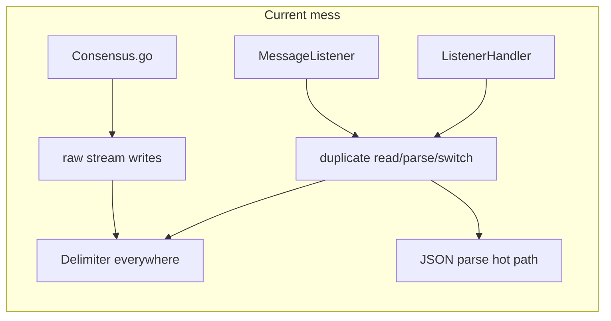
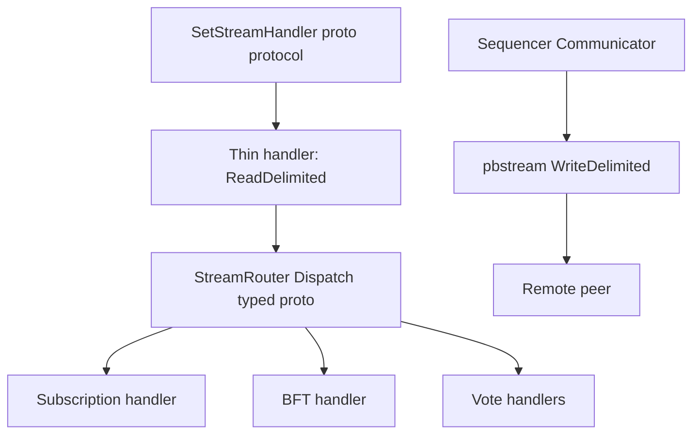

# Sequencer module alignment with FastSync-style layering

## Reference pattern (what you want to mirror)

From [JMDN-FastSync/core/sync/sync_protocols.go](file:///Users/neeraj/CodeSection/JM/JMDN-FastSync/core/sync/sync_protocols.go), [JMDN-FastSync/internal/pbstream/pbstream.go](file:///Users/neeraj/CodeSection/JM/JMDN-FastSync/internal/pbstream/pbstream.go), and [JMDN-FastSync/core/protocol/router/data_router.go](file:///Users/neeraj/CodeSection/JM/JMDN-FastSync/core/protocol/router/data_router.go):

| Layer               | Role                                                                                                                                                                                            |
| ------------------- | ----------------------------------------------------------------------------------------------------------------------------------------------------------------------------------------------- |
| **Stream handlers** | Thin: deadlines, `Read`*, call router, `Write`*, close                                                                                                                                          |
| **Framing**         | Single place: length-delimited protobuf in FastSync (`WriteDelimited` / `ReadDelimited`)                                                                                                        |
| **Communication**   | [communication.go](file:///Users/neeraj/CodeSection/JM/JMDN-FastSync/core/protocol/communication/communication.go): `Communicator` interface; all outbound `NewStream` + encode + read response |
| **Router**          | `Datarouter`: `HandleX(ctx, req, remote) -> resp` — business logic without raw I/O                                                                                                              |

## Profiling motivation: JSON as bottleneck

Profiling identified **JSON parsing as a significant bottleneck** on the Sequencer-related paths. That strengthens the case for **protobuf on the wire** for high-frequency and large payloads: smaller frames, faster unmarshal than `encoding/json` on hot loops, and **schemas owned in one place** (`proto/`), which improves change safety and review (field numbers, deprecations, oneof for versioned envelopes).

**Suggested follow-up before coding protos**: capture one profile artifact (pprof CPU + a short list of top frames involving `json.Unmarshal` / `DeferenceMessage` / stream read paths) so migration priorities stay evidence-based.

## Current jmdn reality (why it feels “clumsy”)

- **Wire format**: JSON + `config.Delimiter` (`0x1E`), not protobuf. Framing is reimplemented in many places via `bufio.Reader` + `ReadString(Delimiter)` and `Write(... + delimiter)` (e.g. [Sequencer/Consensus.go](file:///Users/neeraj/CodeSection/JM/jmdn/Sequencer/Consensus.go), [AVC/BuddyNodes/MessagePassing/MessageListener.go](file:///Users/neeraj/CodeSection/JM/jmdn/AVC/BuddyNodes/MessagePassing/MessageListener.go), [ListenerHandler.go](file:///Users/neeraj/CodeSection/JM/jmdn/AVC/BuddyNodes/MessagePassing/ListenerHandler.go)). Every path pays JSON parse cost.
- **Two different `HandleSubmitMessageStream` implementations** (~848 lines in `MessageListener.go` vs ~1900+ in `ListenerHandler.go`):
  - [Streaming.go `NewListenerNode](file:///Users/neeraj/CodeSection/JM/jmdn/AVC/BuddyNodes/MessagePassing/Streaming.go)` registers `**StructListener.HandleSubmitMessageStream`**.
  - [node/node.go](file:///Users/neeraj/CodeSection/JM/jmdn/node/node.go) registers `**ListenerHandler.HandleSubmitMessageStream`** on the same `SubmitMessageProtocol` when `ForListner` is missing or for alternate startup paths.
  This splits behavior and makes debugging “which handler ran?” harder.
- **Routing**: Giant `switch` on `message.GetACK().GetStage()` scattered across those files; [Sequencer/Router/Router.go](file:///Users/neeraj/CodeSection/JM/jmdn/Sequencer/Router/Router.go) is **only** PubSub verification, not stream dispatch — naming collides with the FastSync “router” idea.
- **Sequencer package**: [Consensus.go](file:///Users/neeraj/CodeSection/JM/jmdn/Sequencer/Consensus.go) is **~2061 lines**; [Communication.go](file:///Users/neeraj/CodeSection/JM/jmdn/Sequencer/Communication.go) mixes subscription ACK correlation (`ResponseHandler`), `AskForSubscription`, and verification helpers.
- **Cross-package coupling**: `ListenerHandler` imports `gossipnode/Sequencer/Triggers/Maps` for vote maps — AVC depends on Sequencer for globals.

## Target architecture (phased: structure first, then proto end state)

**Near term:** Introduce FastSync-shaped layers with **JSON framing centralized** in `transport` so refactors are mechanical and profiling stays comparable.

**End state (aligned with profiling):** **Length-delimited protobuf** framing (same pattern as [JMDN-FastSync `pbstream](file:///Users/neeraj/CodeSection/JM/JMDN-FastSync/internal/pbstream/pbstream.go)`), **single `proto/` package** for Sequencer stream messages (and any shared envelopes), `**Communicator`** using only generated types + `ReadDelimited`/`WriteDelimited`. JSON delimiter path either removed or reserved for admin/legacy only.

| New package / area                         | Responsibility                                                                                                                                                                   |
| ------------------------------------------ | -------------------------------------------------------------------------------------------------------------------------------------------------------------------------------- |
| `**Sequencer/transport`**                  | First: JSON frame helpers; later: **only** protobuf length-delimited read/write (or thin wrapper around shared `internal/pbstream`-style package).                               |
| `**Sequencer/protocol/communication`**     | `Communicator`: all outbound streams; encode/decode via proto types on hot paths.                                                                                                |
| `**Sequencer/protocol/router`**            | `StreamRouter`: dispatch by message type / oneof envelope — **no** per-handler `json.Unmarshal` of ad-hoc maps.                                                                  |
| `**proto/`** (e.g. `proto/sequencer/v1/…`) | **Single source of truth** for wire types: subscription, vote result, BFT request/result envelopes, optional `StreamMessage` oneof for extensibility (like FastSync heartbeats). |
| `**AVC/BuddyNodes/MessagePassing`**        | Thin handlers + unified inbound path calling `StreamRouter`.                                                                                                                     |

**Relevant data formats to migrate (inventory in `proto-inventory` todo):**

- Stream payloads today built around `[config/PubSubMessages.Message](file:///Users/neeraj/CodeSection/JM/jmdn/config/PubSubMessages/Pubsub.go)` / `ACK` + `Stage` — replace with a **versioned envelope** proto (e.g. `SequencerStreamMessage` with `oneof payload` or `stage` enum + typed sub-messages).
- BFT request JSON in [ListenerHandler `handleBFTRequest](file:///Users/neeraj/CodeSection/JM/jmdn/AVC/BuddyNodes/MessagePassing/ListenerHandler.go)` — align with existing [AVC/BFT/proto/bft.proto](file:///Users/neeraj/CodeSection/JM/jmdn/AVC/BFT/proto/bft.proto) where possible, or nest under the new envelope to avoid two competing schemas.
- Vote result / subscription / verification messages that are unmarshaled on every stream — prioritize whatever the profiler ranks highest.

**Network compatibility:** New `**protocol.ID`** for proto-backed streams (e.g. extend [config/constants.go](file:///Users/neeraj/CodeSection/JM/jmdn/config/constants.go) — `BFTConsensusProtocol` is currently unused and could be repurposed or superseded by an explicit `SequencerStreamProtocolV2`) **or** negotiate version in first frame; keep old `SubmitMessageProtocol` + JSON until fleet upgrades.

## Phased implementation plan

### Phase 1 — Framing and outbound communication (low risk)

1. Add `**Sequencer/transport**` with `ReadDelimitedMessage` / `WriteDelimitedMessage` operating on `io.Reader`/`io.Writer` and existing JSON types in `[config/PubSubMessages](file:///Users/neeraj/CodeSection/JM/jmdn/config/PubSubMessages)`.
2. Implement `**Sequencer/protocol/communication**` wrapping:
  - Calls currently in [Sequencer/Consensus.go](file:///Users/neeraj/CodeSection/JM/jmdn/Sequencer/Consensus.go) (`requestVoteResultFromBuddy`, stream write/read around lines ~1595–1722).
  - Paths in [Sequencer/Triggers/Triggers.go](file:///Users/neeraj/CodeSection/JM/jmdn/Sequencer/Triggers/Triggers.go) that open streams and append delimiter.
  - Subscription sends already funneled through `StructListener.SendMessageToPeer` in [MessageListener.go](file:///Users/neeraj/CodeSection/JM/jmdn/AVC/BuddyNodes/MessagePassing/MessageListener.go) — either move client side into `Communicator` or add transport helpers there first, then consolidate.
3. Replace ad-hoc `fmt.Printf` debug in [Communication.go `ResponseHandler](file:///Users/neeraj/CodeSection/JM/jmdn/Sequencer/Communication.go)` with structured logger (optional but improves “debuggability”).

**Exit criteria**: No new `ReadString(config.Delimiter)` in Sequencer except inside `transport`.

### Phase 2 — Inbound router and handler extraction

1. Introduce `**StreamRouter`** in `Sequencer/protocol/router` (or `Sequencer/inbound`) with a **registry** `map[string]StageHandler` keyed by `config.Type_*` / `ACK.Stage`.
2. Move bodies out of the giant switches in `MessageListener` / `ListenerHandler` into `**stage_*.go`** files under `MessagePassing` or under `Sequencer/protocol/handlers` with explicit dependencies (host, listener node, response handler).
3. `**ListenerHandler` stays the place for BFT/vote state** initially; only the **dispatch** and **I/O** become uniform.

**Exit criteria**: Single dispatch path for `SubmitMessageProtocol` inbound messages; switches reduced to router registration.

### Phase 3 — Unify duplicate `HandleSubmitMessageStream`

1. Compare behavior of `[StructListener.HandleSubmitMessageStream](file:///Users/neeraj/CodeSection/JM/jmdn/AVC/BuddyNodes/MessagePassing/MessageListener.go)` vs `[ListenerHandler.HandleSubmitMessageStream](file:///Users/neeraj/CodeSection/JM/jmdn/AVC/BuddyNodes/MessagePassing/ListenerHandler.go)` (case coverage: `Type_AskForSubscription`, `Type_BFTRequest`, `Type_VoteResult`, legacy flags, etc.).
2. Pick **one** implementation path:
  - Either always construct `ListenerHandler` inside `StructListener` and delegate, or
  - Merge into one function that uses `StreamRouter`.
3. Align [node/node.go](file:///Users/neeraj/CodeSection/JM/jmdn/node/node.go) and [Streaming.go `NewListenerNode](file:///Users/neeraj/CodeSection/JM/jmdn/AVC/BuddyNodes/MessagePassing/Streaming.go)` so **the same handler** is registered (avoid divergent production behavior).

**Exit criteria**: One primary inbound implementation; second path removed or thin wrapper.

### Phase 4 — Split `Consensus.go` and clarify `Sequencer/Router`

1. Split [Consensus.go](file:///Users/neeraj/CodeSection/JM/jmdn/Sequencer/Consensus.go) by concern (mirroring FastSync “phase” files): e.g. `start.go` (orchestration), `subscription.go`, `event_flow.go`, `votes.go`, `bls.go`, `broadcast.go` — **pure move**, no logic change first.
2. Rename or namespace `**Sequencer/Router`** to something like `**verification`** or `**pubsub_verify`** to avoid confusion with the new **stream** router.

### Phase 5 — Protobuf migration (performance + maintainability)

**Goal:** Remove JSON parse from hot Sequencer/stream paths; **centralize contracts in `proto/`** so changes are explicit and reviewable.

1. **Inventory (`proto-inventory`)**: From profiler + code search, list message types and call sites: stream `Message`/`ACK`/`Stage`, BFT JSON blobs, vote result payloads, PubSub gossip wrappers if they show up in top frames.
2. **Schema (`proto-schema`)**: Add package under repo `proto/` (follow existing [proto/](file:///Users/neeraj/CodeSection/JM/jmdn/proto) layout). Prefer a **single top-level envelope** with `oneof` for stage-specific payloads to mirror one router dispatch. Reuse or wrap [AVC/BFT/proto/bft.proto](file:///Users/neeraj/CodeSection/JM/jmdn/AVC/BFT/proto/bft.proto) to avoid duplicate BFT shapes.
3. **Framing (`proto-framing`)**: Implement or vendor **length-delimited** read/write (identical idea to FastSync `pbstream`). Register **new protocol ID** or version negotiation; document in config/constants.
4. **Rollout (`proto-migrate-rollout`)**: Implement dual stack if needed (read proto OR JSON for one release), then default proto and deprecate JSON on that protocol. Update `Communicator` and `StreamRouter` to use generated types only on migrated paths.

**Exit criteria**: Profiler shows JSON unmarshaling no longer in top CPU for Sequencer round-trip; all new feature work touches **proto + generated Go** first.

### Phase 6 (optional) — Decouple `Sequencer/Triggers/Maps` from AVC

- Move vote-result map to `**config/PubSubMessages`** or a small `**consensus/state`** package, or inject an interface into handlers so `AVC` does not import `Sequencer` for globals.

## Risk and testing notes

- **Regression risk** is highest in Phase 3 (two handlers) and any change to delimiter framing; **proto rollout** adds network compatibility risk — mitigate with new protocol ID + dual-read window.
- Add **table-driven tests** for `transport` (round-trip JSON, then round-trip proto), and **integration tests** for one full subscription + one vote-result round-trip if your environment allows.
- Re-profile after proto migration to confirm JSON bottleneck is gone.
- Run `**make build`** / `**make lint`** per repo norms; full `make test` may need ImmuDB per [CLAUDE.md](file:///Users/neeraj/CodeSection/JM/jmdn/CLAUDE.md).

## Key files to touch (summary)

| Area                 | Files                                                                                                                                                                                                                                                                                    |
| -------------------- | ---------------------------------------------------------------------------------------------------------------------------------------------------------------------------------------------------------------------------------------------------------------------------------------- |
| Framing + comm       | New under `Sequencer/transport`, `Sequencer/protocol/communication`; refactor [Sequencer/Consensus.go](file:///Users/neeraj/CodeSection/JM/jmdn/Sequencer/Consensus.go), [Sequencer/Triggers/Triggers.go](file:///Users/neeraj/CodeSection/JM/jmdn/Sequencer/Triggers/Triggers.go)       |
| Inbound router       | New `Sequencer/protocol/router` (stream dispatch); slim [MessageListener.go](file:///Users/neeraj/CodeSection/JM/jmdn/AVC/BuddyNodes/MessagePassing/MessageListener.go), [ListenerHandler.go](file:///Users/neeraj/CodeSection/JM/jmdn/AVC/BuddyNodes/MessagePassing/ListenerHandler.go) |
| Handler registration | [Streaming.go](file:///Users/neeraj/CodeSection/JM/jmdn/AVC/BuddyNodes/MessagePassing/Streaming.go), [node/node.go](file:///Users/neeraj/CodeSection/JM/jmdn/node/node.go)                                                                                                               |
| Naming               | [Sequencer/Router/Router.go](file:///Users/neeraj/CodeSection/JM/jmdn/Sequencer/Router/Router.go) (verification) vs new stream router                                                                                                                                                    |
| Proto                | New/updated under `proto/`, generated `*.pb.go`, [config/constants.go](file:///Users/neeraj/CodeSection/JM/jmdn/config/constants.go) for protocol IDs, Makefile or buf for codegen                                                                                                       |

