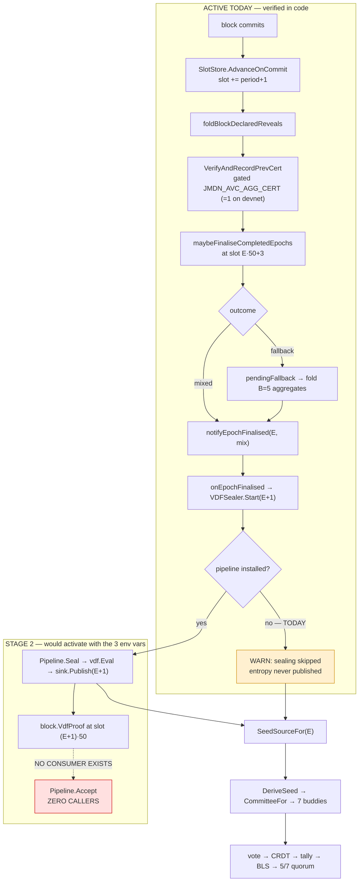

# AVC Stage-2 Entropy — End-to-End Verification

**Repo:** `jmdn` · **Branch:** `feat/consensus-audit` · **HEAD:** `1f1f277`
**Workspace:** `jmdn` + `avc` (go.work), with `seedNodes`, `jmdt-devnet`, `JMDN-FastSync`, `ThebeDB` inspected
**Toolchain:** go1.26.0 linux/arm64 — every claim marked *verified* was compiled, executed, or read from code on this branch
**Date:** 2026-09-03

> **Scope note.** This is an audit document. No production wiring was added as part of it —
> see §C for exactly what is and is not in the working tree.

---

## Verdict

### ⚠️ PARTIALLY ACTIVE — Stage 2 is code-complete on the SEAL side and absent on the ADOPT side

Stage 2 is not merely unconfigured. Three load-bearing pieces have no implementation at all, and one
of them (proof adoption) is the reason the other two matter. Turning on the three VDF environment
variables today would produce a network that seals entropy correctly and cannot share it.

| | |
|---|---|
| **Configured on devnet?** | ❌ No. `JMDN_AVC_VDF_MODULUS_HEX` / `GROUP_NAME` / `DIFFICULTY_T` appear in **no** compose file, gate file, or script across `jmdt-devnet` and `seedNodes` |
| **Stage-1 vs Stage-2 today** | Every node runs **Stage 1** (`SaltSource`). Uniform fleet-wide, therefore safe |
| **B1 aggregate-certificate path** | ✅ **LIVE on devnet** — `docker-compose.yml:66` sets `JMDN_AVC_AGG_CERT` default `1`, while the code default (`entropy_aggsig.go:72`) is off |
| **Blocking on human approval** | VDF modulus provenance + difficulty `T` — §I |

The single most important finding: **`beacon.Pipeline.Accept` has zero callers anywhere in `jmdn`.**
Everything downstream of that is a consequence.

---

## A · Current flow, as the code actually runs it



**Verified constants** (`slot_store.go:43`, `entropy_fallback_window.go:62`, `jmdn.gate.yaml:106`):

| Symbol | Value | Meaning |
|---|---|---|
| `N` | 50 | slots per EntropyEpoch |
| `RevealCutoffK` | 3 | reveal cutoff inside the epoch |
| `FallbackFoldBufferB` | 5 | aggregates required for a fallback fold |
| `FallbackFoldMaxSlotOffset` | 7 | collection deadline offset |
| `max_validators` | 7 | committee cap → `committeeSizeLimit()` = 7 |
| `EpochBoundarySlot(E)` | `E·50` | **first** slot of the epoch |
| `cutoffSlotFor(E)` | `E·50+3` | where finalisation runs |

**Slot clock — verified.** A slot is one completed consensus round. `AdvanceOnCommit` does
`s.slot += period + 1` (`slot_store.go:126`), called only from `broadcast.go:820` and
`blockPropagation.go:396`, both on commit. `slot_store.go` contains **no** `time.Now()`, ticker, or
timer. The slot clock is block-counted and identical on every node; no wall clock enters it.

---

## B · Missing pieces

Ordered by consequence, not by phase number.

### B2 — No inbound VDF proof path *(Phases 6, 12, 19, 20.10, 20.11)*

`beacon.Pipeline.Accept(forEpoch, mix, proof)` exists at `avc/beacon/beacon.go:113` and is
correct: it rejects `proof.T != pinned difficulty`, runs `vdf.Verify`, and publishes only on
success. **Non-test callers in `jmdn`: zero.**

`ZKBlock.VdfProof` is written by the proposer (`Block/consensus_fields.go:160`), folded into the
M2b `ConsensusHash` (`Security/consensus_fields_hash.go:65`), and persisted
(`DB_OPs/backend/block.go:213`) — and then read by nothing. Every non-sealing node must evaluate
the VDF itself, which is precisely the cost the field was added to avoid; that file's own comment
says so.

There is also **no validation of a received `VdfProof` of any kind** — not group, not `T`, not
epoch. Nothing inside `vdf.Proof` names an epoch, so a proof valid for epoch E would publish under
whatever `SeedEpoch` a proposer declared. Phase 20 cases 10 and 11 are therefore both unhandled.

**Hard prerequisite that does not exist yet.** `Accept` takes the **mix** and deliberately does not
read it from the block — a mix supplied by the same party as the proof would verify any proof that
party chose. The verifier must hold it independently. `notifyEpochFinalised(closedEpoch, seed)`
(`entropy_finalise.go:114`) hands the mix to the Stage-E hook and **retains nothing**; there is no
mix store anywhere in the tree. So proof adoption cannot be wired until finalised mixes are kept.
This ordering is not optional and is easy to miss.

### B3 — Sync never records `PrevAggCert` *(Phase 10 — the one you flagged CRITICAL)*

`VerifyAndRecordPrevCert` has exactly two callers, both live paths:

- `messaging/broadcast.go:840` (local commit)
- `messaging/blockPropagation.go:409` (gossip receive)

`thebesync/apply.go` calls **neither**, and contains no reference to `PrevAggCert` at all. Grep
across `JMDN-FastSync` returns nothing either. A node that catches up through sync therefore holds
**no aggregate for any slot it synced**. Every epoch that fell back during the catch-up fails
closed on that node while its peers resolve normally — and with `JMDN_AVC_AGG_CERT=1` on devnet,
this is live behaviour today, not a Stage-2-only concern.

### B4 — Finalised entropy and mixes are memory-only *(Phases 11, 14)*

`committee.BeaconSource.entropy` is a `map[uint64][]byte` behind a mutex, retained for
`MinRetainedEpochs = 3`. `vdfSealers` is a package-level map. Neither is persisted or rehydrated.

Critically, **re-computation is not a recovery option**: both `Pipeline.SealLocally(forEpoch, mix)`
and `Pipeline.Accept(forEpoch, mix, proof)` take the mix, and a restarted node has none — the fold
state that produced it was process memory and the epoch has closed. Recovery must therefore persist
the **32-byte output**, not the ability to recompute it. `BeaconSource.Publish` is already
idempotent for an identical value and refuses a conflicting one (`committee/beacon.go:80-105`),
which makes it a safe rehydration target. Rehydration must replay in **ascending epoch order** —
`evictLocked` drops everything below `newest - retain` on each publish, so newest-first would evict
as it went and leave a single entry.

### B5 — `ValidateVDFTimingParams` validates against an unenforced constant *(Phase 4)*

`messaging/vdf_timing_params.go` defines `SlotFloor = 60s` with its own comment: *"NOT enforced
anywhere yet — Architecture §10 decision 3b is still open."* `ValidateVDFTimingParams`
(`main.go:1465`) checks `T_vdf` against that constant, never against a measured slot duration.

The runway is `EpochBoundarySlot(E) − cutoffSlotFor(E−1)` = `E·50 − ((E−1)·50+3)` = **47 slots**.
Converted to wall clock it gives three regimes (computed, `T_vdf = 1200s`):

| Regime | Condition | Outcome |
|---|---|---|
| Comfortable | `ŝ ≥ 51.1s` | Full 2× margin; `CheckLiveness` passes; `SlotFloor` sits here |
| **Thin** | `25.6s ≤ ŝ < 51.1s` | Proof **is** ready — at `ŝ=30s`, 1410s runway vs 1200s. `CheckLiveness` would **fail** on the real `ŝ` |
| Throttled | `ŝ < 25.6s` | Boundary block 503s until the VDF completes; chain self-limits to 50 slots per `T_vdf` ≈ 24s/slot |

This is a **throughput ceiling, not a halt**: slots advance only on commit, so they cannot outrun
the VDF; `attachAVCConsensusFields` → `ErrVDFProofNotReady` → `Block/Server.go:638` returns HTTP
503 and the submission is refused until the evaluation finishes. Nothing diverges; nothing is
unsafe. Bias resistance moves the other way — the floor is `S·K·ŝ`, so faster slots *lower* it
(600s at `ŝ=30s`, cleared by `T_vdf=1200s`).

The likely operating point is the thin band: the buddy vote path has a
`time.Sleep(30 * time.Second)` floor (`subscriptionService.go:320`) and
`BFTTriggerBufferTime = 30s` (`Triggers.go:43`).

### B6 — Genesis bootstrap *(Phase 5)*

`SelectEntropyCommittee`'s own doc: entropy for the network's first live epoch has no publisher,
and no bootstrap mechanism exists. §F's design does not cover epoch 0 either. Unresolved.

---

## C · What is in the working tree

Three changes were made and kept, from an earlier request in this session. They were built,
vetted, and tested. **The Stage-2 wiring described in §B2/§B3 was implemented during this session
and then reverted at your request — it is *not* in the tree.**

| File | Change | State |
|---|---|---|
| `messaging/entropy_aggsig.go` | `aggCertQuorum()` — `PrevAggCert` must clear `ceil(2n/3)` over the capped pool | **kept** |
| `messaging/committee_v2.go` | `SeedSourceFor` returns `(SeedSource, error)`; `ErrBeaconEpochUnavailable` | **kept** |
| `Sequencer/vdf_sealer.go` | `Result()` latched instead of single-shot drain | **kept** |
| `Sequencer/vdf_seal_wiring.go` | `ClearSealerForTest` (test isolation) | **kept** |
| `messaging/entropy_preflight_test.go`, `Sequencer/vdf_sealer_latch_test.go` | new tests | **kept** |
| `messaging/entropy_finalise.go`, `broadcast.go`, `blockPropagation.go`, `Sequencer/beacon_install.go` | Stage-2 receive wiring | **REVERTED** to `HEAD` |

> **Cleanup you must do by hand.** Four files created during the reverted work could not be
> deleted — file deletion is blocked on this mount. They are unreferenced and harmless (the tree
> builds and tests pass with them present), but they should go:
>
> ```
> git clean -f messaging/entropy_mix_store.go messaging/entropy_vdf_accept.go \
>              messaging/entropy_block_effects.go Sequencer/vdf_accept_wiring.go
> ```

---

## D · Phase-by-phase result

| Requirement | Before | Change Made | After | Verified? |
|---|---|---|---|---|
| Stage-2 installation | `InstallAVCBeaconFromEnv` wired at `main.go:1560`; installs nothing without 3 env vars | none | unchanged | ✅ read + startup path traced |
| VDF provenance | `knownModuli` has 1 entry, `rsa-2048-frc`, `Digest: ""` | none | unchanged | ✅ `provenance.go:97-116` |
| VDF difficulty `T` | env-only, no runtime calibration; `Calibrate` forbids runtime use | none | unchanged | ✅ `vdf.go:387` |
| Timing check | validates vs unenforced `SlotFloor`, never a measured `ŝ` | none | unchanged | ✅ computed, 3 regimes |
| RANDAO reveal flow | epoch = `EpochForSlot`, distinct type from `SelectionPeriod` | none | unchanged | ✅ no cross-use found |
| Entropy finalisation | two-phase, deterministic; mix **not retained** | none | unchanged | ✅ `entropy_finalise.go:114` |
| VDF sealing | `SetEpochFinalisedHook` → `onEpochFinalised` → `Seal` | none | unchanged | ✅ traced |
| VDF proof attach | boundary block only, fails closed if not ready | none | unchanged | ✅ `consensus_fields.go:147` |
| Sealer result re-read | single-shot drain → permanent `ErrVDFProofNotReady` on re-propose | **latched** | idempotent | ✅ 4 tests pass |
| **VDF proof adoption** | `Accept` has **zero callers**; no proof validation at all | **reverted** | ❌ still missing | ✅ gap confirmed |
| Fallback path | B=5, offset 7, deadline enforced, fails closed | none | unchanged | ✅ traced |
| `PrevAggCert` verification | per-signer: eligibility, key binding, dedupe, BLS verify | none | unchanged | ✅ `entropy_aggsig.go:209` |
| **Fallback quorum** | **no count rule** beyond `len(cert)!=0` — 1 signer accepted | **`aggCertQuorum`** | `ceil(2n/3)` = 5/7 | ✅ tests pass |
| **Sync recovery** | `thebesync` never calls `VerifyAndRecordPrevCert` | **reverted** | ❌ still missing | ✅ gap confirmed |
| Restart recovery | beacon + sealers memory-only; mix unrecoverable | none | ❌ still missing | ✅ gap confirmed |
| Entropy persistence | none | none | ❌ still missing | ✅ gap confirmed |
| **No silent Stage-1 fallback** | `beacon.Has()` false → salt, **silently** | **fail closed + ERROR log** | `ErrBeaconEpochUnavailable` | ✅ 3-state test passes |
| `DeriveSeed` inputs | `{EntropyEpoch, PrevHash, Height, Period}` | none | unchanged | ✅ `committee_v2.go:303` |
| A-ExpJ / `CommitteeFor` | canonical order, seats all when `k ≥ n` | none | unchanged | ✅ `avc/committee/select.go:64` |
| 7-buddy committee | `max_validators: 7` in gate config | none | unchanged | ✅ `jmdn.gate.yaml:106` |
| Tally / BLS / 5/7 quorum | `ByzantineQuorum` = `ceil(2n/3)` = 5 at n=7 | none | unchanged | ✅ `consensus_hardening.go:373` |
| Devnet configuration | `COMMITTEE_V2`, `VOTE_CRDT_V2`, `M2B`, `AGG_CERT` on; **no VDF vars** | none | unchanged | ✅ `docker-compose.yml:55-67` |

---

## E · Failure matrix

Verified against code. "Diverge?" means *can two honest nodes reach different committees*.

| # | Case | Block commits? | Entropy exists? | Node behaviour | Diverge? | Loud? |
|---|---|---|---|---|---|---|
| 1 | Buddy does not sign | ✅ if 5/7 reached | ✅ | cert carries fewer signers; all nodes fold identical bytes from the block | No | n/a |
| 2 | Buddy round timeout | ❌ that slot | ⚠️ | slot burned (`period+1`); fold widens toward deadline; tolerates 2 | No | ✅ |
| 3 | Sequencer omits `PrevAggCert` | ✅ **not rejected** | ⚠️ hole in window | `VerifyAndRecordPrevCert` returns silently; nothing requires the field | No | log only |
| 4 | Validator crashes | ✅ | ✅ | non-responder | No | ✅ |
| 5 | Buddy crashes | ✅ if 5/7 | ✅ | as case 1 | No | ✅ |
| 6 | Restart during VDF | ✅ | ❌ for that epoch | sealer map lost; **mix lost → cannot re-seal or adopt** | ⚠️ **yes** | partly |
| 7 | Restart during fallback | ✅ | ❌ | `aggSigStore` lost; fold fails closed | ⚠️ **yes** | ✅ |
| 8 | Rejoin after missing blocks | ✅ | ❌ | no aggregates for missed slots | ⚠️ **yes** | ✅ |
| 9 | Sync applies old blocks with `PrevAggCert` | ✅ | ❌ | **nothing recorded** — §B3 | ⚠️ **yes** | ❌ **silent** |
| 10 | Invalid VDF proof received | ✅ | — | **no code path exists** | — | ❌ none |
| 11 | Wrong-epoch VDF proof | ✅ | — | **no code path exists** | — | ❌ none |
| 12 | Missing VDF result at boundary | ❌ (503) | ❌ | fails closed, retry succeeds once ready | No | ✅ |
| 13 | Missing fallback aggregate | ✅ | ❌ after deadline | `ErrFallbackDeadlineExceeded` | No | ✅ |
| 14 | Duplicate fallback aggregate | ✅ | ✅ | rejected by dedupe on peer **and** key | No | ✅ |
| 15 | One node has Stage-2 entropy, another does not | ✅ | split | **was**: silent salt. **now**: `ErrBeaconEpochUnavailable`, refuses to select | No (now) | ✅ (now) |

Cases 6–9 share one root cause: **entropy state is memory-only and sync does not participate.**
Case 9 is the worst of them because it is the only silent one.

---

## F · Cross-node determinism

| Value | Same across nodes? | Basis |
|---|---|---|
| Slot | ✅ | block-counted, `period+1` per commit, no wall clock |
| EntropyEpoch | ✅ | `EpochForSlot`, pure function of slot |
| Accepted reveal set | ✅ | folded from committed blocks only |
| Finalised entropy (mixed) | ✅ | deterministic accumulator |
| Finalised entropy (fallback) | ⚠️ | deterministic **given the same aggregate set** — which cases 6–9 break |
| VDF parameters | ✅ | env-pinned, identical or the node refuses to install |
| VDF output | ✅ | `vdf.Eval` deterministic; `TestSealingIsDeterministic` asserts it |
| Seed | ✅ | given identical entropy |
| Eligible pool / A-ExpJ / 7 buddies | ✅ | canonical ordering, single constructor |
| Block hash / tally / quorum | ✅ | unchanged by Stage 2 |

**First divergence, ranked.** Not the seed and not the committee — those are deterministic given
their inputs. It is **the fallback aggregate set** (`aggSigStore`), because it is the only
consensus-critical input assembled from locally-observed events rather than derived from committed
block content. Whichever of cases 6–9 fires first is where two honest nodes stop agreeing, and
case 9 fires without a log line.

---

## G · Test results

Run on `feat/consensus-audit` with the §C changes in the tree:

```
ok  gossipnode/messaging                 1.802s
ok  gossipnode/messaging/BlockProcessing 0.077s
ok  gossipnode/Sequencer                 0.921s
ok  gossipnode/Block                     0.021s
ok  gossipnode/Security                  0.011s
go build ./...   → exit 0
go vet ./messaging ./Sequencer ./Block → exit 0
```

Against your Phase 22 list, honestly scored:

| # | Test | Status |
|---|---|---|
| 2 | same VDF result from same input | ✅ `TestSealingIsDeterministic` (pre-existing) |
| 6/7/8 | fallback with 5 / <5 / deadline | ✅ pre-existing in `entropy_fallback_window_test.go` |
| 13 | no silent Stage-1 fallback | ✅ `TestSeedSourceForThreeStates` — added |
| 11 | restart during VDF (partial: re-read) | ✅ `TestVDFSealerResultIsRepeatable` — added |
| — | fallback quorum floor | ✅ `TestAggCertQuorumMatchesCertificateThreshold` — added |
| 1, 3, 4, 5, 12 | cross-node entropy, proof verify/reject, wrong epoch, `Accept()` | ❌ **cannot exist** — no adoption path to test |
| 9, 10 | restart / sync during fallback | ❌ no persistence or sync recording to test |
| 14–19 | seed/committee across nodes, after restart, after rejoin, timeout→period | ❌ needs a multi-node harness; none exists |

Note on §14–19: `messaging/committee_logging_test.go` (added in commit `c64d710`) emits a
diffable marker line per node for exactly this purpose, but the cross-node comparison is operator-run,
not automated.

---

## H · What Stage-2 activation requires, in order

Each step names the observable that proves it. Steps 1–3 gate turning the beacon on at all.

| # | Work | Verify |
|---|---|---|
| 1 | Re-derive `T` against measured `ŝ`; make `ValidateVDFTimingParams` take a measured slot duration | startup refuses an out-of-band `T`; at `ŝ=30s` the band is `600s ≤ T_vdf ≤ 705s` |
| 2 | Pin the `rsa-2048-frc` digest | `NewPinnedRSAGroup` succeeds with **no** `ALLOW_UNPINNED` anywhere |
| 3 | *(done)* fail-closed `SeedSourceFor` | `TestSeedSourceForThreeStates` |
| 4 | **Retain finalised mixes** — prerequisite for step 6 | mix for epoch `E-1` retrievable when `E`'s boundary block arrives |
| 5 | Persist + rehydrate beacon entropy, ascending epoch order | restart a node; `Has(E)` true for all retained epochs; committee matches a never-restarted peer |
| 6 | Wire `Pipeline.Accept` with boundary-slot, epoch, group/`T` and mix checks | valid → published in ms; wrong epoch / wrong group / bad proof → rejected, nothing published |
| 7 | Record `PrevAggCert` on the sync path | synced node's `aggSigStore` matches a live node's for the same range |
| 8 | 3-node integration | restart one mid-epoch; identical committee across all three for 3 consecutive epochs |

Sequencing constraint: **step 6 depends on step 4**, and step 7 should land before step 6 or the
fast path only ever works on nodes that never restarted — the nodes that least need it.

---

## I · Human / deployment blockers

These are **not** code work and must not be faked.

1. **VDF modulus provenance.** `knownModuli` carries one entry, `rsa-2048-frc`, with `Digest: ""`.
   The RSA Factoring Challenge is retired and RSA Labs' pages are gone; the value must come from an
   archived publication, be diffed across all 617 digits against an independent republication, then
   pinned via `go run ./cmd/vdfpin`. **Consequence while unpinned:** `NewPinnedRSAGroup` returns
   `ErrProvenanceNotPinned`, so every node must run `JMDN_AVC_VDF_ALLOW_UNPINNED_MODULUS=1`, which
   logs a security finding on every startup and is explicitly marked *never on mainnet*.
   The underlying trust assumption — RSA Security destroyed the factors in 1991 — is unverifiable
   and permanent; the class-group path is the only thing that removes it.

2. **Difficulty `T`.** Must come from an offline `vdf.Calibrate` run on the slowest hardware in the
   actual fleet. That spec is not recorded anywhere in these repos. `Calibrate`'s own doc forbids
   runtime use — two nodes with different `T` compute different seeds.

3. **Measured slot duration `ŝ`.** Needed before `T` can be chosen (§B5). Obtain from committed
   block timestamps over one full epoch on the live network: report mean **and** minimum.

4. **Devnet configuration.** No VDF variable appears anywhere in `jmdt-devnet` or `seedNodes`.
   All three must be set on **every** node simultaneously — a partial rollout puts some nodes on
   Stage 2 and others on Stage 1, which is failure-matrix case 15 across the whole fleet.

5. **Genesis entropy.** No mechanism publishes entropy for the network's first live epoch (§B6).

---

## Acceptance criteria

| Criterion | Met? |
|---|---|
| same entropy + params + `PrevHash` + `Height` + `Period` + snapshot → same seed → same 7 buddies | ✅ **given identical inputs** — determinism of the derivation is verified |
| a node can restart during VDF and adopt the existing result | ❌ no adoption path; mix unrecoverable |
| a node can rejoin through sync without losing fallback aggregates | ❌ sync records nothing |
| no node silently switches Stage 2 → Stage 1 for a consensus-critical epoch | ✅ fail-closed since this session |
| fallback state deterministic and recoverable | ⚠️ deterministic, **not** recoverable |
| invalid proofs rejected | ❌ no validation exists |
| every node converges to the same entropy and committee | ❌ not while cases 6–9 stand |

**Status: ⚠️ PARTIALLY ACTIVE.** Two of seven criteria met. Stage 2 must not be enabled on any
network until §H steps 1–7 land and §I items 1–4 are resolved.

---

## Preserved unchanged

Per your Phase 23 list, none of the following was touched: the 7-buddy committee design, the 5/7
quorum (`ByzantineQuorum` at n=7 = 5), the no-BFT 5-stage AVC flow, buddy-level BLS result
signatures, the normal-validator vote design, the seed snapshot trust model, and existing
block/committee semantics.

## Limits of this audit

- Static analysis plus targeted unit tests on one branch. **No multi-node run was performed**, so
  every cross-node claim in §F is derivation-based, not observed.
- `ŝ ≈ 30s` is inferred from two 30s constants, not measured. It decides which §B5 regime applies.
- `seedNodes` was inspected for Stage-2 configuration only, not audited as a component.
- The `aggCertQuorum` denominator is the capped eligible pool, mirroring
  `VerifyCertificate`'s `authenticatedCommittee()`. If the protocol instead requires the parent's
  **seated** committee size, that needs the parent's full `RoundContext` reconstructed inside
  `verifyCertAndAggregate` — a heavier change, and an open question from Phase 8.
