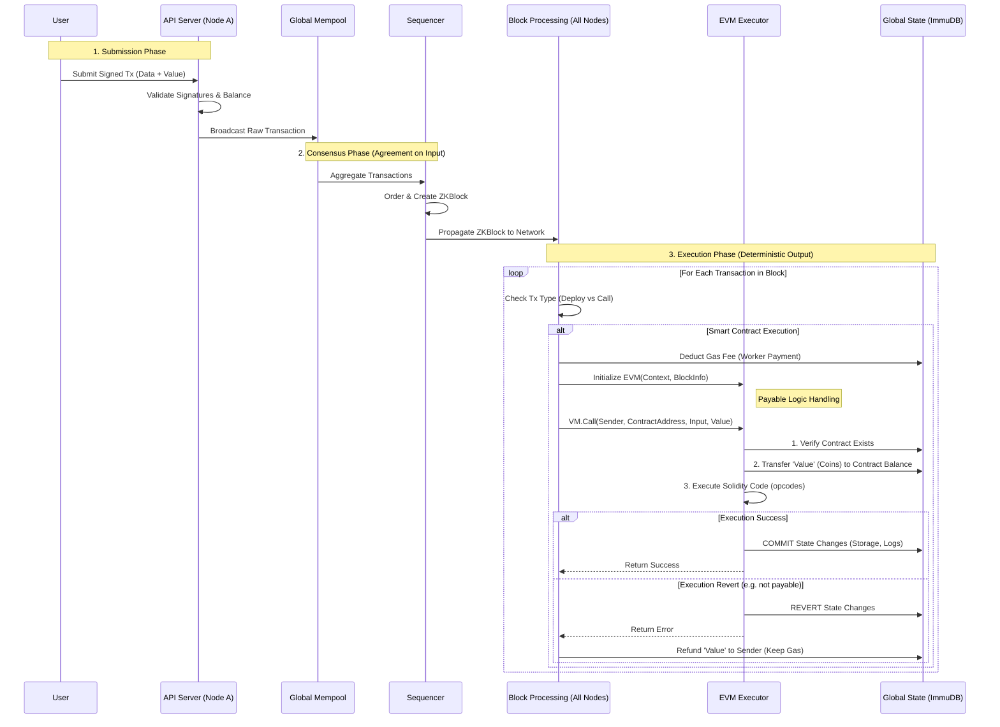

# Smart Contract Consensus Architecture

This document outlines the lifecycle of a smart contract transaction within the JMZK Decentralized Network. It details how the network achieves consensus on smart contract execution and precisely how "payable" value transfers are handled.

## 1. High-Level Flow (Mermaid Diagram)



## 2. Technical Deep Dive (Q&A Style)

### A. The Transaction Payload

**Q: What does the transaction look like exactly? How do I populate it?**

The transaction payload follows the standard EIP-1559 structure. This is what you submit to the API.

```json
{
  "type": "0x2", // Transaction Type (EIP-1559)
  "chainID": "0x539", // Chain ID (e.g., 1337)
  "nonce": "0x1", // Anti-replay counter for the sender
  "to": "0x123...abc", // Target Contract (OR null/empty for Deployment)
  "value": "0xDE0B6B3A7640000", // 1 ETH (in wei) - The "Payable" Amount.
  "input": "0xa9059cbb...", // The Data. Bytecode (Deploy) or ABI Encoded Call (Execution)
  "gasLimit": "0x5208", // Max work allowed (e.g., 21000+)
  "maxFeePerGas": "0x...", // Gas Price
  "maxPriorityFeePerGas": "0x...", // Miner Tip
  "v": "...",
  "r": "...",
  "s": "..." // Cryptographic Signature
}
```

- **deployment**: You set `"to": null` (or empty string/nil depending on library).
- **execution**: You set `"to": "0xExistingContractAddress"`.
- **value**: This is the ACTUAL money you want to maintain inside the contract (e.g., depositing into a DeFI pool). **This is separate from Gas.**

### B. Deployment: Why `null`?

**Q: Why `null`? Can't we use an address?**

Strictly speaking, the address of a new contract is **calculated**, not chosen. It is deterministic: `address = keccak256(sender_address, nonce)`.

- Since the network calculates it, you don't send it in the `to` field.
- The `null` value is the universal "Signal" to the network: _"Please calculate my new address, deploy this bytecode at that address, and run the constructor."_

### C. Costs: Value vs. Gas

**Q: Is the deduction just for coverage costs?**

There are **Two** distinct deductions happening:

1.  **Gas Fee (`gasLimit * gasPrice`)**: This is the "Coverage Fee" or "Work Fee". It pays the network for the CPU time to run the code. **This is taken by the Block Processor immediately.**
2.  **Transaction Value (`msg.value`)**: This is the "Business Logic Money".
    - _Example_: You buy an NFT for 10 ETH.
    - Gas Fee: 0.001 ETH (Goes to Validator/Coinbase).
    - Value: 10 ETH (Goes to the Smart Contract's Balance).

### D. EVM & Database Interaction

**Q: Does the EVM update the DB directly? Do we need a separate transaction?**

No separate transaction is needed. The EVM is "wrapped" around your State Database.

- When `ProcessBlockTransactions` runs, it gives the EVM a "Handle" (`StateDB`) to the underlying database (ImmuDB/Pebble).
- **Internal Transfer**: When the VM starts, it calls `StateDB.SubBalance(Sender, Value)` and `StateDB.AddBalance(Contract, Value)`. This is atomic and happens in memory/buffer first.
- **Commit**: If the Solidity code finishes successfully (no `revert`), the EVM tells the StateDB "Flush these changes to disk". The balances update instantly as part of that one execution.

### E. Handling Reverts

**Q: If it reverts, what exactly is refunded?**

- **Refounded**: The **Value** (e.g., the 10 ETH for the NFT). Since the trade failed, you get your money back.
- **NOT Refunded**: The **Gas Fee** (e.g., the 0.001 ETH). The network still did the work to verify that you _couldn't_ buy the NFT (e.g., it was sold out), so you still pay for the execution effort.

### F. Consensus: Where is it?

**Q: Do we need extra consensus checks after processing?**

**No.** That is the beauty of "State Machine Replication".

1.  **Consensus on INPUT**: The network (via Sequencer/Voting) agrees on **The Block** (the list of transactions and their order).
2.  **Deterministic Processing**: Every single node runs the _exact same code_ (`Processing.go` + `EVMExecutor`) on the _exact same input_ (The Block).
3.  **Consensus on OUTPUT**: Because `Input + Function = Output`, every node will naturally arrive at the exact same Final State (Balances, Storage, etc.).
    - We do not need to vote on "Did Account A have 100 ETH?". We voted on "Block #50 processed Tx #1". If we all processed Tx #1, we all know Account A has 100 ETH.

## Summary of Changes Required

To achieve this flow, we must modify `messaging/BlockProcessing/Processing.go`.
Currently, it looks like this:

```go
// Current (Broken)
if isTransfer {
    Deduct(Sender, Amount)
    Add(Receiver, Amount)
}
```

We will change it to:

```go
// New (Integrated)
if isContract {
    // 1. Pay Workers
    DeductGas(Sender)
    // 2. Run Logic (handles the Amount transfer internally)
    EVM.Execute(Sender, Contract, Input, Amount)
} else {
    // Regular Transfer
    Deduct(Sender, Amount)
    Add(Receiver, Amount)
}
```
