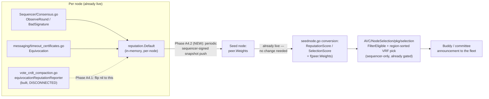

# A4 — Reputation Weighting: What, Why, How

**Status:** Plan only — not yet implemented. Grounded in a fresh, direct read of the actual live code (not the earlier assumption that `avc/nodeselection/selection` was the live path — it is NOT, see §1.3).

---

## 1. What already exists (verified, running today)

### 1.1 Observation — fully built, live since before this migration

`internal/reputation/reputation.go` is a complete, **operator-approved (2026-07-25)** observe-only reputation model: `Start=0.50`, `Floor=0.10`, `Cap=1.00`, per-epoch decay toward `Start`, and `Delta(event)`:

| Event | Delta | Where it's already wired |
|---|---|---|
| `AgreeFinalized` / `RejectNotFinalized` | +0.02 | `Sequencer/Consensus.go:1537`, `reputation.ObserveRound(...)` — called on **every** round, both outcomes (`consensusReached` param) |
| `MinorityDissent` | 0 (never penalized) | same call |
| `Absent` | −0.10 | same call — a committee member with no collected response |
| `BadSignature` | −0.30 | `Sequencer/Consensus.go:2214, 2257` — BLS verify failure or unauthorized committee key on a buddy's aggregate response |
| `Equivocation` | −0.50 | `messaging/timeout_certificates.go:293` (timeout-vote / block-vote double-sign) — **live** |
| `Equivocation` (vote-CRDT specific) | −0.50 | `vote_crdt_compaction.go`'s `equivocationReputationReporter` — **built, tested, currently disconnected** (`nil` passed to `ConvergeAndCompact`, per Stage 6's own recommended staged rollout) |

All of this already runs in production today, gated by `JMDN_REPUTATION_OBSERVE` (default **on**), and Telegram-alerts on objective faults. **None of it affects consensus or selection yet** — that's the entire point of "observe-only."

### 1.2 A real, already-existing seam for enforcement

`internal/reputation/reputation.go`'s own package doc says exactly what's left:

> "Enforcement (feeding the selection score and pushing sequencer-signed reputation to the seed — NOT the self-signed UpdatePeerWeights path, which a peer could abuse) is a separate, later step."

That sentence is the entire scope of A4.

### 1.3 Correction to an earlier assumption: which selection code is actually live

Earlier discussion in this thread analyzed `avc/nodeselection/selection` (the `avc` module's package: `SelectionScore`, `ReputationScore`, `MinReputationScore`, A-ExpJ weighted-random). **jmdn does not import that package at all.** Verified by grep — zero references anywhere in jmdn.

The real, live path is jmdn's own local fork at `AVC/NodeSelection/pkg/selection/` + `gossipnode/seednode`:

- `seednode.go`'s `convertPeerRecordToNode`/`convertBuddyPeerRecordToNode` build a `selection.Node` per seed-node peer record, setting `ReputationScore: float64(peer.Weights)` and a `SelectionScore` derived from the same `peer.Weights` field (default 0.5 for an unweighted peer).
- `AVC/NodeSelection/pkg/selection/filter.go`'s `FilterEligible` requires `0.5 <= SelectionScore < 0.95`, plus an optional `MinReputationScore` gate (currently `0.0` — a documented no-op).
- `AVC/NodeSelection/pkg/selection/vrf.go`'s `SelectMultipleBuddies` VRF-shuffles, then **sorts each region group by `SelectionScore` descending** and takes the top-K per region. This is a real ranking, not a soft probabilistic nudge — a materially higher `SelectionScore` makes a peer win deterministically more often, matching the mental model in your reputation-delta screenshot much more closely than the avc module's weighted-random draw does.
- Buddy selection is **sequencer-gated**: `seednode.go`'s `ListBuddy` auto-attaches a sequencer signature (`SetSequencerSignKey`/`sequencerAuthContext`), and the seed refuses unsigned callers. **Only the sequencer selects a committee** — every other node just receives the announcement. This resolves the "different nodes disagree" conflict you raised: there is already exactly one selector, not N independent ones racing to agree.

### 1.4 The actual missing piece

`peer.Weights` — the seed-node field that `ReputationScore`/`SelectionScore` are both derived from — **is never written by anything today.** The only weight-write RPC that exists at all, `UpdatePeerWeights` (proto: `PeerId, Weights, V, R, S` — a signature), has:
- **no client caller anywhere in jmdn** (only a read, `ListWeightsofPeers`, exists),
- **no server implementation in the `seedNodes` repo** (only the generated `Unimplemented` stub) — checked directly, not assumed.

And even if it were implemented, its shape (`V/R/S`) is a peer signing a claim **about itself** — exactly the self-signed, abusable path the reputation package's own comment says not to use. A malicious peer could self-report a perfect weight.

So: every fault and reward jmdn already observes locally just... stops. It never reaches the one place (`peer.Weights`) that actually influences who gets picked.

---

## 2. Why

Reputation is fully observed and completely inert. Peers accumulate real fault history (absence, bad signatures, equivocation) that nothing downstream ever sees — a peer that's equivocated five times looks identical to a perfectly clean peer when the sequencer picks its next Buddy committee, because `SelectionScore` is still driven by a `peer.Weights` value nothing has ever updated.

A4 closes exactly that gap — and only that gap. It does **not** touch vote counting (Stage 4's `MajorityDecision` already permanently separated "weight" from "counting a cast vote," per your own explicit decision earlier in this migration) and it does **not** need to wait for full CRDT-migration completion in the sense of needing new machinery there — it needs the seed-node write path, which is a separate, pre-existing gap unrelated to the vote CRDT itself.

---

## 3. How — phased plan

### Phase A4.1 — connect what's already built (smallest, safest step)

In `vote_crdt_compaction.go`, change `ConvergeAndCompact(..., nil)` back to `ConvergeAndCompact(..., equivocationReputationReporter{})`. One line, already implemented and covered by `TestEquivocationReputationReporter_RespectsEnabledFlag`. Purely local — no seed-node dependency, no selection-behavior change (still inert until Phase A4.3). This is the exact revert of the change made two turns ago, done deliberately this time as its own decision rather than a side effect.

**Prerequisite:** the vote CRDT flag (`JMDN_VOTE_CRDT_V2`) needs to be on and soaking for this to observe anything real — before that, `compactConvergedVotes` returns early (`if !Vote.VoteCRDTDualWrite { return }`).

### Phase A4.2 — sequencer-signed weight push (the real new work)

Build a new client call in `gossipnode/seednode`, reusing the **existing** sequencer-auth pattern (`SetSequencerSignKey` / `sequencerAuthContext`) that `ListBuddy` already uses — not the self-signed `UpdatePeerWeightsRequest.V/R/S` shape. Concretely:

- Periodically (candidate cadence: `reputation.EpochSeconds` = 3600s, the same clock the decay model already uses), the sequencer takes `reputation.Default.Snapshot()` (a `map[peerID]float64`, already exists, already thread-safe) and pushes it to the seed node as one sequencer-signed batch.
- **This needs a seed-node-service-side change** (either a real `UpdatePeerWeights` implementation gated the same way `ListBuddy` already is — sequencer-signed context required, self-signed peer requests rejected — or a new RPC shaped for a batch). I cannot implement or verify this half: the `seedNodes` repo is a separate Go module, and I found no `UpdatePeerWeights` implementation there to build on. **This is the one piece of A4 that needs the seed-node service owner, not just jmdn changes.**
- Only the sequencer pushes. Buddies/validators never call this — consistent with "buddy selection is sequencer-gated" already being true for the read side.

### Phase A4.3 — no jmdn selection code changes needed, but one real decision required

`seednode.go`'s existing conversion logic already does the right thing once `peer.Weights` carries a real value (`if peer.Weights > 0 { selectionScore = float64(peer.Weights) }`) — **nothing to build here**, only a threshold decision:

**Decision A4-1 (blocks going live with real weights):** reputation's native range is `[Floor=0.10, Cap=1.00]`, `Start=0.50`. Selection's eligibility band is `[MinSelectionScore=0.5, MaxSelectionScore=0.95)`. A brand-new, never-observed peer sits exactly at `Start=0.50` — right on the eligibility floor — and a single `Absent` event (−0.10) drops it to `0.40`, which is **below** `MinSelectionScore` and makes that peer **fully ineligible** for buddy selection, not just lower-ranked. That's a much harsher, more binary consequence than "weighted lower," and it compounds with the fact that a genuinely offline-but-honest peer (one missed vote) gets excluded from Buddy consideration for a full epoch's decay period.

Three ways to resolve this, in order of how much they preserve reputation's existing calibration:
1. **Remap** reputation's `[0.10, 1.00]` onto selection's `[0.5, 0.95)` band with a linear transform before writing to `peer.Weights`, so `Start=0.50` maps to the *middle* of the eligible band rather than its edge, and only a real, accumulated pattern of faults pushes a peer out of eligibility.
2. **Lower `MinSelectionScore`** to something below `Start`'s mapped position, so a single `Absent` doesn't cross the line.
3. **Accept it as intended** — the existing package doc already says objective faults "cost 5-25x more than a single round's reward," suggesting real, felt consequences were the design intent from the start; exclusion-after-one-miss might be exactly that.

I'd flag this to you rather than pick one — it changes how punishing a single Absent event actually is in practice, and that's a product decision, not a technical one.

### Phase A4.4 (optional, separate) — the eligibility gate

`MinReputationScore` already exists in `FilterConfig` as a **second**, currently-disabled (`0.0`) knob, distinct from `SelectionScore`'s ranking role — a true hard cutoff rather than a rank. Worth revisiting once Phase A4.3 has real data, not before.

---

## 4. The "13 times" double-counting concern — now structurally resolved

You raised this earlier: if all Buddy nodes independently notice the same equivocating peer, does that peer get penalized once per node that noticed, or once per notice? Re-checked precisely now that the compaction design is final:

`ConvergeAndCompact`'s watermark only ever advances forward, and it evaluates strictly the range `(oldWatermark, newWatermark]` — a height already at-or-below the watermark before a given call is **never re-evaluated**, even if the hook fires again for the same or a non-advancing tip (verified: `Watermark.Set` with an unchanged tip produces `oldWatermark == newWatermark`, so the evaluation loop's range is empty). So **each node's own compaction pass fires `ReportEquivocation` for a given (peer, blockHash, height) fault exactly once, ever, on that node** — not once per retry, not once per RPC poll.

Multiple *different* honest nodes each independently recording the same real fault in their own local `reputation.Default` store is correct, not a bug — `reputation.Default` is per-node by design (each node's own view). The thing that would be wrong (one node re-triggering on the same evidence multiple times) is exactly what compaction's once-per-converged-height guarantee prevents.

---

## 5. Explicitly out of scope for this plan

- Stage 7 (delete the legacy vote read/write path) — unrelated, already agreed to defer.
- Any change to vote counting — permanently settled by Stage 4's `MajorityDecision`; A4 never revisits it.
- Sequencer rotation / multi-sequencer reputation-write conflicts — moot today (confirmed earlier in this migration: jmdn runs a single static sequencer; rotation is a separate, not-yet-landed workstream). If/when rotation lands, "only the sequencer pushes weights" needs revisiting for whichever sequencer is currently active — flagged here so it isn't forgotten, not solved now.

---

**Untested — this is a plan, not code.** Phase A4.1 is a one-line, already-tested revert. Phases A4.2–A4.3 require the seed-node-service-side coordination and the Decision A4-1 call before any jmdn code should change.
