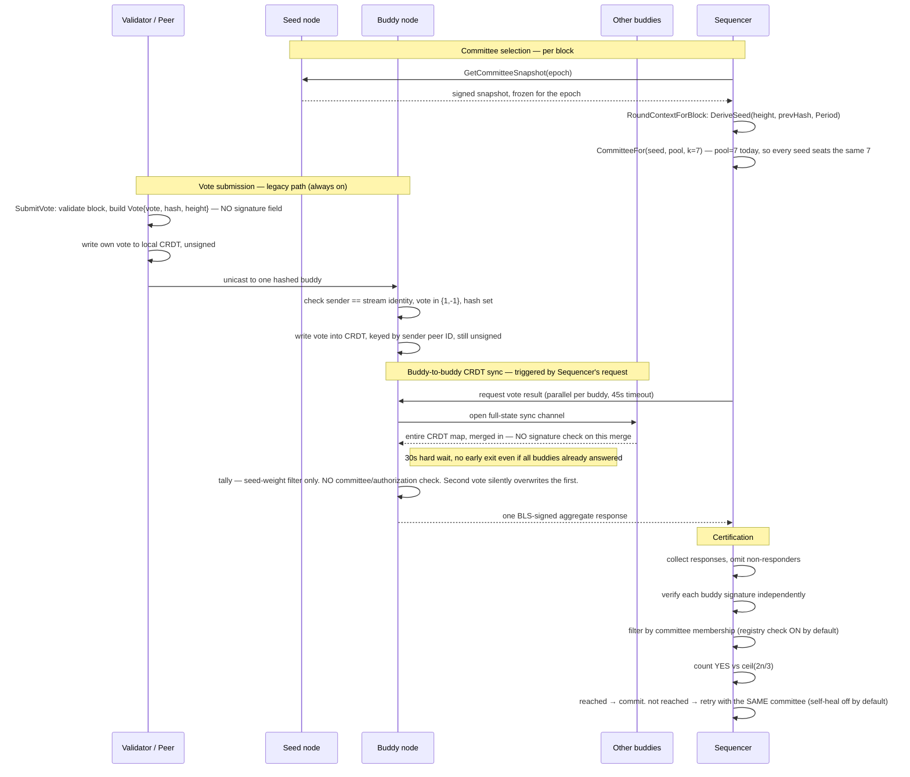

# AVC / JMDN Consensus — Pre-Deployment Audit

Read-only code audit. No files were modified in `jmdn`, `avc`, or `seedNodes` during this pass.
Prepared ahead of Monday's internal test phase. Every claim below traces to a file:line citation
read directly from current code — not from comments or design docs. Where a status doc or an
earlier pass disagreed, the doc was treated as a lead, not ground truth, and re-verified here.

---

## 0. Verdict

## ⚠️ READY WITH KNOWN LIMITATIONS

The happy-path pipeline — committee derivation, quorum arithmetic, buddy signing, Sequencer
certification — is built, wired, and internally consistent by direct code reading.

- **Safe for Monday's internal test phase on trusted nodes.**
- **Not safe** to carry into any environment where a buddy node could be malicious, compromised,
  or reachable by untrusted peers, until the item in Finding 1 is fixed.

---

## A. Current flow — proven

The real call graph for the configuration you'll actually run Monday — every flag at its shipped
default: `JMDN_VOTE_CRDT_V2=false`, `JMDN_COMMITTEE_V2=false`, `JMDN_TIMEOUT_CERT_WIRING=false`,
`JMDN_ENFORCE_COMMITTEE_REGISTRY=true`.

The two steps marked with hard warnings above have no cryptographic guard in the default
configuration — see Finding 1 and Finding 2 below.

---

## B. Gaps & risks

Ranked by severity.

### 🔴 CRITICAL — A buddy can forge votes under any peer's identity during CRDT sync
`CRDTSyncHandler.go:713-733`

- **Actual behavior:** The legacy vote struct has no signature field. When buddies exchange CRDT
  state, `mergeLegacyVoteElement` writes whatever peer-ID key the sync payload claims, with no
  transport-identity or cryptographic check — unlike the direct-submit path, which at least checks
  the libp2p stream identity.
- **Expected behavior:** A vote attributed to peer X should only be acceptable if X actually cast
  it — provable by signature or by an authenticated transport hop, the same guarantee the
  direct-submit path gives.
- **Consequence:** Any node acting as a buddy in a sync exchange — malicious or compromised — can
  inject fabricated votes for arbitrary peers into another buddy's CRDT, directly shaping that
  buddy's tally and its signed conclusion to the Sequencer.
- **Recommended fix:** Either require per-vote signatures on the legacy path (effectively promoting
  it to the v2 scheme), or gate merge-time writes behind the same identity check `handleSubmitVote`
  already enforces.

### 🟠 HIGH — Legacy buddy tally has no committee/authorization check at all
`Structs/Utils.go:396-483`

- **Actual behavior:** `processVotesFromCRDT_legacy` iterates every key in `GetAllCRDTs()` with no
  membership filter. The only gate is the seed's peer-weight list — and if the seed is unreachable,
  that gate falls away too (equal-weight fallback).
- **Expected behavior:** Only committee-eligible peers should be counted, matching the v2 path's
  `isAuthorizedVote` gate.
- **Consequence:** On today's default, a non-committee peer's vote counts identically to a Buddy's,
  at full weight if the seed happens to be down.
- **Recommended fix:** Apply the same `AuthorizedCommitteeForTally` gate used by the v2 path,
  unconditionally.

### 🟠 HIGH — A second vote from the same peer silently overwrites the first — no equivocation detection
`Structs/Utils.go:471-472`

- **Actual behavior:** The legacy tally stores votes in a map keyed by peer ID; a second, different
  vote value simply replaces the first with no flag, log, or evidence retained.
- **Expected behavior:** Two distinct vote values from the same peer for the same block is
  equivocation and should be detected and excluded, as the v2 path already does.
- **Consequence:** A double-voting peer's misbehavior is invisible — no reputation signal, no
  exclusion, just whichever vote arrived last.
- **Recommended fix:** Port `DetectEquivocation`/`ApplyEquivocationPolicy` from the v2 path onto the
  legacy read path.

### 🟠 HIGH — Buddy-to-buddy CRDT sync always blocks the full 30 seconds
`CRDTSyncHandler.go:311-370`

- **Actual behavior:** The "all buddies responded" branch logs and keeps the channel open; only the
  30-second timeout branch ends the wait. Confirmed by reading the loop, not inferred from a
  comment.
- **Expected behavior:** The round should proceed as soon as every expected buddy has responded.
- **Consequence:** Every consensus round is floored at 30s+ regardless of network health — a hard
  liveness/latency ceiling, not just a worst case.
- **Recommended fix:** Exit the wait loop once all expected responses are in; keep 30s only as the
  timeout ceiling.

### 🟠 HIGH — Legacy CRDT vote state has no compaction — unbounded memory growth
`crdt/Heap.go:81-95`, `crdt/MemoryStore.go`

- **Actual behavior:** The op-log eviction in `OpHeap` only trims the log, not the live
  `LWWSet`/`Counter` state. No compaction mechanism exists for the legacy keyspace at all (the v2
  keyspace has one, gated by the same flag that's off by default).
- **Expected behavior:** Vote state for old, already-decided heights should be pruned, as the v2
  `ConvergeAndCompact` does for its keyspace.
- **Consequence:** Memory grows unbounded with uptime and vote volume on the always-active path —
  fine for a short Monday test, a real problem for any longer-running deployment.
- **Recommended fix:** Extend compaction to the legacy keyspace, or migrate fully to the v2 keyspace
  before any long-lived deployment.

### 🟡 MEDIUM — Self-heal exists and is wired, but is off by default — a timed-out round reseats the identical committee
`timeout_gossip.go:297,323` · `consensus_statemachine.go:468`

- **Actual behavior:** `AcceptTimeoutCertificate` does have real production callers (this corrects
  an earlier, doc-sourced claim of "zero callers" — the status doc and an earlier trace pass were
  stale). The whole mechanism is gated by `JMDN_TIMEOUT_CERT_WIRING`, default false.
- **Expected behavior:** A timed-out round should advance `Period` so a retry draws a different
  committee.
- **Consequence:** With the flag off (today's default), a stuck round keeps re-seating the same
  committee — if that committee can't reach quorum once, it won't on retry either.
- **Recommended fix:** Turn the flag on for any test that needs to exercise retry/self-heal
  behavior; keep it off only if that's out of scope for Monday.

### 🟡 MEDIUM — V2 vote certificates are built, signed, and sent — but the Sequencer never reads them
`Structs/Utils.go:1735-1739` · `Consensus.go:1972-2035`

- **Actual behavior:** Both the Phase-1.5 certificate and the validator-scale bitmap certificate are
  attached to the wire response under known keys. `parseVoteResultResponse` only reads
  `result`/`rejection_reasons` — never those keys.
- **Expected behavior:** N/A today by design — the code's own comment calls this deliberate and
  safe. Flagging because "built and tested" should not be read as "in the decision path."
- **Consequence:** None today. Becomes relevant only if a future change assumes the certificate is
  load-bearing.
- **Recommended fix:** No action needed for Monday; note it in the roadmap so nobody assumes
  certificate verification is already gating ACCEPT/REJECT.

### 🟡 MEDIUM — Committee pinning gap — a syncing node can re-derive a different committee than the one that actually voted
`committee_v2.go:307-345` (the code's own "W1 seam")

- **Actual behavior:** `RequirePinnedCommittee` is false by default, so the eligible pool is always
  the live/current one. Re-deriving a committee for a past block after membership has since changed
  can seat a different set than was live at vote time.
- **Expected behavior:** A syncing/catching-up node should be able to reconstruct the exact
  committee that was live for a historical block.
- **Consequence:** Currently latent — dormant while pool size equals seat count (7). Becomes live
  the moment an 8th validator ever joins.
- **Recommended fix:** Already named in the code as an open seam; worth resolving before validator
  count grows past 7, not before Monday specifically.

### 🟡 MEDIUM — No active fetch path for a rejoining node to pull the current timeout certificate
`timeout_gossip.go:24-38`

- **Actual behavior:** A node that adopts a gossiped-in certificate handles it correctly, but there
  is no RPC to actively request "the latest certificate for height N" — a restarted node is
  dependent on passive gossip timing.
- **Expected behavior:** A rejoining node should be able to actively catch up rather than wait for a
  gossip re-flood.
- **Consequence:** Slower, less certain recovery after a restart during an active timeout/retry
  episode.
- **Recommended fix:** Add a pull RPC; disclosed as an explicit scope gap in the code already, so
  this is a known, bounded task.

### 🔵 LOW — BFT engine: one dead path, two live-but-inert paths — no active landmine, but worth cleanup
`AVC/BFT/`, `Service/subscriptionService.go:107`

- **Actual behavior:** `Sequencer/Triggers` is genuinely dead (zero importers). Two other BFT
  dispatch chains are reachable from live message handlers but produce nothing today — one has no
  message producer anywhere in the repo, the other's factory hook (`SetBFTAdapterFactory`) is never
  called.
- **Expected behavior:** N/A — not part of the approved live architecture per the code itself.
- **Consequence:** Low near-term risk (activating either needs a real code change, not a flag flip)
  — but the `SetBFTAdapterFactory` path is one line away from going live with no flag protecting
  it, worth a comment or guard.
- **Recommended fix:** Safe to leave for Monday; worth a deliberate deletion or an explicit guard in
  a later cleanup pass, not urgent.

### 🔵 LOW — BLS verification cost at scale has never been benchmarked
No `Benchmark*` found repo-wide

- **Actual behavior:** Each buddy response is verified independently (not a single aggregate
  verify), so cost scales roughly linearly with committee size — but no number exists anywhere in
  the repo.
- **Expected behavior:** N/A for Monday's scale (7 buddies) — flagging for the growth path.
- **Consequence:** Unknown, not zero. Should be measured before scaling to 13+ buddies or hundreds
  of validators.
- **Recommended fix:** Add a benchmark over dela's `bls.Verify` at 7/50/100/500/1000, on real deploy
  hardware.

### 🔵 LOW — Entropy, Period, and timeout state are in-memory only — lost on restart
`avc/committee/beacon.go:64-69` · `entropy_reveal.go:104-110`

- **Actual behavior:** No disk/DB persistence for published entropy or slot/period state.
- **Expected behavior:** N/A for a short test run; a real gap for anything longer-lived.
- **Consequence:** A restart mid-epoch loses that epoch's accumulated entropy/period progress.
- **Recommended fix:** Add persistence before any multi-day deployment; not a Monday blocker.

---

## C. Deployment readiness matrix

"Tested" means a real test file exercises this in isolation — not that it's been run on a live
multi-node cluster. "Safe as-is" judges the shipped default configuration specifically.

| Component | Built | Wired | Default | Running today | Tested | Safe as-is |
|---|---|---|---|---|---|---|
| Vote submission | yes | yes | on | yes | partial | yes |
| CRDT storage — legacy | yes | yes | on | yes | partial | **no** |
| CRDT storage — v2 | yes | yes | off | no | author-flagged untested | yes, if enabled |
| CRDT sync | yes | yes | on | yes | partial | **no — bypass + 30s wait** |
| A8-1 per-peer cap | yes | yes | only w/ v2 | no | partial | yes |
| Buddy tally — legacy | yes | yes | on | yes | partial | **no** |
| Buddy tally — v2 | yes | yes | off | no | author-flagged untested | yes |
| Committee V2 | yes | yes | off | no | partial | yes |
| Tally seam (pool vs. seated) | yes | yes | matters w/ v2 | dormant | partial | safe by argument, unexercised at scale |
| Buddy signature | yes | yes | on | yes | partial | yes |
| Sequencer verification | yes | yes | on | yes | partial | yes |
| Quorum (ceil(2n/3)) | yes | yes | on | yes | yes | yes |
| Phase 1.5 certificate | yes | sent | w/ v2 | not consumed | yes | yes — additive only |
| Validator-scale certificate | yes | sent | w/ v2 | not consumed | yes | yes — additive only |
| Committee pinning | yes | yes | off | no | partial | open seam, dormant |
| Timeout certificates | yes | yes | off | no | partial | self-heal inert by default |
| RANDAO / entropy | yes | yes | on | yes | partial | genesis-bootstrap gap, in-memory only |
| VDF | yes | yes | needs env vars | depends on deploy config | partial | yes — fails closed |

---

## D. Test scenarios for Monday

Status reflects what the code supports today, at shipped defaults, not what's been run live.

| # | Scenario | Status | Note |
|---|---|---|---|
| 01 | All buddies healthy | ✅ ok | Core path proven end-to-end by direct code reading |
| 02 | One buddy unavailable | ✅ ok | Omitted from results, not blocking — verified in Consensus.go |
| 03 | Two buddies unavailable | ⚠️ tight margin | At committee size 7, threshold is 5 — losing 2 leaves exactly 5. Every remaining vote must be YES |
| 04 | Invalid buddy signature | ✅ ok | Per-signer isolated verification — one bad signature doesn't invalidate others |
| 05 | Unauthorized vote | ❌ at risk | Blocked at Sequencer level by default. NOT blocked inside the legacy buddy tally — Finding 2 |
| 06 | Malformed vote | ✅ ok | Rejected at ingest on both paths before touching the CRDT |
| 07 | Duplicate vote | ⚠️ note | Idempotent on v2; overwritten silently (last-write-wins) on legacy |
| 08 | Same-height, different-hash retry | ✅ ok | Block hash is part of the key — isolated by construction |
| 09 | Equivocation | ❌ at risk | Detected and excluded on v2. NOT detected on legacy — Finding 3 |
| 10 | Validator joins between blocks | ⚠️ timing gap | Immediate for live selection; re-deriving a past committee can diverge (W1 seam) — dormant at pool size 7 |
| 11 | Validator exits | ⚠️ timing gap | Same W1 seam, plus the seed's frozen snapshot means mid-epoch exits aren't visible until rollover — by design |
| 12 | Node restart during collection | ⚠️ lossy but recoverable | In-memory CRDT state is lost; Sequencer treats it as a non-responder. Slow, not broken |
| 13 | CRDT late arrival | ⚠️ split | Blocked by the watermark on v2. Unprotected on legacy — same root cause as Finding 5 |
| 14 | Timeout certificate | ❌ not exercised | Off by default — must flip `JMDN_TIMEOUT_CERT_WIRING` to test this path at all |
| 15 | All nodes derive the same committee | ✅ ok | Deterministic by construction — single constructor, fails closed on Period mismatch |
| 16 | Different blocks → correct committees | ⚠️ untestable today | Seed varies correctly per block, but pool=seats=7 means every block seats the same 7 regardless — won't show real rotation until validator #8 |
| 17 | Seed unavailable | ✅ ok | Weight fetch degrades gracefully; snapshot fetch fails closed — the safer failure mode either way |
| 18 | Seed returns stale data | ⚠️ by design | Tampered data fails signature verification. Honestly-stale-but-signed data is served as-is until epoch rollover — a documented tradeoff, not a bug |

---

## E. Backup sheets — full section-by-section evidence

The detailed, file:line-cited trace behind every claim above.

### 1 · 6 · 7 — Vote flow, validator vs. Buddy handling, tally correctness

**Vote struct**
- `PubSubMessages.Vote{Vote int8, BlockHash, RejectionReason, Height}` — no signature field. (`config/PubSubMessages/Pubsub.go:82-94`)
- Peer always writes its own vote to the legacy CRDT first, unconditionally. (`Vote/Trigger.go:208-230`)
- v2 dual-write (BLS-signed, block-height-keyed) only runs when `JMDN_VOTE_CRDT_V2=true`. (`Trigger.go:236-263`)
- Vote is unicast to one buddy chosen by consistent hashing, retried up to 3 times against different buddies. (`Trigger.go:292-355`)

**Buddy ingest**
- `handleSubmitVote` checks stream-identity match, vote∈{1,-1}, non-empty hash. No signature or equivocation check on this path. (`ListenerHandler.go:922-1130`)

**Tally — legacy (default)**
- No authorization/committee gate; every CRDT key is read. (`Structs/Utils.go:396,410-483`)
- Seed-unreachable → equal-weight fallback, does not abort. (`Utils.go:504-517`)
- Second vote from same peer overwrites the first — no equivocation handling. (`Utils.go:471-472`)

**Tally — v2 (flag on)**
- Order: `TallyBlock` (authz) → `verifyTallySignatures` (BLS) → `ApplyEquivocationPolicy` → `SingleVotePeers` → `MajorityDecision`. (`avc/crdt/votes/tally.go:94-141` · `Utils.go:199-323`)
- Forged/unauthorized elements are dropped before counting, with visible counters (`SkippedUnauthorized`, `MalformedVotes`). (`tally.go:122-134`)
- `MajorityDecision` carries the author's own comment: "untested — no Go toolchain was available." (`AVC/VoteModule/vote_validation.go:55-64`) — **inferred/disclosed, not independently re-run**

**Buddy vs. non-Buddy votes**
- `SubmitVote` is generic — no Buddy/non-Buddy branch anywhere in it. Both are treated identically at every stage traced.
- On legacy, a non-committee peer's vote counts the same as a Buddy's — no filter exists to distinguish them. On v2, both are subject to the same `authorized` (eligible-pool, not committee-only) check.

### 2 · 5 · 9 — Committee selection, authorization boundary, quorum semantics

**Committee selection**
- Selection clock (`SelectionPeriod`, block-height-counted) and entropy clock (`EntropyEpoch`, slot-counted) are distinct Go types — the compiler enforces the separation, no accidental leak found. (`committee_v2.go:81-102`)
- `CommitteeEpochBlocks` has a real caller but defaults to 0 (single epoch) — a no-op at today's config, not dead code. (`committee_v2.go:226` · `defaults.go:195`)
- `JMDN_COMMITTEE_V2` has real production callers, default false. (`consensus_statemachine.go:309` · `authorized_committee_tally.go:51`)
- `RequirePinnedCommittee` default false — pool is always live, not pinned. (`config.go:207` · `defaults.go:198`)
- Determinism: exactly one `RoundContext{...}` constructor exists repo-wide; it fails closed (`ErrPeriodNotSynced`) rather than guessing if the local Period store hasn't converged. (`committee_v2.go:167-190`)
- At today's shape (pool=7=seats), every block seats the identical 7 regardless of seed — rotation is real in the math but inert until an 8th validator exists. (`committee_v2.go:289-294`)
- Retried rounds re-derive with the current Period — but Period never actually advances in production because the timeout-certificate trigger is off by default.

**Authorization boundary**
- Buddy-side tally authorization and Sequencer-side certificate verification use different committee sources under v2 — pool (superset) vs. seated (capped) — by explicit design, argued safe because the pool can only be permissive, never restrictive, on the Sequencer's seated-count math. (`authorized_committee_tally.go:30-57`)
- Eligibility source is Buddy-scoped, never a full validator registry. (`consensus_statemachine.go:120-141`)
- BLS key match is enforced only when the eligibility source actually binds a key; an unpinned/legacy source falls back to peer-ID-only authorization — the code's own comment flags this as "not production-safe." (`consensus_hardening.go:298-321`)
- `EnforceCommitteeRegistry` default is **true** (`consensus_hardening.go:69`) — confirms non-member votes ARE filtered at the Sequencer's certificate-counting step by default. This does not extend to the legacy buddy-side tally (Finding 2), a different layer entirely.
- Only three distinct concepts exist in code — Buddy/seated committee, voter/authorized set, quorum-denominator set — deliberately kept separate (the CON-12 fix). A fourth "reporter set" is not a real concept; the only "reporter" in code is the equivocation reporter interface, unrelated to vote-counting.

**Quorum**
- `n` = the fleet-agreed, capped Buddy-committee size — explicitly never the total validator count, at either flag setting. (`consensus_hardening.go:400-493`)
- `ByzantineQuorum(n)=ceil(2n/3)` is correct and test-covered at n=4,5,6,7,10,100,101 — and its own comment documents a prior bug (a hardcoded 2f+1, unsafe at n=5) that this replaced. (`consensus_hardening.go:367-375`)
- Scale case (V validators, 7 or 13 Buddies): quorum stays cheap and reachable because `n` is sourced from the Buddy-scoped function, not from V — contingent on any future 13-Buddy config keeping that scoping correct, which hasn't been exercised yet.

### 3 — Seed-node dependency

- The real committee/eligibility service is `seedNodes/pkg/peer` (`GormJMNSService`) — not `seednode.proto`, which is an unrelated tx-routing lookup.
- Identity, BLS key, eligibility, registration state, weights, join/exit — all exist, are DB-persisted, and are wired to real callers.
- `GetCommitteeSnapshot` was independently verified by reading the function body, not credited from the RPC name alone: computes the current epoch from wall-clock, rejects future-epoch requests, freezes and re-serves an identical signed snapshot per epoch, re-signs only when stale.
- Client-side (`committee_snapshot_client.go`) enforces signature verification against a pinned authority key and fails closed on a missing pin, fetch error, or mismatch — confirmed at the real call site, not assumed.
- **Gap:** `weights` are collected and signed but not referenced in the eligibility SQL filter — collected, never used for committee selection.
- **Gap:** No entropy/reveal/RANDAO/VDF data anywhere in `seedNodes` (zero grep hits). The wire's `seed` field is hardcoded empty in the only production call site — entropy is entirely self-contained in jmdn/avc.
- **Timing note:** The freeze-then-serve design means "current pool" and "the frozen snapshot" are not the same thing — a mid-epoch join/exit is invisible until epoch rollover. Deliberate, not a bug.

### 4 — CRDT path deep-safety audit

- Key format: `votes:<20-digit height>:<hash>`, provably non-colliding with legacy base58 peer-ID keys. (`avc/crdt/votes/keys.go:21-41`)
- Duplicate submission of the identical vote is idempotent (map-keyed by element). Different-hash votes at the same height are isolated by construction. Retried rounds don't cross-contaminate.
- Equivocation evidence is evaluated before compaction can delete it, by call order inside `ConvergeAndCompact` — bypassable only via a direct call to `CompactVotesBelowHeight`, which has no production caller. (`converge.go:57-66`)
- Watermark cannot move backward (CAS loop) and gates `AddVote` writes directly — cannot be bypassed through the normal write path. (`compact.go:50-82` · `write.go:34-41`)
- A8-1 cap (3/peer/block) returns an explicit error, not a silent drop — documented as best-effort/non-atomic under concurrent writers, not a hard invariant. (`write.go:19-48`)
- Malformed input is rejected before touching the CRDT on the direct-write path (`AddVote`), but the sync-merge path writes opaque elements with no shape check — caught later at tally time via `MalformedVotes`/`MalformedSignatures` counters, never silently counted.
- Replay of an already-compacted height via sync is explicitly guarded — the code's own comment discloses this guard used to be missing and has since been fixed at merge granularity. (`CRDTSyncHandler.go:749-774`)
- Concurrent access is mutex-guarded throughout (`sync.RWMutex`); full-state reads for sync take a read-lock and deep-copy.
- **Real gap:** No persistence anywhere — `MemStore`'s own comment: "No automatic persistence." A buddy restart loses all in-flight vote state.
- **Real gap:** Legacy keyspace has no compaction mechanism at all; the v2 keyspace's compaction only runs while its flag is on.
- **The critical finding:** v2 path — a forged sync-injected element cannot be counted, because `verifyTallySignatures` cryptographically re-verifies at tally time regardless of how an element entered the store — safe by design, confirmed in code. Legacy path — no such re-verification exists, because there's no signature to verify in the first place. This is Finding 1, and it is the single most important result of this audit.

### 8 · 10 · 13 — Buddy→Sequencer certification, certificates, BFT dead paths

- Buddy responses are collected concurrently (goroutines + WaitGroup), each independently BLS-verified; one bad signature never invalidates others. (`Consensus.go:1691-1763` · `consensus_hardening.go:501-553`)
- An unseated buddy cannot satisfy quorum — membership + bound-key match both required. (`consensus_hardening.go:527-536`)
- Confirmed (again, independently): the live certification path is per-buddy BLS responses into `VerifyCertificate` — not BFT PREPARE/COMMIT, not the v2 certificate object.
- Both certificate types (Phase 1.5, validator-scale bitmap) are built, tested, and sent over the wire — but the Sequencer's response parser never reads either key. Purely additive today, by the code's own admission.
- `Sequencer/Triggers`: zero importers repo-wide, genuinely dead — independently re-confirmed, matching an earlier unverified report's claim on this one specific point.
- BFT dispatch via `MessageListener.go` is reachable (a live stream handler would route to it) but has zero message producers anywhere in the repo — dormant for lack of a sender, not because of a flag.
- A second BFT chain (`subscriptionService.go`) is reachable from a different live entry point but is a guaranteed no-op — its factory hook is never called anywhere.
- Even in the hypothetical where BFT fires, its result only gets logged — never fed into `VerifyCertificate` or any ACCEPT/REJECT path.

### 11 · 12 — RANDAO / entropy / VDF, timeout / retry / rejoin

- 50-slot clock confirmed current; selection clock and entropy clock remain distinct types with no accidental cross-use found. (`slot_store.go:43-52`)
- Finalization runs at a cutoff slot inside the epoch (not at rollover), deliberately leaving VDF runway; two-phase design (immediate decision + retried fallback resolution). (`entropy_finalise.go`)
- **Stale-doc correction:** VDF trigger is wired (`SetEpochFinalisedHook` → `vdf_seal_wiring.go`) — the sealer file's own header comment claiming "not wired" is stale, the same doc-drift pattern as the CRDT-compaction finding from an earlier session.
- VDF is inert without three operator-supplied env vars (modulus, group, difficulty) — fails safe to "Stage 1 salt-based selection," not a crash. A deployment-checklist item, not a code bug.
- VDF evaluation is properly async — runs on a goroutine, never blocks block-building; a not-ready read fails closed rather than stalling.
- **Real gap:** Entropy state is in-memory only, same limitation as Period/Slot stores elsewhere.
- **Stale-doc correction, the big one:** `AcceptTimeoutCertificate` DOES have real production callers (`timeout_gossip.go:297,323`) — this directly corrects both the status doc and an earlier pass in this same audit that repeated the doc's stale "zero callers" claim without independently re-checking it. The mechanism is genuinely wired; it is simply gated off by `JMDN_TIMEOUT_CERT_WIRING` (default false).
- A retried round re-derives its eligible pool fresh each time via the same live slot/period computation the block-vote path uses — does not silently reuse the prior round's committee input.
- Mutual-exclusion between a timeout vote and a block vote is enforced two ways; one enforcement layer is explicitly skipped on the pure gossip-relay receive path — disclosed in the file's own header, not silent.
- **Real gap:** No active fetch RPC exists for a rejoining node to pull the current certificate — dependent on passive gossip timing, an explicitly disclosed scope gap.

### 14 — End-to-end performance

- The buddy-to-buddy CRDT sync window is a hard, unconditional 30s wait — the "all responded" branch never exits early, confirmed by reading the loop directly, not inferred. (`CRDTSyncHandler.go:311-370`)
- Sequencer's buddy-result collection is genuinely concurrent (goroutines + WaitGroup), not a sequential loop — wall-clock is bounded by the slowest single buddy, not the sum of all of them.
- Full CRDT state is JSON-marshaled whole on every sync round — not a diff — scaling with both committee size and total vote-element count.
- BLS implementation is `go.dedis.ch/dela/crypto/bls`, verified per buddy response independently (not a single aggregate verify) — cost scales roughly linearly with committee size under today's design.
- **Not measured:** No benchmark of BLS verify cost exists anywhere in the repo, at any committee size. Flagged as a real gap to close before scaling past 7-13 buddies — no number should be assumed.
