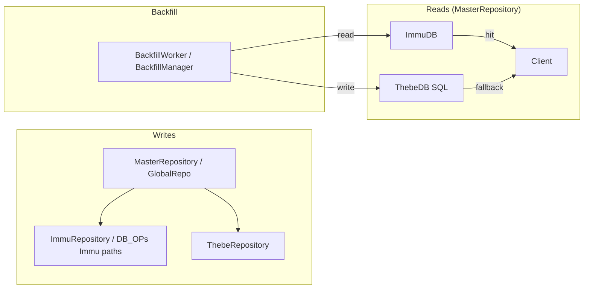

# Dual-write & ThebeDB migration — index

This folder holds documentation for the **`fix/DB_DualWrite`** work: **ImmuDB + ThebeDB (PostgreSQL) dual-write**, **read routing**, **historical backfill**, and **operational configuration**.

Use this file as the **entry point**; deeper topics can be split into additional markdown files under `docs/DualWriteDocs/` as the branch evolves.

---

## Table of contents

1. [Scope and goals](#scope-and-goals)
2. [Branch timeline (14 commits)](#branch-timeline-14-commits)
3. [Architecture at a glance](#architecture-at-a-glance)
4. [Module-by-module: commits and file changes](#module-by-module-commits-and-file-changes)
5. [Environment and configuration](#environment-and-configuration)
6. [Related source locations](#related-source-locations)

---

## Document Suite

| Document | What it covers |
|----------|---------------|
| **[INDEX.md](INDEX.md)** *(this file)* | High-level overview, branch timeline, mermaid diagram, source locations |
| **[COMMITS.md](COMMITS.md)** | Every commit — files changed, functions added/removed, exact reason for each change |
| **[ARCHITECTURE.md](ARCHITECTURE.md)** | Full call graph, package responsibilities, ThebeDB integration deep-dive, GlobalRepo pattern, recursion guard, tracing |
| **[OPERATIONS.md](OPERATIONS.md)** | Running a node, Postgres setup, backfill how-to, admin API reference, port table, troubleshooting |

---

## Scope and goals

| Goal | What the code does |
|------|---------------------|
| **Dual-write** | Writes that must hit both stores go through **`MasterRepository`** / **`GlobalRepo`** where appropriate; **Immu-only** paths are explicit (`*Immu` suffix) to avoid recursion. |
| **Read preference** | **`MasterRepository`** tries **ImmuDB first**, then **ThebeDB** as fallback (Thebe may lag during migration). |
| **Migration** | **Backfill** copies historical blocks/accounts from Immu into Thebe’s SQL layer; **state** tracks progress; **verifier** can compare both sides. |
| **Operations** | **Postgres DSN** in unified settings; local **port 5433** for standalone Postgres vs **5432** used by ImmuDB’s PG wire protocol; optional **admin HTTP API** for backfill lifecycle. |

---

## Branch timeline (14 commits)

Order: **oldest → newest** (how the branch evolved).

| # | Commit | Summary |
|---|--------|---------|
| 1 | `46b45d1` | **sqlops tests:** Safer table DDL/DML strings for S3649-style findings (#12). |
| 2 | `a7892f8` | **Merge `main`:** sqlops production hardening, scripts, node manager, etc. |
| 3 | `2b70e17` | **CI:** SonarQube workflow and properties (#13). |
| 4 | `cdbd2ae` | **Merge `main`:** Sonar workflow onto branch. |
| 5 | `9fbe398` | **Bugfix:** `uint64` underflow in `CheckNonceAndGetLatest` block scan (infinite loop on low block counts). |
| 6 | `93752e7` | **Reads:** Coordinator tries **Immu first**, Thebe fallback (accounts, blocks, logs, latest block). |
| 7 | `201a8ab` | **Migration v1:** State tracker, schema, backfill worker, verifier, tests; auto `go worker.Run` in `setup`. |
| 8 | `34331b1` | **Migration v2:** `BackfillManager`, admin routes, env-driven enable; **`main.go`** DSN flag and admin server. |
| 9 | `64e6339` | **Immu:** `127.0.0.1`, non-nil pooled conns for Immu writes; **`lib/pq` direct** in `go.mod`. |
| 10 | `c03f3ae` | **Config:** `PostgresDSN` in defaults + `jmdn_default.yaml`; setup script Postgres support. |
| 11 | `65a2326` | **Merge** `fix/uint64-underflow-checknonce` into dual-write. |
| 12 | `66a2473` | **Port:** Default PG **5433**, script patches `postgresql.conf` to avoid clash with Immu on **5432**. |
| 13 | `d7b0836` | **Loader:** `database.postgres_dsn` default in Viper `setDefaults`. |
| 14 | `54d05cd` | **Refactor:** `StoreZKBlockImmu`, `UpdateAccountBalanceImmu`; remove GlobalRepo from low-level getters. |

---

## Architecture at a glance

**Reads:** Immu first, Thebe second — see `internal/repository/coordinator.go`.

**Writes:** `DB_OPs.StoreZKBlock` / `UpdateAccountBalance` delegate to `GlobalRepo` when set; `ImmuRepository` calls `*Immu` functions to avoid **Immu → GlobalRepo → Immu** recursion.

**Backfill:** Copies from Immu-shaped source to Thebe target; progress via `migration_state.go` (`MAX(block_number)` etc.).

---

## Module-by-module: commits and file changes

### `DB_OPs/sqlops/`

| Commit | Files | Change |
|--------|--------|--------|
| `46b45d1` | `sqlops_test.go` | Test DDL/INSERT use fixed string building with quoted identifiers instead of `fmt.Sprintf` for table names. |
| `a7892f8` (merge) | `sqlops.go`, `sqlops_test.go` | Production **prepared / safer** statement patterns from `main` (full dual-write branch picks these up via merge). |

### `DB_OPs/account_immuclient.go`

| Commit | Files | Change |
|--------|--------|--------|
| `9fbe398` | same | `CheckNonceAndGetLatest`: top-decrement loop to prevent **uint64 wrap** past block `0`. |
| `54d05cd` | same | `GetAccount` / `GetAccountByDID`: **no** GlobalRepo — Immu only. `UpdateAccountBalance` → `GlobalRepo` or `UpdateAccountBalanceImmu`. |

### `DB_OPs/immuclient.go`

| Commit | Files | Change |
|--------|--------|--------|
| `54d05cd` | same | `StoreZKBlock` → `GlobalRepo` or `StoreZKBlockImmu`. Getters for blocks/tx/latest: **Immu only**; routing at `MasterRepository`. |

### `internal/repository/immu_repo/immu_repo.go`

| Commit | Files | Change |
|--------|--------|--------|
| `64e6339` | same | `StoreAccount` / `StoreZKBlock`: acquire **pooled connections**; never pass `nil` to DB_OPs. |
| `54d05cd` | same | `StoreZKBlock` → `StoreZKBlockImmu`; `UpdateAccountBalance` → `UpdateAccountBalanceImmu`. |

### `internal/repository/coordinator.go`

| Commit | Files | Change |
|--------|--------|--------|
| `93752e7` | same | Read order: **Immu → Thebe**; span attributes `immu_hit` / `thebe_fallback`. |

### `internal/repository/` — migration

| Commit | Files | Change |
|--------|--------|--------|
| `201a8ab` | `migration_config.go`, `migration_state.go`, `migration_backfill.go`, `migration_verifier.go`, `*_test.go`, `setup.go` | Config, **Postgres schema** in `EnsureSchema`, **StateTracker**, **BackfillWorker**, **Verifier**, tests, initial **goroutine** backfill. |
| `34331b1` | `migration_manager.go`, `migration_admin.go`, `migration_backfill.go`, `migration_config.go`, `setup.go`, `main.go` | **BackfillManager** (Start/Stop/Status), **admin HTTP** handler, env-based defaults, optional auto-start; **`Repositories.Manager`**. |

### `internal/repository/thebe_repo/thebe_repo.go`

| Commit | Files | Change |
|--------|--------|--------|
| `201a8ab` | same | Defensive **nil** checks around async logger; **timestamp** column uses `to_timestamp($4)` in `StoreZKBlock` insert. |

### `config/`

| Commit | Files | Change |
|--------|--------|--------|
| `64e6339` | `ImmudbConstants.go` | `DBAddress` = `127.0.0.1` (IPv4 loopback). |
| `c03f3ae` | `settings/defaults.go`, `jmdn_default.yaml` | `PostgresDSN` default and YAML field. |
| `66a2473` | `settings/defaults.go` | DSN port **5433**. |
| `d7b0836` | `settings/loader.go` | `setDefault("database.postgres_dsn", ...)`. |

### `main.go`

| Commit | Files | Change |
|--------|--------|--------|
| `34331b1` | same | `--thebe-dsn`, `ThebeDB_SQLPath` from **Postgres DSN**; **admin server** on `ADMIN_PORT`; `envOrDefault` helper. |

### `Scripts/setup_dependencies.sh`

| Commit | Files | Change |
|--------|--------|--------|
| `c03f3ae` | same | Postgres install path / `--postgres` (large script addition). |
| `66a2473` | same | Default port **5433**, patch `postgresql.conf` before start. |

### `go.mod` / `go.sum`

| Commit | Files | Change |
|--------|--------|--------|
| `64e6339` | both | `github.com/lib/pq` **direct**; ThebeDB resolution lines. |

### CI

| Commit | Files | Change |
|--------|--------|--------|
| `2b70e17`, `cdbd2ae` | `.github/workflows/*`, `sonar-project.properties` | SonarQube pipeline. |

---

## Environment and configuration

| Mechanism | Purpose |
|-----------|---------|
| `database.postgres_dsn` in YAML | ThebeDB PostgreSQL DSN. |
| `JMDN_DATABASE_POSTGRES_DSN` (env) | Overrides via unified settings (Viper). |
| `--thebe-dsn` | CLI override for Postgres DSN. |
| `BACKFILL_ENABLED` | Opt-in auto-start of backfill (via `ConfigFromEnv` / setup). |
| `ADMIN_PORT` | If set, bind admin HTTP for `/admin/backfill/*` on `127.0.0.1`. |
| `ADMIN_TOKEN` | If set, require `X-Admin-Token` for admin routes. |

Defaults use **`127.0.0.1:5433`** for Postgres where the branch standardizes around **avoiding 5432** (ImmuDB PG wire).

---

## Related source locations

| Area | Path |
|------|------|
| Coordinator / reads | `internal/repository/coordinator.go` |
| Repository init, backfill wiring | `internal/repository/setup.go` |
| Migration state & schema | `internal/repository/migration_state.go` |
| Backfill worker | `internal/repository/migration_backfill.go` |
| Backfill manager & progress | `internal/repository/migration_manager.go` |
| Admin HTTP | `internal/repository/migration_admin.go` |
| Verifier | `internal/repository/migration_verifier.go` |
| Immu repo | `internal/repository/immu_repo/immu_repo.go` |
| Thebe repo | `internal/repository/thebe_repo/thebe_repo.go` |
| DB_OPs Immu / accounts | `DB_OPs/immuclient.go`, `DB_OPs/account_immuclient.go` |
| Defaults & loader | `config/settings/defaults.go`, `config/settings/loader.go` |
| Sample config | `jmdn_default.yaml` |
| Node entry | `main.go` |

---

## Document history

| Date | Change |
|------|--------|
| 2026-04-02 | Initial index: 14-commit summary, module map, env table, mermaid diagram. |

---

*Branch reference at time of writing: **`fix/DB_DualWrite`**. Update this index when behavior or defaults change.*
