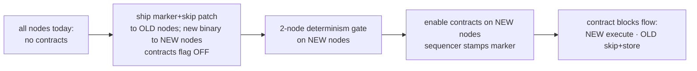

# Mixed-fleet compatibility: contract blocks on EVM-less nodes

**Status:** design for team review (no code yet).
**Audience:** node operators + protocol engineers.
**Scope:** how blocks that contain contract transactions (deploy / call) are ingested by nodes that
do **not** run the smart-contract (EVM) layer, once the fleet is split into two sets.

---

## 1. Situation

Two node populations will coexist:

- **New nodes** — ThebeDB storage **+** smart-contract (EVM) layer. Execute contracts, keep contract
  state, serve the gETH/Facade RPC, and (may) participate in consensus.
- **Old nodes** — ImmuDB storage, **no** smart-contract layer. **Operator decision: old nodes are
  demoted — they do NOT participate in consensus and do NOT serve gETH/Facade RPC.** They remain as
  followers/archive/relay: they receive, store, and forward blocks.

**Requirement:** blocks that include contract transactions (deployment, execution, or a call) must be
**added to the old nodes too, without breaking them.**

## 2. The governing constraint (please read first)

Adding the EVM changes the chain's **state-transition rules**. A node that cannot execute the EVM
**cannot independently reproduce the state a contract transaction produces** — this is a compute-
capability gap, not a wire-format gap. No serialization trick removes it.

Demoting old nodes from **consensus** and **RPC** is what makes coexistence tractable: it removes the
requirement that old nodes *compute correct contract state*. They only need to **ingest and store**
contract blocks without crashing, and keep the non-contract state they still hold consistent.

Even so, **old nodes cannot be left byte-for-byte unmodified** — see §4. A small, wire-compatible
patch is required. This doc specifies the minimal one.

## 3. What a block containing a contract tx looks like on the wire

- The **canonical block hash is computed from transaction contents only**
  (`Security.RecomputeBlockHashFromContents`). Advisory metadata the sequencer adds — `AccountNonces`
  (ART identity), `StateFingerprint` (P2.5), and the **contract-tx marker** proposed below — is **NOT**
  part of the block hash. Older builds ignore unknown JSON fields on unmarshal.
- **Consequence:** a contract block is **wire-compatible**. Old nodes can receive it, verify its hash,
  and store it. The block *propagation and hash* layer needs no change. The only issue is the **apply**
  path (§4).

## 4. What breaks today on an EVM-less node (verified against the tree)

| Tx kind | On-wire (receive/hash) | Apply on an *unmodified* old node |
|---|---|---|
| Plain transfer | OK | OK (unchanged) |
| Contract **call** (`To` = address with code) | OK | Applied as a **plain transfer** (moves `tx.Value`, charges gas, ignores calldata) → **silent state divergence** for contract-touched accounts |
| Contract **deploy** (`To == nil`) | OK | **PANIC / reject** — `processTransaction` dereferences `tx.To` (`tx.To.Hex()`, recipient lookup) → block-apply crashes |

Two distinct problems: **deploy crashes**, and **a call is indistinguishable from a transfer** without
the contract-code table, so an EVM-less node cannot even *recognise* it to skip it.

## 5. Design — contract-tx marker + skip-on-apply

Two pieces, both small and wire-compatible.

### 5.1 Advisory contract-tx marker (block field)
The sequencer knows exactly which txs are contract txs (it executed them). It stamps an **advisory,
non-consensus-hashed** list of the block's contract-tx hashes (or a per-tx boolean), carried like
`AccountNonces` / `StateFingerprint`:

```
ZKBlock.ContractTxs []common.Hash   // json:"contract_txs,omitempty" — advisory, NOT in BlockHash
```

- Not hashed → block hash unchanged → old and new nodes stay wire-compatible; pre-marker builds ignore
  it.
- Lets an **EVM-less node identify contract txs it otherwise couldn't** (a call looks like a transfer).

### 5.2 Skip-on-apply when the EVM is absent
On the apply path (`processTransaction`), a node with **no contract executor registered**
(`!execbridge.Enabled()`) — i.e. an old/EVM-less node, or a new node with the flag off — treats a
marked contract tx as a **no-op for state**: it does **not** apply a transfer, does **not** charge gas,
does **not** deref `tx.To`. It simply records the tx as seen and moves on. The full block is still
stored.

A new node with the executor registered ignores the marker and runs the tx through the EVM seam
(current behaviour).

### 5.3 Behaviour matrix (target)

| Node | Plain tx | Contract call (marked) | Contract deploy (marked) |
|---|---|---|---|
| New (EVM on) | apply | **execute** (EVM → fold → commit) | **execute** (deploy) |
| Old/patched (EVM absent) | apply | **skip state, store block** | **skip state, store block** (no panic) |
| Old/**unpatched** | apply | mis-apply as transfer (divergence) | **PANIC** |

The patch turns the bottom-right two cells from "break/diverge" into "skip cleanly".

## 6. The trade-off you are accepting (decision point)

Skipping a contract tx means the old node also does **not** charge the sender's gas or move any value
for it. Therefore:

> **An old node's balances are NOT authoritative for any account that ever sends or receives through a
> contract.** Old-node state is a faithful record of *plain* (non-contract) activity only.

This is acceptable **iff** old nodes serve nothing that must reflect contract-touched balances (they
are demoted from RPC, so this holds by construction). **If** old nodes must keep correct *plain*
balances even for accounts that also touch contracts, skip is insufficient and you need the
**effects-in-block** alternative (§9) instead.

## 7. FastSync isolation (mandatory operational rule)

Old (contract-skipping) and new (contract-applying) nodes maintain **deliberately different ledgers**.
Therefore:

- A **new** node must **never** FastSync from an **old** node (it would inherit a contract-less ledger).
- Safe topologies: **new ↔ new** and **old ↔ old** only. Cross-population sync must be prevented
  (peer-class tag / separate sync pools), or FastSync must itself honour the marker (skip contract txs
  when the target is EVM-less) — but the simplest safe rule is **isolation by node class**.

## 8. Rollout



1. **Patch old nodes** with marker-awareness + skip-on-apply + `To==nil` nil-safety (the B7 fix). Ship
   the new binary to new nodes with `cfg.Contracts.Enabled=false`.
2. Run the **2-node determinism gate** on the new nodes (deploy/call/payable → identical fingerprint,
   balances, receipts; a diverged node halts).
3. **Enable contracts on the new nodes**; the sequencer begins stamping the contract-tx marker.
4. Contract blocks now flow fleet-wide: new nodes execute, old nodes skip-and-store — no breaks.

Order matters: the old-node patch must be deployed **before** the first contract tx is produced.

## 9. Alternatives considered

- **Effects-in-block (state diff).** The sequencer executes and the block carries the *resulting*
  balance (and storage) changes; all nodes **apply the carried effects** instead of re-executing. Lets
  EVM-less nodes stay *balance*-consistent even for contract-senders. Cost: validators become trusters/
  appliers of the sequencer (they no longer verify execution), and old nodes still cannot store contract
  storage or serve contract RPC. Bigger redesign; only needed if §6's trade-off is unacceptable.
- **Coordinated full upgrade (no old nodes).** Upgrade every node to the EVM binary and enable
  fleet-wide at a fork height; old nodes retire. Cleanest protocol-wise, but the operator has chosen to
  keep old nodes as followers — hence this doc.

## 10. Non-goals
- Old nodes executing contracts, serving contract RPC, or voting on contract state — explicitly out of
  scope (they are demoted).
- Contract **storage** correctness on old nodes — they do not keep it.
- Cryptographic (committee-signed) binding of the marker — it is advisory until the CON-02 v3 block
  hash; its trust rests on the single honest sequencer, same as `AccountNonces`/`StateFingerprint`.

## 11. Risks & open questions
- **Not zero-touch:** old nodes require the marker+skip patch (or at minimum B7 nil-safety). A truly
  unmodified old binary still panics on the first deployment block.
- **Marker authenticity:** advisory/sequencer-stamped, not certificate-bound yet. A malicious/ buggy
  sequencer could mis-mark; under the single-honest-sequencer model this is accepted (and CON-02 v3
  later binds it).
- **Two intentional ledgers:** old-node and new-node state differ by design; must be documented so
  old-node balances are never treated as canonical and never cross-FastSynced.
- **Open Q1:** must old nodes keep correct *plain* balances for contract-senders? (No → marker+skip;
  Yes → effects-in-block.)
- **Open Q2:** marker shape — block-level `[]txHash` list vs a per-tx flag? (List is smaller and keeps
  `Transaction` unchanged.)
- **Open Q3:** enforce FastSync isolation by node-class tagging, or teach FastSync to honour the marker?

## 12. Summary
Because old nodes are demoted from consensus and RPC, they do not need to compute contract state — so a
**contract-tx marker (advisory) + skip-on-apply when the EVM is absent + `To==nil` nil-safety** lets
them ingest and store every contract block without breaking, while keeping their plain-transfer ledger
consistent. The one accepted trade-off: old-node balances are not authoritative for contract-touching
accounts. If that trade-off is not acceptable, the effects-in-block model (§9) is the alternative.
