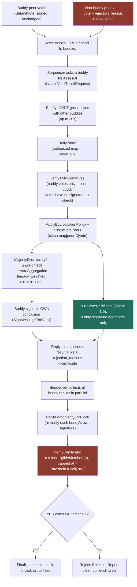

# Final Workflow — Validator Vote → Buddy Processing → Sequencer Decision

**Status: 2026-08-30.** This is the single, end-to-end, reconciled design — what a vote actually goes through today, what's built and waiting, and what's still blocked. It supersedes reading `VALIDATOR-SCALE-VOTE-AGGREGATION-LLD.md` section-by-section for a top-down view; that doc still holds the section-level detail and rationale.

**Ground rule carried through this whole document: nothing about the legacy/live AVC path is being changed.** Everything new is additive — extra fields, extra certificates, computed alongside the existing decision and ignored by anything that doesn't yet read them. If a live node stopped listening to every new field described below, its behavior would be identical to today.

**Design decision (2026-08-30): a normal (non-buddy) peer never sends a signature. Period.** When the validator pool widens past the 7 buddies, a non-buddy peer's vote is `{vote, rejection_reason}` only — the same shape the legacy path already uses. No BLS signature, no per-vote cryptographic check, anywhere in that path. This is deliberate, for speed: verifying a signature per vote is real cost at scale, and this design does not pay it for the wider pool.

**What this means for the buddy-side certificate machinery below (§4/§0):** `BuildVoteCertificate`/`VerifyVoteCertificate` aggregate BLS *signatures* — with non-buddy votes unsigned, there is nothing for them to aggregate at that layer. That machinery stays exactly as built and tested, and stays meaningful for buddy-level votes (the 7 buddies still sign, same as today, same as Phase 1.5 already uses) — it simply does not extend to the wider validator pool under this decision. The security boundary for the wider pool is the same one the legacy path already has: buddies are trusted to tally reported vote values honestly; the sequencer's cryptographic check remains on the buddies' own signed conclusions, not on individual validator votes.

---

## The full flow, stage by stage



---

## Stage 1 — Every peer/validator casts a vote

**Buddy votes: live, unchanged. Non-buddy votes: this session's design decision — unsigned, see above.**

- Any peer running the node software can vote and send it to the buddy nodes. Nothing filters who gets to send — that has never been restricted.
- **Buddy peers** (today, the only voters that exist): `Vote/Trigger.go`, `SubmitVote` — validates the block first (`Security.CheckZKBlockValidation`), signs with `SignMessageForBlock`, a v3 block-bound BLS signature, and writes to its own local CRDT immediately (`AddVote`). Unchanged.
- **Non-buddy peers** (once the pool widens past 7): send `{vote, rejection_reason}` — no signature. Same shape the legacy path already accepts; no new code needed here, since the legacy path never required a signature to begin with.
- Either way, the vote reaches the buddy nodes and lands in their CRDT. **The restriction that exists today is one stage later, at counting, not here.** See Stage 3.

## Stage 2 — Buddies converge (CRDT gossip)

**Live, unchanged.**

- Triggered on-demand: when the sequencer calls `handleVoteResultRequest` on a buddy, that buddy first runs `TriggerCRDTSyncForBuddyNode` — a full-state push/pull gossip round with the other buddies, capped at 30 seconds or until it's heard from all of them, whichever comes first.
- **A8-1 (fixed this session):** the merge path applying a peer's incoming votes now enforces the same watermark (reject an already-compacted height) and per-peer ingest cap (max 3 distinct elements per peer per block) that `AddVote` already enforced on the direct-write path. Before this fix, the gossip path could silently bypass both.

## Stage 3 — Buddy tallies

**Live, unchanged** — this is one linear pass, correct at any authorized-set size (confirmed, not assumed — nothing here hardcodes 7):

1. `TallyBlock(controller, height, blockHash, authorized)` — reads the two CRDT keys for this block directly (`votes:height:hash`, `votesig:height:hash`), and checks each vote-identity element against `authorized`, the ONE place any restriction actually happens. **This is where "every peer can vote" (Stage 1) meets "only 7 are counted" (today):** a vote from a peer not in `authorized` is not an error and is not dropped silently in the sense of being lost — it is read, recognized, and explicitly counted as `SkippedUnauthorized`, then excluded from the tally. `authorized` itself comes from `eligibleMembers()`, capped at 7 today. Widening that map to the full validator set is the entire content of §7 below — nothing about Stages 1, 2, or the rest of Stage 3 needs to change to make that happen.
2. `verifyTallySignatures` — cryptographically re-verifies every counted vote's BLS signature; a forged element is dropped before anything downstream sees it. **Applies to buddy votes** (signed, as always). Under this session's design decision, a non-buddy vote carries no signature to verify — it is counted at whatever value it reports, same trust level the legacy path already has for every vote today.
3. `ApplyEquivocationPolicy` + `SingleVotePeers()` — a peer with two distinct vote values for this block is excluded; everyone else's single value survives into `clean map[peerID]int8`.
4. **Two tally implementations coexist, gated by `JMDN_VOTE_CRDT_V2` (default off):**
   - **Legacy (default today):** `voteaggregation.VoteAggregation(weights, votes)` — **weighted**, seed-node-sourced weights, falls back to 1.0 if unavailable.
   - **v2 (opt-in):** `voteaggregation.MajorityDecision(votes)` — **unweighted**, by deliberate design (`Utils.go`'s own comment: *"reputation/stake weight must never multiply an already-cast validator vote"*).
   - **Neither is being replaced or removed here.** Which one runs is purely the existing flag's decision. This document does not recommend dropping weighting — that's a decision for whoever owns the AVC redesign to make explicitly, with both options intact and working today.

## Stage 4 — Buddy builds its certificate(s)

**Built and tested this session. Both run additively alongside Stage 3's existing decision — neither can change it.**

- **Phase 1.5 (signer-list, buddy-scale):** aggregates the already-verified YES-*buddies*' BLS signatures via `bls.BLSAggregate`, tracks which of the (≤7) buddies are included as a plain peer-ID list. Attached to the reply as `"certificate"`. Unaffected by the unsigned-non-buddy-vote decision — it only ever covered buddy signatures.
- **§0 + §4 (bitmap, validator-scale) — built, tested, but no longer the intended path for non-buddy votes under this session's decision.** `SnapshotOrder(eligible)` + `BuildVoteCertificate(clean, signatures, index)` aggregate *signed* votes into `{AggSig, Bitmap, SignerCount}`. Since non-buddy votes carry no signature, this has nothing to aggregate from them. It remains valid, tested infrastructure — usable again if signed non-buddy votes are ever reconsidered — but is not part of the active design for the wider validator pool right now.
- Phase 1.5 is **best-effort, non-fatal**: a failure to build it is logged and the reply still goes out with the original `result`/`bls`/`rejection_reasons` fields untouched.

## Stage 5 — Buddy replies to the sequencer

**Live. `certificate` (Phase 1.5) extended this session — additive, buddy-scope only.**

```go
resultData := map[string]interface{}{
    "result":            result,           // unchanged
    "bls":                blsResp,         // unchanged — buddy's own signature on its own conclusion
    "rejection_reasons": rejectionReasons, // unchanged
    "certificate":       voteCertificate,  // Phase 1.5 buddy-signature aggregate, omitted if nil
}
```

`validator_certificate` (§4/§5's bitmap-based field) is built and available in the code but, per this session's design decision above, isn't the active path for non-buddy votes — nothing requires it to be attached here under the current design. It stays available to reintroduce if signed non-buddy votes are ever reconsidered.

Same RPC as always (`/p2p/submit/message/...`, direct request-response — not the dead `Type_BFTRequest` pubsub path, see the note below).

## Stage 6 — Sequencer collects and decides

**Live, unchanged.**

1. `CollectVoteResultsFromBuddies` — polls all buddies **in parallel** (not sequentially), each with its own read timeout.
2. Per buddy: `VerifyForBlock` — independently re-verifies that buddy's own signature against the exact block hash/height. The sequencer never trusts a buddy's self-report at face value.
3. `VerifyCertificate` — `n := len(eligibleMembers())`, the capped set (7 today); `Threshold := ByzantineQuorum(n) = ceil(2n/3)` = 5 of 7.
4. `YesVotes >= Threshold` → finalize, commit, broadcast. Otherwise → reject, dispatch a `RejectionReport` to clean up pending transactions.

**This is the one and only quorum check that runs, and stays the only one under this session's design.** With non-buddy votes unsigned, there is no per-validator certificate for the sequencer to verify even in principle — the sequencer's cryptographic check stays exactly where it already is, on the 7 buddies' own signed conclusions. §7 (below) is now purely about *counting* — widening `authorized` so `TallyBlock`'s majority reflects the full validator pool — not about wiring up any certificate verification.

---

## What's genuinely blocked, and by what

| Blocker | Blocks | Status |
|---|---|---|
| **Seed-node `GetCommitteeSnapshot`** | `require_pinned_committee`, growing the pool past 7, §7 | **Reported resolved** by a colleague's review (seedNodes branch `fix/committee-require-rtt-evidence`, `pkg/peer/gorm_jmns_service.go:146`, past-epoch reads confirmed working) — **not independently verified by me; I have no access to that repo.** Get direct confirmation from someone with `seedNodes` open before treating this as settled. |
| **§7 — voter-set / reporter-set split** | Letting the full validator set vote without halting consensus | Not built. Today one source (`eligibleMembers()`) feeds both "who may vote" (Stage 3) and "what's `n`" (Stage 6). Widen the pool without splitting these and the sequencer's threshold grows to `ceil(2V/3)` while only 7 buddies ever reply — quorum becomes unreachable. This is the one required change, not BFT, not bitmaps. |

## What's confirmed dormant, not blocking anything, but worth cleaning up

- **BFT PREPARE/COMMIT (`AVC/BFT/bft/`)** — fully built, and per independent review, is actually the **compiled-in default** the moment `Type_BFTRequest` is ever triggered (`UseLegacyBFT` defaults to running the full engine, not the manual fallback). Nothing sends that message today, on any branch checked — both the engine path and its legacy escape hatch are unreachable. Recommend **retiring it deliberately** (delete the engine, the flag, the four dangling handlers) rather than leaving a default-on path with no trigger, since the next person who adds a sender silently turns PBFT on in production with zero warning.
- **Two unconditional sleeps on the sequencer's critical path**, independent of anything above: a 15-second placeholder wait (`Consensus.go`, explicitly commented *"should be replaced with event-driven trigger"*) plus the 30-second CRDT gossip window (Stage 2). Making the CRDT window close on quorum-reached instead of always running the full 30s, and removing the placeholder sleep, is a larger, simpler latency win than anything BFT-related — and needs no architectural decision to do.
- **D-1/D-2/D-3** (hardcoded VRF mnemonic, non-aggregate "aggregate" signature, single-dissenter veto) — real bugs, confirmed dormant behind `Features.AvcValidation` (default off, testnet-only, shadow mode). Independent of everything above; tracked in `A7-A10-IMPLEMENTATION-PLAN.md`, not yet fixed.
- **Three instances of an EntropyEpoch/SelectionPeriod clock conflation** (`SelectEntropyCommittee`, `entropy_aggsig.go`'s prev-cert verification, `committee_snapshot_anchor.go`'s freeze logic) — found and fixed this session. Inert today (pinning is off), would have resolved the wrong committee pool once pinning goes live.

## Recommended order, once the seed-node status is confirmed for real

1. Get independent confirmation of `GetCommitteeSnapshot`'s actual state directly from someone with the `seedNodes` repo open — this is the fact everything else waits on.
2. If confirmed: enable `require_pinned_committee` behind the usual staged rollout.
3. Build §7 (voter-set/reporter-set split), flag-gated — the one piece of new code genuinely required.
4. Retire BFT deliberately (cleanup, independent, can happen anytime).
5. Fix the two sleeps (independent, can happen anytime, biggest single latency win available).
6. Only after 2–3: grow `max_validators` past 7.

Nothing above requires touching the legacy weighted tally, the existing sequencer quorum check, or any currently-live behavior. Phase 1.5 and A8-1 are live improvements to the existing buddy-scope path. §0/§4/§6 remain built and tested but, per this session's unsigned-non-buddy-vote decision, are not the active mechanism for the wider validator pool — they stay available if that decision is ever revisited. §7 is still the one piece of new code required, and it's now purely a counting change (widen `authorized` for `TallyBlock`'s majority), not a certificate-verification change.
