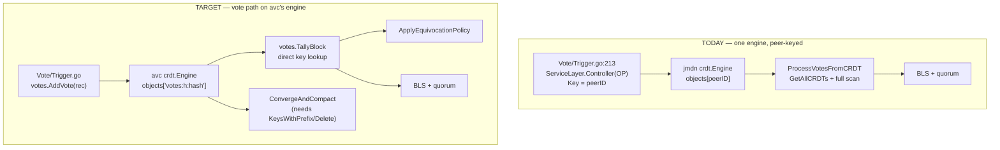

# JMDN Vote-CRDT Migration — Low-Level Design

**Repo:** `jmdn` (integration side). Library side is `avc/crdt/votes`, already built.
**Companion docs:** `avc/docs/CRDT-VOTE-STORE-LLD.md` (the library's own LLD),
`avc/docs/CRDT-COMPACTION-DESIGN.md` (the design authority).
**Status:** ready to implement. Two decisions (§9) block Stage 4 and Stage 6.
**Verified against the tree on 2026-08-26.** Every signature, line number and
import direction below was read from source in this session, not recalled.

---

## 0. What this document is for

`avc/crdt/votes` is complete: 7 files, 39 tests, 89.3% coverage, implementing
the block-keyed vote store (re-key, typed records, equivocation detection,
watermark, converge-then-compact). **Nothing in `jmdn` calls any of it.**
`grep -rn "avc/crdt/votes" jmdn` returns nothing; so do `TallyBlock`,
`SetWatermark` and `CompactVotesBelowHeight`.

This document is the integration plan. It is deliberately staged so that
**every stage is independently shippable and independently revertible**, and
so that no stage can halt consensus if it turns out to be wrong.

### 0.1 The two facts that shape the whole plan

Both were verified in this session and both invalidate the obvious approach
("just swap the write call"):

**Fact 1 — the two CRDT stacks are different Go types.**

```go
// jmdn/AVC/BuddyNodes/Types/Types.go:17
import "gossipnode/crdt"
type Controller struct { CRDTLayer *crdt.Engine }

// avc/types/controller.go:6
import "github.com/JupiterMetaLabs/avc/crdt"
type Controller struct { CRDTLayer *crdt.Engine }
```

Structurally identical, **different concrete types wrapping different
engines**. `votes.AddVote(c *types.Controller, …)` cannot accept
`listenerNode.CRDTLayer`. `Controller` is a struct, not an interface, so no
adapter can bridge them. `jmdn` currently imports `avc/crdt` **nowhere**.

**Fact 2 — swapping the writer alone halts consensus.**

`AddVote` writes elements as `"<peerID>:<vote>"` and
`"<peerID>:<json VoteRecord>"`. The still-live reader
`ProcessVotesFromCRDT` (`AVC/BuddyNodes/MessagePassing/Structs/Utils.go:120`)
runs `json.Unmarshal([]byte(voteStr), &voteDataObj)` on **every element it
finds**. Both new formats fail to parse, are skipped, and the caller at
`Sequencer/Consensus.go:1324-1330` lands on `voteResult == 0` → *"No votes in
CRDT yet"* → no quorum.

**Consequence: writer and reader must not be switched in the same step, and
the writer must keep feeding the old reader until the new reader is live.**
Stage 2's dual-write exists precisely for this.

### 0.2 The one piece of good news

The two engines have **identical public APIs** except for the two methods
compaction needs. Verified side by side:

| Method | jmdn `crdt.Engine` | avc `crdt.Engine` |
|---|---|---|
| `NewEngineMemOnly(maxHeapBytes int64)` | ✅ `CRDT_DBOps.go:13` | ✅ `engine.go:10` |
| `LWWAdd(nodeID, key, element string, ts VectorClock) error` | ✅ `:23` | ✅ `:16` |
| `LWWRemove` | ✅ `:40` | ✅ `:30` |
| `CounterInc` | ✅ `:57` | ✅ `:44` |
| `GetSet(key) ([]string, bool)` | ✅ `:72` | ✅ `:58` |
| `GetCounter` | ✅ `:76` | ✅ `:62` |
| `GetAllCRDTs() map[string]CRDT` | ✅ `:82` | ✅ `:66` |
| `ApplyMergedCRDT(key, crdt)` | ✅ `:88` | ✅ `:70` |
| `SnapshotAll(...)` | ✅ `helper.go:66` | ✅ `:88` |
| **`KeysWithPrefix(prefix) []string`** | ❌ **absent** | ✅ `:78` |
| **`Delete(key) bool`** | ❌ **absent** | ✅ `:82` |

So standing up an avc engine beside the existing one is mechanical, and
`CompactVotesBelowHeight` can **never** work against jmdn's engine — which is
why the engine question must be settled in Stage 1 rather than deferred to
Stage 6.

---

## 1. Target architecture



**The vote path moves to avc's engine. Everything else in `jmdn` that uses
`gossipnode/crdt` stays where it is.** This is deliberate: a wholesale
migration of `gossipnode/crdt` is a far larger change with no benefit to this
work, and the vote CRDT is a self-contained concern.

---

## 2. Stage 1 — stand up the avc engine (infrastructure only)

**Risk: none.** Nothing reads or writes it. No behaviour changes. This stage
is safe to merge on its own and safe to leave in place indefinitely.

### 2.1 Add the field

`config/PubSubMessages/BuddyNode.go:22` — add one field beside the existing
one. Do **not** replace `CRDTLayer`; both coexist through Stages 1–6.

```go
import (
    "gossipnode/AVC/BuddyNodes/Types"
    avctypes "github.com/JupiterMetaLabs/avc/types"
)

type BuddyNode struct {
    CRDTLayer     *Types.Controller  // existing — jmdn engine, peer-keyed votes
    VoteCRDTLayer *avctypes.Controller // NEW — avc engine, block-keyed votes
    Host            host.Host
    // … rest unchanged
}
```

### 2.2 Add the builder setter

`config/PubSubMessages/BuddyNode_Builder.go` — mirror the existing
`SetCRDTLayer` at `:32`, and add the field to `NewBuddyNodeBuilder`'s copy
list at `:17` (it copies field-by-field; a field omitted there is silently
dropped whenever the builder is used to clone a node — that is the one real
trap in this file).

```go
func (buddy *BuddyNode) SetVoteCRDTLayer(c *avctypes.Controller) *BuddyNode {
    buddy.VoteCRDTLayer = c
    return buddy
}
```

```go
// inside NewBuddyNodeBuilder's struct literal, alongside CRDTLayer:
VoteCRDTLayer: buddy.VoteCRDTLayer,
```

### 2.3 Construct it wherever `CRDTLayer` is constructed today

Find the existing `SetCRDTLayer(...)` call site (node startup) and add:

```go
avcEngine := avccrdt.NewEngineMemOnly(maxHeapBytes) // same budget as the jmdn engine
buddy.SetVoteCRDTLayer(&avctypes.Controller{CRDTLayer: avcEngine})
```

**Use the same `maxHeapBytes` value the existing engine gets.** During
Stages 2–5 both engines hold vote data simultaneously, so the node's vote-CRDT
memory roughly doubles. That is bounded and temporary — it ends at Stage 7 when
the old path is deleted — but size it deliberately rather than by accident.

### 2.4 Exit criteria

- `go build ./...` clean
- A node starts and `VoteCRDTLayer != nil`
- **No behavioural test needed** — nothing uses it yet. That is the point.

---

## 3. Stage 2 — dual-write behind a flag

**Risk: none while the flag is off. Low when on** — the old write is unchanged,
so the old reader keeps seeing exactly what it sees today.

### 3.1 The flag

Follow the established pattern (`JMDN_M2B_HASH`, `JMDN_COMMITTEE_V2`,
`JMDN_AVC_AGG_CERT`, `JMDN_TIMEOUT_CERT_WIRING`):

```go
// AVC/BuddyNodes/MessagePassing/... or wherever the vote path can see it
var VoteCRDTDualWrite = envOn("JMDN_VOTE_CRDT_V2", false)
```

### 3.2 The change

`Vote/Trigger.go`, at the existing block ending `:213`. **Keep the existing
`ServiceLayer.Controller` call exactly as it is** and add the new write after
it:

```go
// EXISTING — unchanged. The old reader still depends on this.
if listenerNode.CRDTLayer != nil {
    ownVoteJSON := vt.ToVoteString(vt.Vote)
    OP := &Types.OP{
        NodeID:   listenerNode.PeerID,
        OpType:   int8(1),
        KeyValue: Types.KeyValue{Key: listenerNode.PeerID.String(), Value: ownVoteJSON},
    }
    if result := ServiceLayer.Controller(listenerNode.CRDTLayer, OP); result != nil {
        // … existing error handling
    }
}

// NEW — additive, flagged. Failure here must NEVER fail the vote: the old
// path is still authoritative until Stage 4.
if VoteCRDTDualWrite && listenerNode.VoteCRDTLayer != nil {
    rec := votes.VoteRecord{
        PeerID:       listenerNode.PeerID.String(),
        Vote:         vt.Vote.Vote,
        BlockHash:    blockHash,
        Height:       zkBlock.BlockNumber,
        BLSSignature: /* see 3.3 */,
        BLSPubKeyHex: /* see 3.3 */,
    }
    if err := votes.AddVote(listenerNode.VoteCRDTLayer, listenerNode.PeerID, rec); err != nil {
        if !errors.Is(err, votes.ErrHeightCompacted) {
            logger().Warn(spanCtx, "v2 vote CRDT write failed (old path unaffected)",
                ion.String("block_hash", blockHash), ion.String("err", err.Error()))
        }
    }
}
```

`votes.ErrHeightCompacted` is expected and harmless — a vote for an
already-converged height. Do not log it as an error.

### 3.3 The one thing Stage 2 needs that today's write does not

`VoteRecord` carries `BLSSignature` and `BLSPubKeyHex`. **Today's CRDT write
carries neither** — `Types.KeyValue{Key, Value}` holds only the vote JSON, and
jmdn's live `Vote` struct (`config/PubSubMessages/Pubsub.go`) carries
`Vote`/`BlockHash`/`RejectionReason` and no signature.

So the signature must be obtained at this point. It is produced elsewhere on
the vote path (BLS signing over the v3 canonical message). **Before writing
this stage, locate where the vote's BLS signature and this node's committee
public key are available at `Vote/Trigger.go`'s scope**, and thread them in.

If they are not available at that point, that is a real finding and Stage 2
grows: either the signing step moves earlier, or `SubmitVote` gains the two
values as parameters. **Do not write placeholder/empty strings** — an empty
`BLSPubKeyHex` makes `TallyBlock`'s `isAuthorizedVote` reject the vote at
Stage 4, and it will look like an authorization bug rather than a plumbing
gap.

### 3.4 Exit criteria

- Flag off: byte-identical behaviour, verified by the existing consensus tests
- Flag on, single node: `votes:<h>:<hash>` and `votesig:<h>:<hash>` keys appear
  in `VoteCRDTLayer`, old keys still appear in `CRDTLayer`, consensus unaffected
- Flag on: a deliberately failing `AddVote` (e.g. empty block hash) does not
  fail the vote

---

## 4. Stage 3 — buddy-to-buddy sync for the new keys

**Risk: medium.** This is the first stage where two nodes must agree.

`AVC/BuddyNodes/MessagePassing/CRDTSyncHandler.go` (659 lines) currently syncs
jmdn's engine, and hardcodes the peer-keyed assumption. Its own comment at
`:601` states it: *"The key is the peer ID, and elements are vote JSON
strings"*, and `:618` parses each key as a peer ID (`⚠️ Invalid peer ID in sync
data`).

### 4.1 What changes

The handler must additionally sync `VoteCRDTLayer`, treating keys as **opaque
strings**. The good news: `crdtsync` in avc "treats keys as opaque strings and
needs no change" (per `CRDT-COMPACTION-DESIGN.md`'s own "what we keep
unchanged" table) — the peer-ID parsing in jmdn's handler is an *added*
assumption, not an inherent one.

Two options:

| Option | Approach | Trade-off |
|---|---|---|
| **A** | Extend `CRDTSyncHandler.go` to sync both layers, skipping peer-ID validation for the v2 layer | Smaller diff, but leaves the peer-ID assumption in the file |
| **B** | Add a separate sync path for `VoteCRDTLayer` using avc's `buddynodes/crdtsync` | Cleaner separation, more new code, second gossip topic to manage |

**Recommendation: A.** It keeps one sync mechanism and one topic. The
peer-ID parse at `:618` becomes conditional on which layer is being synced.

### 4.2 Non-negotiable

Sync must **not** route the two layers' data into one another. A `votes:` key
landing in the jmdn engine would be scanned by `ProcessVotesFromCRDT`,
fail to parse, and inflate its skip counters; a peer-keyed vote landing in the
avc engine would be invisible to `TallyBlock` (wrong key shape) and would
never be compacted (`heightFromKey` returns `ok=false`, so
`CompactVotesBelowHeight` skips it) — a permanent leak.

### 4.3 Exit criteria

- Two nodes, flag on: node A's vote appears in node B's `VoteCRDTLayer` under
  the same `votes:<h>:<hash>` key
- Neither layer contains keys belonging to the other
- Flag off: sync behaviour byte-identical to today

---

## 5. Stage 3.5 — the authorized-committee map

**This stage is not optional and is easy to miss.** `TallyBlock` takes
`authorized map[string]string` (peerID → lowercase-hex BLS pubkey) as a
**required argument**; it does not derive it. Today's `ProcessVotesFromCRDT`
takes no such input and performs no authorization at all.

Without it, `TallyBlock` fails closed to an empty tally — **indistinguishable
from "no votes yet"**, which is exactly the silent-quorum-failure mode this
whole redesign exists to prevent.

### 5.1 The source already exists

`messaging/consensus_hardening.go` has exactly the right shape:

```go
func eligibleMembersUncapped() (map[string]string, error)  // :178
func eligibleMembers() (map[string]string, error)          // :232
```

`eligibleMembers` returns the authenticated eligible set capped to
`consensus.max_validators`. That is the map `TallyBlock` wants.

### 5.2 But it cannot be imported directly — verified import cycle

Both functions are **unexported**, and worse, the import direction forbids it:

```
messaging  →  Vote  →  AVC/BuddyNodes/MessagePassing
```

(`messaging/broadcast.go` imports `gossipnode/Vote`; `Vote/Trigger.go` imports
`AVC/BuddyNodes/MessagePassing`.) So `MessagePassing → messaging` is a cycle.

### 5.3 Use the established injection seam

This codebase already solved this exact problem. `AVC/BuddyNodes/MessagePassing/consensus_sync_gate.go:50`:

```go
func SetSlotStoreReadyFn(fn func() bool) { slotStoreReadyFn = fn }
```

…wired from `main.go` as `MessagePassing.SetSlotStoreReadyFn(messaging.SlotStoreReady)`.

Follow it exactly:

```go
// AVC/BuddyNodes/MessagePassing/committee_source.go — NEW
var authorizedCommitteeFn func() (map[string]string, error)

// SetAuthorizedCommitteeFn injects the eligible-committee source. Injected
// rather than imported: messaging -> Vote -> MessagePassing already exists,
// so importing messaging here would cycle. Same pattern as
// SetSlotStoreReadyFn in consensus_sync_gate.go.
func SetAuthorizedCommitteeFn(fn func() (map[string]string, error)) {
    authorizedCommitteeFn = fn
}

// authorizedCommittee returns the injected set, or an error. FAIL CLOSED:
// never return an empty map on error — TallyBlock treats an empty map as
// "authorize nobody", which is correct, but the caller must be able to tell
// that apart from "the committee is legitimately empty".
func authorizedCommittee() (map[string]string, error) {
    if authorizedCommitteeFn == nil {
        return nil, errors.New("MessagePassing: authorized-committee source not installed (fail closed)")
    }
    return authorizedCommitteeFn()
}
```

`messaging` side — export a thin wrapper (the existing functions stay
unexported):

```go
// messaging/consensus_hardening.go
func AuthorizedCommittee() (map[string]string, error) { return eligibleMembers() }
```

`main.go`, beside the existing `SetSlotStoreReadyFn` wiring:

```go
MessagePassing.SetAuthorizedCommitteeFn(messaging.AuthorizedCommittee)
```

### 5.4 Decision required — capped or uncapped?

`eligibleMembers` (capped by `max_validators`) or `eligibleMembersUncapped`?
This changes `n`, and therefore the quorum threshold. **See §9, Decision 1.**

### 5.5 Exit criteria

- Source not installed → `authorizedCommittee()` errors; no caller proceeds
- Installed → returns the same set `VerifyCertificate` uses today
- A unit test asserting the map is non-empty on a configured node

---

## 6. Stage 4 — rewrite the readers

**Risk: high.** This is the stage that changes consensus behaviour, and the
largest piece of real work in the plan.

### 6.1 It is not a signature swap

```go
// OLD — Structs/Utils.go:120
func ProcessVotesFromCRDT(ctx, listenerNode, targetBlockHash string) (int8, map[string]string, error)
//                                                                    ^^^^ ONE aggregated value

// NEW — avc/crdt/votes/tally.go:94
func TallyBlock(c *types.Controller, height uint64, blockHash string, authorized map[string]string) (BlockTally, error)
//   BlockTally{ AuthorizedVotesByPeer map[string][]int8, Signatures map[string][]VoteRecord, … }
//               ^^^^ per-peer, DELIBERATELY not collapsed
```

`TallyBlock` does not collapse per-peer votes — that is the entire point, so
equivocation stays visible instead of being silently overwritten (the live bug
at `Structs/Utils.go`'s `voteData[key] = …`). So each caller must be rewritten
against the new shape, not re-pointed.

### 6.2 Note the new required argument

`TallyBlock` needs `height`. `ProcessVotesFromCRDT` takes only
`targetBlockHash`. Every call site must now supply the block number —
available at all four, but it must be threaded.

### 6.3 The four call sites

| File | Line | Uses | Rewrite to |
|---|---|---|---|
| `Sequencer/Consensus.go` | `:1324` | `voteResult, _, err`; checks `err != nil \|\| voteResult == 0` for "no votes" | `len(tally.AuthorizedVotesByPeer) == 0` for the same condition |
| `AVC/…/MessagePassing/ListenerHandler.go` | `:1653` | `result, rejectionReasons, err` in a **retry loop** (`maxCRDTAttempts`, breaks on `err == nil`) | Keep the retry; treat an empty tally as "retry", a populated one as success. Rejection reasons now come from `tally.Signatures`' records |
| `AVC/…/MessagePassing/Service/subscriptionService.go` | `:729` | `result, _, err`; returns early on error | Same shape; error handling unchanged |
| `AVC/…/MessagePassing/Structs/Utils.go` | `:120` | the definition itself | Becomes a thin adapter (§6.4) or is deleted |

### 6.4 Recommended: keep a shim

Rather than rewriting four call sites against `BlockTally` at once, replace
`ProcessVotesFromCRDT`'s **body** with a call to `TallyBlock`, keeping its
signature, and derive the old return values:

```go
func ProcessVotesFromCRDT(ctx context.Context, listenerNode *PubSubMessages.BuddyNode,
    targetBlockHash string, height uint64) (int8, map[string]string, error) {

    authorized, err := authorizedCommittee()          // Stage 3.5
    if err != nil {
        return 0, nil, err                            // fail closed
    }
    tally, err := votes.TallyBlock(listenerNode.VoteCRDTLayer, height, targetBlockHash, authorized)
    if err != nil {
        return 0, nil, err
    }
    votes.ApplyEquivocationPolicy(tally, targetBlockHash, height, equivocationReporter) // Stage 6 concern
    // derive the old scalar from tally.SingleVotePeers()
    …
}
```

This confines the shape change to one function, keeps three call sites nearly
untouched (they gain the `height` argument), and makes the stage revertible by
flag. **The scalar derivation is where the real design work is** — decide
explicitly what the old `int8` meant and reproduce it from
`SingleVotePeers()`, rather than inferring it.

### 6.5 Exit criteria

- Flag off → old path, existing tests unmodified and green
- Flag on, two nodes → same accept/reject decision as flag off, on the same block
- An injected equivocating peer is excluded from `SingleVotePeers()` and
  appears in `EquivocatingPeers()`
- **Do not proceed to Stage 5 until flag-on and flag-off agree on a real block**

---

## 7. Stage 5 — BLS verification on the new tally

**Risk: low** if Stage 4's exit criteria held.

`TallyBlock` authenticates (checks the voter's claimed pubkey against the
committee record) but explicitly **does not verify the BLS signature
cryptographically** — its own doc comment says so, and that is the same
division of labour the old code had. So the existing aggregate-verify step is
still required and still correct.

The change is where its inputs come from: `tally.Signatures[peerID]` carries
the full `VoteRecord` (`BLSSignature`, `BLSPubKeyHex`) backing each counted
vote. Build `BLS_Signer.BLSresponse` values from those instead of from the
untyped map the old reader produced.

**Only verify signatures for votes you are counting.** Verifying every element
in the set is a CPU-DoS surface — the ingest cap (`maxElementsPerPeerPerBlock
= 3`) bounds it, but do not widen it. On an equivocation pair, verify both
(you need to confirm the double-sign is real before penalising).

### 7.1 Exit criteria

- Aggregate verification passes on a real block through the new path
- A forged signature in the CRDT is rejected, and the vote is not counted

---

## 8. Stage 6 — ConvergeAndCompact

**Risk: low, but only if called correctly.**

### 8.1 Use `ConvergeAndCompact`, not `CompactVotesBelowHeight`

`compact.go`'s own doc comment is explicit: calling
`CompactVotesBelowHeight` (or `Watermark.CompactBelow`) directly **skips the
deferred equivocation evaluation entirely** — evidence in the deleted range is
gone before anything looks at it, silently. `ConvergeAndCompact` evaluates
newly-converged blocks first, then deletes.

```go
evaluated, deleted, err := votes.DefaultWatermark.ConvergeAndCompact(
    listenerNode.VoteCRDTLayer,
    tip, K,
    authorized,          // Stage 3.5
    equivocationReporter,
)
```

### 8.2 Where to call it

The design specifies "driven from jmdn, after each
`UpdateLatestBlockMonotonic`" (`DB_OPs/latest_block.go:71-97`) — the monotonic
choke point through which the tip advances. There is an existing `onAdvance`
hook there (noted in the reconciliation tracker) — use it rather than adding a
second trigger.

### 8.3 The reporter

`votes.EquivocationReporter` is an interface the caller supplies:

```go
type EquivocationReporter interface {
    ReportEquivocation(peerID, blockHash string, height uint64, values []int8)
}
```

Implement it over jmdn's existing `reputation.Equivocation` event
(`internal/reputation/reputation.go:68-71`) — **not a new category**. Passing
`nil` is a valid no-op and is the correct first step: land compaction with a
nil reporter, confirm it deletes correctly, then wire the reporter.

### 8.4 `K` — decision required

**See §9, Decision 2.** `K = 0` is rejected by `Watermark.Set` with a clear
error; every design doc carries `K = 128` as `Assumed`, never measured.

### 8.5 Exit criteria

- `GetSet` identical before/after compaction for keys above the watermark
- A vote for a height at or below the watermark is refused at write time with
  `ErrHeightCompacted`
- An equivocation at a converged height fires the reputation event **exactly
  once**, before its keys are deleted
- Watermark regression is refused

---

## 9. Decisions that block implementation

### Decision 1 — capped or uncapped committee for `TallyBlock`? (blocks Stage 3.5)

`eligibleMembers()` applies the `max_validators` cap; `eligibleMembersUncapped()`
does not. This sets `n`, and therefore the quorum threshold.

**Recommendation: `eligibleMembers()` (capped).** It is what `VerifyCertificate`
uses today, so the new read path computes the same threshold as the live one —
which is what makes Stage 4's "flag-on and flag-off agree" exit criterion
meaningful. Changing the cap is a separate decision that should not ride along
with this migration.

### Decision 2 — the compaction safety buffer `K` (blocks Stage 6)

Every design doc states `K = 128` as **Assumed**, from no measurement. It
bounds how far below the tip votes are retained.

**Recommendation: keep 128 for the first deployment, and measure.** Too large
only defers memory savings; too small races live tallies and silently
undercounts — a strictly worse failure. Bias large, then tighten with real
vote-arrival/catch-up lag data from a running testnet.

---

## 10. Build order and revertibility

| Stage | Change | Risk | Revert |
|---|---|---|---|
| 1 | avc engine + `VoteCRDTLayer` field | none | delete the field |
| 2 | dual-write, flagged | none (flag off) | flag off |
| 3 | sync understands new keys | medium | flag off |
| 3.5 | authorized-committee injection | none | source uninstalled → fail closed |
| 4 | readers → `TallyBlock` | **high** | flag off |
| 5 | BLS on the new tally | low | flag off |
| 6 | `ConvergeAndCompact` | low | stop calling it |
| 7 | delete old write + old reader | — | **not revertible — do last** |

**Stages 1–6 are all revertible by a single flag flip.** Stage 7 is not; do
not start it until the flag has been on through a real soak.

**Fleet-wide flag discipline:** `JMDN_VOTE_CRDT_V2` changes what nodes gossip
and how they tally. A mixed fleet is unsafe from Stage 3 onward — nodes with
the flag off will not sync or understand `votes:` keys. Flip together, in one
coordinated step, exactly as `JMDN_M2B_HASH` and `JMDN_TIMEOUT_CERT_WIRING`
specify.

---

## 11. Risks

- **Double memory for the vote CRDT during Stages 2–6.** Both engines hold
  vote data. Bounded and temporary, but size `maxHeapBytes` deliberately (§2.3).
- **Stage 3 is the first cross-node stage.** A sync bug here is a divergence
  bug, not a local one. Test with two real nodes, not one.
- **Stage 4's scalar derivation (§6.4) is the highest-risk single edit in the
  plan.** The old `int8` return is consumed by four callers with slightly
  different expectations; reproduce it deliberately, not by inference.
- **Cross-layer key contamination (§4.2) is a silent, permanent leak.** A
  peer-keyed element in the avc engine is invisible to both `TallyBlock` and
  compaction. Assert against it in Stage 3's tests.
- **`BLSSignature`/`BLSPubKeyHex` availability (§3.3) is unverified.** If those
  values are not in scope at `Vote/Trigger.go`, Stage 2 is larger than
  described. Check this **before** starting Stage 1 — it is the one thing in
  this plan that could change the shape of the work.
- **Nothing in this document has been compiled or run.** Every signature was
  read from source in this session; none of the proposed code was executed.
  Validate each stage with `CGO_ENABLED=1 go build ./... && go test ./...`
  before moving to the next.
