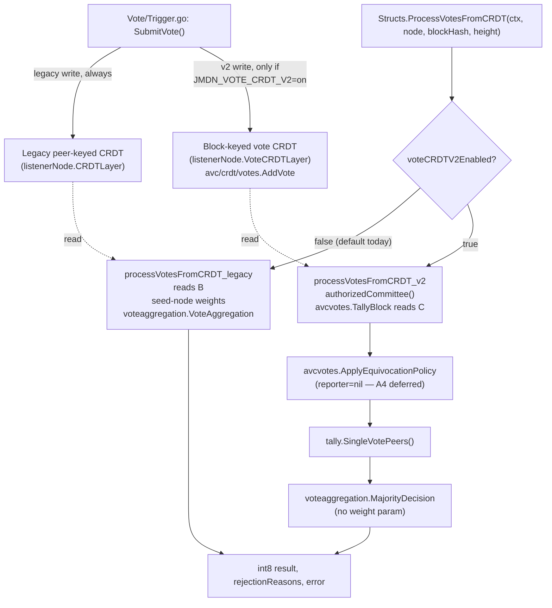

# Stage 4 Implementation Design — Block-Keyed Vote Read Path

**Parent doc:** `docs/JMDN-CRDT-VOTE-MIGRATION-LLD.md` (§6, "Stage 4 — rewrite the readers")
**Status:** Implemented, flag-gated, **not yet built/tested** (no Go toolchain available in the environment this was written in — see Validation §7).
**Repos touched:** `avc` (1 file), `jmdn` (8 files: 2 relocated, 6 modified).

---

## 1. Purpose

Stage 4 replaces the vote-decision function used at BFT time (`ProcessVotesFromCRDT`) so it reads the new block-keyed vote CRDT (`avc/crdt/votes`, added in Stages 1–3) instead of the legacy peer-keyed CRDT, and fixes two problems the LLD didn't originally scope:

1. **Equivocation was silently masked.** The legacy reader stores one vote per peer per key (`voteData[key] = ...`), so a peer that votes twice for the same block simply overwrites its own entry — the second vote wins, silently. `avc`'s `TallyBlock` keeps every distinct value per peer and treats 2+ distinct values as a fault instead.
2. **A weighted-vote / unweighted-vote conflation.** The legacy path fetched per-peer weights from the seed node and fed them into `VoteAggregation`, functionally putting reputation weight on *individual validator votes*. That is architecturally wrong per this project's own design (`avc/docs/COMMITTEE-SELECTION-ALGORITHM.md` — weight belongs to **committee/Buddy selection**, never to counting a vote once cast). Stage 4 replaces this with a new, dedicated, weight-free function.

---

## 2. Two gaps resolved (pre-implementation decisions)

| Gap | Problem | Resolution |
|---|---|---|
| **Gap 1 — RejectionReason loss** | The old `PubSubMessages.Vote`/CRDT-record shapes didn't carry *why* a `-1` vote was cast all the way through the new typed `VoteRecord`. | Added `RejectionReason string` to `avc/crdt/votes.VoteRecord` and threaded it end-to-end (see §4.3). |
| **Gap 2 — weighted vs. unweighted decision** | Existing `VoteAggregation(weights, votes)` multiplies each vote by a per-peer weight fetched from the seed node — i.e., reputation weight was being applied to *counting votes*, not to *selecting the committee*. | New `MajorityDecision(votes map[string]int8) (bool, error)` — plain majority, **no weight parameter at all**. `VoteAggregation` is left untouched; it has a second, legitimate caller (`Sequencer/Triggers/Triggers.go:180`) unrelated to this migration. |

Reputation/stake weighting of committee **selection** (A4) is a separate, deferred workstream — out of scope for this change.

---

## 3. Design decision: flag-gated, not a straight rewrite

The LLD's own build-order table (§10) lists Stage 4's revert mechanism as **"flag off"** — same as every other stage in the migration. That only works if the *reader* checks the same flag as the *writer* (`JMDN_VOTE_CRDT_V2`, `Vote.VoteCRDTDualWrite`, default **off**).

This was caught during implementation, not before it: the reference shim in the LLD's §6.4 pseudocode calls `TallyBlock` unconditionally. Since the write side (`Vote/Trigger.go`) only dual-writes into the new CRDT when the flag is on, and the flag defaults to **off** in production today, an unconditional switch to `TallyBlock` would find zero votes on every block by default — a consensus-breaking regression disguised as a "safe" refactor.

**Fix:** `ProcessVotesFromCRDT` is now a thin dispatcher:

```
ProcessVotesFromCRDT(ctx, listenerNode, blockHash, height)
        │
        ├─ flag OFF (default) ──► processVotesFromCRDT_legacy(...)   // byte-identical to pre-Stage-4 code
        │
        └─ flag ON             ──► processVotesFromCRDT_v2(...)      // TallyBlock + MajorityDecision
```

The flag is read via a package-local `voteCRDTV2Enabled`, **duplicated** (not imported) from `Vote.VoteCRDTDualWrite` — see §5 for why, and note this duplication pattern (an env-flag helper copied per package) already exists in `Security`, `messaging`, `Vote`, and `internal/reputation` in this codebase.

---

## 4. Vote processing flow



**Failure paths (both branches):** listener/CRDT-layer nil → error; committee source unset (Stage 3.5 fail-closed) → error, v2 path only; zero votes found → error; malformed vote value → error from `MajorityDecision`/legacy aggregation. No branch silently returns a decision on missing data.

---

## 5. Import-cycle constraint (why some code is duplicated instead of shared)

Confirmed dependency edges in `jmdn`:

```
Vote  ──imports──►  MessagePassing  ──imports──►  MessagePassing/Structs
```

Consequences enforced by this implementation:

- `Structs` **cannot** import `MessagePassing` (back-edge → cycle). This is why the Stage 3.5 committee-source seam (`authorizedCommitteeFn` / `SetAuthorizedCommitteeFn` / `authorizedCommittee()`) was **relocated** from package `MessagePassing` to package `Structs` — `Structs` is the only package that actually calls it (inside `ProcessVotesFromCRDT`), and only `Structs` has no back-edge to either `MessagePassing` or `Vote`.
- `Structs` **cannot** import `Vote` either (same cycle, one hop further), so the `JMDN_VOTE_CRDT_V2` flag check is **duplicated** locally as `voteCRDTV2Enabled` / `envOnStructs(...)` rather than referencing `Vote.VoteCRDTDualWrite` directly. Same env var, same default — the two must never be changed independently.

---

## 6. File-by-file changes

### `avc` repo

| File | Change |
|---|---|
| `crdt/votes/record.go` | Added `RejectionReason string \`json:"rejection_reason,omitempty"\`` to `VoteRecord`. Additive, `omitempty` — no effect on existing JSON round-trips or keyed struct-literal tests. |

### `jmdn` repo

| File | Change |
|---|---|
| `AVC/BuddyNodes/MessagePassing/committee_source.go` + `_test.go` | **Deleted** (relocated, see §5). |
| `AVC/BuddyNodes/MessagePassing/Structs/committee_source.go` + `_test.go` | **New** — same content, package `Structs`, comments updated to explain the relocation. |
| `main.go` | Added `Structs "gossipnode/AVC/BuddyNodes/MessagePassing/Structs"` import; wiring changed from `MessagePassing.SetAuthorizedCommitteeFn(...)` to `Structs.SetAuthorizedCommitteeFn(messaging.AuthorizedCommittee)`. |
| `config/PubSubMessages/Pubsub.go` | Added `Height uint64 \`json:"height,omitempty"\`` to `Vote` struct (Gap: `TallyBlock` keys by height+blockHash; nothing previously carried height on the wire). |
| `Vote/Trigger.go` | Both `PubSubMessages.Vote{}` literals (accept/reject) now set `Height: zkBlock.BlockNumber`. The existing `avcvotes.VoteRecord{}` literal now sets `RejectionReason: vt.Vote.RejectionReason`. |
| `AVC/VoteModule/vote_validation.go` | Added `MajorityDecision(votes map[string]int8) (bool, error)` — plain majority, ties reject, invalid vote values error. `VoteAggregation`/`WeightAggregation` untouched. Added `"fmt"` import. |
| `AVC/BuddyNodes/MessagePassing/Structs/Utils.go` | `ProcessVotesFromCRDT` split into a flag dispatcher + `processVotesFromCRDT_legacy` (verbatim old body, now gated) + `processVotesFromCRDT_v2` (new `TallyBlock`/`ApplyEquivocationPolicy`/`MajorityDecision` path). Signature gained a required `height uint64` parameter. Added `voteCRDTV2Enabled` flag mirror + `envOnStructs` helper, and `avcvotes "github.com/JupiterMetaLabs/avc/crdt/votes"` import. |
| `Sequencer/Consensus.go` | `printCRDTVotes`: added `blockHeight := consensus.ZKBlockData.GetZKBlock().BlockNumber`, threaded into the call. |
| `AVC/BuddyNodes/MessagePassing/ListenerHandler.go` | `handleVoteResultRequest`: call site now passes existing in-scope `targetBlockNumber`. |
| `AVC/BuddyNodes/MessagePassing/Service/subscriptionService.go` | `handleReceivedMessage`: extracts `height` from the decoded pubsub JSON (`float64→uint64`, zero if absent/legacy sender) and threads it through the existing 30s-delay goroutine into `processVotesAndTriggerBFT`, which gained a `blockHeight uint64` parameter. |

---

## 7. Validation plan (not yet executed — no Go toolchain available)

```
cd jmdn
go build ./...
go vet ./...

# Flag OFF must be byte-identical to pre-Stage-4 behavior:
JMDN_VOTE_CRDT_V2=0 go test ./AVC/VoteModule/... ./AVC/BuddyNodes/MessagePassing/...

# Flag ON exercises the new path:
JMDN_VOTE_CRDT_V2=1 go test ./AVC/VoteModule/... ./AVC/BuddyNodes/MessagePassing/...

cd ../avc
go test ./crdt/votes/...
```

Per the LLD's own Stage 4 exit criteria (§6.5) — **do not proceed to Stage 5 until flag-on and flag-off agree on the same accept/reject decision for a real block**, and an injected equivocating peer is excluded from `SingleVotePeers()` while appearing in `EquivocatingPeers()`.

Recommended additional unit test for the reviewer to add (not yet written): a table test for `MajorityDecision` covering (a) a tie → `(false, nil)`, (b) an empty map → `(false, nil)`, (c) a vote value other than `1`/`-1` → non-nil error.

---

## 8. Explicitly out of scope (deferred to A4)

- Reputation-weighted **committee/Buddy selection** (`SelectionScore`, A-ExpJ).
- `EquivocationReporter` wiring — `ApplyEquivocationPolicy` is called with `reporter=nil` in `processVotesFromCRDT_v2`; verdicts are computed and faulted peers are still excluded from the vote count, but no reputation side-effect fires yet.
- Sequencer-signed reputation persistence to the seed node.

None of this is touched by Stage 4; it is called out here only so a reviewer doesn't look for it and assume it's missing.
