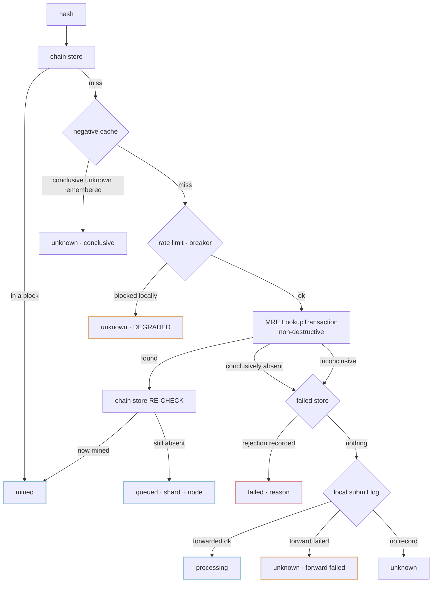

# Transaction status resolution — jmdn implementation handover

**Date:** 2026-08-26
**Branch:** built on `feat/thebe-sc-layer` @ `bda4a3c`
**Scope:** jmdn only. Pairs with `MREService.LookupTransaction` on Mempool-Routing-Engine branch `feat/mre-tx-lookup`.
**Verification:** `CGO_ENABLED=1 go build ./...`, `go vet`, `gofmt -l`, and `go test -race -count=1` on every touched package — all clean. Protos regenerated with the repo's exact pinned toolchain (protoc 29.3 / protoc-gen-go v1.36.10), verified by regenerating the untouched `mempool.proto` to a byte-identical diff.

---

## What this does

`eth_getTransactionByHash` and transaction-status lookup can now answer for transactions that are not yet in a block, by consulting the mempool routing engine and a local record of what this node forwarded.

Resolution order for a hash:

`failed` is reachable in code but never returned today — see *Deferred*, below.

---

## The correction to the requested rule

The rule as specified — "not in the DB and not in the MRE ⇒ `processing`" — is wrong, and is implemented differently.

That condition is also true of a hash that was never submitted, a typo, an adversarial probe, a transaction dropped without a record, and a transaction lost in a crash window. Answering `processing` for any of those makes a wallet poll forever and makes an explorer display transactions that never existed.

**What was built instead:** jmdn already sees every transaction at `eth_sendRawTransaction` and forwards it to the mempool, so a small local record is written at that moment — `hash → {submitted_at, sender, nonce, forwarded, forward_err}`, TTL-bounded, in memory (`txstatus/submitlog.go`, written from `Block.SubmitToMempool`). That turns an ambiguous condition into a decidable one with no new cross-service dependency:

| Condition | Answer |
|---|---|
| in submit log, forward succeeded | `processing` |
| in submit log, forward **failed** | `unknown`, with the forwarding error in `detail` |
| not in submit log | `unknown` |

The middle row is a second deviation, and a deliberate one. A failed forward means the transaction never reached the mempool and will never be mined; `processing` would leave a wallet waiting forever on something that exists nowhere. `unknown` lets it conclude.

**Two things that are never conflated:** "conclusively absent" and "we could not tell". MRE reports these separately, and a `degraded` flag carries the distinction all the way out to the RPC response. A degraded `unknown` is never cached, and never presented as proof a transaction does not exist.

---

## Invariants and where each is enforced

| # | Invariant | Enforcement |
|---|---|---|
| **I1** | `eth_getTransactionReceipt` stays `null` for anything not in a block | **No code path was added to it.** `ServiceImpl.ReceiptByHash` (`Service.go:576`) already returned `(nil, nil)` for "transaction not found" per EIP-1474 and is untouched. No config flag can change it. `TestMarshalTxStatus_EmitsNoReceiptFields` asserts the status response emits no receipt-shaped field (`gasUsed`, `logs`, `blockNumber`, …) and never renders a `0x0`/`0x1` status flag. A synthetic receipt with `status: 0x0` renders in MetaMask as a **failed** transaction, so this is the one thing that must not be got wrong. |
| **I2** | A queued transaction uses the standard pending representation | `pendingTxToFacadeTx` leaves `BlockNumber`/`BlockHash`/`TransactionIndex` unset; `marshalTx` already emits JSON `null` for each when unset, so no marshaller change was needed. `TestPendingTxToFacadeTx_HasNoBlockFields` pins it, and the pre-existing `marshal_test.go` already covers the null rendering. No extra fields were invented on that response. |
| **I3** | Rich status lives on a new non-standard method | `jmdt_getTransactionStatus` returns `{hash, status, source, degraded, detail?, submitted_at?, mempool_node?, shard_id?, reason?}` with `status ∈ {mined, queued, processing, failed, unknown}`. Matches the existing `eth_getTransactionsByAddress` precedent. |
| **I4** | Never `processing` without positive evidence | The submit log is the only source that can produce it (`resolver.go`). Nil/disabled/expired log ⇒ `processing` is unreachable. |
| **I5** | Lookup never mutates mempool state | jmdn calls `LookupTransaction`, which is non-destructive and primary-store-only on the MRE side. jmdn never calls `GetTransaction`/`GetTransactionByHash`/`GetPendingTransactions` from this path. |
| **I6** | Every remote call fails open, never blocks | `MRELookup.Lookup` **never returns an error** — no client, `Unimplemented`, `ResourceExhausted`, deadline, transport failure all become a degraded result. Bounded by `mempool_timeout` (400 ms default) plus a breaker. `TestResolve_MempoolTimeoutDegradesQuicklyAndDoesNotHang` and `TestResolve_MempoolErrorDoesNotErrorTheQuery` pin it. |
| **C3** | Re-check the chain store after a mempool hit | The resolver reads the chain store **twice** — before and after the mempool. Destructive fetches delete asynchronously, so the mempool can report a transaction already in a block being assembled; the second read wins. Without this, `queued` is intermittently reported for mined transactions — the hardest bug class to reproduce. `TestResolve_MinedBetweenReadsReportsMinedNotQueued` asserts both the answer and that two chain reads happened. |
| **C4** | Bound the amplification | Deadline, short-TTL negative cache, token-bucket rate limit, and a consecutive-failure breaker (`txstatus/guards.go`). These are jmdn-side and additional to MRE's own: MRE's protect its fleet from all callers, these protect jmdn's handler latency and stop jmdn being what overloads MRE. |

---

## Files

**New**

| File | What |
|---|---|
| `txstatus/status.go` | Status/Source types, `PendingTx`, and the three ports (`ChainStore`, `MempoolLookup`, `FailedStore`) |
| `txstatus/resolver.go` | the resolution order and every rule above |
| `txstatus/submitlog.go` | TTL+capacity submit log, nil-safe, plus the process-wide instance |
| `txstatus/guards.go` | negative cache, token bucket, circuit breaker |
| `Block/mre_lookup.go` | `RoutingClient.LookupTransaction` + the `txstatus.MempoolLookup` adapter |
| `Mempool/proto/mre_lookup.proto` / `.pb.go` | request/response messages, field-for-field identical to MRE's |
| `gETH/Facade/Service/TxStatus.go` | chain-store adapter, `TxStatus`, `PendingTxByHash`, mempool→facade conversion |
| `metrics/txstatus_metrics.go` | Prometheus metrics + the `Observer` implementation |
| `txstatus_init.go` | startup wiring (default-off) |

**Modified:** `Block/gRPCclient.go` (submit record), `gETH/Facade/Service/{Interface,Service}.go` (interface + `TxByHash` fallthrough), `gETH/Facade/rpc/handlers.go` (new method, null-for-unknown), `config/settings/{config,defaults,loader}.go`, `jmdn_default.yaml`, `main.go` (one wiring call).

`txstatus/` deliberately imports nothing from jmdn: the chain store and mempool are reached through interfaces, so every rule above is tested with no database, network, or running node.

### How jmdn reaches the new MRE RPC

Via `conn.Invoke` against the real method string `/jmdt.proto.mre.v1.MREService/LookupTransaction`, with request/response messages declared in this repo's local `proto` package. This is the pattern already established by `PeekPendingTransactions` (`Singleton_RoutingClient.go:84`): protobuf wire format carries field numbers, not message names, so a structurally identical message decodes correctly. jmdn has no generated `MREService` stubs and this change does not add any.

**Coupling to record:** if a field number changes in `Mempool-Routing-Engine/proto/mre/v1/mre.proto`, it must change in `Mempool/proto/mre_lookup.proto` in the same release or the field silently drops. No field was added to any shared message, so `common.v1.Transaction` field numbers 18/19 remain free for `submitter_id`/`submitter_peer_id`.

---

## Configuration — all defaults preserve today's behaviour

`tx_status.enabled: false`. While off: no submit records, `jmdt_getTransactionStatus` answers `-32601`, and `eth_getTransactionByHash` is byte-for-byte unchanged.

`tx_status.pending_tx_by_hash: false` is a **second, separate** opt-in, off even when `enabled` is true, because serving pending transactions changes what existing clients see. Only with both on does `eth_getTransactionByHash` return a queued transaction (null block fields) or `null` for an unknown hash instead of an error.

Full key list with env names and rationale is in `jmdn_default.yaml`. Every key is bound with an explicit `BindEnv` — Viper's `AutomaticEnv` does not reach nested keys through `Unmarshal`, so without those binds `JMDN_TX_STATUS_ENABLED=true` would silently do nothing. `TestLoad_TxStatusEnvOverrides` is the regression guard.

**Requires `MRE_LOOKUP_ENABLED=true` on MRE.** Without it every lookup returns `Unimplemented` and statuses degrade to `unknown` — safe, but useless. The adapter reports that case with an explicit "set MRE_LOOKUP_ENABLED=true" message rather than a generic RPC error.

## Metrics

`jmdn_tx_status_resolved_total{status,source,degraded}`, `jmdn_tx_status_resolve_duration_seconds{status}`, `jmdn_tx_status_mempool_lookup_total{outcome}` (found/absent/degraded/breaker_open/rate_limited), `jmdn_tx_status_mempool_lookup_duration_seconds{outcome}`, `jmdn_tx_status_breaker_trips_total` (openings, emitted as a delta — not requests-served-while-open), `jmdn_tx_status_negative_cache_total{event}`, `jmdn_tx_status_submit_log_records`.

The label that matters operationally is `degraded`. A rising share of degraded answers means the resolver has stopped being able to tell, not that transactions stopped existing — and the `status` label alone will not show it.

---

## Acceptance tests

| # | Test | Covered by |
|---|---|---|
| T1 | mined tx from chain store, **zero** mempool calls | `TestResolve_MinedShortCircuitsBeforeMempool` (asserts the call count is 0) |
| T2 | queued: status + null block fields | `TestResolve_QueuedFromMempool`, `TestPendingTxToFacadeTx_HasNoBlockFields` |
| T4 | unknown hash → `unknown`, **not** `processing` | `TestResolve_UnknownHashIsUnknownNotProcessing` |
| T5 | submitted but not yet visible → `processing` from the submit log | `TestResolve_ProcessingFromSubmitLog`, plus expiry and failed-forward variants |
| T6 | rejection → `failed` with reason | `TestResolve_FailedFromFailedStore` (the port is tested; no producer is wired — see *Deferred*) |
| T7 | MRE unreachable → chain truth, `unknown`, no hang, no error | `TestResolve_MempoolErrorDoesNotErrorTheQuery`, `..._MempoolTimeoutDegradesQuicklyAndDoesNotHang`, `..._NilMempoolIsDegradedNotAbsent` |
| T9 | mined between the DB check and the mempool hit → mined, not queued | `TestResolve_MinedBetweenReadsReportsMinedNotQueued` |
| T11 | receipt semantics | `TestMarshalTxStatus_EmitsNoReceiptFields`; `ReceiptByHash` unmodified |
| T12 | burst of unknown hashes stays bounded | `TestResolve_NegativeCacheBoundsRepeatedUnknownProbes` (40 probes → 1 lookup), `..._RateLimitDegradesWithoutCallingMempool`, `..._BreakerStopsCallingAnUnresponsiveMempool` |

Also covered: degraded answers never cached; chain-store errors surface rather than being guessed as "not mined"; nil mempool / nil failed store / nil submit log all safe; hash normalisation; concurrent resolve under `-race`; submit-log oldest-first eviction; mempool→facade conversion tolerating unparseable and encrypted-out fields.

T3 (lookup does not consume) and T10 (replica-only copies invisible) are enforced and tested **on the MRE side** — they are properties of the lookup implementation, not of this client. T8 (orchestrator unreachable) is not applicable while the failed path is deferred.

**Pre-existing test failures, unrelated to this change:** `AVC/BuddyNodes/MessagePassing` (`TestStreamLeak`), `AVC/NodeSelection/Router` (`TestGetBuddyNodes`), `DB_OPs/Tests` (`Test_GetMultipleAccounts`, `Test_GetBlocksRange` — panics on an empty slice), `seednode` (`Test_GetPeer`). **Verified pre-existing** by stashing this work and re-running those four packages at `HEAD`: identical failures. They are the integration tests `CLAUDE.md` warns need live services.

---

## Deferred: the failed/rejected-transaction path

Not implemented, by decision. `JMDT-Sequencer-Orchestrator` was not available, so the record shape, endpoint and port could not be verified, and inventing that contract would mean coding against documentation.

What exists: `txstatus.FailedStore` is defined, the resolver consults it in the right position, and it is tested. `initTxStatus` passes `nil`, which makes `failed` unreachable. That fails in the safe direction — the resolver answers `processing` or `unknown` instead, never a wrong `failed`.

**To finish it (Option B, recommended):** the orchestrator already calls jmdn at `/api/process-block` and `/api/l1-commit-range`; add a `/api/tx-rejected` push so jmdn stores rejections locally and lookup stays a local read — no SPOF, no added tail latency, no dependency on the orchestrator's currently unauthenticated `CORS *` API. Then implement `FailedStore` over that store and pass it in `txstatus_init.go`. Delivery should be at-least-once with an idempotent upsert on `tx_hash`. Check first whether the already-decided `BlockAccepted` feedback channel is being built — if so, rejection push belongs on it rather than a parallel endpoint.

---

## Risks

1. **The encryption boundary is still unverified, and it gates `pending_tx_by_hash`.** `JMDN-Mempool` encrypts `from`/`to`/`value`/`nonce`/`gas`/`data` and leaves only `hash`/`type`/`timestamp`/`chain_id`/`v`/`r`/`s` in the clear. Whether the mempool decrypts on the lookup path is decided in that repo, which was not available. If it does not, a queued `eth_getTransactionByHash` response is a **skeleton** — correct hash, empty addresses and value — which a wallet may render as a transaction to the zero address for 0 wei. `jmdt_getTransactionStatus` is unaffected (it reports presence, shard and node). **Do not enable `pending_tx_by_hash` in production until this is checked:** open `JMDN-Mempool`'s `PeekTransactionByHash` handler and confirm it decrypts. The conversion is written to tolerate empty fields rather than fail, so the failure mode is a thin response, not an error.

2. **`Assumed: submit_record_ttl = 30m`. This is a placeholder, not a measurement.** It is the single value that decides whether in-flight transactions report `processing` or `unknown`. Too short and live transactions look unknown; too long and dropped ones look in-flight. The sequencer polls the mempool on an interval and only builds a block once enough transactions are pending, so real worst-case inclusion is much longer than intuition suggests. **Measure time-to-inclusion on the target network before enabling.**

3. **The submit log is in-memory, so a restart loses in-flight records** and those transactions report `unknown` until mined. Deliberate: persisting would put a durable write on the hot submit path to improve a status query. The degradation direction is safe.

4. **`Assumed: mempool_timeout = 400 ms`.** Not measured against real MRE fan-out latency. If MRE's p99 exceeds it, every lookup degrades — safe but useless. Watch `jmdn_tx_status_mempool_lookup_duration_seconds` and MRE's own `mre.lookup.duration_ms` in staging.

5. **No transport auth between jmdn and MRE**, and the rate limit is process-global because there is no caller identity on a JSON-RPC request to key one on. A single noisy client can consume the whole budget and starve the explorer. Do not raise `rate_limit_per_sec` or set it to 0 before auth exists.

6. **`isNotFoundErr` matches error strings.** `DB_OPs` builds errors with `fmt.Errorf` rather than sentinels, so there is nothing to compare against. The match set is deliberately narrow (`not found`, `no rows`, `does not exist`) because matching too broadly would turn a real database failure into a confident "not mined". Tested both directions. **If `DB_OPs` gains sentinel errors, switch to `errors.Is` and delete this function.**

7. **`eth_getTransactionByHash` returning `null` instead of an error for an unknown hash is a behaviour change** — a spec-correct one (EIP-1474), but a change. It is gated behind `pending_tx_by_hash`, so it cannot happen by accident.

8. **Two pre-existing defects found while reading, not fixed here:** the gRPC `_GetTransactionByHash` middleware (`gETH/gETH_Middleware.go:71-74`) hex-encodes the hash and *then* tests `reqHash[0:2] == "0x"`, so the strip is dead code and the slice **panics on a hash shorter than 2 characters**; and `Block/Singleton_RoutingClient.go:28` has an unsynchronised singleton check, so concurrent first calls race. Neither is on the path this change touches.
