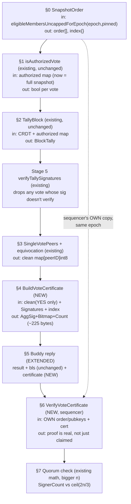

# Validator-Scale Vote Aggregation — Low-Level Design

**Status:** Plan only — nothing implemented. Every existing function cited below was
re-read this session to confirm its real signature; every new function is designed
against those real signatures, not invented in isolation.

**Phase 1.5 (current, scoped down — build this first):** buddy-side aggregate
signature only, over TODAY's existing 7-member authorized committee — no
electorate expansion, no sequencer changes at all. See §12.5 for the exact,
minimal scope. Everything else in this document (§0-§11) is the later, deferred
"expand to the full validator set" phase — do not start it until Phase 1.5 has
shipped and this doc is revisited.

**What the rest of this doc is:** Phase 2 of the architecture discussed this session — expanding the
authorized voter set from the 7-buddy committee to the full validator set, while
keeping buddies as untrusted aggregators (not electors) via BLS signature
aggregation. Phase 1 (today's live system: 7 = electorate = aggregators) is
unchanged and stays the default; this is additive and flag-gated, same discipline
as every stage before it.

**How to read this doc:** each function has four things: **Input** (exactly what it
receives, and which upstream function produced it), **Does it have enough
information?** (the question you asked me to answer for every function, not just
authorization), **Output**, and **Feeds** (the next function that consumes it). This
is the format for the whole pipeline, not just the worked example.

---

## 0. The one new piece of state everything else depends on — ✅ IMPLEMENTED (2026-08-28)

**Built in `avc/crdt/votes/snapshot_order.go`, not jmdn's `messaging` package as
originally sketched below** — for the same reason §4/§6 ended up in avc:
jmdn's `Structs` package (the buddy-side caller that needs this for §5) has a
documented, hard import-cycle constraint against importing jmdn's `messaging`
package at all (`messaging -> Vote -> MessagePassing -> Structs` already
exists — see `Structs/committee_source.go`'s own comment on
`authorizedCommitteeFn` for why that seam had to be injected rather than
imported). Putting the canonical implementation in avc, where jmdn -> avc is
always a safe direction, avoids that entirely. Signature and behavior are
identical to the original sketch below — only the file location changed.

Tests: `avc/crdt/votes/snapshot_order_test.go` — determinism across calls,
index-is-exact-inverse-of-order, empty input, pubkey-values-ignored, and a
real end-to-end proof that its output round-trips through
`BuildVoteCertificate` → `VerifyVoteCertificate` successfully.


Everything below needs one thing that doesn't exist yet: **a stable, deterministic
ordering over the full validator set**, shared identically by every buddy and the
sequencer. Without it, "bit 47 in the bitmap" means a different validator to
different nodes, and the whole scheme is broken.

### `SnapshotOrder` (new)

```go
// jmdn/messaging/committee_snapshot_order.go
func SnapshotOrder(eligible map[string]string) (order []string, index map[string]int)
```

- **Input:** `eligible map[string]string` (peerID → BLS pubkey hex) — the exact
  shape `eligibleMembersUncapped()` already returns
  (`messaging/consensus_hardening.go:178`).
- **Does it have enough information?** Yes, trivially — it's a pure sort. `order :=
  sort.Strings(keys(eligible))`, mirroring the exact sort `eligibleMembers()`
  already does internally for its own capping logic
  (`consensus_hardening.go:240-247`, "sorted deterministically ... every node
  computes the SAME capped committee"). No new coordination needed: because it's a
  deterministic function of the map's contents, every node that reads the same
  eligible set produces the identical order without talking to anyone.
- **Output:** `order []string` (index → peerID, for building/reading bitmaps),
  `index map[string]int` (peerID → index, for O(1) bit lookups when a buddy is
  encoding).
- **Feeds:** every function below that touches a bitmap (B5 encode, B7 decode), and
  the quorum size `n` (B8).

**The one real coordination requirement this creates:** the buddy and the sequencer
must call `eligibleMembersUncapped()` for the **same epoch**, or they'll compute
different `order`s and the bitmap becomes meaningless. `eligibleMembersUncappedForEpoch(epoch,
pinned)` already exists for exactly this (`consensus_hardening.go:189`) — this
design uses the epoch-pinned form, not the "current" form, everywhere.

---

## 1. Authorization — the function you asked about, worked in full

This already exists and does not change. Working through your question on it
exactly, because the same four-part answer applies to every function after it.

```go
// avc/crdt/votes/tally.go:191 — EXISTING, unchanged
func isAuthorizedVote(authorized map[string]string, peerID, blsPubHex string) bool {
    want, ok := authorized[peerID]
    if !ok {
        return false
    }
    return want != "" && normalizeBLSPubHex(blsPubHex) == want
}
```

- **Input:** `authorized map[string]string` (peerID → the pubkey that peer is
  bound to), plus the `peerID`/`blsPubHex` of one specific vote being checked.
- **Does it have enough information?** Yes — and this is the important part to
  see clearly: `isAuthorizedVote` itself needs nothing beyond what's passed in. It
  is a pure function: same three arguments always produce the same answer, no
  hidden state, no network call, no time dependency. **The question that actually
  matters is not "does this function have enough information" — it's "is the
  `authorized` map it was handed the right one."** That's a caller problem, not a
  function problem, and it's exactly what this whole redesign changes.
- **Output:** `bool`.
- **Feeds:** the loop inside `TallyBlock` (`tally.go:122,131`) — `true` →
  `AuthorizedVotesByPeer[peerID]` gets this vote appended; `false` →
  `SkippedUnauthorized++`, vote silently and correctly dropped.

**What actually changes: not the function, the map fed into it.**

| | Today (Phase 1) | This design (Phase 2) |
|---|---|---|
| Who supplies `authorized` | `Structs.authorizedCommittee()` → `messaging.AuthorizedCommittee()` → `eligibleMembers()` (`consensus_hardening.go:268,232`) — **capped to 7** | New injected fn → `eligibleMembersUncappedForEpoch(epoch, pinned=true)` — **the full validator set** |
| Effect on `isAuthorizedVote` | Only the 7 buddies ever pass | Every authorized validator passes |
| Code changed | — | One new `Set...Fn` injection (same pattern as every prior stage's seam) pointing `TallyBlock`'s caller at the uncapped source for this one call path only |

This is why your question was the right one to ask first: once you see that
`isAuthorizedVote` was always self-contained and correct, you see that the entire
"only 7 can vote" behavior lived entirely in **which map got handed to it** — not
in any logic that needs rewriting.

---

## 2. TallyBlock — unchanged signature, bigger input

```go
// avc/crdt/votes/tally.go:94 — EXISTING, unchanged signature
func TallyBlock(c *types.Controller, height uint64, blockHash string, authorized map[string]string) (BlockTally, error)
```

- **Input:** the buddy's own CRDT controller, the block being decided, and
  `authorized` — now §1's full-validator map instead of the 7-entry one.
- **Does it have enough information?** Yes, and nothing about this function needs
  to change to handle 1,000 entries instead of 7 — it's already a single pass over
  whatever `authorized` it's given, calling §1's function once per vote element. The
  only thing that changes is how long that pass takes (more elements to walk), not
  its correctness.
- **Output:** `BlockTally{AuthorizedVotesByPeer, Signatures, SkippedUnauthorized,
  MalformedVotes, MalformedSignatures}` — potentially ~1,000 entries in
  `AuthorizedVotesByPeer` instead of ~7.
- **Feeds:** `verifyTallySignatures` (Stage 5, already built,
  `jmdn/AVC/.../Structs/Utils.go`), unchanged — it already loops over whatever size
  `AuthorizedVotesByPeer` is.

---

## 3. Equivocation + clean set — unchanged, just bigger

`ApplyEquivocationPolicy` and `SingleVotePeers()` (`avc/crdt/votes/equivocation.go`,
`tally.go:53`) are already built, already correct at any size, and don't change.

- **Input:** the (now larger) verified `BlockTally`.
- **Does it have enough information?** Yes — same reasoning as §2. These functions
  already operate on "however many entries `AuthorizedVotesByPeer` has," not a
  hardcoded 7.
- **Output:** `SingleVotePeers()` → `map[string]int8`, clean voters only (up to
  ~1,000 entries, equivocators already excluded).
- **Feeds:** two consumers now instead of one — `MajorityDecision` (existing,
  unweighted count, unchanged) for the result, **and** the new §4 for the
  certificate.

---

## 4. Build the vote certificate — ✅ IMPLEMENTED (2026-08-27)

This is the actual new work. Everything above it was "prove the existing pipeline
already scales"; this is what makes the *proof travel cheaply*.

**Built exactly as sketched, in `avc/crdt/votes/certificate.go`** — the open
question of avc-vs-jmdn placement (see §6's note below, now resolved) came out
in avc's favor for both §4 and §6: `BlockTally`/`VoteRecord` already live
natively in `avc/crdt/votes` (confirmed via Phase 1.5's own import,
`avcvotes "github.com/JupiterMetaLabs/avc/crdt/votes"`), and avc's own `bls`
package (`bls.BLSAggregate`/`BLSFastAggregateVerify`) was confirmed
byte-for-byte wire-compatible with jmdn's `blssign` package — both are
op-for-op identical wrappers over `go.dedis.ch/dela/crypto/bls` (same
`NewSignature`/`NewPublicKey`/`Aggregate`/`MarshalBinary`/
`GetVerifierFactory().FromArray` calls). So this needed no new cross-repo
dependency at all, and the dependency direction stays jmdn → avc, never
reversed.

Tests: `avc/crdt/votes/certificate_test.go` — 7 tests covering YES-only
filtering, empty/no-YES-voters errors, skip-not-fatal for peers with no
backing signature or not in the index, malformed-signature tolerance, and a
non-injective-index rejection. The strongest one independently reconstructs
the aggregate with `bls.BLSFastAggregateVerify` against the real pubkeys of
just the YES voters, proving the output is genuinely verifiable BLS, not just
internally self-consistent.

```go
// avc/crdt/votes/certificate.go
type VoteCertificate struct {
    AggSig      []byte // BLSAggregate of every YES-voter's signature
    Bitmap      []byte // 1 bit per validator in SnapshotOrder, set = signed YES
    SignerCount int    // must equal popcount(Bitmap) — self-consistency check
}

func BuildVoteCertificate(
    clean map[string]int8, // SingleVotePeers() output, §3
    signatures map[string][]VoteRecord, // BlockTally.Signatures, §2 — already BLS-verified by Stage 5
    index map[string]int, // §0's peerID -> bit position
) (VoteCertificate, error)
```

- **Input:** the clean voter set (§3), the `Signatures` map from `BlockTally` (each
  entry's `.BLSSignature` is already independently verified by Stage 5's
  `verifyTallySignatures` before it ever reaches here — this function does not
  re-verify, it only aggregates already-trusted signatures), and §0's index.
- **Does it have enough information?** Almost — one real gap to design around:
  `clean` contains **both YES and NO** voters (`SingleVotePeers()` doesn't filter by
  vote value). This function must filter to `vote == 1` itself before aggregating —
  matching `avc/committee/tally.go`'s own documented rule, "only YES votes are
  counted... a NO vote is verified and then DISCARDED. It is not counted against
  the block, and silence is [not either]." Aggregating a mix of YES and NO
  signatures under one message would be meaningless anyway, since they don't sign
  the same content.
- **Output:** `VoteCertificate{AggSig, Bitmap, SignerCount}` — for 1,000 validators,
  roughly 96 bytes + 125 bytes + 4 bytes ≈ 225 bytes, regardless of how many
  actually signed.
- **Feeds:** the buddy's reply to the sequencer, §5.

**Where the aggregation itself happens:** `bls.BLSAggregate(sigs ...[]byte) ([]byte,
error)` already exists (`avc/bls/signer.go:45`) — this function's job is only to
select the right signature bytes and set the right bits, not to invent new crypto.

---

## 5. Buddy's reply to the sequencer — ✅ IMPLEMENTED (2026-08-28), additive only

**Wired for real in `processVotesFromCRDT_v2`** (`Structs/Utils.go`) and
`handleVoteResultRequest` (`ListenerHandler.go`) — exercising the whole
§0 → §4 pipeline end-to-end today, safely, at today's scale
(`MaxValidators = 7`): right after Phase 1.5's simpler certificate is built,
`avcvotes.SnapshotOrder(authorized)` (reusing the same `authorized` map
already resolved for `TallyBlock`) feeds `avcvotes.BuildVoteCertificate`, and
the result is attached to the reply under a new `"validator_certificate"`
key — deliberately separate from Phase 1.5's existing `"certificate"` key so
the two never collide. Same discipline as Phase 1.5: best-effort, logged and
non-fatal on any error, and the sequencer reads neither key yet
(`parseVoteResultResponse` only looks up keys it knows about), so this is
zero-risk to ship ahead of §6/§7 actually being wired in.

Tests: full existing Structs-package suite re-run clean, including
`TestProcessVotesFromCRDT_V2_ForgedVoteDoesNotFlipTheDecision`; full jmdn
regression shows only the same pre-existing, already-characterized failures.

Original design sketch, unchanged in substance from what shipped:

```go
// jmdn/AVC/BuddyNodes/MessagePassing/ListenerHandler.go — handleVoteResultRequest, EXTENDED
resultData := map[string]interface{}{
    "result":            result,             // unchanged
    "bls":               blsResp,            // unchanged — buddy's own signature on its own conclusion
    "rejection_reasons": rejectionReasons,   // unchanged
    "certificate":       voteCertificate,    // NEW — §4's output
}
```

- **Input:** everything already computed (§0-§4) plus the buddy's own existing
  self-signature (`SignMessageForBlock` on `result`, unchanged — this stays,
  deliberately: it's still the buddy vouching "I computed this honestly," layered
  underneath the new proof that the *content* is real).
- **Does it have enough information?** Yes, by construction — every field was
  produced by an earlier stage in this same pipeline.
- **Output:** the extended reply, over the same RPC as today.
- **Feeds:** `CollectVoteResultsFromBuddies` (`Sequencer/Consensus.go:1687`,
  unchanged collection loop — it just gets a bigger struct back per buddy).

---

## 6. Sequencer-side verification — ✅ IMPLEMENTED (2026-08-27)

**Built in `avc/crdt/votes/certificate.go`, same file as §4.** The
placement question this section originally left open is resolved: the exact
v3 canonical-message construction this function needs already exists
natively in avc as `blssigner.CanonicalVoteMessageV3` (`avc/buddynodes/
messagepassing/blssigner/signer.go`), used by avc's own `blsverifier`
package the same way — so `VerifyVoteCertificate` needed no jmdn import
either. This function stays dormant/unused by any real caller until §0
(`SnapshotOrder`) exists and `require_pinned_committee` is genuinely
flippable — it is pure and independently testable in the meantime, taking
`order`/`pubkeys` as plain parameters rather than resolving them internally.

Tests: 7 more in `certificate_test.go` — a real `BuildVoteCertificate` →
`VerifyVoteCertificate` round trip that must succeed, plus rejections for a
tampered aggregate signature, wrong block hash, wrong height (both proving
replay protection), a dishonest `SignerCount`, a set bit with no resolvable
pubkey, and an empty `order`.

```go
// avc/crdt/votes/certificate.go
func VerifyVoteCertificate(
    order []string,           // §0, sequencer's OWN call for the same epoch
    pubkeys map[string]string, // §0's source map — same eligible set
    cert VoteCertificate,
    chainID, height uint64, blockHash string, // to rebuild the exact signed message
) error
```

- **Input:** the sequencer independently derives its own `order`/`pubkeys` by
  calling the **same** `eligibleMembersUncappedForEpoch(epoch, pinned=true)` the
  buddy used — never trusts a snapshot the buddy sends. This is the same principle
  already enforced elsewhere in this codebase (`committee.Tally`'s own doc: "n and
  T are fixed HERE, before any vote is looked at").
- **Does it have enough information?** Yes, with one self-check worth stating
  explicitly since it's the cheap thing we agreed to keep: **walk `cert.Bitmap`,
  count set bits, and reject immediately if that count doesn't equal
  `cert.SignerCount`.** That's a same-message internal consistency check (a
  malformed or dishonest count), distinct from — and much cheaper than — the actual
  cryptographic verification that follows. Then: for each set bit `i`, look up
  `pubkeys[order[i]]`, collect into a list, and call the existing
  `bls.BLSFastAggregateVerify(pubkeys, message, cert.AggSig)`
  (`avc/bls/signer.go:62`) — the message is the same v3 canonical block-bound bytes
  already used everywhere else in this system.
- **Output:** `error` (nil = the aggregate genuinely proves that many real,
  authorized validators signed YES on this exact block).
- **Feeds:** runs **alongside** the existing per-buddy `VerifyForBlock` check inside
  `VerifyConsensusWithBLS` (`Consensus.go:2135`) — both must pass. The existing
  check still proves "this buddy really replied and vouches for its own honesty";
  this new check proves "the content it vouched for is real," which the existing
  check alone cannot do once the buddy stops being the elector.

---

## 7. Quorum — one constant changes meaning, math doesn't

**⏸ Deliberately deferred (2026-08-28), unlike §0/§4/§5/§6.** This is the one
piece of the pipeline that isn't a pure function or a purely-additive
extension — it changes the real accept/reject decision in the sequencer,
the single most safety-critical code path in the system. It's true that
`len(order)` equals 7 today (`MaxValidators = 7`, no larger pool exists yet
to resolve down from), so wiring it now would be numerically a no-op — but
"currently a no-op" isn't the same guarantee as "safe to land without a
flag." Land this behind an explicit flag (matching `JMDN_COMMITTEE_V2`'s
pattern) when it's actually built, rather than as an always-on change to
consensus-critical math, even a presently-harmless one.

- `n` becomes `len(order)` from §0 (the full validator snapshot) instead of 7.
- `ByzantineQuorum(n)` / `quorum.Threshold(n)` (`ceil(2n/3)`, already built and
  tested) is unchanged — it already takes `n` as a parameter, was never
  hardcoded to committee size.
- **Feeds:** the existing accept/reject decision in `VerifyConsensusWithBLS`,
  now comparing `cert.SignerCount` (independently confirmed by §6, not merely
  claimed) against this threshold.

---

## 8. Full pipeline, input → output → next, in one picture



---

## 9. What is explicitly NOT in this design (per this session's decisions)

- **`setDigest` cross-buddy comparison** — dropped. Can't distinguish "malicious"
  from "hadn't converged yet"; kept out per your call last turn.
- **No change to `MajorityDecision`, `ApplyEquivocationPolicy`,
  `ConvergeAndCompact`, or the reputation pipeline** — all already correct at any
  authorized-set size, none of them assumed "7" anywhere in their logic (only in
  what map they were handed, which is exactly what §1's table isolates).
- **No aggregate certificate replacing the sequencer's per-buddy signature
  checks** — both layers stay, deliberately (buddy-honesty proof + content proof
  are different guarantees).

## 10. Blockers and open decisions before implementation — corrected after independent re-verification

**Revision note:** this section was independently re-audited against both repos
after the first draft (every citation below re-checked, not re-trusted from the
original pass). Two corrections came out of that pass — one reclassifies an item
from "open decision" to **hard blocker**, one narrows an imprecise claim to its
real, already-separately-tracked scope. Both are reflected below; §0 must not be
written until §10.3 is resolved.

### §10.3 (was: "open decision") → **BLOCKER — resolve before writing §0, not after**

The original framing ("confirm the epoch-freeze machinery is where you want it
before wiring this on top") understated this. It is not a preference to confirm —
it is a correctness precondition for the entire bitmap scheme.

**Confirmed:** `consensus.require_pinned_committee` defaults to `false`
(`config/settings/defaults.go:155`), and `docs/COMMITTEE-SNAPSHOT-FREEZE-TODO.md`
item 7 states plainly: *"`JMDN_COMMITTEE_SNAPSHOT_ANCHOR` and
`consensus.require_pinned_committee` both stay off until 1-6 are complete and
fleet-coordinated."* `pinned=true` is therefore **not reachable in production
today** — only `pinned=false` (the live, unpinned "current eligible set right now"
read) is.

**Why that specifically breaks this design, not just degrades it:** §0's entire
premise is that a buddy and the sequencer compute the *identical* `order[]` for
"the same epoch." Read unpinned, "the same epoch" can resolve to two different
underlying eligible-set reads if the buddy and the sequencer query at slightly
different moments (a validator joining/leaving between the two reads changes the
sort). That doesn't fail loudly — the bitmap still decodes, `VerifyVoteCertificate`
still runs, and it can still pass, just against the **wrong validator at bit
position i**. That is a silent-corruption failure mode, exactly the class of bug
this whole session's fail-closed discipline exists to avoid, not a "confirm later"
item.

**Required before §0 is written:** an explicit yes/no on turning
`consensus.require_pinned_committee` on for this design's use, coordinated with
whatever timeline items 1-6 in `COMMITTEE-SNAPSHOT-FREEZE-TODO.md` are already on.
Building §0 against `pinned=false` "for now" is not a safe interim step — it
produces a design that looks correct and occasionally isn't.

### §10.2 (was: "legacy write path's missing per-peer ingest cap") → corrected, already tracked elsewhere

This was imprecisely scoped. Re-verified directly: `AddVote`
(`avc/crdt/votes/write.go:19`) already enforces `maxElementsPerPeerPerBlock = 3` —
a real per-peer cap, right at the write boundary, alongside the watermark gate. So
"the legacy write path is missing a cap" is not an accurate description of
anything reachable through `AddVote`.

**The actual, precisely-scoped gap was the one already tracked as A8-1** in
`avc/docs/A7-A10-IMPLEMENTATION-PLAN.md` — **✅ FIXED (2026-08-27).** The CRDT
sync/merge path (`jmdn/AVC/BuddyNodes/MessagePassing/CRDTSyncHandler.go`,
`mergeVoteCRDTElement`) called `avcdatalayer.Add` directly, bypassing `AddVote`
entirely, so it skipped both the watermark gate and the per-peer cap `AddVote`
enforces.

Confirmed while fixing this: Stage 6 (`avcvotes.DefaultWatermark.ConvergeAndCompact`)
is already wired to production (`jmdn/vote_crdt_compaction.go`, driven from
DB_OPs' `UpdateLatestBlockMonotonic` hook, gated only by `Vote.VoteCRDTDualWrite`)
— so the merge path's old comment claiming the watermark gate "does not exist
yet" was stale; the watermark genuinely advances today and the gap was live,
not theoretical.

**What changed:**
- `avc/crdt/votes`: exported three previously-internal helpers so jmdn could
  replicate `AddVote`'s two checks without duplicating their logic —
  `HeightFromKey` (was `heightFromKey`), `CountElementsForPeer` (was
  `countForPeer`, generalized from vote-key-only to any key), and the
  `MaxElementsPerPeerPerBlock` constant (was `maxElementsPerPeerPerBlock`).
  `DefaultWatermark.Current()` was already exported, so no avc change was
  needed for the watermark check itself.
- `mergeVoteCRDTElement`: before merging a key's elements, skips the whole
  key if `HeightFromKey(key) <= DefaultWatermark.Current()` (an
  already-converged/compacted height — same "expected, not a bug" semantics
  as `AddVote`'s `ErrHeightCompacted`). Inside the per-element loop, skips an
  element once its peer already has `MaxElementsPerPeerPerBlock` elements at
  that key. `AddVote` itself still can't be called here — a merge delivers
  `votes:`/`votesig:` as independent objects, not matched `VoteRecord`
  pairs — so the checks are replicated at key/element granularity instead.
- Tests: `AVC/BuddyNodes/MessagePassing/crdt_sync_a8_1_test.go` — rejects a
  merge at/below the watermark, allows one above it, and enforces the cap
  when one peer offers 6 elements in a single merge (exactly 3 admitted).

Full jmdn regression: only the same pre-existing, already-characterized
failures (`TestStreamLeak`, `TestGetBuddyNodes`, `DB_OPs/Tests`,
`TestEpochIsDerivedFromTheBlockNotTheClock`, `Test_GetPeer`) — nothing new.

### §10.1 (unchanged) — where `VerifyVoteCertificate` lives

Still open, still low-stakes relative to the two above: avc (next to
`BuildVoteCertificate`) vs. jmdn. No new information changes this one.

## 11. Build order — revised to make the blocker load-bearing

**Status as of 2026-08-28:** everything buildable without a live, genuinely-pinned
eligible set is now done — §0, §4, §5, §6. §1/§2/§3 needed no code (confirmed,
not just assumed). What remains is entirely external (the seed-node
`GetCommitteeSnapshot` server — see `docs/SEED-NODE-GETCOMMITTEESNAPSHOT-HANDOFF.md`)
or deliberately deferred (§7, the quorum-denominator change, held back from
touching live accept/reject math until it's flag-gated — see §7's own note).

```
D-1/D-2/D-3 (avc live bugs — hardcoded VRF key, fake aggregate, dissenter veto)
   ── independent of this design entirely; confirmed dormant (behind
      Features.AvcValidation, default off, testnet-only, shadow-mode) but
      still worth fixing on its own schedule

A8-1  MergeElement watermark/cap fix (CRDTSyncHandler.go) — ✅ DONE (2026-08-27)

§0 SnapshotOrder                    — ✅ DONE (2026-08-28, avc/crdt/votes/snapshot_order.go)
   └─ §1 wiring                     — ✅ nothing to build; isAuthorizedVote already correct
       └─ §2/§3                     — ✅ nothing to build; already scale correctly
           └─ §4 BuildVoteCertificate   — ✅ DONE (2026-08-27)
               └─ §5 reply extension    — ✅ DONE (2026-08-28), additive, exercised at n=7 today
                   └─ §6 VerifyVoteCertificate — ✅ DONE (2026-08-27), pure, no live caller yet
                       └─ §7 quorum wiring — ⏸ deliberately deferred, see §7's own note

consensus.require_pinned_committee — ROLLOUT DECISION, still fully external
   ── blocks: growing max_validators past 7, and §6/§7 ever getting a REAL
      (as opposed to today's n=7 exercise) live caller
   ── depends on: seed-node GetCommitteeSnapshot server (handed off, external)
```

Every stage from §1 through §3 needed zero code — confirmed twice now, once when
this doc was written and again while wiring §5. §0/§4/§5/§6 all shipped without
waiting on pinning, because each was buildable as either a pure function (§0, §4,
§6) or a purely-additive extension safe to exercise at today's scale (§5). Only
§7 (real quorum-denominator math) and anything that needs the pool to exceed 7
still wait on the external seed-node work.

## 12.5 Phase 1.5 — the actual near-term scope (build this, not §0-§11, right now)

User-scoped explicitly: keep the sequencer's verification and quorum semantics
**completely unchanged**; add only a buddy-side aggregate signature, carried as
unverified evidence for a later phase.

**Why this is smaller than §0-§11, precisely:** authorization stays capped at 7
(`authorizedCommittee()` → `eligibleMembers()`, unchanged) — nothing about the
electorate expands. That removes both blockers from §10: the pinned-snapshot
ordering problem (§10.3) only exists once the buddy and sequencer must
independently agree on a large shared index; the A8-1 merge-path fix (§10.2)
matters more as the electorate scales, but nothing here scales it. Neither applies
at today's committee size.

**What ships:**

1. **Buddy side, new:** after `MajorityDecision` (unchanged), take
   `SingleVotePeers()`'s YES-voters (≤7, the existing committee — not the full
   validator set), and aggregate their already-Stage-5-verified signatures:
   `bls.BLSAggregate(yesVoterSigs...)`. Attach which of the 7 are included — at
   this size a bitmap is 2 bytes, or a plain peer-ID list is simpler and just as
   cheap; either works, since nothing decodes it yet.
2. **Buddy reply, extended (not replaced):** `resultData["certificate"] =
   {aggSig, signers}` added alongside today's `result`/`bls`/`rejection_reasons`
   in `handleVoteResultRequest`'s existing map literal.
3. **Sequencer: no code change.** Confirmed by reading `Consensus.go:2002` —
   `parseVoteResultResponse` unmarshals into `map[string]interface{}` and reads
   only the keys it looks up (`result`, etc.). A new `"certificate"` key is
   accepted and ignored automatically; nothing needs to be written to make the
   sequencer tolerate it.

**Explicitly not built this phase:** `SnapshotOrder` (§0), `VerifyVoteCertificate`
(§6), the quorum-denominator change (§7), and A8-1 — all correctly deferred to
whenever §0-§11 actually starts.

## 12. Scope note

This document is a separate track from the A7-A10 items in
`avc/docs/A7-A10-IMPLEMENTATION-PLAN.md` — it is not a renamed version of any of
them. A7 = avc test/bench coverage. A8 = vote envelope + replay GC (~70% already
shipped; its one real remaining item is A8-1 above). A9 = not yet audited
(transport encryption). A10 = sequencer confirmation gate. This design is the
mechanism that would let the full validator set's votes actually count toward
consensus, instead of being accepted, gossiped, and discarded at tally time, which
is today's confirmed behavior for any non-committee vote.

---

## 13. Should PREPARE/COMMIT BFT sit between `MajorityDecision` and the Sequencer?

**Question asked:** insert the existing two-phase PREPARE/COMMIT engine
(`avc/bft`, dormant per §"BFT" discussion this session) between each buddy's local
`MajorityDecision()` and its reply to the sequencer, so the 7 buddies explicitly
agree with each other before reporting, rather than reporting independent
conclusions the sequencer aggregates after the fact.

**Recommendation: No — keep the simpler `MajorityDecision → Sequencer` path.**
Not because the idea is wrong in isolation, but because every real benefit it
offers is already provided by a mechanism that exists today, and its costs are
concrete while its marginal benefit is not. Reasoning below, then what to do
instead if the actual underlying worry (buddies disagreeing) still needs
addressing.

### 13.1 The core problem: it's the same committee, the same math, checked twice

`PREPARE`/`COMMIT`'s whole purpose is to make `n` participants converge on one
answer despite up to `f` Byzantine members, using the `ceil(2n/3)` threshold
(§"What BFT means here", already covered this session). Look at what the
sequencer's *existing* path already does: `CollectVoteResultsFromBuddies`
(`Sequencer/Consensus.go:1687`) gathers replies from the same 7 buddies,
`VerifyConsensusWithBLS` verifies each one's signature individually, and
`VerifyCertificateForRound` counts valid YES signatures against exactly the same
`ceil(2n/3)` threshold (`n=7`) — cross-referenced in `bft/math.go`'s own comment
as computing the identical value `jmdn v2.0.0 AVC/BFT/bft/math.go:48` and
`messaging/consensus_hardening.go:305 ByzantineQuorum` were built to agree on.

So the sequencer's poll-and-count *is already a Byzantine-fault-tolerant
agreement protocol over these same 7 participants* — it's just shaped as
"sequencer polls N, verifies each, counts" instead of "N gossip with each other,
then report." Inserting PREPARE/COMMIT in front of it doesn't add a second,
independent line of defense against a different adversary — it re-runs the
identical `n=7`/`f=4` tolerance calculation against the identical participant
set, before the sequencer runs its own. Two BFT rounds over one committee is not
twice as safe; it's the same guarantee computed twice.

Contrast this with why the *validator-scale aggregation* design (§0-§11) is
worth building: it changes `n` from 7 to ~1,000 and moves the aggregate-signature
proof to where the sequencer can verify content it previously had to trust. That's
a genuine capability increase. PREPARE/COMMIT among the existing 7 changes
neither — `n` stays 7, and the sequencer already cryptographically verifies each
buddy's individual signature today (`VerifyForBlock` per response), so it was
never "trusting a buddy's bare claim" in the way inserting BFT here would imply
it fixes.

### 13.2 The cost is real: latency, and a liveness gap this system doesn't have today

**Latency.** PREPARE/COMMIT is two more full rounds of peer-to-peer gossip and
threshold-waiting among 7 nodes (`waitForPrepareThreshold`, then
`waitForCommitThreshold`, `bft/engine.go:138,158`), inserted *inside* the
30-second vote-collection window that's already the slowest part of a round
(established earlier this session). This is added latency for the redundant
guarantee in §13.1, not a new one.

**Liveness.** Re-checked directly: `waitForPrepareThreshold` returns a hard error
on timeout — `"PREPARE timeout: accepts=%d, rejects=%d, need=%d"`
(`bft/engine.go:145`) — with no retry or fallback path. This matches avc's own
documented defect list: *"#8 — no retry / view-change exists anywhere in avc; a
stalled round has no recovery path"* (`AVC-HANDOVER-STATUS.md:171`). Today, if a
few of the 7 buddies are slow or briefly unreachable, the sequencer's
poll-and-count still reaches quorum from whoever *did* reply — that's the whole
point of polling independently rather than requiring pre-agreement. Requiring
PREPARE/COMMIT consensus *before* anyone reports means a stall or partition
*among just the buddies* — which today wouldn't even matter, since the sequencer
tolerates missing replies — would now mean **nobody reports anything**. This is a
new fragility the current design doesn't have, introduced for a guarantee §13.1
shows is already provided.

### 13.3 If the real worry is "buddies might disagree from CRDT non-convergence" — that's legitimate, but PREPARE/COMMIT is an expensive way to catch it

This was raised earlier this session (turn: "buddy 1 has 3 peer votes and buddy 2
has another..."). It's a real concern — two honest buddies *can* compute different
local majorities from an incompletely-converged CRDT view. But:

- CRDT sync already waits for all-buddies-responded-or-timeout
  (`CRDTSyncHandler.go:232`, `syncComplete`) *before* `TallyBlock` even runs — so
  by the time `MajorityDecision` executes, convergence is the expected common
  case, not a coin flip.
- The cheaper detector for the residual risk was already designed and
  *deliberately dropped* earlier this session: a `setDigest` comparing each
  buddy's clean-voter-set hash, logged (not gated), costing a hash comparison —
  not two rounds of consensus. If divergence-detection is wanted back, that's the
  right-sized tool for it, not PREPARE/COMMIT.
- Divergence, if it happens, is still caught today — just one step later, by the
  sequencer, which sees each buddy's individually-signed claim and would notice
  (via a failed/mismatched quorum) if buddies materially disagreed. PREPARE/COMMIT
  would catch it slightly earlier, at the cost of §13.2.

### 13.4 Answer to the question as asked

**Keep `MajorityDecision → Sequencer`, rely on CRDT convergence + signature
evidence** (plus, from §12.5, the buddy-side aggregate certificate as additional
evidence). Do not insert PREPARE/COMMIT between them. The dormant BFT engine
remains available if a future, *different* problem needs it — e.g. if buddies
ever need to coordinate something the sequencer-side poll genuinely cannot see —
but confirming/re-confirming the same 7-member quorum the sequencer already
confirms is not that problem.

---

## 14. Separate the entropy epoch from the selection period — a real type boundary, not a naming convention

**Status: plan only, not implemented.** This extends the "`SeedInput.Epoch` split"
item already listed in §10.2/§11's build order — re-scoped after finding the
mislabeling goes one call frame further than originally flagged.

### 14.1 The confirmed problem

`RoundContext.Epoch` (`messaging/committee_v2.go:82`) carries its own doc comment
stating *"Epoch selects the entropy. At Stage 1 the SeedSource ignores it."* — but
`RoundContextForBlock` (`committee_v2.go:119`) populates it from
`EpochForHeight(b.BlockNumber)`, the **block**-counted clock, not the **slot**-counted
one (`EpochForSlot`, `N=50`) the comment implies. The mislabeling isn't
hypothetical or confined to a future caller — it's baked into the struct's own
field today.

Confirmed the exact single choke point where this matters, by reading the body
directly (`committee_v2.go:209-231`), `SelectCommitteeWithSize` uses **the same**
`rc.Epoch` for two different jobs in the same function:

```go
func SelectCommitteeWithSize(rc RoundContext, k int) ([]committee.Member, error) {
    ...
    snap, err := committeeSnapshotFor(rc.Epoch)          // job 1: fetch the POOL
    ...
    seed, err := committee.DeriveSeed(SeedSourceFor(rc.Epoch), committee.SeedInput{
        Epoch:    rc.Epoch,                                // job 2: look up ENTROPY
        PrevHash: rc.PrevHash,
        Height:   rc.Height,
        Period:   rc.Period,
    })
```

Harmless today only because `SaltSource.EpochEntropy` (avc, Stage 1) ignores
whatever epoch number it's handed. The moment real per-epoch entropy lands
(RANDAO/VDF, Stage 2 — the work already greenlit earlier this session), job 2
needs the *correct* clock, and nothing today stops job 1's value from silently
flowing into job 2's slot.

**Second confirmed instance of the same root cause, one level up:**
`SelectEntropyCommittee(epoch uint64)` (`messaging/entropy_committee.go:125`) calls
the *same* `committeeSnapshotFor(epoch)` `SelectCommitteeWithSize` does — one
shared, epoch-agnostic function, fed by two conceptually different callers. Its
two current callers (`entropy_reveal.go:111`, `entropy_reveal_produce.go:118`)
both take `epoch` as an already-resolved parameter rather than computing it, and
both fail closed today ("Fails closed... which today means always, since Stage F
is unbuilt" — `entropy_reveal.go`'s own comment). So there is no live path where
the wrong clock is actually fed in yet — but nothing in the type system would
catch it once "Stage F" wires a real caller, and the natural thing to reach for at
that point is whatever's already lying around from a block, which is the
block-counted clock, not the slot-counted one.

### 14.2 The fix: two named types, not two comments

Comments already correctly describe the intent in three places (`RoundContext.Epoch`,
`SeedInput.Epoch`'s doc, the LLD entries from earlier this session) — the problem
isn't that nobody wrote down which clock is which, it's that a bare `uint64`
doesn't enforce it. Concretely:

**avc side — `committee/seed.go`:**
```go
// EntropyEpoch selects which epoch's entropy the SeedSource returns. Always
// the SLOT-based clock in this codebase's usage (EpochForSlot) — never a
// block-counted selection period, even though both are historically called
// "epoch." A distinct type, not just a renamed field: the compiler should
// reject a caller passing a SelectionPeriod here without an explicit
// conversion, since the two have never been interchangeable and treating
// them as the same uint64 is exactly the mistake this type exists to catch.
type EntropyEpoch uint64

type SeedSource interface {
    EpochEntropy(epoch EntropyEpoch) ([]byte, error)
}

type SeedInput struct {
    EntropyEpoch EntropyEpoch // was: Epoch uint64
    PrevHash     []byte
    Height       uint64
    Period       uint64
}
```
`SaltSource.EpochEntropy` and every other `SeedSource` implementation update their
parameter type to match — mechanical, since `SaltSource` ignores the value anyway.

**jmdn side — `messaging/committee_v2.go`:**
```go
// SelectionPeriod is the block-counted clock (EpochForHeight,
// committee_epoch_blocks) that determines how often the buddy candidate pool
// refreshes. Distinct from committee.EntropyEpoch (slot-counted,
// EpochForSlot) — the two happen to both be called "epoch" in casual
// conversation, but they have never been the same number and must not
// become interchangeable by accident.
type SelectionPeriod uint64

type RoundContext struct {
    SelectionPeriod SelectionPeriod // was: Epoch uint64 — feeds committeeSnapshotFor
    EntropyEpoch    committee.EntropyEpoch // NEW — feeds SeedSourceFor/SeedInput
    PrevHash        []byte
    Height          uint64
    Period          uint64
}

func RoundContextForBlock(b *config.ZKBlock) RoundContext {
    return RoundContext{
        SelectionPeriod: SelectionPeriod(EpochForHeight(b.BlockNumber)),
        EntropyEpoch:    committee.EntropyEpoch(EpochForSlot(b.Slot)), // NEW — was never read before
        PrevHash:        b.PrevHash.Bytes(),
        Height:           b.BlockNumber,
        Period:           DefaultPeriodStore.PeriodFor(b.BlockNumber),
    }
}
```

`SelectCommitteeWithSize` then reads each field for its own job, with no room for
the two to cross:
```go
snap, err := committeeSnapshotFor(uint64(rc.SelectionPeriod))
...
seed, err := committee.DeriveSeed(SeedSourceFor(rc.EntropyEpoch), committee.SeedInput{
    EntropyEpoch: rc.EntropyEpoch,
    PrevHash:     rc.PrevHash,
    Height:       rc.Height,
    Period:       rc.Period,
})
```

`committeeSnapshotFor(epoch uint64)` itself is left untyped deliberately — its job
("fetch snapshot #N") is identical regardless of which clock N came from, so the
risk was never inside this function, only in what gets passed to it. Typing the
two *callers* (`SelectCommitteeWithSize`'s `rc.SelectionPeriod`,
`SelectEntropyCommittee`'s parameter) is where the mistake would actually be
caught.

**`SelectEntropyCommittee`'s own signature:**
```go
func SelectEntropyCommittee(epoch committee.EntropyEpoch) ([]committee.Member, error) {
    ...
    snap, err := committeeSnapshotFor(uint64(epoch))
    ...
}
```
Once "Stage F" wires a real caller, it must pass `EpochForSlot(block.Slot)` —
and with this type in place, passing `rc.SelectionPeriod` there simply won't
compile without an explicit, visible `committee.EntropyEpoch(...)` conversion,
which is the point: wrong-but-compiling becomes wrong-and-flagged.

### 14.3 Verification step before writing any of this

`entropy_reveal.go:111` and `entropy_reveal_produce.go:118`'s own `epoch`
parameters need tracing one hop further back (who calls `entropyAccumulatorFor`
and `SelfOnEntropyCommittee`, and what do *they* pass) to confirm those two real
call sites already carry a slot-based value today, before the type change locks
that assumption in. Not done this pass — flagged so it isn't skipped.

### 14.4 Where this sits in the existing build order

Same position as the original "`SeedInput.Epoch` split" item in §11 — this section
only adds the detail that the split needs a matching change in jmdn's
`RoundContext`, not just avc's `SeedInput`, and gives it real type names instead of
a rename. No change to sequencing: independent of A8-1, independent of the
pinned-committee rollout, useful whether or not §0-§11 ever ships, and cheaper to
land now (small, mechanical, two structs and their call sites) than after a real
entropy source makes the bug live.
