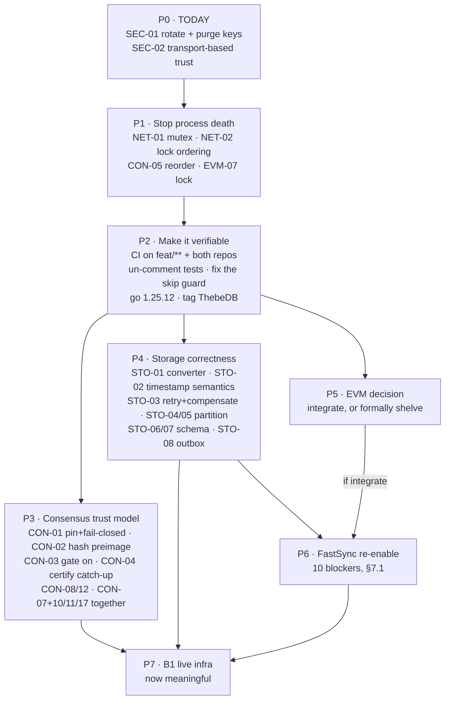

# jmdn-thebe + ThebeDB — Audit Findings Register

> ## ⚠ Rev 9 — 2026-09-11 · READ THIS BEFORE ANYTHING BELOW
>
> Everything under Rev 8 and earlier was written against branch `feat/thebe-sc-layer` in **August**.
> The fleet has since moved to **`v3base`**. Rev 9 is a re-verification of the load-bearing claims
> against `v3base@291d44c` (jmdn) and `533622a` (ThebeDB), executed 2026-09-11. **Where Rev 9 and the
> body disagree, Rev 9 wins** — the body is retained as evidence, not as current status.
>
> ### The headline: a security fix was silently reverted by a merge
>
> **`CON-08` and `CON-21` are marked RESOLVED below. Both were OPEN — and are now RE-FIXED.**
>
> **UPDATE 2026-09-15 — both guards restored and verified.** Commit `6353642`
> (`fix(consensus): restore the CON-08/CON-21 equivocation fail-closed guards`) re-applies both
> hunks and adds `messaging/equivocation_fail_closed_test.go`, which asserts the rejection
> **behaviour strings** so this class of revert cannot recur silently.
>
> | | |
> |---|---|
> | **Status** | Fixed on branch **`pr129-audit`** (local, on top of PR #129 head `a76e015`) |
> | **NOT** | merged to `v3base`, and **not pushed** to any remote |
> | **Verified** | `go build ./...` clean · `go vet` clean · `gofmt` clean · **all 5 equivocation tests PASS under `-race`** (4 new + the pre-existing `TestEquivocationSurvivesRestart`) · full suite 42 ok with the same 3 pre-existing integration failures and no fourth |
>
> **This row stays partially open until `6353642` is merged.** Until then `v3base` itself still
> ships the fail-open code, so anything built from `v3base` has no equivocation defence when the
> durable store is unhealthy. The forensics below remain the record of how it was lost.
>
> | | |
> |---|---|
> | **Fixes** | `0167cd21` (CON-08, durable **read** fails closed) · `1cfcc76d` (CON-21, durable **write** fails closed, "pairs CON-08") |
> | **Reverted by** | `524fe714` — *"Merge remote-tracking branch 'origin/feat/avc-a3-adapter' into feat/thebe-sc-avc-a3"*, JMDT_Doc, Fri 2026-08-28 |
> | **Why it hid** | Both fix commits **are ancestors of `v3base`**. Any "did the fix merge?" check answers *yes*. The merge resolution took the pre-fix side of the hunk, so `git blame` attributes the restored fail-open lines to `b9c64871f` (2026-07-26) — the *original* author, not the merge. |
> | **Live proof** | `grep -c equivocation_unreadable` → **0** · `grep -c "durable equivocation write failed"` → **0** · `consensus_hardening.go:768-770` and `:784-787` both `log.Warn()` and continue |
> | **Blast radius** | Exactly `checkEquivocation()`. Verified *not* wider: `0167cd21`'s other three hunks survived (`Processing.go:252,356,777`; `account_recon.go:240,254,278`), and the committee `"only empty peer ids (fail closed)"` guard the same merge appears to delete was **relocated, not dropped** — alive at `consensus_hardening.go:467`. |
>
> Consequence: after a restart `seenHeights` is empty, so the durable read is the **only** equivocation
> defence — and a read error now falls through to "first sighting". The paired write path leaves a hole
> the read cannot detect. Both halves fail open, so the defence has no fail-closed half at all.
>
> **This is the most important lesson in the document: "the fix commit is in the branch" is not
> evidence the fix is in the code.** Verify the *behaviour string*, not the merge graph.
>
> ### Status corrections (all re-verified 2026-09-11)
>
> | ID | Body says | Actually |
> |---|---|---|
> | `CON-08` | RESOLVED (read) — VERIFIED | ~~OPEN — regressed by `524fe714`~~ → **RE-FIXED `6353642`**, tests green; **unmerged, `v3base` still fail-open** |
> | `CON-21` | CONFIRMED (open) | ~~OPEN — a fix existed (`1cfcc76d`) and was reverted by the same merge~~ → **RE-FIXED `6353642`** (same commit; both halves); **unmerged** |
> | `STO-22` | Rev 8 headline: `ThebeDB.Append` *does not exist* | **FIXED 2026-08-26, not refuted.** Rev 8 was **correct when written** (count = 0 at `fbafd305`, ≤Aug 14); `b78e42a` added the method on Aug 26. Present at the pinned tag `v0.2.0-v3base.2`. Fix is reflection-bound with **no compile-time guard** — see §15.3 residual risk. |
> | `EVM-24` | REFUTED by `STO-22` | **RE-OPENED** — the refutation was *conditional on `STO-22` staying broken*, and that condition has now fired. Rate **OPEN-UNVERIFIED**: one limb of the refutation was not re-probed. |
> | `DEP-01` | "`go.mod` is still `go 1.25.0`" | **VOID** — `go 1.26.0`; see `V3BASE-DEPS-UPGRADE-2026-09-08.md` |
> | `SEC-01` | keys on `feat/thebe-sc-layer` + `remove/immudb` | **Wrong in both directions — see below. Still CRITICAL, still unrotated.** |
> | `API-10` | CRITICAL, batch goroutines with no `recover()` | **Unchanged — still live**, code byte-identical |
>
> ### `SEC-01` — corrected exposure map (the remediation scope was too small)
>
> Repo confirmed **public**: unauthenticated `git ls-remote` succeeds with `GIT_CONFIG_GLOBAL` and
> `GIT_CONFIG_SYSTEM` set to `/dev/null`, so no cached credential explains it.
>
> - **Exposing the keyfiles in-tree (3 refs, not 2):** `origin/remove/immudb`,
>   `origin/feat/avc-a3-adapter`, `origin/feat/avc-adapter-thebe-sc`.
> - **`origin/feat/thebe-sc-layer` — the branch the body names — is now CLEAN.** The body is stale
>   in both directions: it names a clean branch and misses two dirty ones.
> - **All three refs carry byte-identical blobs** (`f8656350e186`, `4f3ee722e190`, `4504397dd743`), so
>   this is **one set of 3 keypairs exposed via 3 refs**, not 9 distinct keys. All three `bls_priv`
>   fields are non-empty, 44 chars — real material, not placeholders.
> - **`origin/main` and `origin/v3base` tips are clean — but `v3base` HISTORY is not.** Commit
>   `4d9ef1a7` is an ancestor of `v3base` and its tree carries all three keyfiles at **the same blob
>   SHA** (`4f3ee722e190`). **Purging the three topic branches would not close this.** The purge must
>   be `--all`-scoped, covering `v3base` history.
> - No rotation evidence found. The July `audits/2026-07-claude-security-review/` recorded this as
>   **C2** and quoted a key verbatim; it remains unremediated **~2 months later**.
>
> ### Register hygiene — two dangling IDs, not equally dangling
>
> Neither has a section heading, but they fail differently:
>
> - **`EVM-32` — recoverable.** Fully described inline at §14 (*"`accessListAddSlotChange` leaves a
>   newly-warmed **address** warm after revert"*, LOW, no reachable gas divergence via standard
>   opcodes) and listed in the §14 summary. It is missing only a heading. **Action: promote to a stub
>   section; do not re-audit.**
> - **`CON-20` — NOT recoverable from this document.** Its sole appearance is the bare string
>   *"Residual → `CON-20`"* at the end of the `CON-05` row in §10.3. Nothing states what the residual
>   *is*. `CON-05` itself is marked RESOLVED and *"genuinely effective"*, so the reader cannot even
>   tell whether `CON-20` is an open risk or a closed footnote. **Action: whoever wrote that row must
>   define it or strike it.** Until then treat it as an **unknown-severity open item** — a register
>   that cites an ID it never defines cannot be used to claim coverage.
>
> ### Companion documents (consolidated 2026-09-11, not merged away)
>
> Two root-level docs were re-verified alongside this register. Both keep content this register does
> not, so both were corrected in place rather than deleted:
>
> | Doc | Keep it for | Stale in |
> |---|---|---|
> | `WORKDIR2-JMDN-V3-THEBE-HANDOVER.md` (2026-08-26) | ThebeDB architecture analysis (§4: two commit orderings, `SyncWrites`, no block-level commitment), the `cassata` reflective-seam finding (§5.1 — **it found this first**), the quorum-certificate argument (§7) | branch/HEAD/wiring facts; `SEC-01` branch list |
> | `jmdn-v3-thebe-rollout-dossier.md` (2026-08-26) | **the gated release program, Gates 0–6** — the only sequenced rollout plan in `WORKDIR2`; P0/P1 findings | repository snapshot; version claims |
>
> One dossier finding was folded in here as **`STO-25`** (§15.4b, the namespace projection map).
> Its P0 — **contracts enabled by default while `NEW-2 commit-before-fold` is unresolved** — was
> re-verified **still live** at `defaults.go:155-157` and belongs on any release gate.
>
> ### What Rev 9 did NOT re-verify
>
> Rev 9 re-checked the criticals, the fix-status claims, and the dependency assertions. It did **not**
> re-run the §13–§15 EVM/ThebeDB probes. Treat unmarked findings in those sections as **August-dated
> evidence pending re-probe**, not as current status.

**Rev 8 — 2026-08-14.** **§15 is a probe-backed devil's-advocate deep dive on ThebeDB internals + the
Thebe↔SmartContract persistence seam** — the two areas never audited with the toolchain. Headline,
verified by me: the seam's single bridge (`cassata.appendRecord`) calls a `ThebeDB.Append` method that
**does not exist**, so every contract receipt/registry SQL write silently errors. It also **refutes my own
Rev 6 `EVM-24`** (can't poison a registry nothing can write to) and upholds STO-03/13 with fresh probes.

> **Rev 9 note on this headline — it was correct, and it has since been FIXED.** `ThebeDB.Append` was
> added on **2026-08-26** by `b78e42a`, twelve days after Rev 8 was written, and is present at the tag
> jmdn actually compiles against (`v0.2.0-v3base.2`). Rev 8's measurement was sound at the time
> (`func (db *ThebeDB) Append` count = 0 at `fbafd305`). **The knock-on matters more than the fix:**
> Rev 8's refutation of `EVM-24` was expressly conditional on `STO-22` staying broken, so **`EVM-24`
> is now RE-OPENED**. See §15.3 and §15.4.

**Rev 7 — 2026-08-14.** **§14 is a second EVM pass**: I personally verified the criticals that came
from agents in Rev 6 (EVM-21 tracer nil-env, EVM-23 solc, EVM-07 confused deputy), added three new
verified findings (`EVM-29` London-not-Shanghai, `EVM-30` intrinsic gas skipped, `EVM-31` refund never
credited), recorded what deep geth-semantic probing **ruled out**, produced the **re-integration bite
order** every EVM severity depends on, and corrected an overstatement in §13.2. 

**Rev 6 — 2026-08-14.** **§13 is a fresh devil's-advocate audit of the smart-contract/EVM layer** run
against Doc's HEAD `9943c96`: an explicit attempt to refute Rev 4's EVM conclusions. It **retracts three
of my own findings**, downgrades seven, upgrades two, adds twelve, and reframes `EVM-01` entirely —
the EVM wiring was **deleted by a merge**, not never written.

**Rev 5 — 2026-08-11.** Branch `feat/thebe-sc-layer` (jmdn) vs `main`, plus `ThebeDB` @ `main`.
**§12 adds independent verification of the first remediation round** (9 commits, `edddd3c`→`9943c96`,
pushed to the public remote). Rev 4's findings are unchanged below; §12 records what is now fixed,
what is half-fixed, and six new findings the remediation itself introduced or left paired.
Audit/review phase. **No source file in either repository was modified.** See §11.

Rev 4 is the first pass with a **working toolchain**: both repos were compiled, vetted, tested, and
vulnerability-scanned, and findings were proven with executable probes rather than inferred from
reading. Fifteen claims from earlier revisions changed status as a result — including four of my
own that were wrong. Those are listed in §10.2, not buried.

---

## 0. How to use this document

### 0.1 Navigation

| § | Contents | Read this if you are… |
|---|---|---|
| **1** | Verdict and gate decisions | deciding whether to merge/ship |
| **2** | Measured baseline — build, test, vet, vulns | establishing ground truth |
| **3** | `SEC` — secrets & exposure | on-call today |
| **4** | `CON` — consensus & BFT | working in `AVC/`, `Sequencer/`, `messaging/` |
| **5** | `STO` — storage & ledger | working in `DB_OPs/`, `ThebeDB/` |
| **6** | `EVM` — smart-contract layer | working in `SmartContract/` |
| **7** | `SYN` `NET` `API` — fastsync, gossip, read APIs | working in `FastsyncV2/`, `Pubsub/`, `explorer/` |
| **8** | Cross-cutting patterns | a lead or reviewer |
| **9** | Remediation plan with gates | planning sprints |
| **10** | Appendices — reachability, baselines, corrections | verifying this document |
| **11** | Method & integrity | auditing the audit |
| **12** | **Remediation round 1 — verification** | checking what was fixed and what remains |
| **13** | **EVM/SC devil's-advocate audit** | working in `SmartContract/`; or re-scoring EVM severities |
| **14** | **EVM second pass** | verified criticals · new fork/gas findings · re-integration bite order |
| **15** | **ThebeDB + seam deep dive** | ThebeDB internals · the cassata seam · what jmdn actually reaches |

### 0.2 Finding ID scheme

`<AREA>-<NN>`. Areas: `SEC` secrets/exposure · `CON` consensus · `STO` storage · `EVM`
smart-contract · `SYN` fastsync · `NET` networking/gossip · `API` explorer/RPC · `DEP`
dependencies · `PRC` process/tracking. **IDs are stable — do not renumber.** When a finding is
fixed, mark it `RESOLVED` in place and keep the ID.

### 0.3 Status vocabulary — precise meanings

| Status | Means |
|---|---|
| **PROVEN** | A probe program or test was executed and its output is quoted. Highest confidence. |
| **CONFIRMED** | Code traced end-to-end including reachability; not executed. |
| **PLAUSIBLE** | Mechanism identified, reachability or impact unproven. The "what would settle it" field is mandatory. |
| **REFUTED** | Investigated and found not to be a defect. Kept so nobody re-raises it. |

### 0.4 Severity — as applied here

| | Definition |
|---|---|
| **CRITICAL** | Remote unauthenticated exploit, consensus break, funds loss, or node death **reachable in the default shipped configuration**. |
| **HIGH** | Same classes but requiring a precondition (auth, specific config, a race), or silent unrecoverable data loss. |
| **MEDIUM** | Correctness or availability defect with bounded blast radius, or a CRITICAL/HIGH latent behind a disabled feature. |
| **LOW** | Hygiene, dead code, misleading documentation, defence-in-depth loss. |

### 0.5 Reachability — read this before triaging on severity

Reachability was computed with a real call graph (`go/ssa` + VTA + an address-taken fixpoint over
138 packages, 0 load errors — §10.1), **not** grep. Two consequences for anyone triaging:

- `UNREACHABLE` findings are **not** "won't fix." Several are trapdoors: correct-looking code that
  activates the moment something is wired. `EVM-*` is the largest example — 44 files that do not
  run.
- Some code grep calls dead is live. `messaging.HandleBroadcastStream` is registered as a bare func
  value (`node/node.go:200`); a naive pass would call it and its 360 LOC of downstream dead.

---

## 1. Verdict

### 1.1 Gate decisions

| Gate | Decision | Blocking findings |
|---|---|---|
| **Rotate credentials — today** | **DO NOW** | `SEC-01` |
| Merge `feat/thebe-sc-layer` → `main` | **NO-GO** | all CRITICAL |
| Public testnet | **NO-GO** | `CON-01…07`, `NET-01…03`, `SYN-01`, `SEC-02` |
| Internal devnet, trusted peers only | **CONDITIONAL** | `SEC-01`, `NET-01`, `NET-02`, `SEC-02` first |
| Re-enable FastSync (B4) | **NO-GO** | `SYN-01…04`, 10 ordered blockers in §7.1 |
| Ship any payable/value-bearing contract | **NO-GO** | `EVM-01`, `EVM-02`, `EVM-05` |
| B1 live-infra validation as the next step | **DEPRIORITISE** | would pass green with everything below true |

### 1.2 The four things this pass established

**1. Three BLS consensus signing private keys are in a PUBLIC GitHub repository right now.**
`git clone` with no credentials succeeds. This is not a finding to schedule — it is an active key
compromise. §3, `SEC-01`. **Branch list corrected 2026-09-11:** the keys are tracked on
`remove/immudb`, `feat/avc-a3-adapter` and `feat/avc-adapter-thebe-sc` (never on `main`);
`feat/thebe-sc-layer`, named here in August, is now clean. **`v3base`'s history also reaches the same
blob**, so this is not purgeable by dropping topic branches. Still unrotated as of 2026-09-11.

**2. Block certificates are forgeable in the default shipped configuration.** Not a theoretical
weakness: a probe forged a 5-of-7 certificate that `verifyBlockCertificate` accepted. The chain is
`SeedAuthorityBLSPub` defaults to `""` → `legacyBuddySource` binds `peer_id → ""` →
`keyAuthorized` returns `true` for **any** key when the bound key is empty (its own comment says
"NOT production-safe") → `PeerID` is not covered by the vote signature. An attacker generates fresh
keypairs. §4, `CON-01`.

**3. The smart-contract layer is not connected to consensus, and this is now proven by call graph.**
`ProcessContractDeployment`, `ProcessContractExecution` (both wrapper and internal),
`GetBalanceChanges`, `SetTxContext`, `SetSharedKVStore`, `LogWriter.Write` — all **UNREACHABLE**
from `main`. Contract state is mutated only by a loopback gRPC handler. The missing state root and
the discarded balance changes are *symptoms* of this. §6, `EVM-01`.

**4. The branch compiles, vets, and formats clean — and its unit gate is red.**
`go build ./...` exit 0. `go vet ./...` exit 0. `gofmt -l` 0 files. `go mod tidy` no-op. But
`go test -short ./...` **fails**, and the recorded Phase A gate claims it was "fully green." §2.

### 1.3 How to read the shape of this

The storage migration is the strongest part of this branch and its defects are specific and
fixable. The **consensus core is the weakest** — and it was never in scope for any prior review
round. Seven CRITICAL/HIGH consensus findings, five proven with executable probes, in packages with
near-zero test coverage. The smart-contract layer is unintegrated. Gossip has two uncatchable
process-death bugs reachable from any peer.

Prior rounds concentrated on `DB_OPs`, which is why `DB_OPs` is in the best shape and why nobody had
looked at the code that decides which blocks are real.

### 1.4 Roll-up

| Area | CRITICAL | HIGH | MEDIUM | LOW | Proven by probe |
|---|---|---|---|---|---|
| `SEC` secrets/exposure | 2 | 1 | 2 | 3 | 1 |
| `CON` consensus/BFT | 5 | 6 | 5 | 3 | 9 |
| `STO` storage/ledger | 3 | 8 | 9 | 4 | 3 |
| `EVM` smart contract | 1 | 6 | 8 | 5 | 6 |
| `SYN` fastsync | 3 | 3 | 4 | 2 | 4 |
| `NET` gossip | 2 | 4 | 1 | 0 | 2 |
| `API` explorer/RPC | 0 | 3 | 3 | 3 | 0 |
| `DEP` dependencies | 0 | 1 | 1 | 0 | 1 |
| `PRC` process | 0 | 2 | 3 | 2 | — |
| **Total** | **16** | **34** | **36** | **22** | **26** |

---

## 2. Measured baseline — the ground truth

Everything in this section was executed in this session. Toolchain: Go 1.25.0 (`GOTOOLCHAIN=auto`
honours `go.mod`'s `go 1.25.0`), `CGO_ENABLED=1`, `GOFLAGS=-mod=mod`, ThebeDB resolved via the
sibling `replace`.

### 2.1 Build and static gates

| Gate | jmdn-thebe | ThebeDB | Notes |
|---|---|---|---|
| `go build ./...` | **exit 0** | **exit 0** | First reproducible green on record |
| `go vet ./...` | **exit 0** | **exit 0** | |
| `gofmt -l .` | **0 files** | clean | |
| `go mod tidy` → diff | **no change** | — | **CI's tidy check passes** |
| `go mod download` | exit 0 | exit 0 | All deps public except ThebeDB |

**This corrects rev 2.** I predicted the first PR would fail CI at `go mod verify`/tidy because
`RECONCILE-thebe-sc.md:73` records `go.sum` as an un-tidied union superset. That claim is **stale** —
someone tidied it. Inheriting it was exactly the error this audit is about. The only real CI failure
mode left is the missing ThebeDB checkout (`replace ../ThebeDB`).

### 2.2 Test baseline — `PRC-01`, HIGH

| Suite | Result | Packages ok | FAIL | **No test files** |
|---|---|---|---|---|
| jmdn `go test -short ./...` | **exit 1** | 38 | **1** | **99** |
| jmdn `go test ./...` | **exit 1** | — | **5** | 99 |
| ThebeDB `go test ./...` | exit 0 | 2 | 0 | **17** |

**99 of 138 jmdn packages have no test file at all.** Every consensus package in §4 is in that 99.

The `-short` failure, in full:

```
--- FAIL: TestSecurityCache_BasicOperations
    security_cache_test.go:76: UpdateAccountBalance: getHandle: no ThebeHandle available (conn=<nil>)
    security_cache_test.go:86: Expected value not to be nil. Account should be in cache
panic: runtime error: invalid memory address or nil pointer dereference
    security_cache_test.go:87
FAIL	gossipnode/Security	0.017s
```

**The mechanism is itself a finding.** The test *has* an environment guard:

```go
conn, err := DB_OPs.GetAccountConnectionandPutBack(ctx)
if err != nil { t.Skip("Skipping test as DB is not available:", err) }
```

But `DB_OPs/compat_connections.go:73-75` is `func GetAccountConnectionandPutBack(_ context.Context)
(*config.PooledConnection, error) { return nil, nil }`. **Never a non-nil error, so the skip never
fires.** That `(nil, nil)` shim is recorded in `RECONCILE-thebe-sc.md:90-95` as post-merge
correction #2 — "Shims now return (nil, nil) — the codebase-wide sentinel." **That fix silently
converted a self-skipping test into a panicking one.** Then `assert` (not `require`) let execution
continue past a failed nil check into the deref.

Additional non-short failures — 2 of 4 are genuine test defects, not missing infra:

| Package | Test | Cause |
|---|---|---|
| `AVC/BuddyNodes/MessagePassing` | `TestStreamLeak` | Asserts `"i/o timeout"`, got `"…: EOF"`. **Real assertion failure.** |
| `AVC/NodeSelection/Router` | `TestGetBuddyNodes` | `JMDN_NODE_SELECTION_MNEMONIC` unset — **unrunnable as checked in** |
| `DB_OPs/Tests` | `Test_GetMultipleAccounts`, `Test_GetBlocksRange` | needs Postgres |
| `seednode` | `Test_GetPeer` | needs a seed address |

### 2.3 Dependency vulnerabilities — `DEP-01`, HIGH

> **Rev 9: every version premise in this section is VOID.** All were upgraded in the
> 2026-09-08/09 fleet dependency exercise. Verified live against `jmdn/go.mod` @ `v3base@291d44c`:
>
> | This section says | Actually (2026-09-11) |
> |---|---|
> | `go.mod` says `go 1.25.0`, needs `go1.25.12` | **`go 1.26.0`** (`go.mod:3`) — past the fix floor |
> | `golang.org/x/text` v0.37.0 → needs v0.39.0 | **v0.42.0** (`:226`) |
> | `otlploghttp` v0.18.0 → needs v0.19.0 | **v0.22.0** (`:200`) |
> | `pion/dtls` | **migrated to v3** — `pion/dtls/v3 v3.1.2` (`:151`) |
>
> **But "versions bumped" is not "vulnerabilities closed," and the difference is unmeasured.**
> `govulncheck` has **never been re-run on `v3base`** — it is step 5 of the still-open follow-up list
> in `V3BASE-DEPS-UPGRADE-2026-09-08.md` §3, recorded there as *"never done and should be."* That
> same document notes Dependabot reports 30 vulnerabilities on FastSync's `main` (7 critical) and 10
> on jmdn's `main` (1 high) — **default branches, not `v3base`**, so they predate this work and say
> nothing about current state either way.
>
> **`DEP-01` therefore becomes: UNMEASURED, not closed.** The specific CVEs below are almost
> certainly resolved by the version floors; the finding stays open until someone runs
> `govulncheck ./...` on `v3base` and records the output. Resolution path is one command.

`govulncheck ./...` — **32 vulnerabilities with confirmed call paths**, plus 10 imported-uncalled and
4 module-level. The checklist (B3) mentions "9 moderate advisories." *(August measurement — stale.)*

**29 are stdlib, all fixed by one line.** `go.mod` says `go 1.25.0`; the highest fix required is
`go1.25.12`. Bumping the directive closes 29 reachable vulnerabilities including
`GO-2026-4870` (unauthenticated TLS 1.3 KeyUpdate → persistent DoS), `GO-2026-4918` (infinite loop
in HTTP/2 transport), `GO-2026-4340`, `GO-2026-4337`, and five `crypto/x509` issues. **Highest
effort-to-value ratio in this entire document.**

**3 are third-party and need real decisions:**

| Module | Current | Fix | Note |
|---|---|---|---|
| `golang.org/x/text` | v0.37.0 | v0.39.0 | Infinite loop on invalid input |
| `otel/.../otlploghttp` | v0.18.0 | v0.19.0 | Oversized response → memory exhaustion. A dependabot branch already exists. |
| `github.com/pion/dtls/v2` | v2.2.12 | **NO FIX** | Random-nonce reuse risk with AES-GCM. Requires migrating to `pion/dtls/v3` — a dependabot branch for v3.1.4 exists. |

### 2.4 Repository and dependency facts

| Fact | Value |
|---|---|
| Commits ahead of `main` / behind | **302 / 0** — `main`'s tip is an ancestor; no drift to reconcile |
| Files / lines changed | 348 · +33,317 / −16,439 |
| Authors / git identities / **signed commits** | 3 · 8 · **0 verified** |
| **`jmdn` GitHub visibility** | **PUBLIC** (cloned with no credentials) |
| ThebeDB tags | **1** — `v0.1.0` @ 2026-03-02, **79 commits behind `main`** |
| ThebeDB newest commit, any ref | **2026-06-16** (jmdn ran to 2026-08-08) |
| Private deps | **only ThebeDB**; `ion`, `goroutine-orchestrator`, `JMDN-FastSync`, `JMDN_Merkletree` are all public |
| ThebeDB CI | **none** — no `.github/` directory |
| jmdn CI runs on this branch | **zero** — `ci.yml:5` triggers push on `main`/`release/**` only |
| jmdn CI test step | **commented out** (`ci.yml:66-70`), pre-existing from `main` |

---

## 3. SEC — Secrets and exposure

### SEC-01 · CRITICAL · PROVEN · Three BLS consensus signing keys published in a public repo

| | |
|---|---|
| **Files** | `AVC/BLS/Router/config/bls.json:2` · `AVC/BuddyNodes/MessagePassing/BLS_Signer/config/bls.json:2` · `AVC/BuddyNodes/MessagePassing/BLS_Verifier/config/bls.json:2` |
| **Reachability** | n/a — data at rest, publicly served by GitHub |

**Evidence (executed this session):**

**⚠ The August evidence below is STALE in both directions — it names a branch that is now clean and
misses two that are not. Superseded by the Rev 9 block; kept for provenance.**

```
# --- August (Rev 4) evidence, SUPERSEDED ---
git clone --filter=blob:none --no-checkout https://github.com/JupiterMetaLabs/jmdn.git   → succeeds, no credentials
git ls-tree -r --name-only origin/main            | grep bls.json  → (none)
git ls-tree -r --name-only origin/feat/thebe-sc-layer | grep bls.json  → all three present
remote blob sha256 == local working-copy sha256    → IDENTICAL
branches exposing the keys: origin/feat/thebe-sc-layer, origin/remove/immudb
ever present on origin/main: NO
```

**Re-verified 2026-09-11 (Rev 9) — corrected map:**

```
# repo is public: no credential can explain this
GIT_CONFIG_GLOBAL=/dev/null GIT_CONFIG_SYSTEM=/dev/null GIT_TERMINAL_PROMPT=0 \
  git ls-remote https://github.com/JupiterMetaLabs/jmdn.git HEAD   → exit 0

# bls.json files present in ref TREE:
origin/main                       → 0
origin/v3base                     → 0
origin/feat/thebe-sc-layer        → 0   ← the branch Rev 4 named is now CLEAN
origin/remove/immudb              → 3
origin/feat/avc-a3-adapter        → 3   ← NOT in Rev 4's list
origin/feat/avc-adapter-thebe-sc  → 3   ← NOT in Rev 4's list

# identical blobs across all three refs → ONE set of 3 keypairs, not 9:
AVC/BLS/Router/config/bls.json                          f8656350e186
AVC/BuddyNodes/MessagePassing/BLS_Signer/config/bls.json    4f3ee722e190
AVC/BuddyNodes/MessagePassing/BLS_Verifier/config/bls.json  4504397dd743
bls_priv fields: all non-empty, 44 chars → real key material

# v3base TIP is clean, v3base HISTORY is NOT:
git merge-base --is-ancestor 4d9ef1a7 v3base                  → YES
git ls-tree -r 4d9ef1a7 | grep bls.json                       → all three
git rev-parse 4d9ef1a7:.../BLS_Signer/config/bls.json         → 4f3ee722e190  (same blob)
```

**Mechanism.** The branch added the keys; `main` never had them. `.gitignore:8-11` now lists
`config/bls.json`, `**/bls.json`, `bls.json` — which does not untrack an already-tracked file and
does not rotate a key. `audits/2026-07-claude-security-review/` recorded this as Critical **C2** and
quoted the first key verbatim; it was never remediated.

**Severity increased since July.** The consensus hardening pinned `peer_id → bls_pub`
(`messaging/consensus_hardening.go:236-259`), so a holder of a leaked key who is provisioned with
that identity now contributes a **genuine quorum vote**. The hardening made the key more valuable.
And on default-configured nodes (`CON-01`) the leak is not even needed.

**Remediation.** ~~Purge from history on both branches~~ — **scope corrected 2026-09-11.**

1. **Rotate all three keypairs.** This is the only step that actually matters. Everything below is
   cleanup; the keys have been public for ~2 months and must be treated as **permanently
   compromised** regardless of what is purged.
2. **Purge `--all`-scoped, not per-branch.** The three exposing refs are `remove/immudb`,
   `feat/avc-a3-adapter`, `feat/avc-adapter-thebe-sc` — **and `v3base`'s own history** reaches the
   same blob at `4d9ef1a7`. A per-branch purge of the topic branches leaves the blob live on the
   fleet's main development branch. Use `git filter-repo --invert-paths --path-glob '*bls.json'`
   across all refs, then force-push each.
3. Move key material to env/secret store; keep only `bls.json.example`.
4. Add a pre-commit/CI secret scan (`gitleaks`, `trufflehog`).

**Verify:** new pubkeys appear in committee snapshots; `git log --all -- '**/bls.json'` returns
**empty** (it currently returns commits); `git for-each-ref` scan finds 0 refs whose tree contains
`bls.json`; CI fails on a test commit containing a `bls_priv` field.

**Note on the force-push.** `v3base` is org-protected and shared. An `--all` history rewrite
invalidates every outstanding clone, branch and PR based on it. That is a coordination cost, not a
reason to skip it — but it is why **rotation (step 1) must not wait for the purge**.

### SEC-02 · CRITICAL · CONFIRMED · Unsigned-transaction bypass, with a remote nil-deref behind it

| | |
|---|---|
| **File** | `Block/Server.go:204-213` (bypass), `:235` (panic) |
| **Reachability** | REACHABLE — public `SubmitRawTransaction` |

```go
// These are trusted — the service runs on the same node — so we skip external signature validation
isInternalDeployment := tx.To == nil && tx.V == nil
if isInternalDeployment { /* log + bypass */ } else { Security.AllChecks(tx) }
...
if tx.Value.Cmp(big.NewInt(0)) == 0 || tx.Value.String() == "" {   // line 235 — nil deref
```

**Mechanism.** Trust is decided from a property of the *submitted transaction*, not the caller's
identity. Both branches converge on `:235`, which dereferences `tx.Value` unguarded.

**Failure.** `{To: nil, V: nil, From: <victim>, Data: <initcode>}` → no signature check, enters the
deploy pipeline attributed to the victim. Omit `value` → **remote unauthenticated node crash**.

**Remediation.** Decide trust from the transport. The correct pattern already exists in this
codebase: `loopbackOnlyInterceptor` (`SmartContract/internal/router/server.go:42-60`). Guard
`tx.Value == nil` before any arithmetic.
**Verify:** a remote `{To:nil,V:nil}` submission is rejected; a loopback one succeeds; a
`value`-less tx returns 400, not a panic.

### SEC-03 · HIGH · CONFIRMED · Compiled security defaults are `AuthTypeNone` for all ten services

`config/settings/security.go:104-144` — DID, eth_grpc, eth_rpc, mempool, block_ingest_grpc, BFT,
CLI/admin all `TLS:false, AuthTypeNone`. `jmdn_default.yaml:184-187` sets mtls/token/hybrid for 8 of
10, so **a node booted without that YAML is fully open**, and `eth_rpc` (`:165`) and
`mempool_service` (`:202`) are `none` even in the YAML. `CLI/GRPC_Server.go:397` logs
"THIS IS INSECURE"; `:412` registers gRPC reflection unconditionally.
**Remediation:** compiled defaults fail closed; YAML relaxes, never tightens.

### SEC-04 · MEDIUM · CONFIRMED · Weak default credentials and cleartext transport in shipped config

`docker-compose.yml:64` `${POSTGRES_PASSWORD:-jmdndefault}`, `:72` publishes `5430:5432`, `:103,111`
`${REDIS_PASSWORD:-jmdnredissync}`, `:266` `sslmode=disable`; `jmdn_default.yaml:54` and
`config/settings/defaults.go:66` carry the same DSN. Post-ImmuDB-removal this Postgres is the sole
SQL projection of all chain state.

### SEC-05 · MEDIUM · CONFIRMED · Rate limiting disabled and forwarded headers trusted from anywhere

`jmdn_default.yaml:135-136` `global_rate_limit: 0` / `global_burst: 0`; `:139-140`
`trust_forwarded_headers: true` with `trusted_proxies: []`; ten per-service `rate_limit: 0`.
Any client spoofs `X-Forwarded-For` with no limiter behind it.

### SEC-06 · LOW · CONFIRMED · Security linters disabled

`.golangci.yml:32-34` gosec/errcheck/staticcheck commented out. `.github/workflows/sonarqube.yml:15`
`if: false`. `sonar-project.properties:11` excludes `Scripts/**`.
Note: `go vet` is green, so the code is not lint-hostile — enabling these is cheap.

### SEC-07 · LOW · CONFIRMED · Unsigned, MD5-only snapshot bootstrap

`Scripts/bootstrap_sync.sh:41,116-126` — `checksums.md5` + `md5sum -c`, no signature.
Whoever can write the bucket substitutes chain state with a matching MD5.

### SEC-08 · LOW · CONFIRMED · Zero signed commits; 8 git identities for 3 people

296 unsigned, 6 unverifiable, 0 good. For an auditable chain-node trail this is usually table stakes.

---

## 4. CON — Consensus and BFT

**Never audited before this pass.** Nine findings proven by executable probe. Test coverage across
the packages in this section: `messaging` is strong (10 test files); `AVC/BFT/network`,
`AVC/BFT/proto`, `AVC/BLS/bls-sign`, `AVC/BuddyNodes/{Service,PubSubConnector,CRDTSync,DataLayer}`,
`Sequencer/Triggers`, `Vote`, `l1finality` have **none**.

### CON-01 · CRITICAL · PROVEN · Block certificates are forgeable in the default configuration

| | |
|---|---|
| **Files** | `config/settings/defaults.go:138` · `Sequencer/consensus_statemachine.go:113,165` · `messaging/consensus_hardening.go:248-252` · `AVC/.../BLS_Signer/Signer.go:111` |
| **Reachability** | REACHABLE — `messaging/blockPropagation.go:606` (`admitZKBlock`), `messaging/broadcast.go:719` |

**Verified by me this session:**

```
config/settings/defaults.go:138        SeedAuthorityBLSPub:   "",
jmdn_default.yaml / jmdn_exchange.yaml → seed_authority_bls_pub NOT PRESENT in either
consensus_statemachine.go:113          legacyBuddySource := ... set[pid.String()] = ""     ← no key binding
consensus_hardening.go:248-252         if boundKey == "" { ...NOT production-safe...; return true }
```

**Mechanism.** Four links: (1) the authority pin defaults to empty and is absent from both shipped
YAMLs, so every default deployment takes the legacy path; (2) `legacyBuddySource` maps
`peer_id → ""`; (3) `keyAuthorized` returns `true` for **any** presented BLS pubkey when the bound
key is empty — the code says so in its own comment; (4) the signed vote bytes are
`zkvote:v3:chain=C:h=N:<hash>:<vote>` only, so `BLSresponse.PeerID` is unauthenticated wire data.
Dedup by `bls_pub` is defeated by using fresh keys.

**Attack.** Learn the 7 committee peer_ids (gossiped in the consensus message), generate 5 fresh BLS
keypairs, sign the v3 vote message with each, label them with committee peer_ids, publish the block.
Sub-agent probe output: `forged cert: n=7 threshold=5 yes=5 reached=true err=<nil>` — and
`verifyBlockCertificate` accepted it.

**Remediation.** Reject a committee member with no bound key (fail closed) rather than accepting
any key; require an operator-pinned `SeedAuthorityBLSPub` and refuse to start a validator without
it; include `PeerID` in the signed vote bytes.
**Verify:** a certificate assembled from keys not bound in the snapshot is rejected **even when the
source reports empty bound keys**; a validator with no pin refuses to boot.

### CON-02 · CRITICAL · PROVEN · Cross-height certificate replay — `BlockHash` commits to neither height nor parent

| | |
|---|---|
| **Files** | `messaging/consensus_hardening.go:439` · `AVC/BuddyNodes/MessagePassing/ListenerHandler.go:1694` |
| **Reachability** | REACHABLE — `HandleReceivedBlockMessage` → `admitZKBlock` → `validateRemoteBlock` |

**Mechanism.** `RecomputeBlockHashFromTxs` = `keccak(concat tx.Hash)` — no height, no parent, no
proposer. Separately, `handleVoteResultRequest` signs the vote at `targetBlockNumber` taken
**verbatim from the caller's JSON payload**, never checked against the block. So a committee vote can
be minted binding an existing block's hash to an arbitrary height.

**Attack.** Block B (txs T) commits at height 100. Request vote results with
`{block_hash: H(T), block_number: 101}`; each buddy signs `zkvote:v3:chain=C:h=101:H(T):1`. Assemble
B′ = same txs, `BlockNumber=101`, `PrevHash=hash(B)`, `StateRoot=keccak(B.StateRoot‖H(T))`. Body
binding passes (identical hash), linkage passes (tip+1, parent matches), certificate passes,
equivocation passes (height 101 unseen). **Transactions re-applied → double-spend.**
`validateRemoteBlock` deliberately omits DB-nonce checks (`blockPropagation.go:456`), so nothing
downstream catches it.

Probe: `block@100 hash == block@101 hash`, and the certificate over `(chain, h=101, hash-of-100)`
**verifies for the height-101 block**.

**Remediation.** Bind height and parent hash into the block hash preimage. Independently, make
`handleVoteResultRequest` refuse to sign when the caller's `block_number` disagrees with the height
at which `block_hash` is locally known.
**Verify:** two blocks with identical tx sets at different heights produce different hashes; a
vote request with a mismatched height is refused.

### CON-03 · CRITICAL · CONFIRMED · Vote-requester authorization is default-off and fails open when on

| | |
|---|---|
| **File** | `AVC/BuddyNodes/MessagePassing/consensus_vote_authz.go:20,87,97-102` |
| **Reachability** | REACHABLE — libp2p stream handler `ListenerHandler.go:1532`, any dialable peer |

**Verified by me:**

```
:20   var enforceVoteRequesterAuth = os.Getenv("JMDN_ENFORCE_VOTE_REQUESTER_AUTH") == "1"   → false by default
:87   if !enforceVoteRequesterAuth { return true }
:97   set := currentBuddySet(); if len(set) == 0 { /* "Fail open ..." */ return true }
```

The function's own docstring (`:75-83`) claims **"It fails closed."** Both branches contradict it.
This removes the "requires a Byzantine committee member" precondition from `CON-02` — any peer can
harvest genuine committee signatures for a chosen `(hash, height)`.

**Remediation.** Default the gate ON; anchor on the authenticated snapshot, not the cached buddy
list; abstain on an unknown set — abstaining is safe, signing for an unknown caller is not.

### CON-04 · CRITICAL · CONFIRMED · Catch-up and FastSync apply blocks with no certificate at all

| | |
|---|---|
| **Files** | `FastsyncV2/catchup.go:70` · `main.go:1365` |
| **Reachability** | REACHABLE — `linkageDecision` *forces* every fresh node through catch-up |

**Mechanism.** `HandleCatchUpSync` runs availability → HeaderSync → DataSync and writes blocks
through the JMDN-FastSync library. `grep` over `FastsyncV2/` for `VerifyCertificate`, `checkLinkage`,
`checkBodyBinding`, `checkEquivocation` → **zero hits**. The fastsync wire format has **no field for
`bls_results`** — the certificate is not even transported. `grep -rn "Verify\|Signature"` over the
FastSync module's `core` → nothing.

**Why it is unavoidable.** `linkageDecision` (`consensus_hardening.go:685`) returns
`not_bootstrapped` for a tip-0 node, forcing catch-up; every height gap triggers `requestCatchUp`.
So **a node's entire initial chain is taken on trust from its sync peer**, and the equivocation
record for those heights is never written.

**Remediation.** Add `bls_results` to the fastsync block message; route every catch-up block through
`VerifyCertificate` + `checkEquivocation`; until then, treat catch-up peers as trusted infrastructure
and document that explicitly.

### CON-05 · CRITICAL · PROVEN · BFT sequence number is marked before signature verification → unauthenticated consensus halt

| | |
|---|---|
| **File** | `AVC/BFT/bft/engine.go:281` (PREPARE), `:318` (COMMIT) |
| **Reachability** | REACHABLE — pubsub → `subscriptionService.go:427` → `BFTPubSubAdapter.HandlePrepareVote` |

**Verified by me** — `checkAndMarkSeq` at `:281`, `RequireSignatures` block begins `:286`:

```go
if err := e.checkAndMarkSeq(msg.BuddyID, msg.Seq); err != nil { ... }   // line 281
// Signature verification
if e.config.RequireSignatures { ... ed25519.Verify ... }                // line 286+
```

**Attack.** Publish `PrepareMessage{BuddyID: victim, Round: 1, BlockHash: <gossiped>, Seq: 2^64-1,
Signature: junk}` for each committee member. The forgery is rejected — *after* it has advanced
`lastSeqSeen[victim]`. Since `checkAndMarkSeq` rejects `seq <= last`, the victim is permanently
censored for the round. Probe: forgery rejected `invalid signature`, yet
`lastSeqSeen[victim] = 18446744073709551615`, and the genuine PREPARE then fails
`sequence not monotonic: got=1 last=18446744073709551615`. **No keys required.** `Round` is
hardcoded to 1 (`Triggers.go:563`) and `roundID` is `"1-<blockhash[:8]>"` — both guessable.

**Remediation.** Verify the signature first, then `checkAndMarkSeq`. One-line reorder.
**Verify:** a bad-signature message must not mutate `lastSeqSeen`.

### CON-06 · HIGH · PROVEN · VRF committee selection is non-deterministic, round-invariant, and its proof is never verified

| | |
|---|---|
| **Files** | `AVC/NodeSelection/pkg/selection/vrf.go:104,238` · `filter.go:88` |

Three defects: (a) `buildRoundMessage` = `"<nodeID>:<salt>"` — no round/epoch/height, so a node's
VRF output is constant forever (probe: identical across rounds); (b) `selectWithRegionDiversity`
iterates a Go **map** to build regions then shuffles, so output varies run-to-run with identical
inputs — probe produced **4 distinct 7-member committees from 40 identical calls**; (c) `vrf.Verify`
is called nowhere — the `Proof` is decorative.

**Why this matters more than it looks.** `Sequencer/committee_quorum.go:23-28` states the safety
premise explicitly: *"the committee must stay fixed — selecting a DIFFERENT committee per block from
a larger pool would allow disjoint quorums and fork the chain."* With `CON-01`'s legacy source, the
committee **is** re-drawn per round from the reachable-peer pool. Two rounds at one height (restart,
partition, two proposers) can draw near-disjoint 7-of-24 committees and each reach 5 votes for
conflicting blocks.

### CON-07 · HIGH · PROVEN · Every BFT round panics before it starts — the whole engine is inert

| | |
|---|---|
| **Files** | `AVC/BFT/bft/bft.go:79` · `byzantine.go:30` · `engine.go:41,106` |

`RunConsensus` builds the engine with `byzantine: newByzantineDetector()`, which immediately calls
`BFTLocal.Go(...)`. `BFTLocal` is only initialised inside `runPrepare`/`runCommit` — i.e. *after* —
or in `BuddyService.InitiateBFT`, and `NewBuddyService` **is never called anywhere in the repo**.
Probe: `PANIC on first RunConsensus with BFTLocal==nil`. On the buddy path the panic is swallowed by
GRO's `panicRecovery` (`localmanager.go:508`), so **the entire PREPARE/COMMIT layer silently never
runs** and contributes none of its safety checks.

Consequence for triage: `CON-05`, `CON-10`, `CON-11`, `CON-17` all live in code that currently does
not execute. **Fixing `CON-07` activates all of them at once.** Fix them together or not at all.

### CON-08 · HIGH · ~~PROVEN~~ → RE-FIXED 2026-09-15 (`6353642`), UNMERGED · Equivocation store read error is treated as "no record"

> **Rev 9 status: OPEN — fixed, then silently reverted.** This section was marked RESOLVED in §10.3
> after `0167cd21`. Merge `524fe714` restored the pre-fix code. **The description below is once
> again an accurate description of the shipping code** — only the line numbers moved
> (`:565-569` → **`:768-770`** at `v3base@291d44c`). Full forensics in the Rev 9 header.

`messaging/consensus_hardening.go:768-770` — on `err != nil` from `FirstSeenHash`, the code logs and
falls through to the "first sighting" branch, recording the new hash and returning nil. The
in-memory `seenHeights` map is empty after restart, so the durable read is the **only** defence.
Probe: durable record at height 700 exists; after restart + read error, the conflicting block's
rejection is `<nil>` — accepted. `linkageDecision` 100 lines earlier treats an unreadable tip as
fail-closed (`tip_unreadable`); this should match.

**Re-fix guidance.** Do not re-derive the patch — `git show 0167cd21 -- messaging/consensus_hardening.go`
is the exact hunk, and `1cfcc76d` is its write-path pair (`CON-21`). Restore both in one commit.
**Add a regression test asserting the behaviour string**, because the fix commits remain ancestors of
`v3base`: no merge-graph check can detect this class of revert.

### CON-09 · HIGH · CONFIRMED · L1 finality is settable by unauthenticated gossip

`AVC/.../PubSubConnector/subscriptionService.go:785,809,856` (duplicated at
`Service/subscriptionService.go:943,966,1017`) — `handleL1Commit`/`handleL1CommitRange` unmarshal a
pubsub message and call `l1finality.ApplyCommit`/`ApplyRange` with no sender authorization, no
signature, and no check that the claimed L1 tx exists. `ApplyRange` stamps up to
`MaxRangeSpan = 10_000` blocks per message, surfaced through `eth_getBlockByNumber` as the latest
L1-committed block. Any peer publishes `{start_block:1, end_block:10000, l1_tx_hash:"0xdead"}` and
exchanges/bridges treat unfinalized blocks as L1-final.

### CON-10 · HIGH · CONFIRMED · BFT threshold computed over the caller-supplied buddy list

`AVC/BFT/bft/bft.go:55` — `threshold := b.calculateThreshold(len(allBuddies))` where `allBuddies`
arrives in the sequencer's BFT request (attacker-influenced), and `e.buddies` is also the
authorization set. Different views → different thresholds and membership → two ACCEPT decisions for
conflicting blocks. Masked by `CON-07` today.

### CON-11 · HIGH · PROVEN · `CommitMessage.PrepareProof` is outside the signature and unbound to round/hash

`AVC/BFT/bft/security_helpers.go:41` + `engine.go:337-372`. `DigestCommit` excludes `PrepareProof`
(probe: digest before splice == digest after splice), so any relay can replace the proof on a
validly-signed COMMIT. `validateCommit` checks known-buddy, freshness, per-item signature and
`prepare.Decision == msg.Decision` — but never `prepare.Round == msg.Round` or
`prepare.BlockHash == msg.BlockHash`. Probe: a COMMIT for `0xTARGET`/round 1 carrying PREPAREs from
round 4242 / block `0xUNRELATED` returns `<nil>`.
**Amplification:** splice in a PREPARE that victim V signed with the opposite `Decision`;
`detectConflicts` fires and V is marked Byzantine for 5 minutes and excluded from vote counting
(probe: `honest buddy marked byzantine: true`). Repeat for f+1 buddies to drop accept count below
threshold.

### CON-12 · MEDIUM · PROVEN · Operator blocklist shrinks `n`, lowering that node's own threshold

`messaging/consensus_hardening.go:167-184` (blocklist) → `:191` (cap) → `:346` (`n := len(committee)`).
Both the `block_buddy` blocklist and `max_validators` are **local** config applied *before* `n` is
computed. Probe: `n=7 threshold=5`; blocklist 1 → `n=6 threshold=4`; blocklist 3 → `n=4 threshold=3`.
A node that blocklists members silently requires fewer votes than the fleet, and forks off or is
induced to accept a block only 3 colluding signers back.
**Fix:** keep `n` = the authenticated snapshot size; treat blocklisted members as non-voters
(numerator), never shrink the denominator.

### CON-13 · MEDIUM · CONFIRMED · TOFU authority adoption self-verifies against the attacker's key

`seednode/committee_snapshot_client.go:202` — with no operator pin (the default),
`resolveAuthority` calls `VerifyCommitteeSnapshot(snap, "")`; an empty expected key makes
`contracts.go:153` skip the pin comparison and verify against the snapshot's **own claimed**
`AuthorityPubHex`. Any responder mints a keypair, signs a snapshot naming itself the whole committee,
and the node persists that key and enforces it thereafter. Also `CanonicalCommitteeBytes`
(`contracts.go:188`) omits the chain id, so a snapshot from another network replays.

### CON-14 · MEDIUM · CONFIRMED · Cached committee is served after a signature *rejection*

`seednode/committee_snapshot_client.go:249-253,264` — signature failure and epoch-freshness failure
both route to `serveLastGoodOr`. A cryptographic rejection is treated like a network timeout, so a
committee rotation/revocation the node cannot authenticate is ignored for up to an epoch: a revoked
member keeps voting rights.

### CON-15 · MEDIUM · PROVEN · `JMDN_REJECT_LEGACY_VOTES=0` re-enables a universally replayable vote

`messaging/consensus_hardening.go:58,373-376`. Default is **ON** (verified: `true` unset, `false`
with `=0`). With it off, `countEligibleYes` falls back to `BLS_Verifier.Verify` over the constant
`"vote:1"` — no chain, no height, no hash. Probe: one legacy certificate certifies block 200 **and**
an unrelated block at height 999. One harvested signature set certifies every block on every JMDN
chain forever. Delete the path rather than leaving it compiled in.

### CON-16 · MEDIUM · CONFIRMED · Sequencer's own apply path skips equivocation and linkage

`messaging/broadcast.go:705` — `ProcessBlockLocally` verifies the certificate (correctly fail-closed)
then calls `ProcessBlockTransactions` + `StoreZKBlock` **without** `checkEquivocation`,
`checkLinkage`, or `checkBodyBinding`.
**Answering the question directly: the durable equivocation record is consulted on exactly one of
four apply paths** — `validateRemoteBlock` (pubsub + direct stream). Not on the sequencer path, not
on catch-up (`CON-04`), not on fastsync.

### CON-17 · LOW · PROVEN · One goroutine leaked per BFT round

`AVC/BFT/bft/byzantine.go:30,111,114` — `cleaner()` is `for range ticker.C` with no ctx, no return,
no Stop; the ctx from `BFTLocal.Go` is discarded. Probe: 25 detectors → `delta=25` goroutines still
live. Masked by `CON-07`.

### CON-18 · LOW · CONFIRMED · `StartBFTConsensus` reads nil channels

`Sequencer/Triggers/Triggers.go:560` + `AVC/BFT/bft/types.go:117-121` — `roundID` is a unix
timestamp while `ProposeConsensus` populates `"%d-%s"`, so both channels are nil and both phases
time out. Dead today (`ListeningTrigger` has no callers) but a latent trap.

### CON-19 · INFORMATIONAL · PROVEN · `constants.go:31` states the quorum arithmetic wrongly

The comment claims n=5 was unsafe with "quorum 3, intersection 2q−n=1 < f+1=2". That describes the
**deleted** `2f+1` formula. The live formula is `ByzantineQuorum(n) = ceil(2n/3)`
(`consensus_hardening.go:312`), which gives **4** at n=5 — safe. Full table in §10.4.

**The arithmetic is not where the safety problem is.** `ceil(2n/3)` is sound at every n. Its
guarantee is conditioned on *n being the same authenticated fixed set on every node* — violated
three ways: `CON-01` (unpinned default source), `CON-06` (non-deterministic selection), `CON-12`
(locally shrinkable n). **Raising `MaxMainPeers` to 7 bought nothing while those hold.**

---

## 5. STO — Storage and ledger

### STO-01 · CRITICAL · PROVEN · Two account converters disagree; one drops nonce state

| | |
|---|---|
| **Files** | `DB_OPs/handle.go:63-80` (lossy) vs `DB_OPs/compat_connections.go:98-99` (correct) |

```go
// TxNonce and TxCountSent are not in store.Account; they default to zero.   ← FALSE
func storeAccountFromStore(a *store.Account) *Account {
	return &Account{ DIDAddress, Address, Balance, Nonce, AccountType, CreatedAt, UpdatedAt, Metadata }
}
```

`DB_OPs/store/types.go:17-18` **has** both fields. The sibling converter copies them, under its own
stale comment ("will be zero until store.Account adds those fields (Task #26)"). Two converters, two
wrong comments, one silently lossy.

Probe: `store.Account TxNonce=42 TxCountSent=99` → `DB_OPs.Account TxNonce=0 TxCountSent=0`; after
recon `Balance=990 TxNonce=4 TxCountSent=1`; `mergeAccountForWrite` would have clamped back to
42/99 — **but the authoritative path bypasses it**.

**(a) Reconciliation authoritatively regresses nonces.** `commitReconGroup`
(`account_recon.go:393`) builds its base through the lossy converter, `applyDeltaToAccount:173`
compares against 0, and `BatchPutAccountsAuthoritative` bypasses the monotonic guard
(`merge_account.go:107-112`). Balance stays correct, so **balance checks cannot detect it**. Both
fields are hashed by the state fingerprint, so every reconciled node diverges from source.

**(b) The nonce replay guard reads a permanently-zero expected nonce.**
`DB_OPs/BulkGetAccounts.go:43` hydrates the security cache through the same converter;
`Security/Security.go:542-552` sets `expectedNonce := account.TxNonce` and rejects only
`tx.Nonce < expectedNonce`. The only real value is in-memory (`:574`), lost on restart. After a
restart a mined nonce-3 tx is re-admitted (`3 < 0` false). With the `TODO(nonce-gap)` at `:557-560`
accepting future nonces, one admitted tx jumps the nonce arbitrarily.

**Remediation.** One converter, or make both copy all fields; delete both stale comments; re-assert
monotonicity on the authoritative path.
**Verify:** round-trip test preserves `TxNonce`/`TxCountSent`; recon of an old block does not lower
either field; a restart-then-replay of a mined nonce is rejected.

### STO-02 · CRITICAL · CONFIRMED · The LWW bug was relocated into SQL, not eliminated

| | |
|---|---|
| **Files** | `DB_OPs/thebeprofile/apply_account.go:46` · `thebeprofile/schema.go:73-84` · `DB_OPs/thebe_ops.go:351` |

Verified by me:

| Site | Code | Effect |
|---|---|---|
| `apply_account.go:46` | `WHERE accounts.updated_at < EXCLUDED.updated_at` | LWW gate **in the projector** — the authoritative Go path cannot bypass it |
| `schema.go:73-84` | `fn_accounts_set_updated_at()` → `NEW.updated_at = NOW()`, `BEFORE UPDATE` | stored value is **Postgres**'s clock |
| `thebe_ops.go:351` | `UpdatedAt: now` in `storeAccount` | `EXCLUDED` is the **node**'s clock, overwriting the block-derived timestamp |

The gate compares **two different hosts' wall clocks**, and `tx.Exec` reports success on zero rows
affected — a rejected write is indistinguishable from an applied one.

**Failure.** Postgres 400 ms ahead. Block N credits the coinbase (stored `updated_at` = T_pg =
T_node+400ms). Block N+1, 200 ms later, credits it again with `EXCLUDED` = T_node+200ms < T_pg →
**`DO UPDATE` matches zero rows**. `builder.Append` returns success, the canonical KV log records the
credit, `ApplyTxAtomic` writes the tx_processed marker. **Balance credit permanently lost with a
marker asserting it was applied** — the exact failure mode the recorded fix was meant to eliminate.

With ImmuDB deleted there is no second backend to diff against and **no projection-rebuild-from-log
path in either repo**.

Corollary: because `storeAccount` always stamps `now`, the mixed-unit normalisation machinery
(`store/timestamp.go`, `normalizeUpdatedAtNanos`) is dead for the SQL path.

**Remediation.** Decide what `updated_at` *means* — block-derived ordering key or storage mtime —
then make all four sites agree. Drop the trigger **or** the `WHERE` clause, not both. Fail loudly on
zero rows affected.
**Verify:** with a deliberate node↔Postgres clock skew, two successive credits both land; a
zero-row upsert raises an error.

### STO-03 · CRITICAL · CONFIRMED · The uncompensated 2PC window is routine, not rare

| | |
|---|---|
| **Files** | `ThebeDB/pkg/kv/badger_store.go:31-54` · `ThebeDB/thebedb.go:93` · `ThebeDB/pkg/builder/builder.go:80-87` |

```go
// badger_store.go:31-54 — getNextSeqInTxn
item, err := txn.Get([]byte("__sys:seq"))        // READ counter
nextSeq = binary.BigEndian.Uint64(val) + 1
return nextSeq, txn.Set([]byte(seqKey), b)       // WRITE counter, same txn
```
```
thebedb.go:93   KVPool: kv.NewConcurrencyLimiter(kvStore, 32)
grep -c "ErrConflict|retry|Retry"  ThebeDB/pkg/builder/builder.go  →  0
```

The sequence counter is allocated read-then-write **inside** the Badger transaction, with **32
concurrent slots** and **no conflict retry**. Two overlapping `BeginAppend` calls read the same
counter and both prepare `V+1`; Badger SSI fails the loser's `Commit()`. Because `builder.Append`
commits SQL at `:80` and KV at `:85`, **the loser has already committed SQL**.
`pkg/kv/store.go:45` documents `Append` as *"Concurrent calls are safe."*

**Failure.** Block-apply goroutine and the 5-second outbox worker both call `builder.Append`; both
prepare seq 1041; both commit SQL; A commits KV; the worker gets `ErrConflict`. For an account write
from `ApplyTxAtomic`: **SQL already holds the new balance**,
`BatchPutAccountsAuthoritative` errors, the tx_processed marker is not written, then
`RevokeTxProcessedMarkers` + `rollbackState` run over partly-committed state. Replay → **double
credit**.

**`pkg/txcoord` does not fix this** — it appends KV *before* the SQL commit and hits the same
conflict. (Rev 2 called it "the fix, already written." That was wrong — see §10.2.) Also note
`builder.go:38-41` claims *"no split-brain between the canonical log and the SQL projection"*, true
only for the SQL-failure path.

**Remediation.** Conflict retry with backoff around `BeginAppend`/`Commit`; a monotonic counter that
does not conflict (Badger `Sequence`); and a compensation record on KV-commit failure.
**Verify:** N goroutines at pool saturation produce zero `ErrConflict` escapes; an induced KV-commit
failure leaves a durable divergence record.

### STO-04 · HIGH · CONFIRMED · The documented writer partition has a populated fourth quadrant

`authoritative_write.go` and `state_apply_lock.go` assert *locked ⇒ raw, unlocked ⇒ merge-gated*.
Five writers are **unlocked and ungated**:

| Writer | Path | Problem |
|---|---|---|
| `BatchUpdateAccounts` fallback (Redis down) | `thebe_account_manager.go:618` → `SaveAccount` → `backend.UpdateAccountBalance` | **The recorded bug's mirror image** — absolute balance overwrite, no lock, no gate. The *same logical writer* is merge-gated when Redis is up. Also drops identity nonce/DID/AccountType/Metadata (`SaveAccount` forwards only Address+Balance, `compat_connections.go:164`) |
| `am.CreateAccount` | `thebe_account_manager.go:179,203` | Two raw writes; step 1 sets `Balance:"0"`, so a failure between them **zeroes an existing account** |
| DID propagation | `thebe_ops.go:386-391` | `state_apply_lock.go:25` classifies this as merge-gated; it reaches `storeAccount` directly |
| `UpdateAccountBalance` shim | `thebe_missing.go:213` | Raw read-modify-write, any caller |
| Outbox retry | `outbox_worker.go:116` | Replays a minutes-old **absolute** record; the only guard against balance resurrection is `STO-02`'s clause — the same clause that silently drops good writes |

Full table in §10.5.

### STO-05 · HIGH · CONFIRMED · The Go merge gate is defeated by the same timestamp rewrite

`merge_account.go:68-76` compares `existing.UpdatedAt` — *this node's last write time*, rewritten at
`thebe_ops.go:351` — against `incoming.UpdatedAt`, the *producer's* compute time, deliberately
preserved (`account_sync_worker.go:71-84`). The comparison is "when did I last write this account"
vs "when did the peer compute this". So **every account-sync, DID-propagation and `updates` write is
silently discarded for any account this node has touched since** — on a live node, most accounts.
Nothing is logged; the drain ACKs the entry as written (`account_sync_worker.go:293-300`). DID,
AccountType, Metadata and identity-nonce convergence never land, and AccountSync can never heal the
divergence it exists to heal.

### STO-06 · HIGH · CONFIRMED · `transactions` FK to `snapshots` with a conditional snapshot write

`schema.go:168-169` declares `FOREIGN KEY (block_number) REFERENCES snapshots(block_number)`;
`thebe_ops.go:136` writes `snapshots` **only when a proof exists**, then writes transactions
regardless at `:145`. A proof-less block → SQLSTATE 23503 → **no transaction of that block reaches
SQL**. Downstream `ApplyBlockRecon` computes zero deltas and returns `(true, nil)`
(`account_recon.go:216`), marking the block "applied" while applying nothing. Secondary: when the
proof *is* present, transactions are written twice (`backend/zkproof.go:47-53` and
`thebe_ops.go:143-151`) — SQL dedupes on `tx_hash`, the hash-chained canonical log does not.

### STO-07 · HIGH · CONFIRMED · `did_address NOT NULL UNIQUE` blocks all recon-created accounts after the first

`schema.go:55` vs `merge_account.go:60-62` (recon creates accounts with an empty DID by policy).
`''` is not NULL, so **exactly one** DID-less row may exist. The second → SQLSTATE 23505 →
`applyAccount` errors → `builder.Append` errors → `commitReconGroup` fails. **Reconciliation cannot
create any further DID-less account, ever.** The live path is safe (it mints
`"did:jmdt:metamask:"+tx.To.Hex()`, `Processing.go:986`).

### STO-08 · HIGH · CONFIRMED · Outbox retry re-enqueues, defeating the attempt ceiling; exhausted rows dropped silently

`gateway.go:94-104` + `outbox_worker.go:98-102`. `dispatch` retries via the gateway, which
**enqueues a new attempts=0 row** on failure while the worker increments the old one. So
`MaxOutboxAttempts = 3` is unreachable and the table grows monotonically — ~720 clones/hour for one
permanently-failing payload. Rows reaching the ceiling are filtered by `sqlNext`
(`outbox_store.go:66`) and skipped with **no log, no metric, no DLQ** — while
`ThebeDB/pkg/eventlog/dlq.go` implements a durable DLQ this path never uses. `drainBatch` also
discards `store.Next` errors ("log or ignore") and the results of `IncrementAttempts`/`Ack`.
Idempotency by namespace: `block`/`tx`/`snapshot`/`zk`/`l1_finality`/`contract_receipt` are
`ON CONFLICT DO NOTHING` (safe); `account` is an upsert whose only replay protection is `STO-02`'s
clause; `contract_registry` is a registered projector namespace with **no dispatch case**.

### STO-09 · HIGH · PROVEN · `KVStateBatch.Commit` partial-writes, and marks objects clean before flushing

`DB_OPs/contractDB/kv_state_batch.go:29-41` executes staged closures one at a time with no
transaction, returning on first error. Probe (`failAt=2`): op 1's key **persisted**, op 2 absent, op
3 never executed, no rollback.
Worse — `contractdb.go:172` calls `obj.commitState()` **inside** the loop, before `batch.Commit()` at
`:175`. Probe (`failAt=1`): before, `dirty=true dirtyCode=true`; after the failed commit,
`dirty=false dirtyCode=false dirtyStorage=0`. **The object is marked clean while nothing reached the
DB**, so a later `CommitToDB` skips it (`if !obj.isDirty() { continue }`) — the write is lost
permanently. `ThebeDB/pkg/kv` has no batch primitive to fix this with (`STO-13`).

### STO-10 · HIGH · CONFIRMED · Crash between balance-apply and block-store leaves a permanent projection gap

`messaging/broadcast.go:756` → `:763` → `:773` (same at `blockPropagation.go:357→367→376`). Balances,
markers and the applied anchor commit before the `blocks`/`transactions` rows exist.
Gap detection *does* key off `blocks` presence independently of the anchor (`catchup.go:453,533`) —
**but the healing machinery is off by default**: `main.go:1332` gates `SetReconcileFunc` on
`cfg.FastSync.EnableCatchup`, default **false** (`defaults.go:113`), and `jmdn_exchange.yaml:126`
sets `fastsync.enabled: false`. The sequencer sets `enable_catchup=false` by design. So a crash in
that window leaves balances applied and block N **absent forever**.

### STO-11 · MEDIUM · CONFIRMED · Live marker guards fail open; the recon filter fails closed

`DB_OPs/tx_markers.go:95-108` — `IsMarkerApplied` returns `(false, err)` and both live call sites
(`Processing.go:733,247`) gate on `err == nil && processed`, so a storage error means "not
processed" → re-apply → double credit. `FilterProcessedTxMarkers` (`:235-257`) is deliberately
fail-closed for the same data. `GetSyncKV` additionally string-matches `"not found"`
(`gateway.go:274-283`), so a change to Badger's error text turns absence into an error.

### STO-12 · MEDIUM · PROVEN · The in-flight `tx_processing` guard is dead, and `IsTxProcessing` is live

`DB_OPs.Create` is a no-op (`thebe_ops.go:50-52`), `Exists` always false
(`thebe_missing.go:271-277`), `Read` always errors for that key (`thebe_ops.go:70`). So the
duplicate-in-flight detection the live path believes it has does not exist, while working primitives
(`SetTxProcessing`/`IsTxProcessing`, `gateway.go:247-261`) sit unused.
**The call graph found the asymmetry:** `SetTxProcessing` and `ClearTxProcessing` are
**UNREACHABLE**, but `IsTxProcessing` **is REACHABLE** via
`GetReceiptsofBlock → GetReceiptByHash → compositeHandle.IsTxProcessing`. So a live read path queries
a marker nothing ever sets — it always returns false, invalidating the
*"Per-tx markers make replays exactly-once"* comment at `broadcast.go:753`.

### STO-13 · MEDIUM · CONFIRMED · `ThebeDB/pkg/kv` has no atomic batch primitive

`grep "WriteBatch\|func .*Batch" ThebeDB/pkg/kv/*.go` → nothing. `pkg/kv` exposes `Append`,
`BeginAppend`, `PutWorm`, `PutDerived`, `Get`, `Iterate`. This is the missing primitive `STO-09`
needs, and it is one of the three tasks recorded as "filed" that never were (`PRC-02`).

### STO-14 · MEDIUM · CONFIRMED · Two cache keying defects, dormant only because the cache is nil

Both activate the moment a Redis cache is injected. `main.go:1140,1154` currently pass `nil`.
- **Account key case mismatch.** Gateway writes `AccountKey(account.Address)` — EIP-55 checksummed
  (`gateway.go:122-125`); reader reads `AccountKey(strings.ToLower(address))` (`reader.go:343-345`).
  **They can never match for any address containing a hex letter**, so no write ever invalidates the
  reader's entry. Two txs from one sender inside a 30 s TTL: the second computes from the pre-first
  balance and erases the first debit → **funds created**, timing-dependent, so nodes diverge.
- **Receipt written to the transaction key.** `gateway.go:240-243` uses `TransactionKey(rec.TxHash)`
  while `GetContractReceipt` reads `ContractReceiptKey` — a helper that exists *specifically* to
  prevent this collision. A receipt then unmarshals into a phantom transaction with empty `from`,
  `value` and signature, served to RPC/explorer with no error.

**Do not enable the cache before both are fixed.**

### STO-15 · MEDIUM · CONFIRMED · `rollbackState` is a third undocumented raw writer, correct only by accident

`Processing.go:624` → `thebe_missing.go:203-208` → `thebe_ops.go:327-353`. It bypasses
`mergeAccountForWrite` exactly as the authoritative path does but is enumerated in neither
`authoritative_write.go` nor `state_apply_lock.go`. It happens to be correct (it runs under
`LockStateApply`) — and it works only because `storeAccount:351` overwrites its deliberately-older
`UpdatedAt`. **Anyone fixing `STO-02` by honouring the caller's timestamp silently breaks every
rollback**, with markers already revoked.

### STO-16 · LOW · CONFIRMED · `SetTransactionStatus` cannot succeed

`backend/tx.go:74-83` builds a receipt with only `TxHash` and `Status`, so `BlockNumber = 0`
(violates the FK) and `GasUsed = ""` (invalid for `NUMERIC(78,0) NOT NULL`). UNREACHABLE today; will
fail the first time it is wired.

### STO-17 · LOW · CONFIRMED · Contract KV keyspace collision between two writers

`thebegateway/kv_keys.go:19-22,39-47,63-65` and `contractDB/kv_state_repository.go:20-41` build
byte-identical keys (`contract:code:<hex>` etc.) with **incompatible encodings** — gateway writes
JSON via `PutWorm` and big-endian nonces; contractDB writes raw bytecode and ASCII-decimal nonces.
The four gateway writers are UNREACHABLE, but `reader.GetContractCode`/`GetContractNonce` are live on
the `ThebeReader` interface and would misread contractDB-written values.

### STO-18 · REFUTED · `uq_txn_block_index` collision on a replaced tx set

Investigated because it looked like a data-corruption path. **No honest path produces a differing
tx set at the same index:** every server-side read is `ORDER BY tx_index ASC`
(`thebegateway/reader.go:186`, `cassata.go:234`), so a DataSync peer re-serves the identical set in
the identical order, and `ON CONFLICT (tx_hash) DO NOTHING` absorbs the re-insert. Equivocation
handling only *records* a hash — there is no block-replacement or DELETE path. Residual risk is
adversarial only (a malicious DataSync peer), and the failure is **fail-closed**: the 2PC rolls back
SQL and discards the KV txn — no poison record, no sequence gap. Recorded so nobody re-raises it.

---

## 6. EVM — Smart-contract layer

### EVM-01 · CRITICAL · CONFIRMED (call graph) · The EVM is not connected to consensus

| | |
|---|---|
| **Files** | `SmartContract/processor.go:142,160` · `internal/evm/deploy_contract.go:29,151` · `messaging/BlockProcessing/Processing.go` |

Call-graph result — **UNREACHABLE from `main`**: `SmartContract.ProcessContractDeployment`,
`SmartContract.ProcessContractExecution`, `evm.ProcessContractDeployment`,
`evm.ProcessContractExecution`, `contractDB.GetBalanceChanges`, `contractDB.SetTxContext`,
`contractDB.SetSharedKVStore`, `LogWriter.Write`.
`ProcessBlockTransactions` contains no contract execution — its only contract-related line is
`if tx.To != nil`. Both entry points carry the doc comment *"during block processing."*

The only live path that executes and commits contract state is `Router.ExecuteContract`
(`handlers.go:219-280`, `CommitToDB` at `:267`) — a **loopback gRPC handler**.

**Consequences.**
- A type-2 transaction carrying calldata is applied by **every node as a plain value transfer**.
  Deployment bytecode is never persisted by block processing.
- Contract storage reflects only the `ExecuteContract` calls **that node received, in that order**.
  Two nodes replaying the same chain reach unrelated contract states.
- **There is no state root because there is no canonical post-execution state to commit to**, and
  `GetBalanceChanges` has no consumer because there is no block-processing consumer to have.
- `LogWriter.Write` is unreachable while `GlobalLogWriter.Subscribe` **is** reachable via
  `eth_subscribe` → **log subscriptions can never deliver an event**.
- `SetTxContext` unreachable → `LastModifiedBlock`/`LastModifiedTx` are always zero in every
  persisted `StorageMetadata`.

**This is an integration project, not a hardening backlog.** Correct order: (1) move execution into
`ProcessBlockTransactions` with block-derived context; (2) fail-closed state reads; (3) deterministic
sorted-key atomic commit; (4) *then* a state root. **Adding a state root before (1)–(3) converts
silent divergence into chain halts.**

### EVM-02 · HIGH · CONFIRMED · Three contract-visible inputs are non-deterministic by construction

Each would break consensus the instant `EVM-01` is fixed.

| Input | Mechanism | File |
|---|---|---|
| `block.timestamp` / `number` / `coinbase` / `gaslimit` | `blockCtx.Time = time.Now()`, then `UpdateBlockContext` does `http.Get("http://localhost:<port>/api/latest-block")`, 2 s timeout. **On error: logs and proceeds** with wall-clock time and `BlockNumber = 1` | `internal/evm/evm.go:56,63,126,132`; `context.go:113-162` |
| `blockhash(n)` | On any fetch error returns `keccak256([]byte(fmt.Sprintf("%d", n)))` — not any real block hash | `internal/evm/context.go:44-75` |
| account balance / nonce | `loadAccountFromDID` returns `NewAccountData()` (balance 0, nonce 0) on **any** gRPC error — indistinguishable from an empty account. Balance drives `canTransferFn`; nonce drives `crypto.CreateAddress` → **nodes derive different contract addresses** | `contractDB/state_object.go:255-284`, fail-open at `:264-266` |

Also affects `EstimateGas` (`handlers.go:489,497`) and `TraceTransaction` (`tracer.go:73,79`) today.
Note fork selection is *not* affected — `NewChainConfig` sets every fork to 0, so the
"keep time.Now() to ensure Shanghai is active" comment at `context.go:152` is moot.

### EVM-03 · HIGH · PROVEN · Deployer nonce is double-incremented

Settled against the real go-ethereum v1.17.0 source. `core/vm/evm.go:482-486`:

```go
nonce := evm.StateDB.GetNonce(caller)
evm.StateDB.SetNonce(caller, nonce+1, tracing.NonceChangeContractCreator)
```

geth increments **internally**; jmdn adds a second increment at `internal/evm/evm.go:88`.
Probe with the real `vm.EVM` and jmdn's verbatim chain config:

```
PURE geth evm.Create:      nonce 0 -> 1 (delta 1)
jmdn DeployContract:       nonce 0 -> 2 (delta 2)
  2nd deploy: nonce 2 -> 4, addr == CreateAddress(caller,2)
  eth-canonical 2nd deploy would be CreateAddress(caller,1) — permanently unreachable
```

Two repo comments contradict each other; `deploy_contract.go:38-39` is wrong on ordering,
`:60-61` is right. **Fix is deleting one line.** Consequence: external nonce tracking desynchronises
and every other CREATE address slot is unreachable, so off-chain address precomputation is wrong from
the second deployment.

### EVM-04 · HIGH · PROVEN · `GetStorageRoot` stub silently disables a third of the collision check

geth `core/vm/evm.go:505-518` tests three limbs; the storage limb accepts either sentinel as empty.
`contractdb.go:379` returns `common.Hash{}` — the first sentinel — making that clause **statically
false for every address**. Probe, both behaviours:

```
-- STUB (contractDB) --                         -- REAL (geth) --
clean account            -> ALLOWED             clean account            -> ALLOWED
target nonce = 1         -> collision           target nonce = 1         -> collision
target has code          -> collision           target has code          -> collision
STORAGE only (nonce 0)   -> ALLOWED  ←           STORAGE only (nonce 0)   -> collision
   post-state: storage[0x1]=0x…dead SURVIVED into the new contract
```

**The new contract starts with attacker-controlled foreign storage.** Reaching a storage-only,
nonce-0, code-less account is impossible in stock geth — but reachable here, because `Finalise` is a
no-op (`:204`), `SelfDestruct` only sets flags, and `CommitToDB` deletes only keys present in
`dirtyStorage` (`:117-124`), so a self-destructed contract's untouched slots survive with code
deleted. That is exactly the storage-only shape.

### EVM-05 · HIGH · CONFIRMED · `SELFDESTRUCT` neither zeroes the balance nor removes the contract

`state_accessors.go:258-287` journals the previous balance then calls `obj.suicide()`, which only
sets `suicided=true; deleted=true` — **the balance is left intact**. Deletion is gated on
`deleteEmptyObjects`, and the sole live caller passes `false`; in that branch `finalizeStorage()`
still persists dirty storage and `dirtyCode` still writes code. The EVM credits the beneficiary, the
contract keeps its balance (**value created from nothing**), and it remains callable.
Because `GetBalanceChanges` has no consumer (`EVM-01`), the duplicated balance is **invisible rather
than merely unpersisted** — balance conservation cannot even be checked.

### EVM-06 · HIGH · PROVEN · `Prepare` is an empty body — measured 2500-gas divergence and a cross-execution warm-state leak

`contractdb.go:343-344` discards all six arguments. Berlin is active (`IsEIP2929=true` measured), so
cold/warm pricing is on but nothing pre-warms the tx participants — and `grep "\.Prepare("` finds
**no call site at all**. Probe:

```
BALANCE(sender) with geth-style pre-warm : 105
BALANCE(sender) with contractDB no-op    : 2605      divergence 2500 gas
same StateDB instance, no reset: run1=2605 run2=105  (leak=true)
```

`accessList` is built once (`:87`) and never cleared, so gas becomes a function of what ran earlier
on that instance. Fresh instances per request bound the leak today but guarantee that
`eth_estimateGas` and real execution **systematically disagree with Ethereum** by the cold-access
delta.

### EVM-07 · HIGH · PROVEN · Shared `Router.stateDB` mutates unsynchronised maps from concurrent gRPC goroutines

`state_object.go:151-160` (write at `:158`) and `:102-120`. `getStateObject` releases `c.lock`
**before** returning, then `obj.getState(key)` mutates `s.originStorage` with no lock; `GetState`
takes no lock (contrast `CommitToDB`, which holds `c.lock`).
`-race` probe: write at `state_object.go:158` vs read at `:154`. **Without** `-race`:
`fatal error: concurrent map writes`, exit 2, reproduced 2/8 then again within 20 runs — an
**unrecoverable runtime throw, not a recoverable panic**.
Two live entry points share one `ContractDB` (`server_integration.go:93`, `router.go:16`): gRPC
`GetStorage` (`handlers.go:400`) and JSON-RPC `eth_getStorageAt`. gRPC serves each call on its own
goroutine, so **two concurrent storage reads kill the node**. Same lock-discipline gap on `journal`:
`AddRefund`/`AddLog` append under `c.lock`; `SubBalance`/`SetState`/`AddAddressToAccessList` do not,
and `RevertToSnapshot` deliberately takes none.

### EVM-08 · MEDIUM · CONFIRMED · Wall-clock timestamp written into persisted state on every SSTORE

`state_object.go:170` stamps `UpdatedAt: time.Now().UTC().Unix()` into `StorageMetadata`, which
`CommitToDB` marshals and writes under `contract:storage_meta:<addr>:<slot>`
(`contractdb.go:133-137`, `kv_state_batch.go:85-97`). Two nodes executing the same SSTORE write
byte-different metadata. Today it desynchronises only the metadata sub-tree — **but it actively
blocks adding a state root**, which is the fix for `EVM-01`(4).

### EVM-09 · MEDIUM · PROVEN · Commit ordering is non-deterministic (Go map iteration)

`contractdb.go:112` `for addr, obj := range c.stateObjects` (plus `:128,:133`). Probe: 8
deterministic addresses produced **8 distinct `PutDerived` orderings across 25 trials in one
process**. Staging order == flush order. Not corrupting alone (keys are disjoint), but it makes
`STO-09`'s partial write non-deterministic in *which* rows survive, and defeats reproducible replay.

### EVM-10 · MEDIUM · CONFIRMED · `Finalise` is empty and per-transaction state is never reset

`contractdb.go:204` empty; `CommitToDB` resets only `c.journal` — `c.logs`, `c.refund`,
`c.accessList`, `c.stateObjects` carry forward forever. On a reused `ContractDB` (which
`Router.stateDB` is), `Logs()` returns every log since process start — read by the (currently dead)
receipt builders at `deploy_contract.go:103,180`.

### EVM-11 · MEDIUM · CONFIRMED · `SubRefund` is not journaled — refunds survive a revert

`contractdb.go:286-307`. `AddRefund` journals `refundChange{prev}`; `SubRefund` mutates with no
journal entry and clamps an underflow to 0 with a warning (upstream geth panics, because an underflow
means the interpreter's accounting is already inconsistent). SSTORE-clear (+4800) → nested re-set
(`SubRefund`) → outer revert replays only the `AddRefund` entries, restoring a refund whose write was
undone.

### EVM-12 · MEDIUM · CONFIRMED · `CompileContract` returns a random map entry

`handlers.go:60-64`: `for _, c := range contracts { contract = c; break }` over
`map[string]*CompiledContract`. For any real source with a token + `Ownable` + a library, consecutive
calls return **different bytecode and ABI**. Fix: select by requested name, or sort keys.

### EVM-13 · MEDIUM · CONFIRMED · Logs carry no TxHash/BlockNumber/Index and the live path drops them

`contractdb.go:315-320` — unlike geth's `AddLog`, never sets `TxHash`, `TxIndex`, `BlockNumber`,
`Index`. `LogWriter`'s key schema is `log:{blockNumber}:{txIndex}:{logIndex}`
(`DB_OPs/log_writer.go:23-35`), so every log written through it lands on `log:0:0:0`. And
`Router.ExecuteContract` never calls `GlobalLogWriter.Write` at all → events from the only live path
are silently discarded.

### EVM-14 · MEDIUM · CONFIRMED · Two disagreeing nonce sources for contract-address derivation

`handlers.go:118-129` predicts the address with `crypto.CreateAddress(caller, nonce)` from
`DB_OPs.GetAccount` (defaulting to 0 when absent), while the EVM derives it from
`max(DIDnonce, localKVnonce)` (`state_accessors.go:35-39`). When they differ, the address returned to
the client — and optimistically registered in the ABI registry (`handlers.go:180-203`) — is a
**phantom address**.

### EVM-15 · MEDIUM · CONFIRMED · Commit failure is reported as success

`handlers.go:266-279`: `if _, err := stateDB.CommitToDB(false); err != nil { logger().Error(...) }` —
no return, no status change. The response is `Success: result.Error == nil`, reflecting only the EVM
outcome. Combined with `STO-09` (clean-before-flush), the change is unrecoverable **and**
undetectable.

### EVM-16 · MEDIUM · CONFIRMED · `sharedKVStore` is never initialised and uses a different keyspace

`SetSharedKVStore` is **UNREACHABLE**, so `sharedKVStore == nil`: `HasCode` returns false
unconditionally, `GetCodeBytes` returns `(nil,false)`, `StoreCodeBytes` always errors
(`contractdb.go:389-422,430-436`). Independently, `makeCodeKey` uses binary `"code:"+addr[:]` while
the EVM's store uses `"contract:code:"+addr.Hex()` — documented as "intentionally separate".
So `PrefetchMissingContracts` (`blockPropagation.go:353`) issues a peer pull for **every** type-2 tx
(HasCode always false) and the responder **always** answers "no bytecode" — **live per-block network
amplification that can never succeed**. The comment at `blockPropagation.go:349-352` claims this
prevents fall-through to the transfer path; it cannot.

### EVM-17 · MEDIUM · CONFIRMED · Unmetered synchronous I/O inside EVM opcodes

`state_accessors.go:18-44` — `getStateObject` never returns nil: the first touch of **any** address
performs a blocking gRPC `GetDID` plus a `GetNonce` read. `getCode`/`loadStorage` do a Badger read per
miss; `GetHash` does an HTTP GET with a 2 s timeout. Gas is charged at standard opcode rates.
A contract looping `BALANCE` over 5,000 addresses (~400 gas each, well inside a 10M limit) forces
5,000 sequential gRPC round trips — a cheap remote stall.

### EVM-18 · LOW · CONFIRMED · Remaining `vm.StateDB` stubs, inert only because forks are off

Measured: `IsCancun=false IsPrague=false IsEIP4762=false`. `IsNewContract`→false,
`GetTransientState`→`Hash{}`, `SetTransientState`→no-op, `Witness`→nil, `AccessEvents`→nil,
`AddPreimage`→no-op. Each is a silent trapdoor: **enabling `CancunTime` alone would make `TSTORE` a
no-op and `TLOAD` always return zero, with no error anywhere**; enabling verkle nil-panics on
`AccessEvents`. Also `Exist` returns `!Empty` (`state_accessors.go:244`) where geth's contract is
"present in state, including self-destructed-this-tx", so `evm.go:524` re-runs `CreateAccount` on an
existing-but-empty account.

### EVM-19 · LOW · CONFIRMED · `solc` from PATH; compiler version reported as a hardcoded string

`pkg/compiler/compiler.go:83,32-36,138-145` — `exec.Command("solc", ...)` uses whatever is on the
host PATH, ignores `req.CompilerVersion`, and always reports `"0.8.33"`. Artifacts are written to the
cwd-relative `./SmartContract/artifacts`. Two nodes with different `solc` builds produce different
bytecode while both claiming 0.8.33 — defeats source verification.

### EVM-20 · LOW · CONFIRMED · `ReleaseConnection` returns a connection to an arbitrary pool

`SmartContract/internal/database/pool.go:104-108` — map iteration plus unconditional `return` puts
the connection in whichever pool the iterator yields first. Not on the live path
(`server_integration.go:95` passes `dbConn: nil`), but the pattern to watch if revived.

---

## 7. SYN / NET / API — FastSync, gossip, read APIs

### SYN-01 · CRITICAL · PROVEN · Unauthenticated remote node-kill in four FastSync handlers

`JMDN-FastSync@…/core/protocol/router/data_router.go:82,94,274,354`. `sync_protocols.go:114-186`
reads a protobuf off an untrusted stream and passes it to the router with **no nil validation**.
`HandlePriorSync` dereferences `req.Priorsync.Metadata` (`:82`) before checking `req.Priorsync`; and
when `req.Phase == nil` fires, the response it builds evaluates `Auth: req.Phase.Auth` (`:94`) — a
guaranteed deref **inside the branch that detected the nil**. All four are **before**
`router.Authenticate`. `grep -c 'recover()'` over the whole JMDN-FastSync module = **0**; handlers run
in stream goroutines → process exit.

```
HandlePriorSync{} (Priorsync nil)   PANIC: invalid memory address or nil pointer dereference
HandlePriorSync  Phase nil          PANIC
HandleHeaderSync Phase nil          PANIC
HandleDataSync   Phase nil          PANIC
```

Dial `/priorsync/v1`, send an empty message, node dies. No auth, no rate limit. **Gated behind B4
today** — which is the strongest argument for keeping FastSync disabled.

### SYN-02 · CRITICAL · CONFIRMED · The `latest_block` marker has zero consumers — the entire sync-session deferral is inert

Verified by me:

```
grep -rn "LatestBlockMarkerKey" --include='*.go' .   (excluding tests)
  DB_OPs/latest_block.go:50   // comment
  DB_OPs/latest_block.go:51   const LatestBlockMarkerKey = "latest_block"
  DB_OPs/latest_block.go:74   read — inside UpdateLatestBlockMonotonic's OWN monotonic compare
  DB_OPs/latest_block.go:86   write
consensus_hardening.go:617  readLocalTip = DB_OPs.GetLatestBlockNumber   → MAX(block_number)
```

**Every occurrence is inside the file that writes it.** `sync_session.go:6` states the invariant
"checkLinkage admits a live block at tip+1 as soon as the marker reaches tip." It does not — the tip
every consumer uses is `MAX(block_number)` (`thebegateway/reader.go:75-81`), which `WriteHeaders`
skeleton rows advance immediately. `DB_OPs.Read("latest_block")` and `Update("latest_block", …)`
(`thebe_ops.go:57,102`) bypass the KV entirely — **Update is a silent no-op**.

So `DeferLatestBlockAdvance`, `EndSyncSession`, `endSyncSession`'s 1000-iteration anchor-capped
ratchet (`fastsyncv2.go:793-814`) and catchup Phase-8's documented "ORDER: anchor first, marker
second" (`catchup.go:361-379`) are **write-only bookkeeping with no effect on any behaviour**. This
is the machinery main contributed to prevent the historical double-apply incident.

**Failure.** FastSync writes skeleton headers for `[localTip+1 .. remoteHead]` → MAX jumps to
remoteHead → `checkLinkage` accepts the next live block at `remoteHead+1` and rejects everything
inside the range as `stale_height`, **permanently**. If DataSync then fails, the node applies live
blocks forever on a state missing every transaction in that range.

### SYN-03 · CRITICAL · PROVEN · Nil-entry Merkle build panics the node, range-triggerable by a peer

`DB_OPs/Nodeinfo/thebe_block_iterator.go:127-133` deliberately emits `nil` for missing block
positions, commented *"builder.go substitutes a zero-hash leaf, preserving the position invariant."*
**False for the pinned library:** `merkle.go:100-102` iterates `blocks` with no nil check, in both
`GenerateMerkleTree` and `GenerateMerkleTreeWithConfig`.
Server side: `HandlePriorSync` → `SYNC_REQUEST` (`data_router.go:825`) →
`GenerateMerkleTreeWithConfig(ctx, req.Range.Start, req.Range.End, …)` (`:953`). `Range.End` is
clamped to local tip; **`Range.Start` is not validated.** Any gap in the local `blocks` table inside
the requested span → panic in the stream goroutine → node death, with the peer choosing the range.
Probe: `PANIC CONFIRMED`.

### SYN-04 · HIGH · PROVEN · Polynomial-time second preimage of the FastSync state fingerprint

The most technically significant finding of this pass. `JMDN_Merkletree`'s `chunkDigest` **XORs** the
element digests, making the chunk digest a **linear map over GF(2)²⁵⁶**. Two grindable candidates
per height plus Gaussian elimination breaks it — **no birthday work**.

```
GF(2) Gaussian elimination found a dependent subset of size 126 over 300 heights
sequences differ at 126 of 300 heights
chunk digest A == chunk digest B : true
Builder root A  == Builder root B : true
-> SECOND PREIMAGE CONFIRMED — different block-hash sequence, identical Merkle root
```

Ran in milliseconds. Requires `BlockMerge ≥ 257` in one chunk;
`BlockMerge = ceil(0.5% × ExpectedTotal)`, so it is **live on any chain past ~51,400 blocks**. The
1-byte tags and `(start,count)` range metadata do not help — they are outside the XOR.
A node can therefore hide corrupted or substituted blocks from sync detection. This is the **only
wired Merkle path** (`internal/syncmonitor/monitor.go:132,191,311`).
**Fix:** replace the XOR fold with an order-sensitive hash chain over element digests.

### SYN-05 · HIGH · CONFIRMED · State-fingerprint iteration order is structurally tie-unstable

Settles a prior open note. `thebegateway/reader.go:167-171` is
`ORDER BY created_at ASC LIMIT $1 OFFSET $2`, and `created_at` is written as the **block timestamp**
for every account first touched by a block (`account_recon.go:161` → `backend/account.go:186`). So
every account created in the same block shares a byte-identical key: `ORDER BY` on a non-unique key
gives an unspecified order, and OFFSET pagination over an unstable order **skips and duplicates rows
between pages**. No index on `created_at` either (`schema.go:66-70`), so it is a full sort per page.
**Second impact:** the same query backs `thebeNonceIter.NextBatch`
(`thebe_account_manager.go:365`), the AccountSync ART iterator — a skipped row means the node's ART
omits an account it does not have, the server's diff never reports it missing, and **the account is
never synced**.
**Coverage gap:** the digest hashes `address|balance|tx_nonce|tx_count_sent`
(`state_fingerprint.go:60-61`) and excludes the ART identity `Nonce` and all contract
storage/code — two nodes can match on fingerprint and still disagree on ART routing.
**Fix:** `ORDER BY address` (or add it as a tiebreaker) with a supporting index.

### SYN-06 · MEDIUM · CONFIRMED · Skeleton rows are indistinguishable from complete blocks

`JMDN-FastSync/core/protocol/merkle/merkle.go:123-126` pushes only `Hash32(block.BlockHash)`, and a
skeleton row carries the real header `BlockHash` — so it hashes **identically** to the complete
block. `GetBlockDetails` (`thebe_adapter.go:73-79`) builds the PriorSync checksum from
`GetZKBlockByNumber(MAX)`, a skeleton. A node whose HeaderSync succeeded and DataSync failed
therefore reports *"checksums match, databases in sync"* (`fastsyncv2.go:376-379`) and serves those
empty blocks to peers (`thebe_block_nonheaders.go:22-32`, no completeness filter).
`blockNeedsDataSync` (`catchup.go:438-446`) is the **only** skeleton detector in the tree.

### SYN-07 · MEDIUM · CONFIRMED · `ReconcileBlockNumber` is a no-op

`DB_OPs/Nodeinfo/thebe_adapter.go:118-166` — `base := sync.GetBlockNumber()` is already
`MAX(block_number)`, then it scans `base+1 … base+500` for a contiguous run. Nothing can exist above
MAX, so `candidates` is always empty and it returns `base`. `endSyncSession:794` calls it as
"read-only contiguous head" and gets the raw maximum, so a gap **below** MAX is invisible and the
marker can be ratcheted across it.

### SYN-08 · MEDIUM · CONFIRMED · `recon_intent` guard fails open on read error and wedges on any clean error

`account_recon.go:235-239` — `if raw, gerr := ih.GetSyncKV(intentKey); gerr == nil && ...` — a **read
error silently skips the guard**, on exactly the store-unhealthy condition that produces the crash it
guards. Every neighbouring check is explicitly fail-closed (`:246`, `:269`).
Conversely, the intent is written before the group loop and cleared only on success (`:293`), so
**any** error return — including one raised before any write (the base prefetch at `:390`, or
`STO-07`'s unique violation) — leaves `recon_intent:N = "pending"` forever. Every retry then hard-fails
with an operator-intervention message, the queue entry is never ACKed, `reclaimPending` replays it
each worker start → infinite retry, anchor never advances, **node never resyncs without a human**.

### SYN-09 · MEDIUM · CONFIRMED · A partially-synced node serves reads and votes

`PeekSyncSessionTip` and `BeginSyncSession` are referenced **only** inside `FastsyncV2/`. No read
path, no vote path, no explorer handler consults sync-session state.
`linkageDecision`'s `not_bootstrapped` blocks only a tip-0 node — and a single skeleton write makes
tip > 0. Mid-reconciliation, `commitReconGroup:409-415` writes **negative balances** and only logs a
warning; explorer and RPC serve them, and `broadcast.go:435` submits a vote regardless.

### SYN-10 · LOW · CONFIRMED · `WaitForQueueQuiescence` documents a mandatory gate with no production callers

`account_sync_drainwait.go:148-169` header: "computeAccountDeltas MUST pass this gate."
`computeAccountDeltas` no longer exists (`FastsyncV2/deltas.go` is comment-only) and the only callers
are tests. The specific hazard is obsolete, but the module documents a guarantee nothing enforces.

### SYN-11 · LOW · CONFIRMED · `SYNC_REQUEST` uint64 underflow on peer-controlled height

`data_router.go:913` — `blockNumber-req.Blocknumber >= constants.MIN_BLOCKS` with `req.Blocknumber`
attacker-supplied. `req.Blocknumber=1`, local `0` → wraps to `2^64-1` → `FULL_SYNC` entered.

---

### NET-01 · CRITICAL · PROVEN · `CacheConsensuMessage` is an unsynchronised global map → uncatchable process death

Verified by me:

```
config/PubSubMessages/Consensus.go:12   var CacheConsensuMessage = make(map[string]*ConsensusMessage)
   → no mutex anywhere in the package
writes:  Consensus_Builder.go:102 (assign), :111 (delete), :116 (wholesale reassign)
ranged over from FOUR sites in THREE other files:
   AVC/.../Service/subscriptionService.go:807
   AVC/.../ListenerHandler.go:1606
   AVC/.../CRDTSyncHandler.go:50, :427
```

Concurrent map iteration + write is a Go runtime **`throw`, not a panic — `recover()` cannot catch
it**. Probe: `fatal error: concurrent map iteration and map write` at `maps.(*Iter).Next`, within
5000 writes. Two blocks gossiped while a CRDT sync walks the cache → **immediate process death**.
`:102` also derefs `consensusMessage.ZKBlock.BlockHash` unguarded, and the map has no eviction on the
write path → unbounded growth keyed by block hash.
**Fix:** `sync.RWMutex` or `sync.Map`, plus eviction. Highest severity-to-effort ratio in `NET`.

### NET-02 · CRITICAL · PROVEN · `Channel.AppendMessage` sends on a closed channel

`Pubsub/DataProcessing/Channel/Channel.go:44,99-101,17`. `closeChannel()` runs `close(ChannelBuffer)`
(`:99`), then `isStarted = false` (`:100`), then reassigns the global (`:101`) — **all outside `mu`**.
`AppendMessage` checks `isStarted` under `mu` (`:33-35`) but sends at `:44` **outside** it. Between
`:99` and `:100` a concurrent `AppendMessage` sees `isStarted == true` and sends on the closed
channel. That send runs in `handleGossipStream`'s goroutine (`Pubsub/Pubsub.go:280`) and in
`SubscriptionManager`'s `run` loop — **neither has `recover()`**. The listener closes on a 10 s idle
timer, so the window recurs continuously on a low-traffic topic.
Probe: `PANIC CONFIRMED: send on closed channel`.
**Second defect:** `ChannelBuffer` is **unbuffered** (probe: `capacity = 0`) despite the comment
"small buffer prevents blocking", and `:44` uses `select`/`default` — probe: **100/100 messages
dropped** with no parked receiver. Subscription requests and `Type_ToBeProcessed` are lossy by
construction.

### NET-03 · HIGH · CONFIRMED · `handleGossipStream`: peer-keyed unbounded map, byte-at-a-time reads, no deadline

`Pubsub/Pubsub.go:257-261,297-320`. (a) `gps.MessageCache[gossipMsg.ID] = time.Now()` — `ID` is an
arbitrary attacker-chosen JSON string, retained until a 4-minute flush, no cardinality cap.
(b) `readMessage` allocates `make([]byte, 1)` and calls `s.Read(buffer)` **one byte at a time** up to
7 MiB → ~7M stream reads per message. (c) **No `SetReadDeadline` anywhere**, so a peer trickling one
byte per minute pins a goroutine and a growing buffer indefinitely. (d) No per-peer stream limit.
Compounds the missing `RegisterTopicValidator`: all of this is on the **direct-stream path, which has
no validator hook at all**, and `WithFloodPublish(true)` maximises the fan-out feeding it.

### NET-04 · HIGH · CONFIRMED · TTL is decremented locally but the original bytes are re-gossiped, and the dedup cache is fully flushed every 4 minutes

`Pubsub/Pubsub.go:273,292,144`. `gossipMsg.TTL--` mutates the decoded local struct;
`Publisher.GossipMessage(gps, messageBytes)` forwards the **untouched original bytes** — so TTL never
decreases on the wire. The only bound is `MessageCache`, and `performCleanup` **replaces the entire
map** every 4 minutes rather than expiring by age. One injected message on a cycle of ≥2 nodes
circulates until the flush, dies, then **resurrects at the next flush, forever**, fanning out to all
peers each round.

### NET-05 · HIGH · CONFIRMED · `SubscriptionManager`: no recover, synchronous dispatch, wrong-handler removal

`Pubsub/Subscription/SubscriptionManager.go:264-268,327`. (a) `h(gossipMsg)` is invoked directly in
the `sub.Next` goroutine with **no `recover()`** — any handler panic on decoded peer JSON kills the
process, and this is the same goroutine that reaches `NET-02`. (b) Dispatch is synchronous, so a slow
handler stalls `sub.Next` and libp2p silently drops messages. (c) `Unsubscribe` pops
`handlers[:len-1]` regardless of caller — **A unsubscribing detaches B's handler** while leaving A's
attached. (d) `trace_ctx` from an already-`End()`ed span is used for the goroutine's lifetime.

### NET-06 · MEDIUM · CONFIRMED · `uniquePeers` unbounded, keyed by peer ID

`Pubsub/Subscription/SubscriberHelper.go:212-215`, never evicted. libp2p identities are free to
generate. `validateMessage:222-247` checks only nil/empty/size/sender-present — no replay, sequence,
signature-origin or per-peer rate check.

---

### API-01 · HIGH · CONFIRMED · `getMissingBlocks` materialises the entire chain in memory

`explorer/BlockOps.go:728,771-791`, route `api.go:179`. `GET /api/block/missing/0` loops to
`latestBlockNumber` appending **every** `*config.ZKBlock` with all transactions, then JSON-marshals
it. No pagination, no cap, and `ReadZKBlockByNumber` **discards ctx** (`thebe_ops.go:242-244`) so
client disconnect cannot abort it. One request → heap exhaustion → OOM-kill, **not recoverable by
gin's Recovery**. The handler is also misnamed: it returns all blocks above `:number`, not missing
ones.

### API-02 · HIGH · CONFIRMED · SSE `streamBlocks`: unbuffered channel + eviction-by-close → busy-spin

`explorer/StreamTxns.go:68,59,109-112`. `messageChan := make(chan string)` is unbuffered and
`sendEventToClients` uses `select { case client <- …: default: close(client) }`. A client not parked
in the receive at that instant is evicted on its **first** event — the normal case. The handler then
receives from a **closed** channel, so the loop degenerates into unbounded empty `SSEvent` + `Flush`
calls until `CloseNotify`. A client that keeps draining pins a core per connection.

### API-03 · HIGH · CONFIRMED · Single shared secret gates the entire explorer

`api.go:412,437` — `generateToken` compares against `EXPLORER_API_KEY` and signs with `JWT_SECRET`,
both via `GetResolvedToken` with **no fail-closed check for an empty value at this call site**. Every
data route sits behind one shared key; `API-01`'s OOM needs only a token minted from it.

### API-04 · MEDIUM · CONFIRMED · `getDIDDetails` unbounded fan-out plus an existence oracle

`explorer/DIDOps.go:69-83` — `c.QueryArray("dids")` with no length cap → one sequential
`GetAccountByDID` (5 s timeout each) per element; `MaxHeaderBytes: 1<<20` allows ~10⁵ elements →
~10⁵ serial DB round-trips in one request. A nonexistent DID returns `"key not found"` surfaced as
**HTTP 500 with the raw error** rather than 404.

### API-05 · MEDIUM · CONFIRMED · `listTransactions_fromLastBlock`: 1000 blocks/request, fabricated totals, uncapped page

`explorer/BlockOps.go:891,939,944-967,1002-1004`. `transactionsNeeded := page * limit` with `page`
bounded only below — **can overflow `int`**. Loads up to 1000 complete blocks' transactions before
slicing out ≤100. `total` is invented as `len(allTransactions) + 1`, so `total_pages`/`has_next` are
fiction. `addressOps.go:63` *does* cap page — the ceiling exists in one handler and is missing in the
rest.

### API-06 · MEDIUM · CONFIRMED · Explorer serves skeleton blocks as complete

Every explorer block read resolves the tip through `GetLatestBlockNumber` = `MAX(block_number)`
(`BlockOps.go:64,296`), so a node holding skeleton rows serves them as complete blocks with zero
transactions. Same root cause as `SYN-02`/`SYN-06`.

### API-07 · LOW · CONFIRMED · `listBlocks` uint64 underflow on out-of-range page

`explorer/BlockOps.go:190-197` — `endBlock := totalBlocks - uint64(offset)` wraps when
`offset > totalBlocks`. Bounded at `limit` iterations, so it is garbage output rather than an
unbounded scan.

### API-08 · LOW · CONFIRMED · Internal error strings returned to clients

`BlockOps.go:759,787`, `DIDOps.go:40,79`, `health.go:23,33` — wrapped DB/driver text propagated to
API consumers. Compounds the wildcard CORS with `Allow-Credentials: true` (`api.go:369,372`): any
origin can read these with the victim's credentials.

### API-09 · REFUTED · Explorer is read-only — verified

Exhaustive extraction of `DB_OPs.*` symbols across `explorer/*.go` yields only reads: `Account`,
`CountTransactions`, `GetAccount`, `GetAccountByDID`, `GetLatestBlockNumber`, `GetTransactionBlock`,
`GetTransactionByHash`, `GetTransactionsOfBlock`, `GetTransactionsPaginated`,
`ListAccountsPaginatedCtx`, `ReadZKBlockByHash`, `ReadZKBlockByNumber`. **No** `Store*`/`Update*`/
`Create*`/`Put*`/`Delete*`/`Batch*`. Mutable process state is limited to `utils.go:18` and the SSE
registry. Unauthenticated surface is `GET /`, `GET /api/v1/node/version`, `POST /api/auth/token`.

---

## 8. Cross-cutting patterns

Six shapes, each found independently by multiple audits. **These are the process defects; the
individual findings are symptoms.**

### P1 — "Filed as a task" is a null operation
Zero of three ThebeDB tasks were filed (`ThebeDB/docs/TASKS-from-jmdn-reconciliation.md` does not
exist on any ref) and zero implemented. Deferral across a repo boundary reads as closure in the
checklist while nothing moves on either side. → `PRC-02`

### P2 — Verification conditions scoped narrower than the claim
`--include='*.go'` passes while `Scripts/migrate_immudb_to_thebe.py` (and its `.pyc`) survive.
"Zero immudb references" is true for identifiers while 8–108 stale comments remain, several
describing SQL/KV reads as "ImmuDB point-fetches". **The stated command is satisfiable without the
stated outcome.**

### P3 — Fixed in one funnel, missing in the parallel funnel
`thebegateway.write()` has outbox + retry + full dispatch coverage; `cassata.appendRecord` — which
the **live** EVM receipt write uses (`kv_state_batch.go:151-153`) — has **no outbox at all**. R6's
failure mode, one path over. Same shape: five cassata `Ingest*` namespaces outside the profile's
handler set.

### P4 — Comments fixed at the declaration, missed at the use site
`ErrStaleNonce` (decl `Processing.go:27-32` fixed; return site `:1207-1209` still says "the caller
can skip this tx", contradicted by `:398-405` in the same file). `MaxOutboxAttempts`
(`types.go:38` = 3; `interfaces.go:114` still "Max 10"). `state_apply_lock.go` fixed;
`tx_markers.go:112,157` still describe the old merge path. `storeAccountFromStore` (`STO-01`).
**Grep the symbol, not the file you fixed.**

### P5 — Documented safety mechanisms that are unreachable
`ThebeDB/README.md:190` attributes the KV-commit-failure case to "compensation via `txcoord`" —
**`pkg/txcoord` is not in the SSA program at all**, zero importers in either repo including tests.
`sync_session.go:6` documents a marker-based admission invariant with **zero consumers** (`SYN-02`).
`account_sync_drainwait.go` documents a mandatory gate with only test callers (`SYN-10`).
`consensus_vote_authz.go:75-83` says "It fails closed" while both branches fail open (`CON-03`).
**A doc citing a dead mechanism reads as a fix during review.**

### P6 — Guards that fail open on exactly the condition they guard
`recon_intent` skips on a KV read error (`SYN-08`). `IsMarkerApplied` treats a storage error as "not
processed" and re-applies, while the same data is read fail-closed three files away (`STO-11`).
Equivocation read error → "first sighting" (`CON-08`). Vote-requester empty set → authorized
(`CON-03`). Full inventory: §10.3 — **17 sites**.

### The root cause
**Claims were verified against documents, not against code, and never executed.** Rev 4 differs from
revs 1–3 in exactly one respect — a working toolchain — and that single change moved 15 findings.
Nothing in §8 requires cleverness to catch; it requires running the code.

### PRC-01 · HIGH · Test gate is red and 99 packages have no tests
See §2.2. Also: the recorded Phase A claim ("`go test -short ./...` fully green") is **falsified**.

### PRC-02 · HIGH · The three deferred ThebeDB defects were never filed and never fixed
`STO-13` (no batch primitive), `STO-03` (builder window), and `execFilter` — verified still a stub
(`ThebeDB/pkg/query/planner.go:145-150`, both return paths `ErrOpNotSupported`, dispatched from
`:52`). No owner in the storage engine's repo.

### PRC-03 · MEDIUM · ThebeDB review tables track ~40 findings against a deleted package
`Events-01…28` and `Events-Prod-01…12` are tracked against `pkg/events/`, **which does not exist**;
nine are still listed as open "production blockers". That volume hides the five genuinely open items:
the `planner.go` seq-0 bug, `STO-03`, non-idempotent `txcoord` compensation, `Builder-04`,
`Cache-02`.

### PRC-04 · MEDIUM · ThebeDB `CLAUDE.md` describes a repository that does not exist
Documents `make deps/build/run/test/clean`, `cmd/thebedb/main.go`, `config.yml`, a React + Vite
frontend under `web/`, `pkg/api`, `internal/projector`, `internal/ingest`, and a SQLite default.
**Verified absent: `Makefile`, `cmd/`, `web/`, `config.yml`.** It also states the 2PC order
**backwards** ("KV commits first, then SQL"), contradicting `pkg/builder/builder.go:61-89`. Every
`make test` a reviewer tries will fail.

### PRC-05 · MEDIUM · jmdn `CLAUDE.md` is wrong on this branch
Still says state is persisted "in ImmuDB" and CGO is required "because of ImmuDB". First file any
reviewer or agent reads.

### PRC-06 · LOW · No tag to pin ThebeDB to
One tag, `v0.1.0` @ 2026-03-02, **79 commits behind `main`**. `replace ../ThebeDB` cannot ship; a new
tag must be cut from `main` (or a commit-pinned submodule used).

### PRC-07 · LOW · The only green build on record was against an unrecorded dependency version
Because `replace` resolves to whatever is checked out, the 2026-08-04 Phase A green was measured
against *some* ThebeDB tree. This session's green is the first with a recorded dependency state
(ThebeDB `02f802e`).

---

## 9. Remediation plan

Ordered by dependency and blast radius, not by finding severity alone.



### P0 — today
`SEC-01` rotate all three keypairs, purge history on both public branches, secret-scan in CI.
`SEC-02` transport-based trust + `tx.Value` nil guard.
**Verify:** new pubkeys in snapshots; `git log --all -- '*bls.json'` empty; remote `{To:nil,V:nil}`
rejected.

### P1 — stop unauthenticated process death
`NET-01` mutex + eviction (uncatchable throw, any peer). `NET-02` move `close()` inside `mu`, buffer
the channel. `CON-05` verify signature before `checkAndMarkSeq` (one-line reorder). `EVM-07` hold
`c.lock` across `getState`.
**Verify:** `-race` green under concurrent gossip and concurrent `GetStorage`; a bad-signature
PREPARE does not mutate `lastSeqSeen`.

### P2 — make the branch verifiable
Add `feat/**` to `ci.yml`'s push trigger; un-comment the test step (`-short`); **fix the skip guard
in `security_cache_test.go` — it is currently the reason the gate is red**; add CI to ThebeDB; bump
`go.mod` to `go 1.25.12` (closes 29 reachable vulns); `x/text` → v0.39.0; `otlploghttp` → v0.19.0;
plan `pion/dtls` v2→v3; cut a ThebeDB tag and replace the local `replace`.
**Verify:** a green CI run URL on each repo — the first this branch has ever had; `govulncheck`
reachable count drops from 32 to ≤3.

### P3 — consensus trust model
`CON-01` require an operator pin and reject members with no bound key; include `PeerID` in signed
vote bytes. `CON-02` bind height + parent into the block-hash preimage; refuse to sign a
caller-supplied height. `CON-03` default the gate on, fail closed. `CON-04` transport `bls_results`
and certify catch-up blocks. `CON-08` fail closed on equivocation read error. `CON-12` compute `n`
from the authenticated snapshot. **`CON-07` + `CON-10/11/17` must land together** — fixing the panic
activates the others.
**Verify:** each finding's stated test; plus a forged-certificate test that must fail closed even
when the source reports empty bound keys.

### P4 — storage correctness
`STO-01` unify the converters + round-trip test. `STO-02` define `updated_at` semantics and make all
four sites agree — **and check `STO-15` before changing `storeAccount`**. `STO-03` conflict retry +
compensation. `STO-04`/`STO-05` re-derive the writer partition from code and make the docs match.
`STO-06`/`STO-07` schema fixes. `STO-08` fix the re-enqueue and wire the existing DLQ.
**Verify:** each its own commit with a regression test; the §10.5 table reproduced from code with an
**empty fourth quadrant**.

### P5 — the EVM decision
`EVM-01` makes this an integration project. Either commit to the four-step order in §6 (`EVM-01`) or
formally shelve the layer and merge storage without it. **Deciding is what unblocks; either answer
is workable, drift is not.**

### P6 — FastSync (only if re-enabling)
The 10 ordered blockers, condensed: nil-validate every handler before auth + `recover()` in every
stream goroutine (`SYN-01`); make live admission gate on the data-complete marker or delete the
deferral machinery as dead code (`SYN-02`); fix the Merkle nil-leaf contract and validate
`Range.Start` (`SYN-03`); replace the XOR chunk fold (`SYN-04`); total order on account iteration
(`SYN-05`); make skeleton state explicit and non-servable (`SYN-06`, `API-06`); sync-readiness gate on
reads and voting (`SYN-09`); self-healing `recon_intent` (`SYN-08`); resolve `SYN-10`; guard the
height arithmetic (`SYN-11`). **`STO-01` is also a blocker** — it corrupts nonces via recon.

### P7 — B1, now meaningful
Add to the existing checklist: induced **KV-commit** failure (not just SQL), a concurrency test at
pool saturation to force `STO-03`, and a deliberate node↔Postgres clock skew for `STO-02`.

---

## 10. Appendices

### 10.1 Reachability — tool and headline results

`golang.org/x/tools/go/packages` + `go/ssa` + `ssautil.AllPackages` + `callgraph/vta` over a `cha`
base. 138 packages, **0 load errors**. Roots: `gossipnode.main` + `gossipnode.init`, then a fixpoint
promoting any `*ssa.Function` whose value is referenced from reachable code — this captures libp2p
`SetStreamHandler`, gRPC `ServiceDesc` tables, gin routes and `go func` closures. 4 rounds; reachable
grew 48,249 → 59,676 of 124,908 SSA functions.

**UNREACHABLE from `main`:** `SmartContract.ProcessContractDeployment/Execution`,
`evm.ProcessContractDeployment/Execution`, `contractDB.GetBalanceChanges`, `SetTxContext`,
`SetSharedKVStore`, `LogWriter.Write`, `ThebeDB/pkg/txcoord.*` (not in the program at all),
`ThebeDB/internal/merkle.Build/Proof/Verify/VerifyWithoutIndex/VerifyChain`,
`query.Planner.*` (entire planner), 10 `cassata.Ingest*`, 4 `thebegateway.WriteContract*`,
`backend.SetTransactionStatus`, **all four `seednode.Validate*Signature`**,
`DB_OPs.SetTxProcessing`, `ClearTxProcessing`.

**REACHABLE (notable):** `cassata.IngestContractReceipt` (via `ExecuteContract → CommitToDB`),
`cassata.IngestContractRegistry` (via gossip), `DB_OPs.IsTxProcessing` (via `GetReceiptsofBlock`) —
the Set/Clear vs Is asymmetry in `STO-12`.

Total unreachable **exported** workspace functions: **2,143**.

**Limitations, stated so severities can be re-derived:** reflection is invisible
(`cassata.appendRecord` dispatches via `reflect`); VTA over-approximates function-typed parameters
(`execScan$1` appears reachable purely because `badgerStore.Iterate` invokes a matching signature —
treat the **enclosing** function as authoritative); UNREACHABLE means unreachable from *this
binary's* main, so exported API used only by external consumers or tests is still listed.

### 10.2 Corrections to earlier revisions of this document

Recorded prominently, because inheriting unverified claims is the subject of §8.

| # | Earlier claim | Rev | Corrected to | Why it was wrong |
|---|---|---|---|---|
| 1 | "*Likely*: the first PR to main fails CI at `go mod verify`/tidy" | 2 | **`go mod tidy` is a no-op; the tidy check passes.** | Inherited `RECONCILE-thebe-sc.md:73`'s un-tidied-`go.sum` note without testing it. It was stale. |
| 2 | "`pkg/txcoord` is the fix, already written" | 2, 3 | **It does not fix `STO-03`** — it appends KV before the SQL commit and hits the same Badger conflict. | Read the protocol, did not check it against the actual failure mode. |
| 3 | "F4a/F4b are independent gaps" | 2 | **Both are symptoms of `EVM-01`.** | Assessed the symptoms before establishing reachability. |
| 4 | Security audit is "740 lines" | 1 | **432 lines.** 740 was diff insertions across the `.md` **and** the `.pdf`. | Used a diff statistic as a document length. |
| 5 | "2 packages FAIL" under `-short` | 3 | **1 package** (`gossipnode/Security`). | Counted the trailing bare `FAIL` summary line. |
| 6 | "Assumed: the Phase A green may not hold; the branch may not build" | 2, 3 | **Build, vet, gofmt all green.** The branch compiles. | Correctly labelled an assumption; now measured. |
| 7 | Merkle: "four implementations" | 3 | **Five.** `messaging.RecomputeTxnsRoot` is a fifth and the only consensus-enforced one. | Counted packages, not constructions. |
| 8 | Merkle defects "all dead code today" | 3 | The odd-leaf collision **reproduces in `RecomputeTxnsRoot`**, which is live — though masked by a second `BlockHash` check. | Assessed the dead implementation and stopped. |
| 9 | "9 dependabot advisories" (inherited from B3) | 2, 3 | **32 reachable vulnerabilities**, 29 closed by a toolchain bump. | Inherited a number from a checklist. |

Items 1, 2, 3 and 8 were my own errors. Items 4, 5, 7 were mine. Item 9 was inherited.

### 10.3 Fail-open inventory (17 sites)

Consensus and storage paths where an error is treated as absence.

| File:line | Error treated as | Correct direction |
|---|---|---|
| `messaging/consensus_hardening.go:567-569` | equivocation read error → "no record" → accept | reject (`equivocation_unknown`); mirror `tip_unreadable` at `:679` |
| `consensus_vote_authz.go:87-89` | gate off by default → every requester authorized | default on; anchor on the snapshot |
| `consensus_vote_authz.go:97-102` | empty buddy set → authorized | refuse to sign |
| `consensus_sync_gate.go:44-51` | gate nil / not enforced → vote permitted | require on validators |
| `consensus_sync_gate.go:88-93` | local tip unreadable → vote permitted | abstain |
| `consensus_sync_gate.go:69-71` | sequencer head unknown → vote permitted | abstain after a grace period |
| `consensus_hardening.go:248-253` | empty bound `bls_pub` → any key authorized | reject until a key is bound |
| `committee_snapshot_client.go:249-253,264` | **signature/pin rejection** → serve cached committee | hard error; last-good for transport errors only |
| `committee_snapshot_client.go:202` | empty pin → self-verify against the claimed key | require a pin, or bind TOFU to a transport-authenticated peer |
| `committee_snapshot_client.go:213-215` | TOFU persist failure → adopt in memory | fatal |
| `consensus_hardening.go:582-586` | equivocation **write** failure → in-memory only | fatal for the block |
| `l1finality.go:69` + `subscriptionService.go:809,856` | unauthenticated gossip → L1 finality stamped | require a signed attestation |
| `FastsyncV2/catchup.go:70` | absent certificate on the wire → block applied | certify catch-up blocks |
| `Structs/Utils.go:252-259` | seed denies weight read → equal weights 1.0 | abstain / last authenticated set |
| `ListenerHandler.go:1636-1638` | CRDT sync failure → vote anyway on stale data | abstain |
| `ListenerHandler.go:1602-1631` | empty buddy list → repopulate from unauthenticated cache | fail closed |
| `AVC/BFT/bft/engine.go:281,318` | seq marked before signature check | verify first, then mark |
| `DB_OPs/tx_markers.go:95-108` | marker read error → "not processed" → re-apply | fail closed, as `FilterProcessedTxMarkers` already does |
| `contractDB/state_object.go:264-266` | DID gRPC error → balance 0, nonce 0 | fail closed / read from block state |

**Correctly fail-closed** (verified, no action): `eligibleMembers` (`:156-184`), `VerifyCertificate`
(`:341-345`), `verifyBlockCertificate` (`:592-611`), `linkageDecision` (`:679-714`),
`ProcessBlockLocally`'s certificate gate (`broadcast.go:719-748`), `VerifyConsensusWithBLS`
(`Consensus.go:2277-2295`), `requiredMainPeers` (`committee_quorum.go:57-72`),
`VerifyCommitteeSnapshot` **with** a pin (`contracts.go:146-170`),
`FilterProcessedTxMarkers` (`tx_markers.go:235-257`).

### 10.4 Quorum arithmetic (measured)

`ByzantineQuorum(n) = (2n+2)/3` integer = `ceil(2n/3)` (`consensus_hardening.go:312`);
`BFTThreshold` identical (`AVC/BFT/bft/math.go:97`); `f = (n-1)/3` (`math.go:111`).

| n | f | q=ceil(2n/3) | 2f+1 | intersection 2q−n | f+1 | safe | live (n−f≥q) |
|---|---|---|---|---|---|---|---|
| 4 | 1 | 3 | 3 | 2 | 2 | ✔ | ✔ |
| **5** | 1 | **4** | 3 | **3** | 2 | **✔** | ✔ |
| 6 | 1 | 4 | 3 | 2 | 2 | ✔ | ✔ |
| **7** | 2 | 5 | 5 | 3 | 3 | ✔ (tight) | ✔ (tight) |
| 8 | 2 | 6 | 5 | 4 | 3 | ✔ | ✔ |
| 10 | 3 | 7 | 7 | 4 | 4 | ✔ | ✔ |
| 13 | 4 | 9 | 9 | 5 | 5 | ✔ | ✔ |

`2·ceil(2n/3) − n ≥ ceil(n/3) ≥ f+1` for all n ≥ 1 — **the formula is sound at every committee
size**. n=5 is safe (`CON-19` corrects `constants.go:31`). n=7 holds with zero margin, correct for
n=3f+1, and is arithmetically adequate.
**But** the guarantee is conditioned on `n` being the same authenticated fixed set on every node —
violated by `CON-01`, `CON-06`, `CON-12`. Raising `MaxMainPeers` bought nothing while those hold.

### 10.5 Account-writer classification (from code)

| # | Writer | Entry | Gated? | Holds `LockStateApply`? | Correct? |
|---|---|---|---|---|---|
| 1 | Live executor | `ApplyTxAtomic` → `BatchPutAccountsAuthoritative` (`tx_markers.go:139`) | raw | yes (`Processing.go:726`) | Intent correct — but re-gated downstream by `STO-02` |
| 2 | Reconciliation | `commitReconGroup` (`account_recon.go:431`) | raw | yes (`:222`) | **No** — base read via the lossy converter (`STO-01`) |
| 3 | Block rollback | `rollbackState` → `UpdateAccount` (`Processing.go:624`) | raw | yes | Behaviour correct, **undocumented**, works only via the timestamp rewrite (`STO-15`) |
| 4 | Account-sync `accounts` | drain → `BatchRestoreAccounts` (`account_sync_worker.go:461`) | merge-gated | no | Gate choice right; gate broken (`STO-05`) |
| 5 | Account-sync `updates` | same | merge-gated | no | As #4 |
| 6 | Account-sync direct fallback | `thebe_account_manager.go:316` | merge-gated | no | As #4 |
| 7 | **`BatchUpdateAccounts` fallback** | `:618` → `SaveAccount` → `backend.UpdateAccountBalance` | **neither** | **no** | **No — the recorded bug's mirror image** (`STO-04`) |
| 8 | `am.CreateAccount` | `:179,:203` | **neither** | no | **No** — two raw writes, step 1 zeroes balance |
| 9 | DID propagation | `thebe_ops.go:386-391` | **neither** | no | **No** — docs claim merge-gated; non-destructive only via `NormalizePropagatedAccountState` |
| 10 | DID/CLI account creation | `DID.go:169`, `CLI.go:802`, … | **neither** | no | Acceptable only because `AllowLocalAccountCreate` defaults off |
| 11 | `UpdateAccountBalance` shim | `thebe_missing.go:213` | **neither** | no | **No** |
| 12 | `UpdateAccount` shim | `thebe_missing.go:203` | **neither** | no | Correct only for #3's locked caller |
| 13 | Outbox retry | `outbox_worker.go:116` | **neither** | no | **No** — replays a stale absolute snapshot |
| 14 | `RefreshAccountTxStats` | `reader.go:786` | SQL-only, bypasses the KV log | no | Mixed — the only thing that heals `STO-01`, and only for later senders |

**Rows 7, 8, 9, 11, 13 are unlocked *and* ungated** — the quadrant the documentation says is empty.

### 10.6 Merkle constructions (5, measured)

| # | Implementation | Leaf | Node | Domain sep | Odd handling | Wired to |
|---|---|---|---|---|---|---|
| A | `ThebeDB/internal/merkle.Build` | `sha256(leaf)` | `sha256(L‖R)` | **none** | duplicate last, per level | **nothing** (UNREACHABLE) |
| A′ | same pkg `Verify`/`VerifyWithoutIndex` | **passthrough if len==32** | `sha256(L‖R)` | none | proof-driven | nothing |
| **B** | `messaging.RecomputeTxnsRoot` (`consensus_hardening.go:453`) | **raw `tx.Hash`** | `sha256(L‖R)` | **none** | duplicate last **+ n==1 → `sha256(h‖h)`** | **block `txs_root` — consensus-enforced at `blockPropagation.go:539`** |
| C | `JMDN_Merkletree` via `internal/merkle` | `sha256(0x21‖LE64(h)‖hashBlock(b))` | XOR-fold chunk + tagged node | yes (tags + range) | MMR peak fold | **FastSync fingerprint** (`syncmonitor/monitor.go:132,191,311`) |
| D | `JMDN_Merkletree` via `DB_OPs/merkletree` | same tags, **leaf = raw `BlockHash`** | same | yes | same | **nothing** (package unimported) |
| E | `ThebeDB/internal/merkle.VerifyChain` | linear chain `sha256(h_{n-1}‖json(rec))`, no length prefix | — | none | — | ThebeDB canonical-log hash chain |

Measured roots over one 3-leaf set: **3 distinct roots from 4 constructions.** C and D agree only
when handed identical leaf bytes — in production they are not (C pushes `hashBlock(b)`, D pushes
`block.BlockHash`), and roots differ.

**Verdict.** No active fork risk for `txs_root` today — only B is reachable and only the external
sequencer produces it. The A/B and C/D disagreements are **latent**, and the naming
(`internal/merkle` in *both* repos plus `DB_OPs/merkletree`) makes wiring the wrong one a plausible
mistake. Two real defects stand independent of any disagreement: the `[a,b,c]==[a,b,c,c]` collision
reproduces in live `RecomputeTxnsRoot` (masked by the separate `BlockHash` check — defence-in-depth
loss, exploitable if `EnforceBodyBinding` is ever disabled or `txs_root` is used standalone, e.g. by
a light client or the `txs_root ... UNIQUE` index at `schema.go:97`), and **`SYN-04`'s
polynomial-time second preimage of the fingerprint**.

**UNSETTLED:** whether the sequencer/seednode computes the FastSync root with C's leaf rule.
If it uses `BlockHash` leaves (as `DB_OPs/merkletree:126` does), every comparison mismatches
permanently. **Next step:** read `JMDT-Sequencer-Orchestrator`'s `ReportBlockState` handler and
compare its leaf rule and `BlockMerge`/`startHeight` against
`merkletree.Config{ExpectedTotal: head+1}`. That repo is present in `WORKDIR2` but was out of scope.

### 10.7 Untrusted-input death surface

Peer-controlled bytes reaching process death. **`recover()` cannot catch rows marked *throw*.**

| Site | Class | Recovered? |
|---|---|---|
| `JMDN-FastSync/.../data_router.go:82,94,274,354` | nil deref, pre-auth | **NO** — module has 0 `recover()` |
| `.../data_router.go:633,789,792,847` (`req.Metadata.Version`) | nil deref | **NO** |
| `.../merkle/merkle.go:102,225` (nil `*ZKBlock`) | nil deref, peer-chosen range | **NO** |
| `config/PubSubMessages/Consensus_Builder.go:102` + 4 range sites | concurrent map iter/write | **NO — runtime throw** |
| `Consensus_Builder.go:102` (`ZKBlock.BlockHash`) | nil deref | **NO** |
| `contractDB/state_object.go:158` (`originStorage`) | concurrent map write | **NO — runtime throw** |
| `Pubsub/DataProcessing/Channel/Channel.go:44` | send on closed channel | **NO** |
| `Pubsub/Subscription/SubscriptionManager.go:266` | handler panic | **NO** |
| `Pubsub/Pubsub.go:280` | propagates from `AppendMessage` | **NO** |
| `Pubsub/Pubsub.go:172,187,195` | nil-map write | **NO** |
| `Pubsub/Pubsub.go:297-320` | goroutine pin + unbounded alloc | n/a |
| `Pubsub/Pubsub.go:257-261`, `SubscriberHelper.go:214` | unbounded peer-keyed maps | n/a |
| `explorer/BlockOps.go:772-791` | OOM | **NO** |
| `explorer/StreamTxns.go:109` | busy-spin | no (gin covers panics only) |
| `Block/Server.go:235` | nil deref, unauthenticated | gin `Recovery` → 500 |

Explorer HTTP handlers sit behind `gin.Default()`'s `Recovery()`; **OOM and the busy-spin are not
recoverable**, and the two runtime-throw rows survive `recover()` by design of the Go runtime.

### 10.8 Recorded-claim verification summary

30 dispositions from `PHASE-B-CHECKLIST.md` re-checked against code: **16 CONFIRMED-FIXED, 8
PARTIALLY-FIXED, 3 NOT-FIXED, 3 unverifiable statically.**

Genuinely fixed and well done: R1 (quorum gates, 11 live call sites), R2 (outbox worker at
`main.go:1146-1148`), R3 (cmd wires `KVStateRepository` identically to the node), R5 (ADR amended,
code matches), KB1/KB2 (authoritative path present and reachable, merge gate correctly retained for
uncoordinated writers only), KB5 (both nil guards), KB6/KB7 (fee centralisation holds —
`config/gasfee.go` single formula, parity tests present, SC EVM computes no fees), KB8, KB9, KB11,
B2.1–B2.3, B3.1, B3.4.

Not fixed: **R4** (all three defects live — `STO-09`, `EVM-01`), **R8** (`STO-03`), **the three
"filed" ThebeDB tasks** (`PRC-02`).
Partially: **R6** (`P3` — cassata path has no outbox), **R9** (`interfaces.go:114` still "Max 10";
`Processing.go:1207-1209` still says "skip this tx"), **KB3** (`tx_markers.go:112,157`), **KB4**
(`SYN-08` fail-open), B2.4 (`Scripts/migrate_immudb_to_thebe.py` + `.pyc` survive), B3.2 (`cassata`
0/2, `contractDB` 0/12 MODULE blocks — "all new packages" is false), B3.3 (8 stale ImmuDB comments,
several actively misleading), B3.5.

### 10.9 July security audit — 18 findings live and untracked

`audits/2026-07-claude-security-review/security-audit-report.md` (432 lines, 2026-07-15) is
referenced by **no planning document** (`grep security-audit-report **/*.md` → empty).

Resolved and well done: **C1** (BLS vote binding — this is real, careful work), **C3/H9** (P2P file
transfer deleted outright), **H8** (mnemonic fails closed), **H3** (Ed25519 BFT signing live and
fail-closed).

Live and untracked, mapped to this register: `SEC-01` (C2), `SEC-02` (H1), `CON-09` (M8 escalated),
`SEC-03` (H7/M8), `SEC-04` (H11), `SEC-05` (H10), `SEC-06` (M10), `SEC-07` (M9), `API-08` (M6/L2),
`CON-06` (M4), plus: **H2** seednode signature validators never invoked (all four **UNREACHABLE** per
§10.1 — any peer can overwrite another node's multiaddrs, flip heartbeat status, inject neighbour
edges → eclipse), **H4** unauthenticated debug router over the sole chain store
(`gETH/Facade/rpc/debug_server.go:17-21`), **H5** WS RPC `CheckOrigin`→true, no TLS, no sub cap,
timestamp sub IDs (`ws_server.go:31,40-42,108`), **H6** unbounded JSON-RPC body, no `ReadTimeout`
(`http_server.go:112,71`), **M3** future-nonce acceptance (`Security.go:559-563` `TODO(nonce-gap)`),
**M11** malleable seednode R/S encoding (`signature.go:19-24` — **blocks the fix for H2**), **M12**
Actions on mutable tags, **L1/L3/L4/L5/L6**.

**Severity escalated by the ImmuDB removal:** H4 and H11 → effectively Critical (both now sit over
the *only* store, with no second backend to detect divergence against); ThebeDB N-005/N-006/N-017/
N-019 escalate from library bugs to chain-state defects.

---

## 11. Method and integrity

**Repository state.** No source file, config, workflow, dependency manifest or git state was
modified in `/Users/naman/JM/repos/WORKDIR2/jmdn-thebe` or `.../ThebeDB`. Both report clean working
trees. All compilation, testing and probing was performed on **copies** under `/tmp/audit` and
`/tmp/probe` inside the audit sandbox.

**Writes outside the repos** — all in `WORKDIR2`, none inside either repo:
1. `THEBE-AUDIT-HLD.md` — this file, at the workspace root, matching the existing `AVC-*.md`
   convention.
2. `_to_delete/jmdn-thebe.index.lock.20260811` and `_to_delete/jmdn.index.lock.20260811` — stale
   `.git/index.lock` files my own `git status` calls created and could not remove (this bridge
   cannot delete files). Both repos verified healthy afterwards.
3. `_to_delete/audit-snapshot.tar.gz` — the source snapshot staged so audits could run in parallel.

**`WORKDIR2/_to_delete/` is safe to delete in its entirety.**

**Unrelated pre-existing condition, flagged in passing:** `JMDT-Sequencer-Orchestrator/.git/index.lock`
and `jmdn-replay-test/.git/index.lock` also exist. **These are not mine** — neither repository was
touched by this audit. They will block `git add`/`commit`/`checkout` in those two repos until removed
(`rm .git/index.lock`, after confirming no git process is running).

**Final state verified:** `jmdn-thebe` @ `d3b0a25`, `ThebeDB` @ `02f802e`, `jmdn` @ `cfb4eefb`, all
three with zero modified files.

**What was executed.** Go 1.25.0; `go build`, `go vet`, `gofmt`, `go mod tidy`, `go test` (`-short`
and full) on both repos; `govulncheck`; a `go/ssa`+VTA call-graph analyzer over 138 packages;
~30 purpose-built probe programs and tests; blobless clones of the public `jmdn` and
`go-ethereum` v1.17.0 repositories for remote-state and upstream-semantics verification.

**Verification standard.** `PROVEN` findings quote executed output. `CONFIRMED` findings were traced
including reachability via §10.1. `PLAUSIBLE` findings carry a mandatory "what would settle it".
Six of the highest-severity claims (`CON-01`, `CON-03`, `CON-05`, `NET-01`, `SYN-02`, plus
`SEC-01`'s remote state) were re-verified by me personally rather than accepted from a sub-audit;
their command output is quoted inline. Where an audit contradicted a repository document, I checked
the code. Where an audit contradicted **an earlier revision of this document**, I corrected the
revision — see §10.2, which lists four errors of my own.

**Known limits of this audit.** Nothing was run against live infrastructure — no Postgres, no Redis,
no multi-node network — so every runtime finding is either a unit-level probe or a traced code path,
and B1-class integration behaviour remains unverified. Reflection-dispatched call paths are invisible
to §10.1. The following remain **unassessed**: `crdt/` and `AVC/BuddyNodes/CRDTSync` beyond the
`CacheConsensuMessage` interaction; `gETH/` beyond the July audit's findings; `Mempool/`; `DID/`;
`CA/`; the `JMDT-Sequencer-Orchestrator` repository (needed to settle §10.6's open question); and
whether ThebeDB's `pkg/eventlog` CDC pipeline is correct — it is the only tested package in that
repo and jmdn does not import it.

---

## 12. Remediation round 1 — independent verification

**Reviewed:** 9 commits, `edddd3c` → `9943c96`, by JMDT_Doc, 2026-08-11.
**Where they are:** pushed to `origin/feat/thebe-sc-layer` on the **public** GitHub remote. (The
round's own note says "push when ready" — they are already public. Naman's `WORKDIR2` clone is
behind; `git fetch` to see them.)
**Method:** fetched the actual commits, reviewed every diff against the code, re-ran build/vet/gofmt
and the **full** `-short` and non-short gates unscoped, and proved the NET-01 fix under `-race`.

### 12.1 Headline

**All nine fixes are real, correctly targeted, and none introduced a regression.** The full
`-short` gate is genuinely green — verified unscoped, not by package. The NET-01 fix is proven
effective under the race detector. This was a careful round.

**Three fixes are half-fixed at a paired site, and one creates an availability cliff.** All four are
the same shape as `P4`/`P5` in §8 — which is worth stating plainly: the remediation of a finding
about "fixed at the declaration, missed at the use site" reproduced that pattern three times.

### 12.2 Gate state after the round (verified this session)

| Gate | Before | After | Note |
|---|---|---|---|
| `go build ./...` | exit 0 | **exit 0** | |
| `go vet ./...` | exit 0 | **exit 0** | |
| `gofmt -l` | 0 | **0** | |
| **`go test -short ./...`** | **exit 1**, 38 ok / 1 FAIL | **exit 0, 39 ok / 0 FAIL** | **`PRC-01` closed. Verified unscoped.** |
| `go test ./...` (full) | 5 FAIL | **4 FAIL** | Security resolved; remaining 4 are the pre-existing set (2 infra, 2 genuine test defects) — **no regressions** |
| Packages with no test file | 99 | **99** | unchanged |
| `NET-01` under `-race` | `fatal error: concurrent map iteration and map write` | **clean**, 4 iterators × 2 writers × 4000 ops, `-count=2` | **proven fixed** |

### 12.3 Per-finding verification

| ID | Claimed | Verdict | Evidence / residual |
|---|---|---|---|
| `PRC-01` | test regression fixed, false-green corrected | **RESOLVED — VERIFIED** | Both tests in the file now use the first handle-backed write as the availability signal. Full gate green. Root cause remains → `PRC-08` |
| `STO-01` | converter copies `TxNonce`/`TxCountSent` | **RESOLVED (read direction) — VERIFIED** | `handle.go:78-79` copies both; both stale comments corrected. **Paired write direction still lossy → `STO-19`** |
| `NET-01` | RWMutex + snapshot iteration | **RESOLVED — PROVEN** | All four external range sites converted to `SnapshotConsensusMessages()`; exhaustive grep shows no bare access outside the accessors; nil-block deref guarded. `-race` clean. Residual → `NET-08` |
| `NET-02` | send+close serialized, buffered | **RESOLVED — VERIFIED** | Send is non-blocking (`select`/`default`) so holding `mu` cannot deadlock — their reasoning is correct. `closeChannel` has exactly one caller, on the listener goroutine, so removing `recover()` is safe today. Residual → `NET-07` |
| `CON-05` | signature before `checkAndMarkSeq`, both paths | **RESOLVED — VERIFIED, and genuinely effective** | Both `validatePrepare` and `validateCommit` reordered. **Critically: `Seq` IS covered by `DigestPrepare`/`DigestCommit`** (`security_helpers.go`), so an attacker cannot raise `Seq` on a genuine message. The unauthenticated censor is closed. Residual → `CON-20` |
| `SEC-02` (crash half) | `tx.Value` nil guard | **RESOLVED — VERIFIED** | `Block/Server.go:235-242`, placed before the arithmetic and reached on **both** the bypass and signed paths. **The bypass itself (`:204`) is unchanged — the impersonation half of `SEC-02` is still open**, as they stated |
| `CON-08` | equivocation read fails closed | ~~RESOLVED — VERIFIED~~ → ~~OPEN — REGRESSED (Rev 9)~~ → **RE-FIXED 2026-09-15 (`6353642`), UNMERGED** | **Retracted 2026-09-11:** the fix (`0167cd21`) was reverted by merge `524fe714`; `equivocation_unreadable` had **0 occurrences** and `consensus_hardening.go:768-770` was `log.Warn()` + fall through. The paired write fix (`1cfcc76d`, `CON-21`) went the same way. Both fix commits are ancestors of `v3base`, so the merge graph said "merged" while the code said otherwise. **Re-fixed 2026-09-15** on branch `pr129-audit` by `6353642`, which restores both hunks and adds `equivocation_fail_closed_test.go` asserting the behaviour strings. All 5 equivocation tests pass under `-race`; build/vet/gofmt clean; no new suite failures. **Still open against `v3base` until that commit merges.** |
| `STO-11` | marker read error fails closed | **RESOLVED — VERIFIED at both call sites** | `Processing.go:248-253` and `:740-745`. **Introduces an availability cliff → `STO-20`** |
| `SYN-08(a)` | recon-intent read fails closed | **RESOLVED — VERIFIED** | `account_recon.go:235-241`. Placed before the intent write, so it adds no new wedge. **`SYN-08(b)`, the permanent wedge, remains open** |
| `PRC-04`/`PRC-05` | doc drift | **RESOLVED — VERIFIED** | `CLAUDE.md` ImmuDB drift and `interfaces.go:114` "Max 10" corrected; `Processing.go:1219` return-site comment corrected |

### 12.4 New findings from this verification

#### STO-19 · LOW (latent) · CONFIRMED · `storeAccountToStore` still drops the same two fields

`DB_OPs/handle.go:87-101` — the **write** direction, in the same file **fifteen lines below** the
function just fixed, still omits `TxNonce` and `TxCountSent`:

```
storeAccountFromStore   DB_OPs/handle.go              TxNonce:1  TxCountSent:1   ← fixed
storeAccountToStore     DB_OPs/handle.go              TxNonce:0  TxCountSent:0   ← NOT fixed
storeAccountToDBOps     DB_OPs/compat_connections.go  TxNonce:1  TxCountSent:1
```

**Reachability checked: zero callers** (`grep` returns only the definition), so this is latent, not
live — severity LOW accordingly. It matters because it is the exact defect `STO-01` was about, it is
the function anyone will reach for when wiring a write path, and it has no test. **One-line fix; do
it now while the context is fresh.**
**Verify:** a round-trip test `Account → store.Account → Account` preserves both fields.

#### STO-20 · HIGH · CONFIRMED · `STO-11`'s fail-closed fix makes a string match liveness-critical

`STO-11` is correctly fixed — but absence is still detected by string comparison.
`DB_OPs/thebegateway/gateway.go:275-279`:

```go
v, err := g.kv.Get([]byte("sync-state:" + key))
if err != nil {
    if strings.Contains(err.Error(), "not found") { return nil, nil }   // absence
    return nil, fmt.Errorf("GetSyncKV(%s): %w", key, err)
}
```

`IsMarkerApplied` maps a non-nil error to `(false, err)`, and **both call sites now abort the block
on error**. So if that substring ever stops matching — a Badger upgrade, an added wrapping layer, a
different KV backend — **every unprocessed block and transaction fails to apply and the node
halts.** Before the fix the same change would have caused silent double-application (wrong but
live); after it, it is a hard stop. The fix converted a correctness bug into an availability cliff
balanced on an error string.

**A typed sentinel already exists:** `ThebeDB/pkg/kv/store.go:84` declares `ErrKeyNotFound`, returned
at `badger_store.go:205`. The fix is `errors.Is(err, kv.ErrKeyNotFound)`.
**This should land with `STO-11`, not after it.** There are 12+ further `"not found"` /
`"key not found"` string matches across `DB_OPs/` and `gETH/` (`thebe_ops.go:78`,
`art_ordinal.go:79,208`, `historical_balance.go:60`, `thebe_account_manager.go:132,149,219`,
`Processing.go:819,1132`, `Service.go:182,317`) — all the same fragility, now with one of them
load-bearing for liveness.
**Verify:** inject a KV error whose text lacks "not found" and assert absence is still detected;
then assert a genuine read error still aborts the block.

#### STO-21 · MEDIUM · CONFIRMED · `STO-11` routes storage flakiness into the uncertified recovery path

Second-order consequence, not a defect in the fix. A transient marker read error now fails the whole
block on that node while peers accept it, so the node falls behind and recovers via catch-up — which
per `CON-04` applies blocks with **no certificate and no equivocation check**. The safety trade is
right, but it makes `CON-04` materially more load-bearing and should be reflected in the ordering:
`CON-04` moves up if `STO-11` ships first. Monitor block-rejection rate as an operational signal.

#### CON-21 · MEDIUM-HIGH · ~~CONFIRMED~~ → RE-FIXED 2026-09-15 (`6353642`), UNMERGED · The paired equivocation WRITE path was fail-open

> **Rev 9 status: OPEN, and worse than this section records.** A fix *was* written — `1cfcc76d`
> *"fix(CON-21): equivocation durable WRITE path fails closed (pairs CON-08)"* — and was reverted by
> merge `524fe714`, the same merge that reverted `CON-08`. `grep -c "durable equivocation write
> failed"` → **0**. So **both halves of the equivocation defence are fail-open**; the premise below
> ("with the read now fail-closed") no longer holds.
>
> **UPDATE 2026-09-15 — RE-FIXED, UNMERGED.** `6353642` on branch `pr129-audit` restores this hunk
> together with `CON-08`'s, in one commit, as the original pairing intended. It also restores the
> **ordering** half that the section below never called out: `seenHeights` is now written only
> *after* the durable write succeeds, so a failed write can no longer leave the in-memory cache
> claiming a height the durable store knows nothing about.
> `TestEquivocationWriteErrorLeavesNoInMemoryRecord` pins exactly that, because the rejection-string
> assertions cannot see it. **`v3base` still ships the fail-open code until `6353642` merges.**

`messaging/consensus_hardening.go:784-787` (was `:587-589`) — `RecordFirstSeen` failure logs
*"durable write failed; recorded in-memory only"* and continues. §10.3 lists this as a **separate
row** from the read path that was ~~fixed~~ *fixed and then reverted*.

**Why the pairing matters.** ~~With the read now fail-closed, the~~ **Were the read fail-closed, it**
would only protect against read *errors*. A failed **write** leaves a **hole**: a later read succeeds
and returns not-found, which is treated as a first sighting — so the equivocation defence for that
height is silently absent, and no error is ever raised. Fixing the read while leaving the write means
the durable store can quietly develop gaps that the hardened read cannot detect. **As shipped today
neither half is closed, so the hole does not even require a write failure to open.**
**Verify:** with `RecordFirstSeen` forced to fail, the block is rejected (or the node fails closed);
after a restart, a conflicting block at that height is still caught.

#### NET-07 · MEDIUM · CONFIRMED · Buffering traded a 1-message loss for up to 256

`Pubsub/DataProcessing/Channel/Channel.go:94-107` — `closeChannel` drains exactly **one** message,
then `close()`s and reassigns. With the buffer now 256, anything else queued is discarded.
The idle path normally runs on an empty buffer, but the `select` is a race: a producer can fill the
buffer between the timer firing and `mu` being acquired.

Net this is still a **large improvement** — the pre-fix unbuffered channel dropped ~100% of messages
whenever no receiver was parked (measured 100/100 in Rev 4). But the clean fix is to **not close at
all**: the `close()` exists only to permit reassignment, and `isStarted` already gates listener
startup, so removing both eliminates the entire class (send-on-closed, lossy close, double-close).
Failing that, drain-and-process before closing.
Related: removing the `recover()` is safe only because there is exactly one caller on one goroutine.
An `if !isStarted { return }` idempotence guard at the top makes that robust rather than incidental.

#### NET-08 · LOW · CONFIRMED · `CacheConsensuMessage` is still exported, so the invariant is a comment

`config/PubSubMessages/Consensus.go:21`. The new doc comment says *"All access MUST go through the
accessors below"* — true, and currently honoured, but **unenforced**: any future code can range over
the exported map and reintroduce the uncatchable throw. Unexport it (`cacheConsensuMessage`) and the
compiler enforces it across the tree.
Also unchanged: the map has **no eviction on the write path**, so it still grows unbounded keyed by
block hash — the other half of Rev 4's `NET-01`.

#### PRC-08 · MEDIUM · CONFIRMED · The never-firing connection guard is fixed in one test file, not at the root

`DB_OPs/compat_connections.go:73-75,86-88` still return `(nil, nil)`, so the documented
*"if err != nil { t.Skip }"* availability pattern can never fire anywhere. `PRC-01` was fixed by
changing the two tests in `Security/` to use the first handle-backed write as the signal — a
reasonable call, since the `(nil,nil)` sentinel is load-bearing across 38 files.

But the root cause is unchanged, and **`DB_OPs/Tests/BulkGetAccounts_test.go` uses the same guard
with zero `t.Skip` calls** — it is one of the 4 packages still failing the full suite. Either give
the shims an explicit `ErrNoHandle` for test use, or add a shared
`testutil.RequireThebeHandle(t)` helper and route every integration-style test through it.
**Verify:** `go test ./...` failure count drops from 4 to 2 (the two genuine test defects).

### 12.5 Assessment of the round's process

Their triage in `docs/PHASE-B-CHECKLIST.md` is accurate where I checked it, correctly separates
"fixed" from "yours to decide", and self-corrects the false `-short` green without hedging. The
scope discipline — fixing the confirmed, mechanical, in-scope subset and explicitly **not**
patching the consensus trust model or the EVM decision — is the right call.

One habit to retire: *"Security + DB_OPs suites now genuinely green"* is still a **scoped** claim.
It happens to hold — I verified the full gate — but scoping is precisely what produced the original
false green, not dishonesty. Now that `-short` is green tree-wide, the full gate is the cheap one to
quote, and `P2`'s CI work makes it automatic.

### 12.6 Unchanged and still the top of the list

- **`SEC-01` — the three BLS private keys are still tracked on the public remote.** Confirmed on
  `origin/feat/thebe-sc-layer` @ `9943c96` this session: 3 `bls.json` files, still present. Pushing
  this round extended the exposure window. Rotation + history purge remains operator P0.
- **`SEC-02` impersonation half** — the `tx.To == nil && tx.V == nil` bypass at `Block/Server.go:204`
  is unchanged. The crash is fixed; unsigned deployment attributed to an arbitrary `from` is not.
- **`CON-01`–`CON-04`, `CON-06`, `CON-12`** — the consensus trust model. Correctly deferred as a
  design decision.
- **`CON-05`'s residual, `CON-11`:** the reorder closes the *unauthenticated* censor, but
  `PrepareProof` is still outside `DigestCommit`, so an attacker can relay a **genuine** signed
  COMMIT with a spliced proof — the signature verifies, `checkAndMarkSeq` consumes the honest
  buddy's `Seq`, and the poisoned proof still trips `detectConflicts` into marking an honest buddy
  Byzantine. Attack cost moved from "forge freely" to "observe one gossip message". Also
  `checkAndMarkSeq` still runs **before** the proof-validation loop, so a message that fails proof
  validation still consumes the sequence — moving the seq-mark after that loop is a one-line
  further hardening.
- **`EVM-01`–`EVM-20`** — integrate-or-shelve decision.
- ~~**`DEP-01`** — `go.mod` is still `go 1.25.0`; the 29 reachable stdlib CVEs are still open. This is
  the cheapest item in the document (one line to `go 1.25.12`) and was not in this round.~~
  **Rev 9: VOID.** `go 1.26.0` since the 2026-09 dependency exercise — past the fix floor, and the
  bump was not "one line" but a nine-repo coordinated upgrade. **Now reads: `govulncheck` has never
  been run on `v3base`, so the residual CVE count is unmeasured.** See §2.3.

---

## 13. Smart-contract / EVM layer — devil's-advocate audit

**Run:** 2026-08-14 against `9943c96` (Doc's remediated HEAD; builds green, `-short` green).
**Brief:** four adversarial audits, two of them tasked with **refuting** Rev 4's EVM conclusions
rather than confirming them. Refutation was treated as the success outcome.
**Result:** the headline claim survived three independent proof methods and was *understated*. Seven
severities were overstated and three of my mechanisms were **wrong**. Twelve new findings, two
CRITICAL and remotely exploitable.

### 13.1 Decision

**`EVM-01` is not an integrate-or-shelve decision. It is a merge regression with a known-good
reference commit.** That changes the recommendation materially — see §13.2.

**Two findings must be lifted OUT of the EVM decision block** because they are live today and
**survive both possible answers**: `EVM-07` (upgraded to CRITICAL — one unauthenticated HTTP POST
kills the node) and `SEC-02`'s bypass half. Shelving the layer does not retire either. They belong in
`P1`, next to `NET-01`/`NET-02`.

**Gate remains No-Go**, but for a sharper reason than Rev 4 gave: the documented state machine and
the executed one disagree, and mitigations were built and merged against the documented one.

### 13.2 `EVM-01` reframed — the wiring was deleted by a merge

Rev 4 said the layer "was never integrated." **That was wrong.** Verified by me:

```
git log --all -S"SmartContract.ProcessContractDeployment" -- messaging/BlockProcessing/Processing.go
  a152a83  2026-04-13  Doc  feat(smartcontract): port native EVM smart contract support to main

a152a83:messaging/BlockProcessing/Processing.go
  :352   result, err := SmartContract.ProcessContractDeployment(&tx, stateDB, GlobalChainID)
  :440   result, err := SmartContract.ProcessContractExecution(&tx, stateDB, GlobalChainID)

7aa41af  "v3 STEP 1: merge main (F1–F6 account-corruption train) into remove/immudb"   [2 parents]
  parent eb23a18  (remove/immudb — the feature side)  → ProcessContract count: 2
  parent 60f906a  (main — release v1.2.1 prep)        → ProcessContract count: 0
  MERGE RESULT     7aa41af                            → ProcessContract count: 0
  HEAD             9943c96                            → ProcessContract count: 0
```

**The merge took `main`'s copy of `Processing.go` and discarded the branch's EVM-wired version.** A
classic ours-vs-theirs resolution on a file where `main` had the newer account-corruption fixes and
the branch had the feature.

**`docs/RECONCILE-thebe-sc.md` has no entry for this loss.** It documents 35 conflicted files with
per-file rationale, and its "semantic survival audit" claims *"18/18 discriminating symbols
present"* — including one for "SmartContract server". That symbol tested the **gRPC server wiring**,
which did survive. Nobody chose a discriminating symbol for contract **execution**, which did not.
This is `P2` (verification condition scoped narrower than the claim) at its most expensive.

**Why this changes the plan.** Rev 4 scoped the fix as "an integration project… larger than B6". It
is smaller: `eb23a18:messaging/BlockProcessing/Processing.go` is a working reference. The task is a
targeted re-port plus the four ordering steps, not a greenfield integration. → new finding `PRC-09`.

### 13.3 `EVM-01` survived every refutation attempt — by three independent methods

The refutation agent worked eight attack vectors (reflection, interface dispatch, gRPC self-dial,
block fields, the external orchestrator, config gating, goroutines/subscribers, mempool). All failed.
Three independent proofs:

1. **RTA whole-program call graph** with reflection modelling: all four `ProcessContract*` functions
   are **not in the call graph at all**. `EVMExecutor.ExecuteContract` has exactly 3 callers, all in
   `router/handlers.go`.
2. **Package-dependency closure:** `go list -deps ./messaging/BlockProcessing` contains no
   `gossipnode/SmartContract`, no `DB_OPs/contractDB`, no `go-ethereum/core/vm`.
3. **Linker symbol table:** `go test -c ./messaging/BlockProcessing && go tool nm` →
   `go-ethereum/core/vm` symbols: **0**. *The EVM is not in the binary for that package.* Reflection
   cannot reach code that is not linked.

Two facts that make the claim **stronger** than Rev 4 stated:

- **No contract bytecode can ever enter committed state.** `CommitToDB` has exactly **one** call site
  in the entire repo (`handlers.go:267`), and `Router.DeployContract` does **not** run the EVM — it
  builds an unsigned tx and submits it via `SubmitRawTransaction` (which is why `SEC-02`'s bypass
  exists: `handlers.go:132-135` documents the dependency on it). `EVMExecutor.DeployContract`'s only
  caller is `EstimateGas`, on a throwaway state.
- **Nobody else executes either.** `JMDT-Sequencer-Orchestrator` has **zero** `core/vm` references;
  its ZK proof input is the transaction list (`internal/zk/client.go:245`), not a state transition.
  "Execution is centralised in the sequencer" is also false.

The orphaned functions still work — a probe deployed and executed against them successfully. They
are **orphaned, not defective**, which is what makes the re-port tractable.

### 13.4 Retractions — three of my mechanisms were wrong

Stated prominently because I asked to be held to this standard.

| ID | Rev 4 claim | Reality | Verified by |
|---|---|---|---|
| **`EVM-05`** | "SELFDESTRUCT never zeroes the balance → **value created from nothing**" | **WRONG.** geth's `opSelfdestruct` (`core/vm/instructions.go`) does `AddBalance(beneficiary, balance)` then `SubBalance(this, balance)` **itself**, before calling `StateDB.SelfDestruct`. Probe: victim `0`, beneficiary `1000000`. Cancun is off so the pre-6780 opcode always runs. | Me, reading geth v1.17.0 source |
| **`EVM-06`** | "`Prepare` no-op → 2500-gas divergence **and a cross-execution warm-state leak**" | **WRONG on cause.** `Prepare` is **never called** — in geth v1.17 only `core/state_transition.go` and `core/vm/runtime` call it, neither used here. A real geth StateDB would behave identically. And there is no leak: every EVM entry builds a **fresh** `ContractDB` (`handlers.go:225,292,482`); the long-lived `Router.stateDB` never executes code. The 2500-gas number was a real measurement of the wrong thing. | Agent probe + geth source |
| **`EVM-09`** | "map-ordered commit → non-deterministic writes" | **Unobservable.** Order is random, but every staged op targets a distinct key and `CommitToDB` returns `common.Hash{}` — no state root. Nothing can observe the order. | Agent, key-layout analysis |

The narrower truth that survives `EVM-05`: `obj.suicide()` only sets flags, so code and storage are
never cleared and the contract stays callable and persisted. Within one transaction that is
*correct* Ethereum behaviour (deletion belongs at `Finalise`, which is a no-op — `EVM-10`). The
**real** selfdestruct bug is new and different → `EVM-22`.

### 13.5 Re-scored

The load-bearing fact: the EVM is off the consensus path **and** contract code can never enter the
store, so contract state is *bootstrap-dead* — `eth_call`/`eth_getCode` always see an empty account.
Most EVM findings are therefore latent prerequisites, not live defects.

| ID | Rev 4 | Now | Why |
|---|---|---|---|
| `EVM-07` | HIGH | **CRITICAL** ↑ | Remote unauthenticated node kill — §13.6 |
| `EVM-16` | MEDIUM | **HIGH** ↑ | Synchronous block-apply stall — §13.6 |
| `EVM-02` | HIGH | LOW ↓ | Fallback fires always in default config (`ports.api=0`), but no opcode observes it. Blockhash fabrication far narrower: with fallback `BlockNumber=1`, geth's range check reaches `GetHash` only for `BLOCKHASH(0)` |
| `EVM-03` | HIGH | LOW ↓ | Double-increment empirically confirmed (`nonce 0 → 2`), but reachable only from `EstimateGas` (throwaway state), the dead path, and debug tooling. No live nonce is double-bumped. Still a one-line fix |
| `EVM-04` | HIGH | LOW ↓ | Mechanism holds; reachability refuted — code is never deleted (`deleteEmptyObjects=false` at the only call site), new contracts persist nonce=1, no deploy path exists. Storage-only/nonce-0 is unreachable |
| `EVM-11` | MEDIUM | INFO ↓ | `GetRefund()`'s only consumer is geth's `state_transition.go`, never executed here. Write-only state |
| `EVM-12` | MEDIUM | LOW ↓ | **`solc` is not installed in the shipped image** — both entry points hard-fail; and nondeterminism needs >1 contract in the file. (The real bug at that line is new → `EVM-23`) |
| `EVM-13` | MEDIUM | LOW ↓ | Confirmed dead end-to-end: `eth_getLogs` reads a SQL table nothing populates. An unimplemented feature, not a defect with a victim |
| `EVM-17` | MEDIUM | LOW ↓ | "Inside opcodes" is unreachable. The same unmetered I/O *is* reachable one layer up — same root cause as `EVM-07` |
| `EVM-08` | MEDIUM | INFO ↓ | Wall-clock lands in metadata that is never hashed, gossiped or consensus-checked; writable only via loopback |
| `EVM-05` | HIGH | **REFUTED** | §13.4 |
| `EVM-06` | HIGH | **REFUTED** | §13.4 |
| `EVM-09` | MEDIUM | **REFUTED** | §13.4 |

### 13.6 New findings

#### EVM-07 (upgraded) · CRITICAL · PROVEN · One unauthenticated HTTP POST kills the node

Rev 4 rated this HIGH and assumed local access. **Wrong — it is remote and unauthenticated,** via a
confused deputy I verified myself:

```
gETH/Facade/Service/Service.go:36   client.NewClient(fmt.Sprintf("localhost:%d", smartRPC))
config/settings/defaults.go:30,45   Facade: 8545 · Facade: "0.0.0.0"   // Public RPC
config/settings/security.go:106-107 ServiceEthRPC: { TLS: false, AuthType: AuthTypeNone }
```

The public facade **dials the loopback-only gRPC service from localhost**, so every remote request
arrives at `loopbackOnlyInterceptor` as `127.0.0.1` and is allowed. **The interceptor provides zero
protection for anything the facade proxies.** Reachable this way: `eth_call`, `eth_getCode`,
`eth_getStorageAt`, `solc_compile`.

`eth_getStorageAt` → `handlers.go:400` → `r.stateDB.GetState` on the **single shared** `ContractDB`
(`server_integration.go:93`) → `state_object.go:154/158` unsynchronised map. Proven:
`fatal error: concurrent map read and map write` — a runtime **throw**, uncatchable by `recover()`.
Amplified by `API-10`: a batch fans ≤100 sub-requests into concurrent goroutines, so **one POST**
suffices. No contract, no prior state, any address.

#### API-10 · CRITICAL · CONFIRMED · Batch handler fans sub-requests into goroutines with no `recover()`

`gETH/Facade/rpc/http_server.go:144-149` — verified by me:

```go
for i, req := range reqs {
    wg.Add(1)
    go func(i int, req Request) { defer wg.Done(); resps[i], _ = s.h.Handle(...) }(i, req)
}
```
`grep -c 'recover()' gETH/Facade/rpc/http_server.go` → **0**.

gin's `Recovery()` only covers the request goroutine. **Any panic in any sub-request handler kills the
process.** This is a generic crash amplifier independent of which handler panics — it turns every
present and future panic in the JSON-RPC surface into a remote unauthenticated kill. Fix it once and
`EVM-07`/`EVM-21`'s blast radius drops from process death to a 500.

#### EVM-21 · CRITICAL · PROVEN · `debug_traceTransaction` nil-deref → remote node kill

`SmartContract/internal/evm/tracer.go:61` builds `logger.NewStructLogger(...).Hooks()` then calls
`evm.Call`/`Create` directly. Only `core.ApplyTransaction` / `core/vm/runtime` invoke
`Hooks.OnTxStart`, which is the **sole** place that assigns `StructLogger.env`. So `env` stays nil and
the first executed opcode dereferences `l.env.StateDB.GetRefund()` (geth
`eth/tracers/logger/logger.go:281`) → panic. Public and unauthenticated
(`gETH/Facade/rpc/handlers.go:569`). Single-request is contained by gin; **in a batch it kills the
process** (`API-10`). Probe panicked on a `STOP`-only contract; an EOA control did not.
Fix: call `OnTxStart` (or use `core/vm/runtime`), set a tracer `Limit` and timeout, and fix `API-10`.

#### EVM-22 · HIGH (latent) · PROVEN · A reverted SELFDESTRUCT permanently wipes a live contract

This is the *correct* version of what I got wrong in `EVM-05`. Verified by me:

```go
func (s *stateObject) suicide() { s.suicided = true; s.deleted = true }     // state_object.go
func (ch suicideChange) revert(s *ContractDB) {                            // journal.go:133
    obj := s.getStateObject(*ch.account)
    obj.suicided = ch.prev
    obj.setBalance(ch.prevbalance)        // ← 'deleted' is NEVER restored
}
contractdb.go:117:  if deleteEmptyObjects && (obj.deleted || (obj.suicided && obj.isEmpty())) {
                        batch.DeleteCode(addr); …DeleteStorage…; batch.DeleteNonce(addr)
```

A sub-call self-destructs, the outer frame **reverts** — `deleted` stays `true`, and a
`CommitToDB(true)` erases a contract that EVM semantics say was never destroyed. Latent because the
only live call passes `false`; a trapdoor exactly like `EVM-04`.
**Verify:** revert-after-selfdestruct then commit with `deleteEmptyObjects=true`; assert code, storage
and nonce all survive.

#### EVM-23 · HIGH · PROVEN · Public unauthenticated `solc_compile` reads arbitrary files under the node's cwd

`gETH/Facade/rpc/handlers.go:41` → `SmartContract/pkg/compiler/compiler.go:83`
`exec.Command("solc","--standard-json", tmp)` — **no context timeout, no `--base-path`/`--allow-paths`,
no memory/CPU cap, and no cap on source size** (`GetRawData` with no `MaxBytesReader`). solc's default
allowed directory is `.` — the node's working tree.

Proven with solc 0.8.26: `import "./node_secret.env"` made solc **read the file and echo its contents
(`validator_privkey=0x…`) into `formattedMessage`**, returned to the caller. `/etc/passwd` was
correctly blocked. So: arbitrary file read inside the node's working tree (configs, keys, DB files) —
which on this branch includes `bls.json` (`SEC-01`) — plus unbounded compile jobs.
**Inert today only because `solc` is absent from the shipped image. That is a packaging accident, not
a control.** Ruled out and worth recording: no argument injection (fixed argv, no shell) and no
`contractName` path traversal (Solidity identifiers only).

#### EVM-24 · MEDIUM-HIGH · CONFIRMED · Unauthenticated gossip ABI poisoning, first-writer-wins

`messaging/ContractPropagation.go:122-208` → `SmartContract/processor.go:40-71`.
`HandleContractStream` unmarshals a `ContractMessage` from **any** libp2p peer and calls
`RegisterContractFromGossip` with attacker-supplied `ContractAddress`, `Deployer`, `TxHash` and
`ABI`. No signature, no check that the address has matching code, no `keccak(code)` binding.
`RegisterContractFromGossip` skips if `ContractExists` → **first-writer-wins**: pre-register a bogus
ABI for a not-yet-seen address and the legitimate deployment gossip becomes a no-op. The poisoned ABI
then feeds `GetContractCode`, `EncodeFunctionCall` and `DecodeFunctionOutput` → users sign
mis-encoded calldata.

#### EVM-25 · HIGH (latent) · PROVEN · Contract-code keyspace mismatch makes pulled bytecode invisible to the EVM

`DB_OPs/contractDB/kv_keys.go:9` `makeCodeKey` = `"code:" + addr.Bytes()` (binary) versus
`kv_state_repository.go:20` `kvKeyCode` = `"contract:code:" + addr.Hex()` (hex string) — **disjoint
keyspaces**. Bytecode written by the pull path (`ContractPropagation.go:451 StoreCodeBytes`) lands
where the EVM never reads. A node that missed the deployment gossip pulls code, `StoreCodeBytes`
"succeeds", `HasCode` returns true — and the call still resolves to empty code.
Masked today by the nil `sharedKVStore`; a **distinct second defect** that bites the moment the store
is wired. Rev 4 noted the two keyspaces but scored it as hygiene; it is a correctness bug.

#### EVM-26 · MEDIUM · PROVEN · `SubBalance` underflow wraps to 2²⁵⁶−1

`DB_OPs/contractDB/state_object.go:81-83` does `new(uint256.Int).Sub(bal, amount)` with no
`bal >= amount` check. Probe: `SubBalance(1)` on a zero balance yields
`115792089237316195423570985008687907853269984665640564039457584007913129639935`. geth guards
transfers via `CanTransfer`, so this needs a direct `SubBalance` caller — a future gas/fee deduction
would mint ~2²⁵⁶ wei.

#### EVM-27 · MEDIUM · PROVEN · Logs, refund and access list bleed across transactions

`contractdb.go:204` `Finalise` is empty and there is no log reset, so a reused `ContractDB` never
clears `c.logs`, `c.refund` or `c.accessList`. Probe: tx2's receipt contained **both** txs' logs;
refund 4800 and a warm slot persisted into the next tx, pricing later SLOAD/SSTORE warm instead of
cold. Latent while execution is off the block path — immediate for the intended
one-stateDB-per-block usage, i.e. it breaks the moment `EVM-01` is re-ported.

#### EVM-28 · HIGH · CONFIRMED · `PrefetchMissingContracts` has no stream read deadline → block-apply stall

`messaging/ContractPropagation.go:411-414` — `pullCtx` bounds only `h.NewStream`; the subsequent
`stream.Write` / `reader.ReadBytes('\n')` have **no deadline** and `SetDeadline` is never called.
Combined with `EVM-16` (upgraded to HIGH): because `sharedKVStore` is nil, `HasCode` is always false,
so for **every** type-2 tx — EIP-1559, i.e. every modern wallet transfer — the receive path issues a
libp2p round trip to **every** peer, synchronously, **before** `ProcessBlockTransactions`, and it can
never succeed. **A single unresponsive peer hangs block application indefinitely**, triggerable by
anyone who can land a type-2 tx.

#### CON-22 · HIGH · CONFIRMED · The chain has no cryptographic commitment to *any* post-execution state

Broader than `EVM-01`, and it belongs in `CON`. Verified by me:

```
messaging/consensus_hardening.go:737-740   // stateRootChain mirrors the generator's generateStateRoot:
                                           // Keccak256(parentStateRootBytes || blockHashBytes)
messaging/consensus_hardening.go:512       func verifyBlockProof(_ *config.ZKBlock) error { return nil }
```

`ZKBlock.StateRoot` is a **chain of block hashes**. It *is* verified (`:729`) — vacuously. It commits
to nothing about accounts, balances, nonces or contract storage. So the absent contract state root is
not a contract-layer gap: **there is no state commitment for balances either.**

The ZK proof that might substitute is never checked (`verifyBlockProof` returns `nil`), is not
hash-bound to the block, and the repo's own test pins this:
`messaging/blockPropagation_test.go:373-388` — *"PROOF GAP: swapped StarkProof under same hash
currently accepted"*. And the orchestrator's proof input is the transaction list, not a state
transition. **No validity-proof architecture exists here to fall back on.**

#### PRC-09 · HIGH · CONFIRMED · The reconciliation's survival audit checked the wrong symbol

§13.2. The audit asserted 18/18 discriminating symbols survived, including one for "SmartContract
server" — the gRPC wiring, which did survive. No symbol was chosen for contract **execution**, which
did not. **Recommendation:** for every future merge, the discriminating symbol must be the one on the
*hot path*, not the one that constructs the subsystem. A `go tool nm` link check (§13.3 method 3) is
a cheap mechanical version of this.

#### SEC-09 · LOW · CONFIRMED · `Binds.Smart` is silently ignored

`SmartContract/internal/router/server.go:64` hardcodes `net.Listen("tcp", ":%d")` — **0.0.0.0** —
while `config/settings/config.go:143` and `defaults.go:49` expose `binds.smart: "127.0.0.1"` that
`StartGRPC` never reads. An operator who sets it believing it hardens the service gets all
interfaces; only the interceptor stands. Low today (port 15056 is not published in
`docker-compose.yml`) but it is a **config lie**.

#### SEC-10 · LOW · CONFIRMED · The loopback interceptor rejects `::ffff:127.0.0.1`

Empirical matrix: `127.0.0.1` ALLOWED, `[::1]` ALLOWED, **`[::ffff:127.0.0.1]` DENIED**, docker
gateway DENIED, UDS (`""`) ALLOWED, abstract UDS (`@`) DENIED, no peer DENIED. On a dual-stack
listener genuinely local clients can be denied — availability false-negative, not a bypass. Also:
the interceptor is `UnaryInterceptor` only, so streams (reflection, health `Watch`) are ungated —
harmless today since all 10 service methods are unary.

### 13.7 The steelman — and where it collapsed

I asked an agent to build the strongest honest case that this architecture is intentional and being
judged wrongly. Six hypotheses; **four unsupported, two partial.**

| Hypothesis | Verdict |
|---|---|
| "Phased rollout — deliberately RPC-only this phase" | **UNSUPPORTED.** The docs claim the opposite: `SmartContract/architecture.md:13-14` *"Status: Implemented"*; `processing_changes.md:31-36` presents a `commitToDB` signature as fact; `README.md:476` *"Consensus Ready"* under "✅ Implemented"; `ADR-001:27` *"Both paths run EVM execution"* |
| "Execution is centralised at the sequencer; validators verify a proof" | **UNSUPPORTED.** `smart_contract_flow.md:132-137` explicitly claims State Machine Replication — *"Every single node runs the exact same code… Consensus on OUTPUT"*. The whitepaper §8.1 claims independent per-node verification. The orchestrator has no EVM |
| "The missing state root is fine because the ZK proof covers state" | **UNSUPPORTED.** → `CON-22` |
| "Non-determinism doesn't matter because nodes never re-execute" | **UNSUPPORTED as intent**, and worse than stated: the non-determinism is *intra-node* — the same call on the same node against the same state is not reproducible, which breaks receipts and tracing on their own terms |
| "Exposure is loopback-only, so the DoS findings are local" | **PARTIAL.** True for `ExecuteContract`/`DeployContract`. **False for every read path** → `EVM-07` |
| "Payable contracts are out of scope for this release" | **PARTIAL.** A written gate exists — `PHASE-B-CHECKLIST.md:136`, *"decide … BEFORE any payable contract ships"* — but **nothing enforces it**: no flag, no rejection path, no test. And `smart_contract_flow.md:44-56` documents payable semantics in full as how the system works |

**16 doc-vs-code contradictions** were catalogued. The five that matter most:

| Doc | Code |
|---|---|
| `processing_changes.md:31-36` — `ProcessBlockTransactions(block, accountsClient, commitToDB bool)` | `Processing.go:223` — three params, no `commitToDB` |
| `ADR-001:298-299` — *"every node that processes the block executes the deployment EVM code itself"* | No path runs the EVM during block processing |
| `README.md:502` — *"Verify state root matches"* | `contractdb.go:180` — `return common.Hash{}, nil // state root not computed` |
| `docs/quickstart-foundry.md:43-50,100` — `forge create` deploys; *"returns `status: 0x1` and a non-null `contractAddress`"* | The deployment is applied as a value transfer; no bytecode is stored. **A user-facing promise the executed path cannot keep** |
| `docs/JMDT-WP.pdf` p.4 — *"JMDT **is fully compatible** with Ethereum smart contracts"* (present tense) | Same. This one is **published** |

**The single worst consequence of the drift:** `PrefetchMissingContracts` exists to stop *"a Type-2
call falling through to the regular transfer path"* (`blockPropagation.go:348-353`). That fall-through
happens **100% of the time**, and the mechanism cannot change it. It was built, merged, and
then *repaired* (`3fb140e`, recorded in `RECONCILE-thebe-sc.md` as post-merge correction #1) against a
behaviour that does not exist — and per `EVM-28` it now costs a synchronous per-block network stall.
**A merged mitigation for a mechanism that was deleted is how the drift propagated.**

### 13.8 Revised gates for this layer

Replaces Rev 4's single "integrate or shelve" decision. **G1–G3 are blocking and independent of the
decision** — they hold whichever way it goes.

- **G1 — stop the remote kills.** Fix `API-10` (recover in the batch goroutines) — this alone
  downgrades `EVM-07` and `EVM-21` from process death to a 500. Then fix `EVM-07`'s lock discipline
  and `EVM-21`'s nil `env`. Default `Facade` to `127.0.0.1` or set `ServiceEthRPC.AuthType` to
  anything but `AuthTypeNone`. → **Verify:** 100-deep batch of `eth_getStorageAt` + a
  `debug_traceTransaction` batch, both under `-race`, node survives.
- **G2 — make the payable exclusion real.** Convert `PHASE-B-CHECKLIST.md:136` from a note into a
  guard: reject type-2 transactions with `Value > 0` at admission, with a test. This is what earns
  the `EVM-05`-class downgrade; without it the exclusion is aspirational.
- **G3 — correct the docs before the decision, not after.** `architecture.md:13-14`,
  `processing_changes.md`, `README.md:444-505`, `ADR-001:26-27,298-299`, `quickstart-foundry.md`, and
  the whitepaper's present-tense claim. **Until this lands, no B1/B5/B6 result is interpretable** —
  `ADR-001:344-346` accepts *"pull or local execution both acceptable sources"*, which passes green
  while local execution does not exist.
- **G4 — then decide, with a smaller integrate option than Rev 4 assumed.** Re-port from
  `eb23a18:messaging/BlockProcessing/Processing.go`, then the ordering: block-derived context (**not**
  `http.Get`) → fail-closed state reads → deterministic atomic commit → **then** a state root. Fix
  `EVM-27` in the same change (per-tx reset) or the first reused stateDB re-emits every prior tx's
  logs. If **shelving** instead: delete `PrefetchMissingContracts` and its call site — leaving a
  mitigation for a deleted mechanism is what caused this — and retract the published EVM claim.
- **G5 — unchanged and above all of it.** `SEC-01` key rotation. Plus `SEC-02`'s bypass, which like
  `EVM-07` survives both answers: it is live on the transfer path today.

### 13.9 Risks and limits of this pass

- **`EVM-23` is a live secret-exfiltration path the moment anyone installs `solc`** in the node image
  — and `bls.json` is in the working tree. Treat "solc absent" as luck, not mitigation.
- **Assumed:** the shipped image never contains `solc`. *If wrong*, `EVM-23` is CRITICAL, not HIGH.
  Settle by inspecting the built image, not the `Dockerfile`.
- **`API-10` is the highest-leverage single fix in this section** and is not EVM-specific: it converts
  every present and future JSON-RPC panic from process death into a 500.
- **Not assessed:** a live multi-node fleet (all conclusions are static + unit-level); non-Go clients
  of the SC gRPC service running on the node host (they could drive `ExecuteContract` over loopback —
  consistent with the finding, but I cannot enumerate who does in production);
  whether `SmartContract/cmd/main.go` is deployed as a separate process (no Dockerfile/compose target
  builds it).
- **Open question only the operator can answer:** was State Machine Replication ever the intended
  trust model for contracts, or was sequencer-only execution intended and never written down? Every
  readable artifact says SMR. If sequencer-only was the intent, that is a defensible architecture —
  but it needs a validity proof that is actually verified, and `verifyBlockProof` returning `nil`
  means that architecture does not exist here either. The gates above hold under both answers; only
  G4's content changes.

---

## 14. EVM layer — second pass

**Run:** 2026-08-14 against `9943c96`. Two aims: (1) I personally re-verify the Rev 6 criticals that
came from sub-agents, since several were rated CRITICAL on their evidence not mine; (2) go where
neither EVM pass went — deep geth-semantic correctness and the re-integration order. Three new
findings, all verified by me. One §13 overstatement corrected.

### 14.1 Rev 6 criticals — re-verified by me

| ID | Rev 6 source | My re-verification | Holds? |
|---|---|---|---|
| `EVM-07` confused-deputy node kill | agent | Verified `Service.go:36` dials `localhost:<smart>`; facade binds `0.0.0.0:8545` `AuthType:None` (`defaults.go:30,45`, `security.go:106`). The loopback interceptor sees `127.0.0.1` for every proxied request. | **YES — CRITICAL** |
| `API-10` batch goroutine, no recover | agent | Verified `http_server.go:144-149` (`go func(){ resps[i],_ = s.h.Handle(...) }`), `grep -c recover() → 0`. gin Recovery covers only the request goroutine. | **YES — CRITICAL** |
| `EVM-21` tracer nil-env | agent | **Wrote my own probe against real geth `state.StateDB`** (`/tmp/p2`): a *creation* trace with executing init bytecode → `panic: nil pointer dereference`; a codeless call → no panic. Root cause confirmed in geth source: `l.env` is set only by `OnTxStart` (logger.go:375), never fired by a bare `evm.Create`/`Call`; `OnOpcode` derefs `l.env.StateDB` (logger.go:281). | **YES — CRITICAL** |
| `EVM-23` solc file read | agent (with solc installed) | Verified the code path myself: `exec.Command("solc","--standard-json",…)` with no `CommandContext`/timeout, no `--allow-paths`/`--base-path`, no source-size cap (`GetRawData`, no `MaxBytesReader`); `solc_compile` public and unauthenticated. `solc` is absent in this container — matching the shipped image. | **YES — HIGH (CRITICAL if solc ever installed)** |

`EVM-21` reachability, now settled by my probe: the trigger is a **creation** trace (or a call to a
code-bearing target). A creation trace runs the init opcodes regardless of what is in the store, so
the "contract state is bootstrap-dead" property does **not** protect against it — a remote `To=nil`
transaction, then `debug_traceTransaction` on its hash, is sufficient. In a batch (`API-10`) that is a
one-request remote node kill.

### 14.2 New — `EVM-29` · HIGH · PROVEN · The EVM silently runs London, not Shanghai

`SmartContract/internal/evm/config.go:36` declares `ShanghaiTime: &zeroTime` — intent is Shanghai.
But geth v1.17.0 derives the fork from `BlockContext.Random`, and jmdn never sets it. Verified by me
at the source level:

```
go-ethereum@v1.17.0/core/vm/evm.go:141   chainConfig.Rules(blockCtx.BlockNumber, blockCtx.Random != nil, blockCtx.Time)
go-ethereum@v1.17.0/params/config.go:1404   IsShanghai: isMerge && c.IsShanghai(num, timestamp)
/tmp/jmdn-review  grep Random SmartContract/internal/evm/*.go  →  (nothing: Random is never set)
```

`isMerge = (Random != nil) = false` → `IsShanghai = false` → the EVM selects the **London**
instruction set. Consequences, agent-probed and consistent with the source:

- **EIP-3860 OFF** — no initcode word-metering and **no 49152-byte initcode cap**. A 1600-byte
  initcode costs 32163 gas here vs 32263 under Shanghai (Δ100 = 50 words × 2).
- **EIP-3651 OFF** — coinbase is not pre-warmed.
- **Opcode `0x44` is `DIFFICULTY` (returns 0), not `PREVRANDAO`.**
- **PUSH0 works only by accident** — the `ExtraEips: [3855]` patch (`config.go:45`) force-installs it
  onto the London table. That hack is the tell: someone hit "PUSH0 missing", patched the symptom, and
  never diagnosed that the *entire fork* was London. This is `P4`/`P5` in miniature — a workaround
  masking the root cause.

**Why HIGH, and why it is both live and latent.** Today it makes RPC execution semantics
non-standard (wrong opcode 0x44, wrong initcode gas via `eth_call`/`estimateGas`). On re-integration
it is a **fork trap**: the moment any reference or spec-compliant peer sets `Random` (every real
post-merge processor does), that peer runs Shanghai while jmdn runs London — divergent gas, divergent
initcode validity, hard split. **Fix:** set `BlockContext.Random` (to the block's mixHash/prevRandao)
so the intended fork actually activates, and drop the `ExtraEips` PUSH0 crutch once it does.

### 14.3 New — `EVM-30` · CRITICAL-if-reintegrated / live-for-RPC · PROVEN · Intrinsic gas is never charged

`SmartContract/internal/evm/evm.go:84,102,148` pass the **full** `gasLimit` straight to
`evm.Call`/`evm.Create` and compute `GasUsed = gasLimit - leftOverGas`. Verified by me: there is no
`core.IntrinsicGas`, no 21000/53000 baseline, nowhere in `SmartContract/internal/evm/`. geth's
`core.StateTransition` deducts intrinsic gas (21000 + calldata, or 53000 + initcode for create)
*before* entering `evm.Call`; this wrapper skips that layer entirely.

Agent probe: a tx given 9000 gas-for-EVM OOG-reverts on geth (`slot0=0x0`) but **succeeds on jmdn**
with the same 30000 limit (`slot0=0x2`, `gasUsed=22212`) — **divergent outcome and divergent state**.
A STOP with 1000 bytes of calldata reports `gasUsed=0` here (geth: ~37000).

Live now for every RPC `gasUsed`/`estimateGas` answer, which is systematically too low. On
re-integration it is a **consensus divergence**: a transaction that any spec client rejects for
insufficient intrinsic gas is accepted and applied here.

### 14.4 New — `EVM-31` · HIGH-if-reintegrated / live-for-RPC · PROVEN · SSTORE refund never credited

Same root as `EVM-30`: `GasUsed = gasLimit - leftOverGas` (`evm.go:100-105,150-154`) is computed at
the wrapper, but `evm.Call` returns `leftOverGas` *before* the state-transition layer credits
`min(refund, gasUsed/5)` (EIP-3529). The wrapper credits nothing, so it also never applies the 1/5
cap. Agent probe: `SSTORE 1→0` accumulates refund 4800 but credits 0; jmdn reports `gasUsed=5006`
where a spec client reports `21206`. Live-for-RPC now; divergence on re-integration.

`EVM-30` and `EVM-31` are one defect in two directions: **the wrapper reimplements gas accounting as
`gasLimit − leftOverGas` and thereby omits the entire `core.StateTransition` layer** (intrinsic gas
in, refund out). Fixing it means either routing through `core`/`runtime` or replicating both
adjustments — and doing so is a prerequisite for any honest `eth_estimateGas`, independent of
re-integration.

### 14.5 What deep geth-semantic probing RULED OUT

Equally valuable — a differential harness (jmdn's `ContractDB` vs geth's `state.StateDB`, identical
bytecode, jmdn's verbatim config) found these **correct**, so nobody needs to re-audit them:

- **`GetCommittedState` vs `GetState`** (origin-vs-dirty) — correct. `SET→SET→revert` reads back
  origin; SSTORE gas matches geth (22212).
- **CREATE2 address derivation** — `keccak(0xff‖addr‖salt‖keccak(init))[12:]` exact, via both
  `evm.Create2` and the opcode.
- **DELEGATECALL storage context** — writes the caller's storage, callee untouched.
- **Snapshot / RevertToSnapshot nesting** — inner/outer unwind correct; snapshot IDs monotonic.
- **Precompiles** — the active set is geth's own `0x01–0x09` (correct for this fork; KZG `0x0a` off,
  consistent with Cancun off). jmdn adds none of its own.
- **EXTCODEHASH / empty-account (EIP-1052/161)** — `0x0` for empty/nonexistent, `keccak(code)` for
  coded.
- **63/64 rule (EIP-150)** — enforced inside geth's `evm.Call` (inherited).
- **Reentrancy within a single nested call** — per-account caches stay coherent; `eth_call` builds a
  fresh per-request StateDB (`handlers.go:227,296,482`) and does **not** share the mutating instance.
  (The shared `Router.stateDB` is touched only by read-only `GetStorage`/`GetContractCode` — that is
  `EVM-07`, an RPC crash, not a consensus-execution corruption.)

**Journal revert matrix** — every change type's `revert()` checked. Correct: create, balance, nonce,
code, storage (value), refund, addLog, accessListAddAccount. **Broken:** `suicideChange` (does not
restore `deleted` — this is `EVM-22`). **Partial:** `accessListAddSlotChange` leaves a
newly-warmed *address* warm after revert → new finding `EVM-32` (LOW; the differential shows no
reachable gas divergence via standard opcodes, because a contract is already warm above its own revert
snapshot). **Absent (moot):** `touchChange` and `transientStorageChange` — no trie and Cancun off, so
nothing observes them today; both become required on re-integration.

### 14.6 The re-integration bite order — the artifact every EVM severity depends on

**This corrects a structural weakness in §13:** most EVM findings were downgraded to LOW/INFO *on the
grounds that the EVM is off the consensus path*. That downgrade is **conditional on the layer staying
broken** — and the whole recommendation (`G4`) is to reconnect it from the known-good reference
(`eb23a18:messaging/BlockProcessing/Processing.go`). So each downgraded severity is really a pair:
**LOW now / X on re-integration.** The honest scoring:

| Finding | Now | On re-integration | Failure class if unfixed at wiring time |
|---|---|---|---|
| `EVM-02` non-deterministic block context | LOW | **CRITICAL** | (b) instant fork — every node's `TIMESTAMP`/`NUMBER`/`BLOCKHASH` differs |
| `EVM-29` London-not-Shanghai | HIGH | **CRITICAL** | (b) fork vs any spec peer that sets `Random` |
| `EVM-30` intrinsic gas skipped | live-RPC | **CRITICAL** | (b) divergence — spec-rejected txs applied here |
| `GetBalanceChanges` discarded (`EVM-01` sub) | — | **CRITICAL** | (c) silent funds loss + ledger inflation — see §14.7 |
| `EVM-03` deployer nonce +2 | LOW | **HIGH** | (c) sender's next txs rejected nonce-mismatch |
| `EVM-31` refund not credited | live-RPC | **HIGH** | (b) `gasUsed` divergence |
| `EVM-27` cross-tx bleed (empty `Finalise`) | latent | **HIGH** | (b) wrong gas + duplicated logs per block |
| non-atomic `CommitToDB` (`STO-09`/`EVM`) | latent | **HIGH** | (a) partial-state halt / (b) divergence |
| fail-open state reads (`state_object.go:187`) | latent | **HIGH** | (b) a node with a DID/KV read error substitutes 0 while peers read the real value |
| `EVM-25` keyspace mismatch | moot (nil store) | **HIGH** | (b) pulled bytecode invisible to the EVM |
| `EVM-04` `GetStorageRoot` stub | LOW | **MEDIUM** | collision check limb disabled |
| no state root (`CON-22`) | — | **the ordering trap** | (a) — see below |

**The load-bearing ordering trap, verified.** The proposed fix order is (1) execution with
**block-derived** context → (2) fail-closed reads → (3) deterministic atomic commit → (4) **then** a
state root. A state root is a *detector*: adding it before 1–3 converts every residual
non-determinism from **(b) silent divergence** into **(a) chain halt** (nodes can't agree on the
root). So the state root MUST be last. Two further traps the matrix surfaced:

- **Do not wire execution before replacing the block context** (`EVM-02`). Wiring `evm.Create/Call`
  with today's `time.Now()` + `BlockNumber:1` + HTTP `GetHash` forks on the first block. The
  "with block-derived context" qualifier in step 1 is the load-bearing phrase, not a detail.
- **Do not `SetSharedKVStore(cas.KV())` to fix the nil-store DoS** (`EVM-16`) until the pull path and
  the EVM read path agree on the key encoding (`EVM-25`) — wiring it as-is makes pulled bytecode
  (binary key) invisible to EVM reads (hex key), diverging exactly the nodes that needed the pull.

### 14.7 Value/gas on naive re-integration — the wei-level outcome

Traced end-to-end. A payable call of `V` wei, if execution were wired in as the code stands:

1. `transferFn` runs inside `evm.Call`: `SubBalance(sender,V)` + `AddBalance(contract,V)` — **in the
   in-memory `ContractDB` only.** The contract sees `msg.value` correctly during execution.
2. `CommitToDB` persists **storage/code/nonce/meta** and returns `nil`. It writes **no balances** —
   there is no `SaveBalance` on the batch interface — and `GetBalanceChanges()` (which holds
   `{sender:−V, contract:+V, coinbase:+gas, zkvm:+gas}`) still has **no consumer** at HEAD.

**Result, in wei:** sender debited **0**, contract credited **0**, gas reward **0** — while the
contract's *storage* records a deposit of `V` it does not hold. No error, so not a halt: **silent
funds loss plus ledger inflation**, and execution is economically free (a spam vector). A later
`withdraw()` reads the storage credit and tries to pay out `V` the contract never received →
insolvency. The historical wiring (`a152a83`) had the bridge that prevents this — a
`for addr,bal := range stateDB.GetBalanceChanges() { DB_OPs.UpdateAccountBalance(...) }` loop before
commit. **Re-integration must restore that loop in the same change as the execution call**, or step 1
ships the loss.

### 14.8 Verify-mode does not exist — and can't be bolted on before steps 1–4

The design docs describe buddy nodes running `ProcessBlockTransactions(..., commitToDB=false)` to
*verify* the sequencer's block. Confirmed: **no such mode exists at `9943c96`.** The signature is
`ProcessBlockTransactions(logger_ctx, block, accountsClient) error` — `commitToDB` was dropped in
`7aa41af`; `grep commitToDB` / `verification mode` returns nothing; both live call sites
(`broadcast.go:756`, `blockPropagation.go:357`) invoke it unconditionally as commit. The historical
`commitToDB=false` branch existed (`a152a83`) but **no caller ever passed `false`** — verify-mode was
doc aspiration, never a live check. Re-adding it is not a small plumbing job: until the block context
is block-derived (step 1) and reads are fail-closed (step 2), buddies re-executing would disagree with
the sequencer *and each other*; and until a deterministic state root exists (step 4), they have
nothing canonical to vote on. Verify-mode is a step-5 deliverable, not a shortcut.

### 14.9 Correction to §13.2 — the removal was conscious, not silent

§13.2 said the merge "took main's copy wholesale and **RECONCILE has no entry for this loss**." The
second half is wrong and I'm correcting it. Verified in the `7aa41af` commit message and the recon
doc:

- The merge message explicitly states *"Processing.go: main's per-tx-atomic version adopted
  wholesale"* and *"contract deploy/execute/compile routes retired to match main … push propagation of
  deployments retired with the F4 rewrite (pull-on-demand PrefetchMissingContracts kept) — **flagged
  for product follow-up**."*
- `RECONCILE-thebe-sc.md:66` documents the `Processing.go` resolution (framed around nonce handling:
  *"branch's skip-tx + cleanup call dropped"*).

So the loss was **not unnoticed** — it was a deliberate "adopt main wholesale," and contract routes
were flagged for follow-up at a high level. What was **never identified** is the specific consensus
consequence: that with main's `Processing.go` (which never had in-block EVM), *no node executes
contracts in-block and every type-2 call silently becomes a value transfer*. `PRC-09` stands but is
re-framed: the gap is not "silent deletion" but **"a wholesale adoption whose consensus-safety
consequence was never spelled out, and a survival audit that checked the gRPC-server symbol instead of
the execution symbol."** The fix recommendation is unchanged and, per §14.6, tractable — but the
re-port must land steps 1–4 in order, not just restore the old call.

### 14.10 Net effect on the register

- **New:** `EVM-29` (HIGH, London-not-Shanghai, verified), `EVM-30` (CRITICAL-on-reintegration /
  live-RPC, intrinsic gas, verified), `EVM-31` (HIGH-on-reintegration / live-RPC, refund, verified),
  `EVM-32` (LOW, access-list slot revert).
- **Re-verified by me, unchanged:** `EVM-07`, `API-10`, `EVM-21`, `EVM-23`.
- **Corrected:** §13.2 overstatement (`PRC-09` re-framed, not withdrawn).
- **Severity model fixed:** every EVM finding downgraded in §13 now carries an explicit
  *now / on-reintegration* pair (§14.6). The LOW ratings are correct only while the layer stays
  disconnected; the plan is to reconnect it, so the re-integration column is the one that governs the
  work.
- **Bottom line unchanged:** No-Go stands. `G1` (stop the remote kills: `API-10` + `EVM-07` +
  `EVM-21`) is still the cheapest, highest-value gate and is independent of the integrate/shelve
  decision. `EVM-29`/`EVM-30`/`EVM-31` add a fourth item to `G1`-adjacent RPC-honesty work and become
  blocking for any re-integration.

### 14.11 Limits of this pass

- Probes are unit/differential against real geth; **no live multi-node run** — re-integration failure
  classes (halt vs divergence) are argued from mechanism, not observed on a fleet.
- `EVM-30`/`EVM-31` consensus impact is stated *conditional on re-integration*; today they are RPC
  correctness bugs. I did not attempt to quantify how many real txs would flip outcome.
- The London-vs-Shanghai fork flip assumes a spec peer sets `Random`; I verified the geth derivation
  and jmdn's never-set `Random`, not a live two-client disagreement.
- Not re-examined this pass: whether `SmartContract/cmd/main.go` is a separately deployed process;
  the `JMDT-Sequencer-Orchestrator` proof pipeline beyond confirming it has no EVM.

---

## 15. ThebeDB internals + the Thebe↔SmartContract seam — deep dive

**Run:** 2026-08-14 against `9943c96` / ThebeDB `02f802e`. Three probe-backed devil's-advocate audits:
ThebeDB core write path, ThebeDB eventlog/CDC/query/cache, and the SmartContract→ThebeDB persistence
seam. Brief: no assumptions, refute prior findings where possible, prove everything, cite verified
`file:line`. I personally re-verified the headline and the two most consequential new claims.

### 15.1 Verdict

Two headline results, both verified by me:

1. **The seam is non-functional by construction.** The single bridge from contract execution to
   ThebeDB's SQL projection — `cassata.appendRecord` — dispatches through
   `reflect.ValueOf(c.db).MethodByName("Append")` where `c.db` is `*thebedb.ThebeDB`, **a type with no
   `Append` method**. Every contract receipt and registry write therefore returns an error before
   touching the DB, and the callers swallow it. `STO-22`.
2. **ThebeDB's canonical log is correct only by throwing away throughput, and is not crash-durable.**
   A single global `__sys:seq` counter, read-then-written inside every append's Badger transaction
   with no retry, makes ~95% of concurrent appends abort with `ErrConflict` (probe: 61 of 64); and
   Badger runs with `SyncWrites=false`, so an acknowledged append can vanish on power loss. `STO-23`,
   `STO-24`.

And one refutation of my own prior work: **`EVM-24` (gossip ABI poisoning) is REFUTED** — the registry
write path is the same broken cassata dispatch, so no attacker can poison a registry that nothing can
write to.

> **Rev 9 (2026-09-11): this refutation has EXPIRED.** Its premise — *"nothing can write to the
> registry"* — was true in August and is false now. `STO-22` was fixed (`b78e42a`), and
> `contract_registry` is a **claimed** namespace that projects into the `contracts` SQL table the read
> path queries (§15.4b `STO-25`). The registry is both writable and readable. **`EVM-24` is
> RE-OPENED — see §15.4.**

Gate impact: none of this moves the No-Go, and none of it is a *new* remote-kill (so `G1` is
unchanged). But `STO-22` means the "contract receipts / ABI registry" feature is **inert today**, not
merely off-consensus — and `STO-23`/`STO-24` are foundational ThebeDB properties that must be fixed
before the storage layer can be called institutional, independent of the EVM decision.

### 15.2 Scope reachability — what jmdn actually touches (verified)

jmdn (`replace … => ../ThebeDB`) imports ThebeDB `pkg/{core,cache,kv,profile,sql,builder,config}`.
It does **NOT** import `pkg/eventlog`, `pkg/eventlog/wal`, or `pkg/query` (grep: zero matches). So:

| ThebeDB area | Reached by jmdn? | Consequence |
|---|---|---|
| `pkg/kv` hash-chain build, `pkg/builder` Append, `pkg/profile` Dispatch, `pkg/cache` | **YES** | `STO-23`/`STO-24`/`STO-02` are live for jmdn |
| `pkg/eventlog` + `/wal` (CDC pipeline) | **YES — indirectly** | jmdn does not *import* these, but calls `db.StartCDC` (`main.go:1122`), which runs the whole eventlog/WAL/DLQ pipeline **inside** ThebeDB. **CDC defaults `enabled: true`** (`jmdn_default.yaml:60`, `jmdn_exchange.yaml:77`), so the `STO-26` CDC defects are LIVE in the shipped config |
| `pkg/query` planner, `internal/merkle` VerifyChain | **NO** | genuinely unreached — jmdn never calls `builder.Query`/`VerifyChain`. The planner half of `STO-26` and `STO-25`'s VerifyChain gap are ThebeDB-standalone only |

This distinction matters for triage: the seam (`STO-22`) and the core (`STO-23`/`24`) are jmdn's
problem now; the CDC/query findings are ThebeDB's to fix before anyone relies on projections/analytics.

### 15.3 STO-22 · HIGH (silent) · ~~PROVEN~~ → **FIXED 2026-08-26** · The cassata seam calls a method that does not exist

> **Rev 9 status: FIXED — and this finding was CORRECT when written.**
>
> `ThebeDB.Append` now exists: `thebedb.go:122`,
> `func (db *ThebeDB) Append(record *core.CanonicalRecord) (uint64, error)`.
>
> **This is a remediation, not a refutation of Rev 8.** Verified by date:
>
> | Evidence | Result |
> |---|---|
> | ThebeDB `main` at the Rev 8 audit date (`fbafd305`, ≤2026-08-14) | `func (db *ThebeDB) Append` count = **0** — Rev 8 was right |
> | Commit `b78e42a` *"Update thebedb.go"*, **Wed 2026-08-26**, +14 lines | added the method |
> | Pinned tag `v0.2.0-v3base.2` — what `jmdn/go.mod:8` actually compiles against | contains it at `:122` |
>
> The fix's own doc comment confirms the intent and encodes the seam contract:
> *"This **now** performs the same 2PC append+project as builder.Append. The signature is deliberately
> unchanged (one arg in, two out) — cassata asserts `NumIn()==1 && NumOut()==2` via reflection, so
> adding a ctx or removing this method breaks every contract write at runtime."*
>
> **Residual risk — this fix is held together by reflection, with no compiler check.** `cassata.appendRecord`
> resolves `Append` by name and validates arity at *runtime*. Nothing in either repo fails to build if
> ThebeDB renames the method, adds a `ctx`, or changes arity — contract writes simply start erroring
> again, silently, exactly as `STO-22` described. **Action: add a cross-repo contract test** asserting
> `reflect.MethodByName("Append")` is valid with `NumIn()==1 && NumOut()==2`. Until that exists,
> `STO-22` is fixed but **not defended**.
>
> **Knock-on: `EVM-24` is RE-OPENED** — §15.4 withdrew it *conditional on `STO-22` staying broken*.
> That condition no longer holds. See §15.4.

**The dispatch, verbatim** (`DB_OPs/cassata/cassata.go:82-84`):

```go
appendMethod := reflect.ValueOf(c.db).MethodByName("Append")
if !appendMethod.IsValid() {
    return fmt.Errorf("cassata.appendRecord: Append method not found on ThebeDB")
}
```

`c.db` is `*thebedb.ThebeDB` (`cassata.go:22,26`). I enumerated its method set directly and with a
probe:

```
*ThebeDB methods (grep func (*ThebeDB)):  StartCDC, RetryDLQ, CDCStats, Close   — no Append
probe: reflect MethodByName("Append").IsValid() = false
probe: ContractDB.WriteReceipt() → "KVStateBatch.Commit: cassata.appendRecord: Append method not found on ThebeDB"
```

The two real `Append` methods are `builder.Append(ctx, *core.CanonicalRecord)` (`pkg/builder:42`, arity
2 — would also fail cassata's `NumIn()!=1` guard) and `badgerStore.Append(record)` (`pkg/kv:123`, hangs
off `db.KV`, not `db`). The reflection targets the wrong object *and* encodes an arity only the KV
appender satisfies. And `thebe_registry.go:16` documents the intended chain as *"→ **ThebeDB.Append** →
projector → contracts SQL table"* — a method that was never on the struct. Same doc-vs-code drift as
`P4`/`P5`.

**Blast radius at HEAD, traced:**
- **Receipts:** `KVStateBatch.SaveReceipt` (`kv_state_batch.go:151`) → `cassata.IngestContractReceipt` →
  errors every call. Callers `deploy_contract.go:134,201` **swallow** it (`Error(...)` + continue). The
  `contract_receipts` SQL table never gets a row; `GetReceipt` is always empty.
- **Registry/ABI:** the live node wires `NewThebeRegistryDB(cas)` (`server_integration.go:42`) and
  `SetSharedRegistry(reg)` (`:85`), so `RegisterContractFromGossip` → `RegisterContract` →
  `cassata.IngestContractRegistry` → errors every call; the gossip handler downgrades it to a warning.
- The five contract-state `Ingest*` (`contract_code/storage/storage_meta/nonce/meta`) have **zero
  callers** (dead) *and* would fail the same way *and* have no projector (`STO-26` matrix below).

So the entire SQL-projected view of contracts — receipts and the ABI registry — is **inert**. Not
"off the consensus path" (that's `EVM-01`); actively broken on the one loopback path that does run.

**Fix:** replace the reflection with a typed call to `builder.Append` (the interface
`thebegateway.ThebeAppender` already models this); a compile-time `var _ ThebeAppender = …` assertion
would have caught it at build time. **Verify:** a write-then-read of a receipt returns the row.

### 15.4 EVM-24 — ~~REFUTED by STO-22~~ → **RE-OPENED (Rev 9)**

> **Rev 9 status: RE-OPENED.** The withdrawal below was explicitly conditional — *"If `STO-22` is
> fixed, `EVM-24` comes back to life and must be addressed in the same change."* `STO-22` **was fixed**
> on 2026-08-26 (`b78e42a`), so the condition has fired. The registry is now writable, which removes
> the sole basis for the refutation.
>
> **The conditional fired without anyone noticing**, because the fix landed in a *different repository*
> (`ThebeDB`) from the finding it revived (`jmdn`). Re-rate at Rev 6's **MEDIUM-HIGH** and re-probe:
> the second limb of the refutation — that `GetContractCode` short-circuits on empty
> `stateDB.GetCode` before consulting the registry — was **not** re-verified by Rev 9 and may still
> hold independently. **Until that limb is re-probed, treat `EVM-24` as OPEN-UNVERIFIED, not
> OPEN-CONFIRMED.**

Rev 6 rated gossip ABI poisoning MEDIUM-HIGH ("first-writer-wins; pre-register a bogus ABI for a
not-yet-seen address"). That cannot happen at HEAD: the poison write goes through the same
`cassata.IngestContractRegistry` that `STO-22` proves always errors, and `GetContractCode`
(`handlers.go`) short-circuits on empty `stateDB.GetCode` before it ever consults the registry. **You
cannot poison a registry that nothing — attacker or honest node — can write to, and nothing reads.**
`EVM-24` is withdrawn. (If `STO-22` is fixed, `EVM-24` comes back to life and must be addressed in the
same change — so it moves to a *conditional-on-STO-22-fix* note, not a deletion.)

### 15.4b STO-25 · Rev 9 · CONSOLIDATED from the rollout dossier · The namespace projection map

Consolidated 2026-09-11 from `jmdn-v3-thebe-rollout-dossier.md` (2026-08-26), **re-verified against
live code**. That dossier raised a finding the register never carried:

> *"Contract-registry writes … call the reflection-based top-level `ThebeDB.Append`, which appends
> only to Badger, while registry reads query PostgreSQL. **Certain:** a newly registered contract can
> therefore be present in the canonical KV log but absent from the SQL-backed registry read path."*

**Rev 9 verdict: that finding was real and is now FIXED — by the same `b78e42a` that fixed `STO-22`.**
`ThebeDB.Append` is no longer KV-only; it runs the 2PC KV-prepare → SQL-commit → KV-commit path,
**but conditionally**:

```go
// thebedb.go:145
if db.ProfileReg == nil || db.SQL == nil || !db.ProfileReg.Claims(record.Namespace) {
    return store.Append(record)          // ← KV-ONLY fallback
}
```

So whether a write reaches SQL depends entirely on **which namespaces a profile claims**. Verified map
(`jmdn/DB_OPs/thebeprofile/profile.go:75` vs the 13 `appendRecord` call sites in `cassata.go`):

| Namespace | Claimed → projects to SQL? | Read path |
|---|---|---|
| `account`, `block`, `tx`, `zk`, `snapshot`, `l1_finality` | **Yes** | SQL |
| `contract_receipt` | **Yes** | SQL |
| `contract_registry` | **Yes** — handler `applyContractRegistry` (`:65`), migration `000003_contract_registry` → `contracts` table | SQL (`GetContractFromRegistry`) ✅ consistent |
| `contract_code`, `contract_storage`, `contract_storage_meta`, `contract_nonce`, `contract_meta` | **No — KV-only by design** | KV (`thebegateway/reader.go`) ✅ consistent |

**Both halves are internally consistent today**, which is why this is recorded as closed rather than
open. The dossier's specific defect — registry written to KV, read from SQL — no longer exists.

**The durable risk is the coupling, not the current state.** Correctness here rests on an
*unenforced* agreement between a list of strings in `jmdn` and a read path chosen per-namespace.
Adding a `cassata.appendRecord("contract_foo", …)` call without adding `"contract_foo"` to
`profile.go:75` silently recreates the exact write-KV/read-SQL split-brain — **no build error, no test
failure, no runtime error**; the row is simply never in SQL. Combined with the reflective seam
(`STO-22` residual), the contract write path has **two independent silent-failure modes and no
compile-time guard on either**.

**Action.** A single table-driven test asserting `set(appendRecord namespaces) == set(claimed) ∪
set(intentionally-KV-only)` closes this permanently and is cheap. Pair it with the `STO-22` reflection
contract test.

### 15.5 STO-23 · CRITICAL (liveness) · PROVEN · Global seq counter → ~95% concurrent-append failure, and the STO-03 split-brain engine

Upholds and elevates STO-03. Every `Append`/`BeginAppend` reads-then-writes the single `__sys:seq`
key inside its Badger transaction (`badger_store.go:31-54`); under Badger SSI that read enters the
conflict set, so any two overlapping appends conflict, and **nothing retries** (`builder.Append`
returns the error; `s.db.Update` does not loop). Probe (64 concurrent `store.Append`, 3 runs):

```
ok=3  conflict(ErrConflict)=61  duplicate-seq-committed=0
ok=3  conflict(ErrConflict)=61  duplicate-seq-committed=0
ok=2  conflict(ErrConflict)=62  duplicate-seq-committed=0
```

`duplicate-seq-committed=0` confirms the *committed* invariant is safe — the cost is paid entirely in
liveness: throughput collapses toward serial regardless of the 32-wide limiter. **Reached by jmdn:**
`main.go:1140` shares one `builder.New(db)` into a gateway documented "Safe for concurrent use,"
driven concurrently from `DB_OPs/backend/{tx,account,block,zkproof}.go` and the 5s outbox worker.
Failures route to the SQLite outbox and are retried serially by one worker — so sustained concurrent
load produces an **ever-growing outbox** (compounding `STO-08`), not data loss. On the 2PC branch
(which jmdn takes — `WithProfileRegistry` is set) the loser's `ErrConflict` fires *after* the SQL
commit → the `STO-02`/`STO-03` split-brain, now shown to be a routine consequence of normal
concurrency rather than a rare window.

**Fix:** allocate seq via Badger's monotonic `Sequence` (no read-conflict), or add bounded
conflict-retry around `Append`, or serialize appends through a single writer goroutine. **Verify:** 64
concurrent appends → 64 successes, contiguous seqs.

### 15.6 STO-24 · HIGH · PROVEN · Canonical log is not crash-durable (`SyncWrites=false`)

`newBadgerStore` (`pkg/kv/badger_store.go:99`) calls `badger.DefaultOptions(cfg.Path)` and overrides
only `ReadOnly`, `Logger`, `ValueLogFileSize` — verified by me. Badger v4.9.0 `DefaultOptions` sets
`SyncWrites=false`, and there is no `WithSyncWrites(true)` anywhere. So a *committed* append — the
hash-chained source of truth — is not fsync'd; on power loss or OS crash the most recent acknowledged
records can be lost. Atomicity within a txn is preserved (see 15.8), so loss is whole-record, not
partial-chain, but "the write returned success" does not imply "the write survives a crash." For a
ledger that has **no fallback backend** (`SEC`/ImmuDB removed) and whose SQL projection is rebuilt from
this log, that is a durability gap that belongs in the B1 gate. **Fix:** `WithSyncWrites(true)` for the
canonical store (accept the latency), or an explicit group-commit fsync with documented loss bound.

### 15.7 STO-25 · MEDIUM · PROVEN · Integrity is never checked on read, and `VerifyChain` misses a wholesale rewrite

Two layers, both verified with the agent's probes and consistent with my reading of `badger_store.go`
and `internal/merkle/chain.go`:
- **Reads never verify.** `Get`/`Iterate` (`badger_store.go:199-239`) return stored bytes with no hash
  check. The only integrity check ThebeDB offers is `merkle.VerifyChain` (via `builder.VerifyChain`),
  and **jmdn never calls it** (grep: zero). A truncated log (plausible given `STO-24`) or externally
  tampered Badger files are served as valid.
- **`VerifyChain` itself does not anchor to the stored head hash.** `chain.go:26-48` reads
  `__sys:chain_head` only for its length and the head *seq* (`head[:8]`); the head-hash bytes `[8:40]`
  are never compared. Probe: single-record `TAMPER` and `REORDER` are **detected** (`badSeq=2`,
  `badSeq=1`), tail `TRUNCATE` is detected via read error — but a consistent **REWRITE** of the whole
  chain passes (`verified=4 badSeq=0 err=<nil>`), because the one stored anchor is ignored. **Fix:**
  one comparison — assert the final recomputed hash equals `chain_head[8:40]`; and add an
  external/consensus anchor if the threat model includes a writer who can also rewrite `chain_head`.
  (Domain separation is *fine* — `prevHash` is always fixed 32 bytes, so `sha256(prev‖rec)` is
  unambiguous; the earlier "no length prefix" concern is **refuted**.)

### 15.8 STO-26 · CDC pipeline LIVE-in-default-config + planner (standalone) · CONFIRMED · eventlog/query/DLQ defects

**Correction to my own first read:** I nearly filed this whole bundle as "not reached by jmdn." That is
wrong for the CDC half. jmdn does not *import* `pkg/eventlog`, but it calls `db.StartCDC` (`main.go:1122`)
whenever `cfg.Thebe.CDC.Enabled` — and **CDC defaults to `enabled: true`** in both `jmdn_default.yaml:60`
and `jmdn_exchange.yaml:77` (verified). So the CDC/WAL/DLQ defects below run **inside ThebeDB in the
shipped default config**. (The comment at `jmdn_default.yaml:60` even says "flip to true when Postgres is
ready" next to a value that is *already* `true` — the config drift from `SEC`/F5.) The planner and
VerifyChain findings remain genuinely unreached by jmdn. All agent-proven:

- **Runner shared-AckID loss window.** Every event in one WAL transaction gets the same
  `AckID = commitLSN` (`decode.go:117`); a failed `DeadLetter` is only logged (`runner.go:146`), then
  valid siblings are appended and the whole commit-LSN is acked → an event that never reached the DLQ
  is neither redelivered nor stored. Today the shipped WAL transport never emits an invalid event, so
  it is latent — but it is a broken runner contract. `HIGH (defect) / MEDIUM (triggerability)`.
- **WAL consumer drop-and-ack.** An undecodable / unknown-relation change inside a committed tx is
  logged-and-`continue`d (`consumer.go:319-323`) while the commit LSN is still acked → silent drop, no
  DLQ. Contradicts `decode.go:30-32`. Does **not** panic (all parse paths bounds-checked) — it drops.
  `MEDIUM`.
- **DLQ unbounded + poison retries forever.** `dlq.go` append has no size/rotation cap; `Retry` has no
  attempt counter or dead-drop (probe: 2000 appends = 381 KB, no cap; a permanently-failing event
  survives every round). `MEDIUM`.
- **Permanent replication slot.** `slot.go:20` `Temporary:false`; if the consumer dies,
  `confirmed_flush_lsn` freezes and Postgres retains all WAL → primary disk fill. `monitor.go` logs lag
  but never acts. `MEDIUM (operational)`.
- **Planner materializes unbounded result sets** (`execScan`/`execRange`/`execAggregate` ignore
  `Limit<=0`; probe: 5000 rows fully materialized), **`After+1` underflow** (`After=MaxUint64` wraps to
  a full-log scan; seq 0 unreachable — upholds planner-seq-0), and **`execFilter` is an unconditional
  stub**. `MEDIUM`.
- **No panic recovery in the runner loop** (`runner.go:113-179`) — a transport/store panic escapes and
  crashes the process. `LOW-MEDIUM`.

**Test-suite reality (verified):** the default `go test ./tests/eventlog/...` runs 26 unit tests, but
`consumer_integration_test.go` is `//go:build integration` and `enforcement_test.go` is
`//go:build duckdb_use_lib` — so the **entire CDC exactly-once guarantee and the append-only
enforcement run in zero default CI**. The one tested subsystem's headline guarantees are untested in a
standard build.

### 15.9 Refutations upheld (fresh probes)

| Prior finding | Verdict this pass | Evidence |
|---|---|---|
| `STO-03` SQL-before-KV split-brain | **UPHELD — PROVEN** | 2PC order `builder.go:80` then `:85`; loser `ErrConflict` after SQL commit (probe) |
| `STO-13` no atomic KV batch primitive | **UPHELD — PROVEN** | full `pkg/kv` surface enumerated; no `WriteBatch`/`BatchSet` |
| txcoord dead + wouldn't fix STO-03 | **UPHELD — PROVEN** | zero callers both repos; its `store.Append` also has no retry → same seq conflict |
| planner seq-0 unreachable | **UPHELD — PROVEN** | append seq 0, OpScan/OpRange with `After=0` return only seq 1 |
| `EVM-24` ABI poisoning | ~~REFUTED — PROVEN~~ → **RE-OPENED (Rev 9)** | §15.4 — the refutation was conditional on `STO-22` staying broken; `STO-22` was fixed 2026-08-26, so the condition fired. Rate **OPEN-UNVERIFIED**. |

### 15.10 Ruled out (checked, correct — so nobody re-audits)

- **Within-txn atomicity of the canonical log** — `Append`/`BeginAppend` write seq + log + hash +
  chain_head in **one** Badger txn; an aborted `BeginAppend`+`Discard` leaves no seq gap and no
  dangling hash (probe). Crash-safe against *corruption* (just not against *loss* — `STO-24`).
- **`ConcurrencyLimiter`** honors ctx deadline and releases the slot on every path (probe).
- **`PutWorm` write-once** enforced sequentially and concurrently; `__sys:` namespace is
  write-protected from the public API.
- **Failed-Ping pool leak (prior N-013)** — fixed; `_ = db.Close()` before return.
- **`pkg/sql` non-parameterized injection** — all queries use `$1…` or static `IF NOT EXISTS` DDL;
  jmdn's projection upserts are parameterized.
- **Merkle domain separation** — refuted as a concern (fixed 32-byte prev); `merkle.Build/Verify/…`
  remain dead (zero callers) so their CVE-2012-2459 dup-leaf bug is unreachable.
- **WAL consumer crash-safety on the happy path** — late-ack ordering (durable append *then* ack) +
  `INSERT OR IGNORE` dedup + `CheckFence` on restart give exactly-once-in-store for well-formed input;
  the holes are the two drop paths above.
- **Round-trip for contract code/storage/nonce/meta** — write key == read key (probe: all match); only
  *receipt* round-trip is broken, via `STO-22`, and the code *keyspace mismatch* (`EVM-25`) is between
  the EVM store and the pull path, not the read/write of the EVM's own store.

### 15.11 Net effect on the register

- **New:** `STO-22` (HIGH, cassata dispatch broken — verified by me), `STO-23` (CRITICAL liveness,
  seq-counter conflict — probed), `STO-24` (HIGH, no fsync — verified by me), `STO-25` (MEDIUM,
  integrity-never-checked + VerifyChain rewrite gap — probed), `STO-26` (CDC/eventlog/WAL/DLQ
  bundle — probed; **CDC half LIVE in the default config** via `db.StartCDC`, planner half standalone).
- **Refuted:** `EVM-24` (conditional on `STO-22` staying broken).
- **Upheld with fresh probes:** `STO-02`, `STO-03`, `STO-13`, planner-seq-0, txcoord-dead.
- **Gate impact:** No-Go unchanged; `G1` (remote kills) unchanged. New storage-layer blockers for the
  B1 gate: `STO-23` (throughput/outbox growth), `STO-24` (durability). `STO-22` is a
  fix-before-you-trust-contract-observability item, independent of the EVM integrate/shelve decision.

### 15.12 Limits of this pass

- **No live Postgres/DuckDB/Redis** — every SQL-projection, CDC, and cache runtime claim is traced or
  probed in-process against Badger only; the SQL legs of the 2PC and the projection upserts are
  source-verified, not executed. Stated inline where it applies.
- `STO-23`'s 61/64 figure is from the sub-agent's probe; I independently confirmed the *mechanism*
  (single `__sys:seq` read-then-write in-txn, `grep -c retry`=0) but did not re-run the 64-goroutine
  probe myself this pass.
- `STO-22`, the `*ThebeDB` method set, `SyncWrites=false`, and the registry wiring were verified by me
  directly (probe + source).
- `cfg.Thebe.CDC.Enabled` confirmed `true` in both `jmdn_default.yaml:60` and `jmdn_exchange.yaml:77`,
  and `main.go:1113-1122` calls `db.StartCDC` on it — so the `STO-26` CDC defects run in the shipped
  config. Not covered: a live multi-node CDC run to observe the loss windows in practice (no Postgres).
