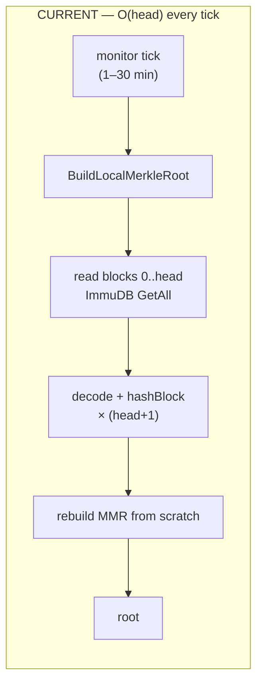

# Proposal: Incremental local Merkle fingerprint (`BuildLocalMerkleRoot`)

**Status:** Draft / for review
**Author:** Doc (saishibu@jupitermeta.io)
**Area:** `internal/merkle`, `internal/syncmonitor`
**Related:** 2.0.0 CPU/RAM regression investigation (pprof heap/alloc/cpu on `jmdn-sequencer-server` and `jmdn-mainnet-1`, 2026‑07‑28)

---

## Summary

The sync monitor's local fingerprint, `internal/merkle.BuildLocalMerkleRoot`, rescans **every block from height 0 to the current head** from ImmuDB on **every tick** (the monitor fires on a 1–30 min adaptive interval). Each scan reads, protobuf/JSON‑decodes, and SHA‑256‑hashes the entire chain. This is `O(chain length)` per tick and grows with the chain, and it is the dominant source of allocation churn (≈ 89 % of all bytes allocated) — hence the CPU (GC + decode) and ImmuDB read‑load increase observed after 2.0.0.

This proposal makes the fingerprint **incremental**: cache the Merkle accumulator plus the last head, and on each tick fold in only the blocks appended since the previous computation. This converts the per‑tick cost from `O(head)` to `O(Δ)` (new blocks only), removes ≈ 89 % of allocations and the full‑chain ImmuDB read, and — critically — stops the cost from growing with chain length.

---

## Problem & evidence

The 2.0.0 CPU/RAM regression was profiled on two production nodes. The alternatives were ruled out first:

| Hypothesis | Verdict | Evidence |
|---|---|---|
| Global `LockStateApply` contention / goroutine backlog | **Refuted** | goroutines: 385 (mainnet‑1), 726 (sequencer); `grep -c 'LockStateApply\|semacquire'` on the goroutine dump = **0** on both |
| Per‑block gossip crypto (BLS/ECDSA/Keccak) pegging CPU | **Not dominant** | CPU over 120 s: **0.67 %** (mainnet‑1), **3.37 %** (sequencer); top frames are syscalls/futex/gRPC transport, not crypto |
| Go heap leak | **Refuted** | live heap `inuse_space` ≈ 5.6 MB |

The allocation profile (`/debug/pprof/allocs`, `alloc_space`) isolates the cause — one call path is ≈ 89 % of everything the process has allocated:

| Allocator (cumulative) | mainnet‑1 | sequencer |
|---|---|---|
| `internal/merkle.BuildLocalMerkleRoot` | **89.5 %** | dominant |
| ` └ DB_OPs.GetBlocksRange` | 77.3 % | ~same |
| ` └ DB_OPs/Nodeinfo.(*dbBlockIterator).Next` | 81.9 % | |
| ` └ immuClient.GetAll` | 42.9 % | |
| ` └ encoding/json.Unmarshal` | 34.2 % | |
| protobuf `consumeBytesNoZero`, gRPC buffer pools, `reflect.growslice`, `sha256`, `math/big` | remainder | remainder |
| **Total allocated** | **9.1 GB** | **11.3 GB** |

Because the work is periodic (once per monitor tick) and transient (GC‑reclaimed), average CPU reads low and the *live* heap stays tiny — a 120 s CPU sample catches part of a scan (sequencer 3.37 %) or misses it entirely (mainnet‑1 0.67 %). The cumulative allocation profile is what exposes it. The sustained RSS growth is on the **ImmuDB** side: each full scan pulls the entire chain through ImmuDB's caches / the OS page cache.

---

## Root cause (code)

`internal/merkle/builder.go:31`:

```go
func BuildLocalMerkleRoot(ctx context.Context, blockInfo fastsync_types.BlockInfo) (*Result, error) {
    head := blockInfo.GetBlockNumber()
    start := uint64(0)                                   // ← always from genesis
    ...
    iter := blockInfo.NewBlockIterator(start, head, defaultBatchSize)  // ← [0, head] every call
    for {
        blocks, _ := iter.Next()                         // read from ImmuDB (GetAll)
        for _, b := range blocks {
            hashes = append(hashes, hashBlock(b))        // decode + SHA-256 over all fields+txs
        }
        // ... fold hashes into the merkletree builder
    }
}
```

Called by the sync monitor at `internal/syncmonitor/monitor.go:309` on its adaptive interval. Nothing is cached between calls — the accumulator is rebuilt from scratch each time. At head ≈ 13,491 that is ~13.5 k block reads + decodes + hashes per tick; at 100 k blocks it is ~7× that. The cost scales linearly with chain length, which is why the regression appeared with 2.0.0's sync monitor and worsens over time.



---

## Goals / non‑goals

**Goals**
- Per‑tick cost proportional to blocks appended since the previous computation, not to chain length.
- Byte‑identical root to the current full‑scan implementation for the same chain state (drop‑in; no protocol/wire change — the fingerprint is a local comparison value).
- Correct under the append‑only common case and under (rare, shallow) tip reorgs.

**Non‑goals**
- Changing what the fingerprint covers or how it is compared with the seed (out of scope).
- Persisting the accumulator across process restarts in v1 (optional follow‑up; see below).

---

## Proposed design

Keep a package‑level (or monitor‑owned) cached accumulator and fold forward.

**Cached state**

```
type fingerprintCache struct {
    mu        sync.Mutex
    ready     bool
    lastHead  uint64            // highest block folded
    root      Result            // last computed root (returned when nothing changed)
    acc       *merkletree.Builder // resumable accumulator (see "API prerequisite")
    tipHashes []leaf            // small ring buffer of the last K folded (height, hash)
}                               // K bounded (e.g. 64) for shallow-reorg detection
```

**Per‑tick algorithm**

```
head := blockInfo.GetBlockNumber()

1. Cold start (!ready): full scan [0, head] exactly as today, populate acc + tipHashes,
   set lastHead = head, ready = true. One-time cost per process start.

2. No change (head == lastHead): re-hash ONLY the head block and compare to the cached
   tip hash.
     - unchanged  → return cached root (near-zero cost: 1 read + 1 hash).
     - changed    → tip reorg, go to step 4.

3. Pure append (head > lastHead) AND block[lastHead] hash unchanged:
     - read ONLY blocks (lastHead, head] from ImmuDB, hashBlock each, Add to acc,
       push onto tipHashes.
     - lastHead = head; recompute root from acc; return it.
       Cost = O(head - lastHead).

4. Reorg (a previously-folded height's hash differs): walk back through tipHashes to the
   lowest height whose stored hash no longer matches what we folded (the divergence point
   d). Rebuild acc from d (re-read [d, head]). If d is older than the ring buffer covers
   (deeper than K), fall back to a full rebuild (step 1). Bounded because the consensus
   layer enforces contiguous linkage + equivocation records, so reorgs are shallow and
   rare; the fallback is a safety net, not the hot path.
```

**Reorg handling — why bounded.** L2 finalized blocks do not reorg at already‑stored heights under normal operation: `messaging/consensus_hardening.go` enforces contiguous parent/height linkage and records equivocation durably, and blocks are committee‑certified. So step 3 (pure append) is the overwhelming common case; steps 2‑changed and 4 are defensive. The ring buffer (`tipHashes`, K ≈ 64) makes shallow reorgs cheap to detect and rebuild; the full‑rebuild fallback guarantees correctness for the pathological deep case at the old cost (no worse than today).

```mermaid
flowchart TD
    T["monitor tick"] --> H{cache ready?}
    H -- no --> F["full scan [0,head]<br/>(one-time / post-restart)"] --> OUT["root"]
    H -- yes --> C{head vs lastHead}
    C -- "== (rehash tip)" --> U{tip hash changed?}
    U -- no --> OUT2["return cached root<br/>~0 cost"]
    U -- yes --> RB
    C -- "> (append)" --> P{block[lastHead] unchanged?}
    P -- yes --> A["fold (lastHead, head]<br/>O(Δ)"] --> OUT3["root"]
    P -- no --> RB["find divergence d,<br/>rebuild from d<br/>(fallback: full)"] --> OUT4["root"]
```

**API prerequisite (verify before implementing).** The current code feeds hashes into `merkletree.NewBuilder(cfg)` batch by batch, so the builder already supports incremental `Add`. Confirm in `JMDN_Merkletree` that the builder can (a) produce a `Root()` and then accept further `Add()` calls (some builders finalize on root), and (b) that `Root()` is independent of the `Config.ExpectedTotal` pre‑sizing hint as head grows. If either does not hold, snapshot the MMR **peaks** (a small `O(log n)` set) instead of holding the builder, and reconstruct/resume from the peaks. Either way the leaf‑folding math is unchanged, so the root stays identical to the full scan.

**Restart behavior.** v1 keeps the cache in memory: the first tick after a restart pays one full `O(head)` scan, then every subsequent tick is `O(Δ)`. Since the monitor runs many times between restarts and restarts are infrequent, this captures essentially all of the benefit. **Optional follow‑up:** persist `{lastHead, MMR peaks}` (a few KB) to disk so even the post‑restart tick is incremental.

**Concurrency.** The sync monitor already serializes reconciles (`reconcileMu`) and runs the fingerprint from a single goroutine; the cache mutex is a guard for safety if any other caller is added. No interaction with `LockStateApply` (this path does not write account state).

---

## Before / after cost

| | Current | Proposed |
|---|---|---|
| Per‑tick block reads (ImmuDB `GetAll`) | `head + 1` (~13.5 k today) | `Δ` = blocks since last tick |
| Per‑tick decode + SHA‑256 | `head + 1` | `Δ` |
| Allocations per tick | GBs (≈ 89 % of process total) | ~`Δ`‑proportional |
| Scaling with chain length | **linear (worsens)** | **flat** |
| Cold start / post‑restart | every tick | once |

Illustrative: with a 2‑min block interval and a 10‑min monitor tick, `Δ ≈ 5` blocks vs `~13,491` — a ~2,700× reduction in per‑tick work today, and the gap widens as the chain grows.

---

## Correctness & testing

- **Differential test (the key one):** for a synthetic chain, assert the incremental root equals a from‑scratch `BuildLocalMerkleRoot` after: (a) a sequence of appends across multiple ticks, (b) a no‑change tick, (c) a shallow tip reorg (replace the last 1–2 blocks), and (d) a reorg deeper than the ring buffer (forces the full‑rebuild fallback). Roots must match in every case.
- **Cold‑start parity:** first incremental call on an existing DB equals the full scan.
- **Gap handling:** preserve the current behavior of substituting a zero hash for a missing block so the tree still covers a contiguous range (`builder.go` gap branch).
- **Bench:** micro‑benchmark per‑tick allocations/time at head = 1 k / 10 k / 100 k for full vs incremental to confirm flat scaling.
- **Live validation:** after deploy, capture `/debug/pprof/allocs` and confirm `BuildLocalMerkleRoot` drops out of the top allocators, and watch ImmuDB RSS/read metrics fall.

---

## Alternatives considered

1. **Raise the monitor interval only.** Spaces out the scans but does not reduce per‑scan cost and does not stop the linear growth — a mitigation, not a fix. Worth doing as an interim measure until the incremental change lands.
2. **Persist the root + last head and skip recompute when head is unchanged.** Helps the idle case but still pays `O(head)` whenever any new block arrives (i.e. almost every tick). Subsumed by the incremental design.
3. **Fingerprint a bounded recent window instead of `[0, head]`.** Changes the semantics of the comparison with the seed and weakens divergence detection over history — rejected.
4. **Disable the fingerprint on nodes that don't need it (e.g. the sequencer).** Reduces load but loses the detection signal on those nodes; orthogonal and can be combined, but not a substitute.

---

## Risks & mitigations

- **Reorg correctness.** Mitigated by the divergence‑detection ring buffer plus a full‑rebuild fallback (never worse than today) and the differential test covering the reorg cases. Given the consensus linkage/equivocation guarantees, the fallback should almost never fire in production.
- **`merkletree.Builder` resumability.** Verified as an API prerequisite before implementing; peaks‑snapshot is the fallback design if the builder can't resume after `Root()`.
- **Stale cache after an out‑of‑band DB change** (e.g. a re‑bootstrap or restore rewriting blocks). The head‑block and `block[lastHead]` hash checks catch a changed tip; a wholesale DB replacement is covered by the cold‑start path on the next restart. Optionally invalidate the cache on bootstrap/restore.
- **Behavior change is local‑only.** The fingerprint is a comparison value the node computes about itself; it is not on the wire and not consensus‑bound, so an implementation bug degrades detection at worst — it cannot fork state. Low blast radius.

---

## Rollout

- Land behind no flag needed (drop‑in, identical output) — but gate with a build/CI differential test so a regression in the root value fails loudly.
- Deploy to one validator first; confirm via pprof `allocs` that `BuildLocalMerkleRoot` leaves the top allocators and that ImmuDB read load/RSS drops; then fleet‑wide.
- Interim: bump the sync‑monitor minimum interval now for immediate relief while this is implemented and reviewed.

## Implementation checklist

- [ ] Verify `JMDN_Merkletree` builder resumability (`Add` after `Root`, `Root` independent of `ExpectedTotal`); otherwise adopt the peaks‑snapshot variant.
- [ ] Add `fingerprintCache` and the fold‑forward algorithm in `internal/merkle` (keep `BuildLocalMerkleRoot`'s signature; add an incremental entry point the monitor calls).
- [ ] Wire the monitor (`internal/syncmonitor/monitor.go:309`) to the incremental entry point; invalidate the cache on bootstrap/restore if applicable.
- [ ] Differential + reorg + cold‑start + gap tests; head‑scaling benchmark.
- [ ] (Optional) persist `{lastHead, peaks}` to skip the post‑restart full scan.
